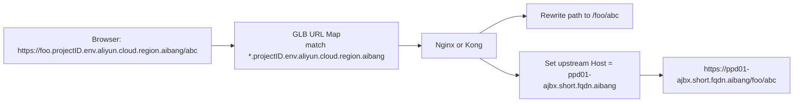

# 8.json 设计说明

## 1. Goal and Constraints

目标：

- 让大多数 `https://*.projectID.env.aliyun.cloud.region.aibang` 请求不再逐个写 GLB URL map 规则
- 保留后端仍然访问短域名 `ppd01-ajbx.short.fqdn.aibang`
- 允许少量特殊路径继续做单独处理

关键约束：

- GCP URL map 可以匹配通配 Host
- GCP URL rewrite 可以改 Host，也可以改 Path
- 但 Path Rewrite 使用的变量只能来自 Path Match，不能从 Host 的 `*` 中取值后拼回 Path

因此，下面这种需求不能优雅地只靠 URL map 实现：

- `https://foo.projectID.env.aliyun.cloud.region.aibang/bar`
- 自动变成
- `https://ppd01-ajbx.short.fqdn.aibang/foo/bar`

因为这里的 `foo` 来自 Host，不是来自 Path。

## 2. Recommended Architecture (V1)

复杂度：`Moderate`

推荐做法：

- GLB 只负责通配 Host 接入和转发到统一 Nginx/Kong 后端
- Nginx/Kong 根据原始 `Host` 动态提取子域名前缀
- Nginx/Kong 把请求改写成 `/$subdomain$uri`
- Nginx/Kong 再把上游 `Host` 改成 `ppd01-ajbx.short.fqdn.aibang`
- 少量特殊路径在 Nginx/Kong 中显式覆盖

流量模型：



## 3. Why This Is the Better Simplification

### Immediate fix

- 用一条通配 Host 规则替代大多数单独 hostRule/pathMatcher

### Structural improvement

- 把“域名字符串到路径前缀”的动态映射放到 Nginx/Kong
- 以后新增 `abc.projectID.env.aliyun.cloud.region.aibang` 时，GLB 不需要再增加一条 URL map 规则

### Long-term redesign

- 如果未来特例很多，可以维护一份域名映射表，由 CI/CD 生成 Nginx `map` 或 Kong route 配置
- 如果未来必须全部前置在 GCP 原生层，建议改业务域名规划，不要依赖“Host 子串回填 Path”这种模型

## 4. What 8.json Does

[8.json](/Users/lex/git/knowledge/ssl/docs/claude/routeaction/maps-format-and-verify/success/8.json) 是一个简化后的 GLB URL map：

- `*.projectID.env.aliyun.cloud.region.aibang` 全部走 `wildcard-pass-through-matcher`
- `ppd01-ajbx.short.fqdn.aibang` 走默认 matcher
- 不在 GLB 层做动态 Path Rewrite

这样做的目的不是偷懒，而是避免在 GLB 层实现不了的能力上继续堆规则。

## 5. Nginx Implementation Example

下面是一个适合放到 Nginx 的实现思路。它把原始 Host 中的前缀取出来，拼到 Path 前面，再把上游 Host 固定为短域名。

```nginx
server {
    listen 443 ssl http2;
    server_name ~^(?<app>.+)\.projectID\.env\.gcp\.cloud\.region\.aibang$;

    location = /jccl/v1/callbackup {
        if ($app = "gg-env-region") {
            proxy_set_header Host ppd01-ajbx.short.fqdn.aibang;
            proxy_pass https://ppd01-ajbx.short.fqdn.aibang/v1-sit;
            break;
        }

        proxy_set_header Host ppd01-ajbx.short.fqdn.aibang;
        proxy_pass https://ppd01-ajbx.short.fqdn.aibang/$app/jccl/v1/callbackup;
    }

    location / {
        proxy_set_header Host ppd01-ajbx.short.fqdn.aibang;
        proxy_pass https://ppd01-ajbx.short.fqdn.aibang/$app$uri$is_args$args;
    }
}
```

效果示例：

- `https://lex-long-fqdn.projectID.env.aliyun.cloud.region.aibang`
  -> `https://ppd01-ajbx.short.fqdn.aibang/lex-long-fqdn`
- `https://lex-long-fqdn.projectID.env.aliyun.cloud.region.aibang/hello`
  -> `https://ppd01-ajbx.short.fqdn.aibang/lex-long-fqdn/hello`
- `https://gg-env-region.projectID.env.aliyun.cloud.region.aibang`
  -> `https://ppd01-ajbx.short.fqdn.aibang/gg-env-region`
- `https://gg-env-region.projectID.env.aliyun.cloud.region.aibang/jccl/v1/callbackup`
  -> `https://ppd01-ajbx.short.fqdn.aibang/v1-sit`

## 6. Validation and Rollback

验证：

- 导入 [8.json](/Users/lex/git/knowledge/ssl/docs/claude/routeaction/maps-format-and-verify/success/8.json)
- 确认通配 Host 都能命中统一 backend service
- 在 Nginx access log 中打印 `$host $uri $upstream_http_host`
- 验证以下样例：

```bash
curl -k -H 'Host: lex-long-fqdn.projectID.env.aliyun.cloud.region.aibang' https://<lb-ip>/
curl -k -H 'Host: lex-long-fqdn.projectID.env.aliyun.cloud.region.aibang' https://<lb-ip>/hello
curl -k -H 'Host: gg-env-region.projectID.env.aliyun.cloud.region.aibang' https://<lb-ip>/
curl -k -H 'Host: gg-env-region.projectID.env.aliyun.cloud.region.aibang' https://<lb-ip>/jccl/v1/callbackup
```

回滚：

- GLB 层回滚到 [v7.json](/Users/lex/git/knowledge/ssl/docs/claude/routeaction/maps-format-and-verify/success/v7.json)
- Nginx 层保留旧配置文件并支持快速 `reload`

## 7. Trade-offs and Alternatives

方案 A：继续把每个长域名单独写进 GLB URL map

- 优点：所有逻辑都在 GLB
- 缺点：配置增长快，维护成本高，容易出错

方案 B：GLB 用通配 Host，Nginx/Kong 做动态映射

- 优点：最适合你现在这种“多数同构，少量特例”的流量模型
- 缺点：需要后端代理层具备一段标准化 rewrite 逻辑

方案 C：写脚本生成 URL map

- 优点：不改现有分层
- 缺点：本质上还是大量显式规则，只是从手工改成模板生成

## 8. References

以下结论基于 Google Cloud 官方文档：

- URL map 支持 wildcard host 和 path template rewrite，但 rewrite 变量来自 path template match，而不是 host
  - [URL maps overview](https://cloud.google.com/load-balancing/docs/url-map-concepts)
- Google Cloud 在 rewrite 前会把原始客户端 URL 放到 `x-client-request-url` 和 `x-envoy-original-path`
  - [URL maps overview](https://cloud.google.com/load-balancing/docs/url-map-concepts)
- Host rewrite 是把 host 替换成一个给定字符串，不是动态模板
  - [UrlRewrite reference](https://cloud.google.com/php/docs/reference/cloud-compute/latest/V1.UrlRewrite)

基于这些文档，我的判断是：

- “`*.domain` 自动映射成 `/$subdomain`”不适合继续在 GLB URL map 上堆配置
- 你的最佳简化点在 Nginx/Kong，而不是继续细化 hostRule/pathRule
