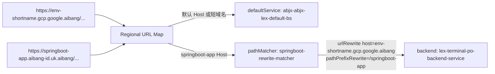

# URL Map JSON 更新与校验说明

## 1. Goal and Constraints

- 目标：把现有 URL Map 配置改成可直接通过 Compute REST API + `curl` 导入的 JSON 形式。
- 范围：Regional URL Map，重点处理 `routeAction` / `urlRewrite` 场景。
- 约束：不依赖 `gcloud compute url-maps import`，而是走 `curl -H "Authorization: Bearer ..."` 的方式。
- 复杂度：`Moderate`

## 2. Recommended Architecture (V1)

### 推荐结构

你这个场景更合理的 V1 不是把 `routeRules` 放在顶层，而是：

1. 顶层 `defaultService` 负责兜底流量。
2. `hostRules` 只负责“哪个 Host 进入哪个 pathMatcher”。
3. `pathMatchers` 里决定默认转发，或者做 `defaultRouteAction.urlRewrite`。
4. 如果未来一个 matcher 下面要承载很多长域名，再在 `pathMatchers[].routeRules[]` 里做高级匹配。

### 为什么这样更合理

- 你的例子本质是“按 Host 分流，再做 rewrite”，不需要一开始就上复杂 `routeRules`。
- `hostRules + pathMatchers + defaultRouteAction` 更贴近 URL Map 原生模型，也更容易静态校验。
- 回滚简单，只需要替换同一个 URL Map 资源。

### 流量模型



## 3. Trade-offs and Alternatives

### 你当前 `urlmap.json` 的问题

你原先那份 JSON 不是“语法看起来像对”，而是结构上就有几个关键错误：

1. `routeRules` 不能放在顶层，它必须放在 `pathMatchers[]` 下面。
2. `matchRules[].host` 不是 Compute URL Map 支持的字段。
3. 你的 `hostRules` 写的是 `env-shortname.gcp.google.aibang`，但真正进入 GLB 的 Host 是 `springboot-app.aibang-id.uk.aibang`。这两者语义不同，不能混用。
4. 资源 URI 大小写不一致。建议统一写成 `backendServices`。

### 什么时候才该用 `routeRules`

当你需要下面这种能力时，再上 `routeRules`：

- 同一个 Host 下按路径、Header、Query 参数做多路分流
- 一个 wildcard host 下，根据 `:authority` 再细分多个长域名
- 需要 weighted backend、headerAction、fault injection 等高级能力

如果只是“某个长域名改写成某个短域名语义”，`defaultRouteAction` 就够了。

## 4. Implementation Steps

### 4.1 已生成的文件

- JSON 模板：[urlmap.json](/Users/lex/git/knowledge/ssl/docs/claude/routeaction/urlmap.json)
- 静态校验脚本：[validate-urlmap-json.py](/Users/lex/git/knowledge/ssl/docs/claude/routeaction/validate-urlmap-json.py)
- `curl` 导入脚本：[apply-urlmap-json.sh](/Users/lex/git/knowledge/ssl/docs/claude/routeaction/apply-urlmap-json.sh)

### 4.2 修正后的 JSON 设计

当前 [urlmap.json](/Users/lex/git/knowledge/ssl/docs/claude/routeaction/urlmap.json) 采用的是两段式模型：

1. 顶层 `defaultService`
   作用：任何没命中显式 `hostRules` 的请求都走默认 backend。
2. `springboot-rewrite-matcher`
   作用：当 Host 是 `springboot-app.aibang-id.uk.aibang` 时，把上游请求改写成：
   - Host: `env-shortname.gcp.google.aibang`
   - Path 前缀：`/springboot-app`

### 4.3 这份 JSON 为什么是正确且合理的

这是合理的，因为它满足了 URL Map 的三个真实约束：

1. Host 分流先由 `hostRules` 决定。
2. Rewrite 行为发生在 `pathMatcher.defaultRouteAction.urlRewrite`。
3. 最终请求仍然落到明确的 regional backend service。

这也是生产上最稳的 V1：

- 默认规则清晰
- 特殊域名单独收敛
- 配置可读性高
- 后续扩展到更多 Host 时，只需新增 `hostRules` 和 `pathMatchers`

### 4.4 本地先做静态校验

```bash
cd /Users/lex/git/knowledge/ssl/docs/claude/routeaction
python3 ./validate-urlmap-json.py ./urlmap.json
```

这个脚本会检查：

- JSON 语法是否正确
- 顶层是否误用了 `routeRules`
- `hostRules` 是否引用了不存在的 `pathMatcher`
- exact host 是否重复
- wildcard host 是否与 exact host 冲突
- backend service URI 是否像一个合法的 regional backend service
- `tests` 字段是否可用

### 4.5 用 Google API 做正式 validate

```bash
cd /Users/lex/git/knowledge/ssl/docs/claude/routeaction
./apply-urlmap-json.sh projectid europe-west2 ./urlmap.json validate
```

这个动作会做两层校验：

1. 本地静态校验
2. 调用 `regionUrlMaps.validate` API

这个阶段不会创建或更新资源。

### 4.6 创建或更新 URL Map

```bash
cd /Users/lex/git/knowledge/ssl/docs/claude/routeaction
./apply-urlmap-json.sh projectid europe-west2 ./urlmap.json upsert
```

脚本行为：

1. 读取 `urlmap.json` 的 `name`
2. 先调用 validate API
3. 如果资源不存在，则 `POST /regions/{region}/urlMaps`
4. 如果资源已存在，则先 GET 当前资源拿 `fingerprint`
5. 再 `PUT /regions/{region}/urlMaps/{name}` 更新

### 4.7 如果你想直接看 `curl` 形式

校验：

```bash
ACCESS_TOKEN="$(gcloud auth print-access-token)"

python3 - <<'PY' /Users/lex/git/knowledge/ssl/docs/claude/routeaction/urlmap.json >/tmp/urlmap-validate-body.json
import json
import sys
from pathlib import Path

resource = json.loads(Path(sys.argv[1]).read_text())
print(json.dumps({"resource": resource}))
PY

curl -sS \
  -X POST \
  -H "Authorization: Bearer ${ACCESS_TOKEN}" \
  -H "Content-Type: application/json" \
  --data @/tmp/urlmap-validate-body.json \
  "https://compute.googleapis.com/compute/v1/projects/projectid/regions/europe-west2/urlMaps/abjx-env-uk-lex-poc-urlmap/validate"
```

创建：

```bash
curl -sS \
  -X POST \
  -H "Authorization: Bearer ${ACCESS_TOKEN}" \
  -H "Content-Type: application/json" \
  --data @/Users/lex/git/knowledge/ssl/docs/claude/routeaction/urlmap.json \
  "https://compute.googleapis.com/compute/v1/projects/projectid/regions/europe-west2/urlMaps"
```

更新：

先 GET 当前 URL Map 取 `fingerprint`，再把它写回 JSON 后 `PUT`。这个过程已经包含在 [apply-urlmap-json.sh](/Users/lex/git/knowledge/ssl/docs/claude/routeaction/apply-urlmap-json.sh) 里。

## 5. Validation and Rollback

### 导入前怎么确认“语法 OK”

最稳的顺序是：

1. `python3 validate-urlmap-json.py urlmap.json`
2. `./apply-urlmap-json.sh ... validate`
3. 通过后再 `upsert`

这比只做 `jq empty` 更有价值，因为你关心的不只是 JSON 语法，还包括 URL Map 的结构合法性。

### 导入前怎么确认 Host 转发条件没有冲突

我给你的静态校验脚本会先检查这些问题：

- exact host 重复
- wildcard host 覆盖 exact host
- `pathMatcher` 引用缺失
- routeRule 优先级重复
- 错把 `matchRules.host` 当成合法字段

这不是 100% 替代 Google 控制面校验，但足够提前拦掉大多数“文件格式对，但路由语义错”的问题。

### 导入前怎么做业务语义验证

在 URL Map JSON 里保留 `tests` 字段。这是最实用的方式。

现在你的 [urlmap.json](/Users/lex/git/knowledge/ssl/docs/claude/routeaction/urlmap.json) 已经带了两个测试：

1. `springboot-app.aibang-id.uk.aibang` 应该命中 terminal backend
2. `env-shortname.gcp.google.aibang` 应该命中 default backend

这样 `validate` API 会按这些 host/path 样例去演算，而不是只检查 schema。

### 回滚策略

如果你是更新现有 URL Map，回滚方式有两个：

1. 把上一版 JSON 放回去，再执行一次 `upsert`
2. 保留一个备份版 URL Map 名称，切回旧资源

生产建议是把 JSON 文件纳入 Git，而不是只保留临时导出结果。

## 6. Reliability and Cost Optimizations

- 优先把 Host 级别分流放在 `hostRules`，避免无意义的高级匹配，减少维护复杂度。
- 对单一 Host 的默认 rewrite，优先用 `defaultRouteAction`，不要先上 `routeRules + weightedBackendServices`。
- 把 `tests` 保留在 JSON 里，纳入 CI。这样每次导入前都能自动校验核心路由。
- 如果未来要做灰度发布，再引入 `weightedBackendServices`，不要在当前简单场景提前复杂化。

## 7. Handoff Checklist

- 把 `projectid` 替换成真实 GCP Project ID
- 确认 `europe-west2` 是目标 regional URL Map 所在区域
- 确认两个 backend service URI 都真实存在
- 执行本地静态校验
- 执行 Google validate
- 再执行 `upsert`

## 8. URL 访问示例

### 示例 1：默认短域名流量

用户访问：

```text
https://env-shortname.gcp.google.aibang/
```

结果：

- 命中 `short-host-matcher`
- 直接走 `abjx-abjx-lex-default-bs`
- 不做 rewrite

### 示例 2：长域名 rewrite 流量

用户访问：

```text
https://springboot-app.aibang-id.uk.aibang/actuator/health
```

GLB 内部等效转发：

```text
Host: env-shortname.gcp.google.aibang
Path: /springboot-app/actuator/health
Backend: lex-terminal-po-backend-service
```

用户浏览器地址栏仍然保持：

```text
https://springboot-app.aibang-id.uk.aibang/actuator/health
```

## 9. Exploration Summary

这次探索的关键结论是：

1. 你原始 JSON 的问题不在“是不是 JSON”，而在“是不是合法的 URL Map 资源结构”。
2. 这个场景不必强行从一开始就依赖复杂 `routeRules`。
3. 更适合的生产 V1 是：`hostRules + pathMatchers + defaultRouteAction.urlRewrite + tests`。
4. 真正稳妥的导入链路应该是：
   本地静态校验 -> Google validate API -> create/update

## References

- [Compute Engine UrlMaps reference](https://cloud.google.com/compute/docs/reference/rest/v1/regionUrlMaps)
- [Compute Engine UrlMaps validate method](https://cloud.google.com/compute/docs/reference/rest/v1/regionUrlMaps/validate)
