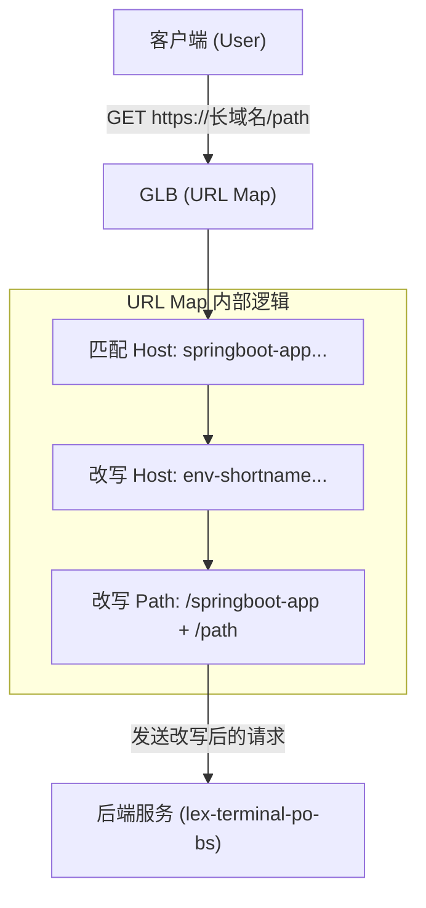

# GLB URL Map 透明代理配置解析 (url-succ.json)

本文档详细解析了 GLB URL Map 配置文件 `url-succ.json` 的实现原理、请求流向及具体应用场景。该配置核心实现了 **“长域名到短域名 + 特定路径”的透明改写（Transparent Rewrite）**。

---

## 1. 核心功能分析

该配置的主要目的是让用户通过一个“长域名”访问时，Load Balancer 在后台透明地将请求修改为“短域名”和“对应的子路径”，然后再转发给后端。对于客户端（浏览器）来说，**地址栏的域名和路径完全不会改变**。

### 关键组件拆解

| 组件 | 配置项 | 说明 |
| :--- | :--- | :--- |
| **匹配条件 (Match Rules)** | `host: springboot-app.aibang-id.uk.aibang` | 只有匹配该长域名的请求会触发规则。 |
| | `prefixMatch: "/"` | 匹配所有路径。 |
| **改写动作 (urlRewrite)** | `hostRewrite: "env-shortname.gcp.google.aibang"` | 将 HTTP Header 中的 `Host` 字段从长域名修改为短域名。 |
| | `pathPrefixRewrite: "/springboot-app"` | 将匹配到的路径前缀 `/` 改写为 `/springboot-app`。 |
| **转发目标 (Weighted Backend)** | `lex-terminal-po-backend-service` | 将改写后的请求发送到指定的后端服务。 |
| **兜底后端 (defaultService)** | `abjx-abjx-lex-default-bs` | 如果请求不符合任何规则，则转发到此默认服务。 |

---

## 2. 具体执行示例

假设 Load Balancer 的 IP 是 `1.2.3.4`。

| 步骤 | 客户端发送的原始请求 (Client Side) | GLB 处理后的请求 (Backend Side) |
| :--- | :--- | :--- |
| **URL** | `https://springboot-app.aibang-id.uk.aibang/api/v1/list` | `https://env-shortname.gcp.google.aibang/springboot-app/api/v1/list` |
| **Host Header** | `springboot-app.aibang-id.uk.aibang` | `env-shortname.gcp.google.aibang` |
| **Path** | `/api/v1/list` | `/springboot-app/api/v1/list` |
| **后端行为** | - | **目标服务**: `lex-terminal-po-backend-service` |

**结果**：
1.  **用户感知**：浏览器地址栏依然显示长域名，没有任何跳转。
2.  **后端感知**：后端 Nginx 或应用收到的 Host 是短域名，路径多了 `/springboot-app` 这一段前缀。

---

## 3. 请求流向图 (Mermaid)



---

## 4. 注意事项与最佳实践

1.  **地址栏不变**：这是 `urlRewrite` 与 `urlRedirect` 的最大区别。`urlRewrite` 是内部改写，对用户完全透明。
2.  **SSL 证书匹配**：必须在 GLB 的 `Target HTTPS Proxy` 上同时绑定长域名和短域名的 SSL 证书（或泛域名证书），否则 HTTPS 握手会报错。
3.  **后端响应处理**：
    *   如果后端应用返回的是“绝对路径”链接（如 `href="https://env-shortname..."`），用户点击后会跳到短域名。
    *   建议后端应用尽量使用“相对路径”。
4.  **默认后端 (defaultService)**：
    *   该配置确保了未分配规则的流量（如直接访问 LB IP 或其他域名）有兜底的流向。

---

## 5. 验证命令

你可以使用 `curl` 模拟长域名请求来验证配置是否生效：

```bash
# 验证透明代理效果
curl -v -H "Host: springboot-app.aibang-id.uk.aibang" https://<LB_IP>/api/login
```

在后端服务器上查看日志，你应该能看到：
*   `Host`: `env-shortname.gcp.google.aibang`
*   `Request URL`: `/springboot-app/api/login`
