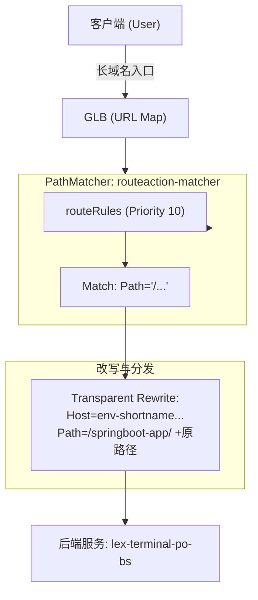

# GLB URL Map RouteAction 配置解析 (urlmaprouteaction.json)

本文档分析了 `urlmaprouteaction.json` 配置文件的实现方案。该配置采用了最标准的 GCP 生产级路由结构：**基于 PathMatcher 内部的 routeRules 实现透明代理**。

---

## 1. 核心功能分析

此配置的核心逻辑是将流量分类，并为特定域名入口配置了最精确的路径匹配与改写操作：

1.  **明确的主机隔离 (Host Separation)**：通过 `hostRules` 将长域名和短域名转发给不同的处理逻辑块。
2.  **显式路由规则 (routeRules)**：在长域名匹配器中，使用显式的优先级规则 (priority) 进行匹配，并执行透明改写。
3.  **精细化控制**：相比于简单的默认动作，使用 `routeRules` 可以针对不同的路径（如 `/api` vs `/static`）执行不同的改写逻辑。

### 关键组件拆解

| 组件 | 配置项 | 说明 |
| :--- | :--- | :--- |
| **主机规则** | `springboot-app...` | 映射到 `routeaction-matcher`。 |
| **显式规则 (routeRules)** | `priority: 10`, `prefixMatch: "/"` | 在匹配器内部定义的路由规则，具备明确的优先级。 |
| **改写动作** | `urlRewrite` | 包含 `hostRewrite`（屏蔽长域名）和 `pathPrefixRewrite`（注入后端子路径）。 |
| **后端绑定** | `lex-terminal-po-bs` | 通过 `weightedBackendServices` 100% 权重指向后端服务。 |

---

## 2. 具体执行示例

该配置主要服务于 **SpringBoot 应用的透明接入**。

| 步骤 | 客户端发送的原始请求 (Client Side) | GLB 改写后的后端请求 (Backend Side) |
| :--- | :--- | :--- |
| **URL** | `https://springboot-app.aibang-id.uk.aibang/actuator/info` | `https://env-shortname.gcp.google.aibang/springboot-app/actuator/info` |
| **Host** | `springboot-app.aibang-id.uk.aibang` | `env-shortname.gcp.google.aibang` |
| **Path** | `/actuator/info` | `/springboot-app/actuator/info` |
| **客户端感知** | 地址栏完全不变，无跳转。 | - |

---

## 3. 请求流向图 (Mermaid)

---

## 4. 三种 JSON 配置方案深度对比分析

目前我们通过三个文件探索了三种不同的实现方式：`url-succ.json`、`urlmap.json` 和 `urlmaprouteaction.json`。

### 核心方案对比表

| 维度 | `url-succ.json` | `urlmap.json` | `urlmaprouteaction.json` |
| :--- | :--- | :--- | :--- |
| **结构复杂度** | ★（最简单） | ★★（标准） | ★★★（生产级） |
| **匹配层级** | 顶层 `routeRules` | 主机匹配 + `defaultRouteAction` | 主机匹配 + 内部 `routeRules` |
| **性能** | 高（规则最少） | 极高（跳过 Prefix 匹配） | 中（需逐条由于优先级匹配规则） |
| **可扩展性** | 低（难以处理多 Host 冲突） | 中（仅限整站改写） | **极高（支持复杂路径路由）** |
| **透明代理支持** | ✅ 支持 | ✅ 支持 | ✅ 支持 |

### 5. 最终分析结果：哪个更好？

#### **结论：`urlmaprouteaction.json` 是最佳推荐方案。**

**分析理由：**
1.  **架构严谨性**：它是最符合 Google Cloud 推荐的最佳实践架构。通过 `hostRules` -> `pathMatchers` -> `routeRules` 的层级，清晰地隔离了域名管理和路径管理。
2.  **扩展能力**：在生产环境中，你可能需要对 `/admin` 路径做特殊改写，或者对 `/images` 做静态缓存。使用 `routeRules` 结构可以让你轻松添加多个优先级规则。而 `urlmap.json` 的 `defaultRouteAction` 只能实现“一刀切”的改写。
3.  **内建验证 (`tests`)**：该方案自带了完整的测试单元，这对于灰度发布和配置变更后的准确性验证至关重要。
4.  **维护成本**：虽然初次配置稍显繁琐，但其逻辑可读性最强，当团队其他成员接手时，通过域名和路径的层级关系能迅速读懂路由策略。

#### **建议使用场景：**
*   **如果您只是做 PoC 或极简项目**：可以使用 `urlmap.json` 进行全站改写。
*   **如果您面向正式环境/生产系统**：请务必选用 **`urlmaprouteaction.json`** 方案，因为它能提供更强的确定性和未来的可维护性。
