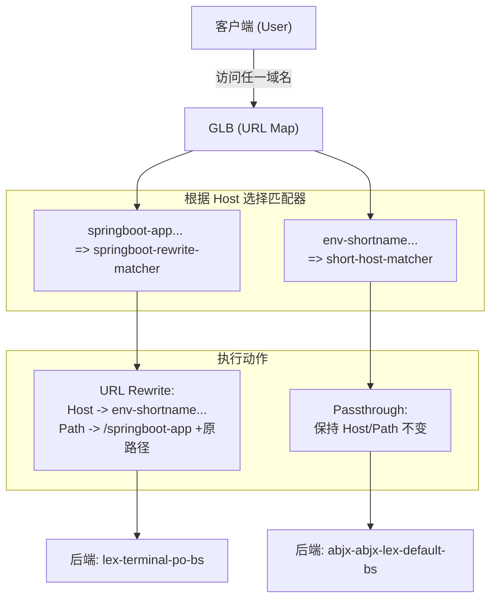

# GLB URL Map 配置解析 (urlmap.json)

本文档详细解析了 GLB URL Map 配置文件 `urlmap.json` 的实现逻辑。该配置通过多主机规则 (hostRules) 和路径匹配器 (pathMatchers) 实现了 **入口域名自动改写与流量分发**。

---

## 1. 核心功能分析

此配置定义了两个不同的入口主机名，并根据主机名执行不同的路由动作：

1.  **自动改写入口 (Long Host)**：当用户通过 `springboot-app.aibang-id.uk.aibang` 访问时，LB 会透明地修改主机名并添加路径前缀。
2.  **直接访问入口 (Short Host)**：当用户直接通过 `env-shortname.gcp.google.aibang` 访问时，流量会转发到默认的后端服务，不进行改写。

### 关键组件拆解

| 组件 | 配置项 | 说明 |
| :--- | :--- | :--- |
| **主机规则 1** | `springboot-app...` | 映射到名为 `springboot-rewrite-matcher` 的匹配器。 |
| **主机规则 2** | `env-shortname...` | 映射到名为 `short-host-matcher` 的匹配器。 |
| **改写动作 (Rewrite)** | `hostRewrite` / `pathPrefixRewrite` | 在 `springboot-rewrite-matcher` 中生效，核心是透明改写。 |
| **后端 1** | `lex-terminal-po-bs` | 处理来自长域名（改写后）的 SpringBoot 应用流量。 |
| **后端 2** | `abjx-abjx-lex-default-bs` | 处理来自短域名的默认流量及兜底流量。 |

---

## 2. 具体执行示例

### 场景 A：长域名访问（触发改写）

| 步骤 | 客户端发送的原始请求 (Client Side) | GLB 处理后的请求 (Backend Side) |
| :--- | :--- | :--- |
| **URL** | `https://springboot-app.aibang-id.uk.aibang/health` | `https://env-shortname.gcp.google.aibang/springboot-app/health` |
| **Host Header** | `springboot-app.aibang-id.uk.aibang` | `env-shortname.gcp.google.aibang` |
| **Path** | `/health` | `/springboot-app/health` |
| **转发目标** | - | **后端服务**: `lex-terminal-po-backend-service` |

### 场景 B：短域名访问（直通模式）

| 步骤 | 客户端发送的原始请求 (Client Side) | GLB 发送给后端的请求 |
| :--- | :--- | :--- |
| **URL** | `https://env-shortname.gcp.google.aibang/index.html` | `/index.html` (保持原样) |
| **Host Header** | `env-shortname.gcp.google.aibang` | `env-shortname.gcp.google.aibang` |
| **转发目标** | - | **后端服务**: `abjx-abjx-lex-default-bs` |

---

## 3. 请求流向图 (Mermaid)



---

## 4. 关键差异点 (与 url-succ.json 相比)

1.  **多 Host 支持**：此配置文件显式定义了两个 Host，并为它们分配了不同的处理行为。
2.  **默认改写 (defaultRouteAction)**：在该配置中，匹配器的所有路径（因为没有定义具体的 `routeRules`）都默认执行 `urlRewrite` 操作。
3.  **内建测试 (Tests)**：配置文件包含了 `tests` 数组，这是 GLB 验证逻辑的描述，用于确保配置变更后符合预期。

---

## 5. 验证与排查

你可以利用配置中自带的测试案例进行验证：

```bash
# 验证长域名路径映射
curl -v -H "Host: springboot-app.aibang-id.uk.aibang" https://<LB_IP>/actuator/health

# 验证短域名直通
curl -v -H "Host: env-shortname.gcp.google.aibang" https://<LB_IP>/
```

**后端日志预期**：
*   长域名请求进入后端时，日志应显示带有 `/springboot-app` 的前缀。
*   短域名请求进入后端时，日志应保持原始路径。
