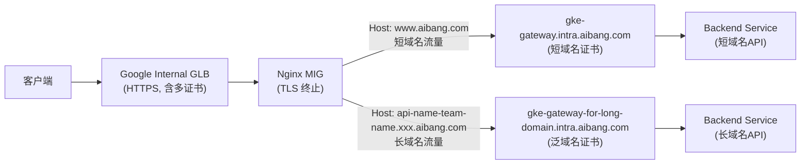
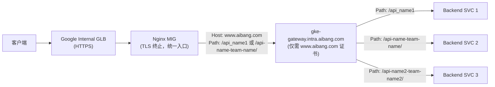
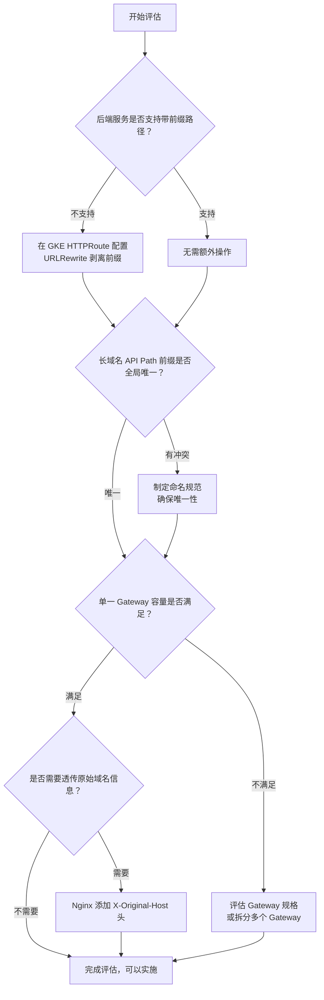

# SSL 终止前移与单一 GKE Gateway 架构分析

> 基于 `ssl-terminal.md` 的延伸探讨，目标：将 TLS 终止提前到 Nginx 层，使用单一 GKE Gateway 承载所有请求。

---

## 1. 问题分析

### 1.1 现有架构（旧模式）



**存在的问题：**
- 需要维护 **两个 GKE Gateway**
- 两个 Gateway 各自携带证书（短域名证书 + 泛域名证书）
- 每新增长域名 API，可能需要扩展 Gateway 配置

---

### 1.2 目标架构（新模式）



**核心变化：**
- 所有请求（短域名 + 长域名）都经由 Nginx 将 `Host` 头统一改写为 `www.aibang.com`
- 所有请求都转发到 **同一个** `gke-gateway.intra.aibang.com`
- 通过 **Path 前缀** 来区分不同的长域名 API
- GKE Gateway 只需要一份证书（`www.aibang.com`）

---

## 2. 可行性判断：**可以实现**

### 2.1 核心理由

| 维度                          | 分析                                                                                                                                        |
| ----------------------------- | ------------------------------------------------------------------------------------------------------------------------------------------- |
| **TLS 终止位置**              | Nginx 已经完成 TLS 终止，后端的 GKE Gateway 收到的是来自 Nginx 的加密连接（Nginx 重新加密），但 Gateway 视角上 Host 统一为 `www.aibang.com` |
| **Host 改写**                 | Nginx `proxy_set_header Host www.aibang.com` 可以将任意域名的请求头改写，GKE Gateway HTTPRoute 只需匹配 `www.aibang.com`                    |
| **Path 路由**                 | GKE Gateway 的 HTTPRoute 支持 `PathPrefix` 匹配，可以用路径前缀区分不同的后端服务                                                           |
| **证书简化**                  | GKE Gateway 只需配置 `www.aibang.com` 一个证书，不再需要泛域名证书                                                                          |
| **Nginx proxy_pass 路径行为** | `proxy_pass https://host/path/` 配合 `location /` 时，Nginx 会将请求 URI 中的 `/` 替换为 `/path/`，路径正确传递给 Gateway                   |

### 2.2 关键配置示意

**Nginx 侧（统一转发）：**

```nginx
# 长域名 server block（每个长域名一个 server block）
server {
    listen 443 ssl;
    server_name api-name-team-name.googleprojectid.aibang.com;
    ssl_certificate /etc/pki/tls/certs/wildcard.cer;
    ssl_certificate_key /etc/pki/tls/private/wildcard.key;

    include /etc/nginx/conf.d/pop/ssl_shared.conf;

    location / {
        # 将请求路径添加 /api-name-team-name/ 前缀后，转发给统一 GKE Gateway
        proxy_pass https://gke-gateway.intra.aibang.com:443/api-name-team-name/;
        # 关键：Host 改写为短域名，让 GKE Gateway 以短域名 HTTPRoute 规则匹配
        proxy_set_header Host www.aibang.com;
        proxy_set_header X-Real-IP $remote_addr;
        proxy_set_header X-Forwarded-For $proxy_add_x_forwarded_for;
        # 建议透传原始 Host，便于后端审计
        proxy_set_header X-Original-Host $host;
    }
}

# 短域名 server block（原有逻辑不变）
server {
    listen 443 ssl;
    server_name www.aibang.com;
    # ... 证书配置 ...

    location /api_name1 {
        proxy_pass https://gke-gateway.intra.aibang.com:443;
        proxy_set_header Host www.aibang.com;
        proxy_set_header X-Real-IP $remote_addr;
        proxy_set_header X-Forwarded-For $proxy_add_x_forwarded_for;
    }

    location /api_name2 {
        proxy_pass https://gke-gateway.intra.aibang.com:443;
        proxy_set_header Host www.aibang.com;
        proxy_set_header X-Real-IP $remote_addr;
        proxy_set_header X-Forwarded-For $proxy_add_x_forwarded_for;
    }
}
```

**GKE Gateway 侧（HTTPRoute 示例）：**

```yaml
apiVersion: gateway.networking.k8s.io/v1
kind: HTTPRoute
metadata:
  name: unified-route
  namespace: your-namespace
spec:
  parentRefs:
  - name: gke-gateway        # 统一 Gateway 名称
    namespace: gateway-ns
  hostnames:
  - "www.aibang.com"         # 只匹配这一个 Host
  rules:
  # 短域名 API 路由（原有）
  - matches:
    - path:
        type: PathPrefix
        value: /api_name1
    backendRefs:
    - name: api-name1-service
      port: 8080

  - matches:
    - path:
        type: PathPrefix
        value: /api_name2
    backendRefs:
    - name: api-name2-service
      port: 8080

  # 长域名 API 路由（新增，通过 path 前缀区分）
  - matches:
    - path:
        type: PathPrefix
        value: /api-name-team-name/
    backendRefs:
    - name: api-name-team-name-service
      port: 8080

  - matches:
    - path:
        type: PathPrefix
        value: /api-name2-team-name2/
    backendRefs:
    - name: api-name2-team-name2-service
      port: 8080
```

---

## 3. 最大的潜在影响

### 3.1 🔴 高风险影响

#### 3.1.1 Path 前缀透传到后端（最关键）

**Nginx `proxy_pass` 路径行为说明：**

```
原始请求:  GET https://api-name-team-name.googleprojectid.aibang.com/v1/resource
Nginx 配置: location / { proxy_pass https://gke-gateway.intra.aibang.com:443/api-name-team-name/; }
转发路径:  GET https://gke-gateway.intra.aibang.com:443/api-name-team-name/v1/resource
```

> **⚠️ 重要**：路径从 `/v1/resource` 变为 `/api-name-team-name/v1/resource`
>
> 后端服务需要能处理带有前缀的路径，或者在 GKE Gateway 的 HTTPRoute 中配置 **路径重写（URLRewrite）** 来剥离前缀：

```yaml
rules:
- matches:
  - path:
      type: PathPrefix
      value: /api-name-team-name/
  filters:
  - type: URLRewrite
    urlRewrite:
      path:
        type: ReplacePrefixMatch
        replacePrefixMatch: /   # 剥离前缀，还原为 /v1/resource
  backendRefs:
  - name: api-name-team-name-service
    port: 8080
```

#### 3.1.2 单一 Gateway 成为单点

- 原来两个 Gateway 互相隔离，现在合并为一个
- 若 `gke-gateway.intra.aibang.com` 出现问题（证书过期、配置错误、资源不足），**所有 API（长域名 + 短域名）全部受影响**
- 需要评估 GKE Gateway 的高可用性和容量规划

#### 3.1.3 HTTPRoute 规则数量膨胀

- 如果长域名 API 数量多（例如几十个），HTTPRoute 中的 `rules` 会迅速增多
- 需要评估 GKE Gateway 对 HTTPRoute 规则数量的限制
- 建议使用多个 HTTPRoute 对象（同一个 Gateway 可以绑定多个 HTTPRoute）

---

### 3.2 🟡 中风险影响

#### 3.2.1 Path 前缀命名冲突

```
api-name-team       ← 路径前缀 /api-name-team/
api-name-team-name  ← 路径前缀 /api-name-team-name/
```

若前缀存在包含关系，`PathPrefix` 匹配可能出现歧义。  
**解决方案**：确保所有长域名转换后的路径前缀全局唯一，并在 HTTPRoute 中使用精确或更长的前缀优先匹配。

#### 3.2.2 X-Original-Host 丢失

后端服务原来可以通过 `Host` 头知道请求来自哪个长域名，改造后 `Host` 统一变成 `www.aibang.com`。  
**解决方案**：在 Nginx 中透传原始 Host：
```nginx
proxy_set_header X-Original-Host $host;
```

#### 3.2.3 访问日志/审计

原来通过 Gateway 名称可以区分流量来源，合并后需要依赖 `X-Original-Host` 或 Path 信息来区分。

---

### 3.3 🟢 正面影响

| 收益                          | 说明                                                             |
| ----------------------------- | ---------------------------------------------------------------- |
| **证书管理简化**              | GKE Gateway 只需维护 `www.aibang.com` 一个证书，减少证书轮换成本 |
| **Gateway 资源减少**          | 从 N 个 Gateway 减少到 1 个，降低 GCP 资源费用                   |
| **Nginx 是统一的 TLS 终止点** | 所有 TLS 策略（加密套件、HSTS 等）集中在 Nginx 管理              |
| **运维复杂度降低**            | 不用为每个新长域名创建新的 GKE Gateway                           |

---

## 4. 需要评估的清单



### 评估清单

| 评估项                        | 优先级 | 说明                                                                        |
| ----------------------------- | ------ | --------------------------------------------------------------------------- |
| **后端路径兼容性**            | 🔴 必须 | 确认后端服务能否处理带 `/api-name-team-name/` 前缀的路径，或配置 URLRewrite |
| **Path 前缀唯一性**           | 🔴 必须 | 所有长域名转换的路径前缀不能有包含/前缀歧义关系                             |
| **Gateway 高可用**            | 🔴 必须 | 评估单 Gateway 的 SLA、副本数、资源配额                                     |
| **HTTPRoute 规则上限**        | 🟡 重要 | GKE Gateway HTTPRoute 每个对象的 rules 数量限制（建议拆分多个 HTTPRoute）   |
| **证书更新流程**              | 🟡 重要 | `www.aibang.com` 证书失效影响面扩大到所有 API                               |
| **监控告警调整**              | 🟡 重要 | 原有按 Gateway 分拆的监控需要改为按 Path 区分                               |
| **X-Original-Host 透传**      | 🟢 建议 | 保留原始域名信息，便于审计和后端区分                                        |
| **Nginx proxy_pass 路径测试** | 🔴 必须 | 在测试环境验证路径改写后的完整 URL 正确性                                   |
| **滚动迁移策略**              | 🟡 重要 | 逐步迁移，建议先迁一个长域名 API 验证，再全量迁移                           |

---

## 5. 总结

**可以实现。** 核心原理：

1. Nginx 作为统一的 TLS 终止点，将所有请求（不论来自短域名还是长域名）都改写 Host 为 `www.aibang.com`
2. 通过 `proxy_pass` 在 URL 中加入 Path 前缀（`/api-name-team-name/`），让 GKE Gateway 通过路径区分不同的后端服务
3. GKE Gateway 的 HTTPRoute 只需匹配 `Host: www.aibang.com` 和各个 Path 前缀

**最大的风险** 是：
- 路径前缀透传到后端服务时需配合 **URLRewrite** 剥离前缀（否则后端收到的路径是错误的）
- 单一 Gateway 变成所有流量的单点，**高可用性评估不可跳过**

**建议的实施步骤：**
1. 先在测试环境选一个长域名 API 进行验证（含路径测试）
2. 确认后端路径兼容或配置 URLRewrite
3. 逐步将长域名 API 迁移至统一 Gateway
4. 最后下线旧的 `gke-gateway-for-long-domain.intra.aibang.com`
