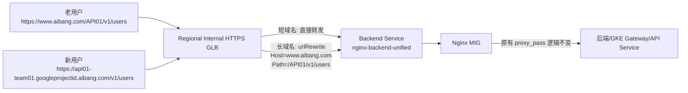

# GLB URL Map RouteAction 实施方案：长域名透明代理，地址栏不变，后端复用短域名 Path 逻辑

> 核心原则：
>
> - 长域名进来
> - GLB URL Map 在边缘节点做 `routeAction.urlRewrite`
> - 客户端地址栏保持长域名不变
> - Nginx 继续复用原来的短域名 path 逻辑
> - 不在 Nginx 中管理长域名

---

## 1. Goal and Constraints

### 你的原始目标，收敛成一句话

把长域名入口统一放到 GLB 上处理，但不做 301/302 跳转，而是做透明代理。

### 目标拆解

1. 保持现有短域名链路继续可用：
   - `https://www.aibang.com/API01`
   - `https://www.aibang.com/API02`
2. 新增长域名入口，例如：
   - `https://api01-team01.googleprojectid.aibang.com`
   - `https://api02-team02.googleprojectid.aibang.com`
3. 长域名请求进入 GLB 后，不改变浏览器地址栏。
4. GLB 将长域名请求内部改写成短域名语义，再转发给原 Nginx。
5. Nginx 不负责长域名管理，不增加长域名 `server_name`。

### 本文适用前提

这个方案能做到“Nginx 不改长域名配置”，但要满足下面条件：

1. Nginx 现有短域名 `location` 已经存在。
2. 长域名最终要映射到的短域名 path 已经存在，或者可以直接复用已有 path。
3. GLB 转发给 Nginx 时，Nginx 允许接收 `Host: www.aibang.com` 这类短域名语义。

复杂度：`Moderate`

---

## 2. Recommended Architecture (V1)



### 请求效果

#### 短域名用户

```text
请求:  https://www.aibang.com/API01/v1/users
GLB:   不改写
Nginx: 命中 location /API01
```

#### 长域名用户

```text
请求:  https://api01-team01.googleprojectid.aibang.com/v1/users
GLB:   hostRewrite = www.aibang.com
       pathPrefixRewrite = /API01
Nginx: 实际收到 Host=www.aibang.com, Path=/API01/v1/users
结果:  命中原 location /API01
用户:  浏览器地址栏仍然是长域名
```

---

## 3. 直接回答你的三个问题

## 3.1 如何 update GLB 域名并绑定多个证书

### 设计结论

- 同一个 `target-https-proxy` 可以同时绑定多个证书。
- GLB 会根据客户端 SNI 自动选择匹配证书。
- 短域名和长域名泛域名证书可以同时挂上去。

### 推荐操作

```bash
export PROJECT_ID="your-project-id"
export REGION="asia-east1"
export HTTPS_PROXY="prod-ilb-https-proxy"

gcloud compute target-https-proxies describe ${HTTPS_PROXY} \
  --project=${PROJECT_ID} \
  --region=${REGION} \
  --format="yaml(urlMap,sslCertificates)"
```

如果已经有短域名证书，再加一个长域名泛证书：

```bash
gcloud compute ssl-certificates create short-domain-cert \
  --project=${PROJECT_ID} \
  --region=${REGION} \
  --certificate=./certs/www.aibang.com.crt \
  --private-key=./certs/www.aibang.com.key

gcloud compute ssl-certificates create long-wildcard-cert \
  --project=${PROJECT_ID} \
  --region=${REGION} \
  --certificate=./certs/wildcard.googleprojectid.aibang.com.crt \
  --private-key=./certs/wildcard.googleprojectid.aibang.com.key
```

更新 proxy：

```bash
gcloud compute target-https-proxies update ${HTTPS_PROXY} \
  --project=${PROJECT_ID} \
  --region=${REGION} \
  --ssl-certificates=short-domain-cert,long-wildcard-cert \
  --ssl-certificates-region=${REGION}
```

### 注意

- 这个命令会覆盖证书列表，不是追加。
- 所以你必须把“要保留的旧证书 + 新证书”一起写进去。
- 如果是 internal regional HTTPS LB，就要使用 regional SSL certificates。

---

## 3.2 如何创建新的 backend service，并绑定到原来的 Nginx

### 推荐做法

不是新建一套 Nginx，而是：

- 新建一个新的 `backend service`
- 继续绑定原来的 Nginx MIG
- 这样便于和现网 backend service 并行存在
- 回滚最简单

### 先查看现有 backend service

```bash
export EXISTING_BS="prod-nginx-backend"

gcloud compute backend-services describe ${EXISTING_BS} \
  --project=${PROJECT_ID} \
  --region=${REGION} \
  --format=yaml
```

重点看这些字段：

- `protocol`
- `portName`
- `healthChecks`
- `timeoutSec`
- `connectionDraining`
- `backends`

### 按原参数创建新 backend service

```bash
export NEW_BS="nginx-backend-unified"
export NGINX_MIG="nginx-mig"
export HC_NAME="nginx-https-hc"

gcloud compute backend-services create ${NEW_BS} \
  --project=${PROJECT_ID} \
  --region=${REGION} \
  --protocol=HTTPS \
  --port-name=https \
  --health-checks=${HC_NAME} \
  --health-checks-region=${REGION} \
  --load-balancing-scheme=INTERNAL_MANAGED \
  --timeout=30 \
  --connection-draining-timeout=300 \
  --enable-logging \
  --logging-sample-rate=1.0

gcloud compute backend-services add-backend ${NEW_BS} \
  --project=${PROJECT_ID} \
  --region=${REGION} \
  --instance-group=${NGINX_MIG} \
  --instance-group-region=${REGION} \
  --balancing-mode=UTILIZATION \
  --max-utilization=0.8

gcloud compute backend-services get-health ${NEW_BS} \
  --project=${PROJECT_ID} \
  --region=${REGION}
```

### 为什么这样最稳

- 不碰现有 backend service。
- URL map 可以逐步切到新 backend service。
- Nginx 实例本身不需要复制。
- 同一个 MIG 可以同时被多个 backend service 引用。

---

## 3.3 如果以前没有显式通过 URL map 管理规则，现在如何创建

### 关键结论

即使你以前没有手动维护过高级路由，GLB 背后仍然一定有一个 URL map。

你现在要做的不是“从没有到有”，而是：

1. 找到当前 proxy 指向的 URL map
2. 导出它
3. 基于它生成一个新的 `url-map-v2`
4. 验证后切换 proxy

### 找出当前 URL map

```bash
gcloud compute target-https-proxies describe ${HTTPS_PROXY} \
  --project=${PROJECT_ID} \
  --region=${REGION} \
  --format="value(urlMap)"
```

### 导出当前 URL map

```bash
export OLD_URL_MAP="prod-url-map"

gcloud compute url-maps export ${OLD_URL_MAP} \
  --project=${PROJECT_ID} \
  --region=${REGION} \
  --destination=/tmp/${OLD_URL_MAP}.yaml
```

### 生产建议

- 不要直接改老 URL map。
- 新建 `prod-url-map-v2`。
- 先导入、验证，再切换 proxy。

---

## 4. 推荐映射模型

你提到有两种模式，我都给出。

## 4.1 模式 A：长域名映射到固定短路径 API 名

| 长域名 | GLB 内部改写后 Path | Nginx 命中的原 location |
| --- | --- | --- |
| `api01-team01.googleprojectid.aibang.com` | `/API01/...` | `location /API01` |
| `api02-team02.googleprojectid.aibang.com` | `/API02/...` | `location /API02` |

这个模式适合：

- 你已经有稳定的 `/API01`、`/API02` 入口。
- 想让多个 team/tenant 的长域名统一落到某个已有 API path。

## 4.2 模式 B：长域名前缀映射到同名短路径

| 长域名 | GLB 内部改写后 Path | Nginx 命中的原 location |
| --- | --- | --- |
| `api01-team01.googleprojectid.aibang.com` | `/api01-team01/...` | `location /api01-team01` |
| `api02-team02.googleprojectid.aibang.com` | `/api02-team02/...` | `location /api02-team02` |

这个模式适合：

- 每个长域名本身就对应一个唯一短 path。
- Nginx 上已经存在这些短 path location。

---

## 5. Recommended Architecture (V1) 的 URL Map 写法

## 5.1 设计原则

推荐使用：

- 一个短域名 `pathMatcher`
- 一个长域名 wildcard `pathMatcher`
- 在长域名 matcher 中用 `routeRules + headerMatches(Host) + routeAction.urlRewrite`

原因：

- `hostRules` 的 `*.googleprojectid.aibang.com` 只能把所有长域名先导入一个 matcher。
- 真正区分 `api01-team01` 和 `api02-team02`，仍要靠 `routeRules` 按 Host 精确匹配。
- 透明代理不是 `urlRedirect`，而是 `routeAction.urlRewrite`。

---

## 6. 完整 URL Map YAML 示例

下面给的是你当前目标最贴合的版本：

- 短域名继续原样转发
- 长域名透明代理
- 地址栏不变
- Nginx 继续命中原短域名 path 逻辑

```yaml
kind: compute#urlMap
name: prod-url-map-v2
description: "short domain passthrough + long domain transparent proxy via routeAction.urlRewrite"
defaultService: projects/YOUR_PROJECT_ID/regions/YOUR_REGION/backendServices/nginx-backend-unified

hostRules:
- hosts:
  - "www.aibang.com"
  pathMatcher: short-domain-matcher

- hosts:
  - "*.googleprojectid.aibang.com"
  pathMatcher: long-domain-matcher

pathMatchers:
- name: short-domain-matcher
  defaultService: projects/YOUR_PROJECT_ID/regions/YOUR_REGION/backendServices/nginx-backend-unified

- name: long-domain-matcher
  defaultService: projects/YOUR_PROJECT_ID/regions/YOUR_REGION/backendServices/nginx-backend-unified
  routeRules:
  - priority: 10
    description: "api01-team01 transparent route to short path /API01"
    matchRules:
    - prefixMatch: "/"
      headerMatches:
      - headerName: "Host"
        exactMatch: "api01-team01.googleprojectid.aibang.com"
    routeAction:
      urlRewrite:
        hostRewrite: "www.aibang.com"
        pathPrefixRewrite: "/API01"
      weightedBackendServices:
      - backendService: projects/YOUR_PROJECT_ID/regions/YOUR_REGION/backendServices/nginx-backend-unified
        weight: 100

  - priority: 20
    description: "api02-team02 transparent route to short path /API02"
    matchRules:
    - prefixMatch: "/"
      headerMatches:
      - headerName: "Host"
        exactMatch: "api02-team02.googleprojectid.aibang.com"
    routeAction:
      urlRewrite:
        hostRewrite: "www.aibang.com"
        pathPrefixRewrite: "/API02"
      weightedBackendServices:
      - backendService: projects/YOUR_PROJECT_ID/regions/YOUR_REGION/backendServices/nginx-backend-unified
        weight: 100
```

### 这份 YAML 的效果

#### API01 示例

```text
客户端请求:
https://api01-team01.googleprojectid.aibang.com/v1/users

GLB 内部改写后转发给 Nginx:
Host: www.aibang.com
Path: /API01/v1/users
```

#### API02 示例

```text
客户端请求:
https://api02-team02.googleprojectid.aibang.com/v2/orders

GLB 内部改写后转发给 Nginx:
Host: www.aibang.com
Path: /API02/v2/orders
```

---

## 7. 如果你要按“同名短路径”映射

例如：

- `api01-team01.googleprojectid.aibang.com` -> `/api01-team01`
- `api02-team02.googleprojectid.aibang.com` -> `/api02-team02`

那么只改 `pathPrefixRewrite`：

```yaml
  - priority: 10
    description: "api01-team01 transparent route to /api01-team01"
    matchRules:
    - prefixMatch: "/"
      headerMatches:
      - headerName: "Host"
        exactMatch: "api01-team01.googleprojectid.aibang.com"
    routeAction:
      urlRewrite:
        hostRewrite: "www.aibang.com"
        pathPrefixRewrite: "/api01-team01"
      weightedBackendServices:
      - backendService: projects/YOUR_PROJECT_ID/regions/YOUR_REGION/backendServices/nginx-backend-unified
        weight: 100
```

请求效果：

```text
客户端:
https://api01-team01.googleprojectid.aibang.com/v1/users

Nginx 实际收到:
Host: www.aibang.com
Path: /api01-team01/v1/users
```

---

## 8. 对于后端 Nginx 配置，需要做什么调整

### 先给结论

按照你的当前目标，Nginx 不需要增加任何长域名配置。

也就是说：

- 不需要新增长域名 `server_name`
- 不需要为长域名增加 `location`
- 不需要在 Nginx 里做长域名到短路径的 rewrite

### 你真正需要确认的只有这几件事

1. 现有 `server_name www.aibang.com` 能处理 GLB 改写后的请求。
2. 现有短域名 path 已存在。
3. `proxy_pass` 逻辑无需依赖客户端原始 Host。

### 例子 1：固定 API path 模式

```nginx
server {
    listen 443 ssl;
    server_name www.aibang.com;

    location /API01 {
        proxy_pass https://gke-gateway.intra.aibang.com:443;
        proxy_set_header Host www.aibang.com;
        proxy_set_header X-Real-IP $remote_addr;
        proxy_set_header X-Forwarded-For $proxy_add_x_forwarded_for;
    }

    location /API02 {
        proxy_pass https://gke-gateway.intra.aibang.com:443;
        proxy_set_header Host www.aibang.com;
        proxy_set_header X-Real-IP $remote_addr;
        proxy_set_header X-Forwarded-For $proxy_add_x_forwarded_for;
    }
}
```

这时：

- 长域名 API01 在 GLB 被改成 `/API01/...`
- 长域名 API02 在 GLB 被改成 `/API02/...`
- Nginx 原 location 完全复用

### 例子 2：同名短路径模式

```nginx
server {
    listen 443 ssl;
    server_name www.aibang.com;

    location /api01-team01 {
        proxy_pass https://backend-01.intra.aibang.com:443;
    }

    location /api02-team02 {
        proxy_pass https://backend-02.intra.aibang.com:443;
    }
}
```

这时：

- GLB 把 `api01-team01.googleprojectid.aibang.com` 改成 `/api01-team01/...`
- GLB 把 `api02-team02.googleprojectid.aibang.com` 改成 `/api02-team02/...`
- Nginx 一样不需要知道长域名存在

### 什么时候 Nginx 仍然可能需要调整

只有以下情况才需要动 Nginx：

1. 当前没有对应短 path location。
2. 当前 `server_name` 或 TLS 配置导致改写后请求不能被接收。
3. 应用依赖原始长域名 Host 才能工作。

如果出现第 3 种情况，就需要重新评估是否保留 `hostRewrite: www.aibang.com`，或者把下游应用改成不依赖原始 Host。

---

## 9. 透明代理方案的关键边界

## 9.1 它能解决什么

- 客户端地址栏保持长域名。
- 不做 301/302 跳转。
- 不在 Nginx 管理长域名。
- 尽量复用现有短域名 path 逻辑。

## 9.2 它不能自动完成什么

GLB URL Map 不能自动从 Host 中提取变量，再动态拼接成 Path。

也就是说，你不能只写一条这样的“动态规则”：

```text
{prefix}.googleprojectid.aibang.com  ->  /{prefix}
```

原因是：

- `urlRewrite` 的变量能力主要面向 path，不是 host 提取。
- `hostRules` 可以匹配 wildcard，但不能把 wildcard 捕获值继续喂给 `pathPrefixRewrite`。
- 所以你仍然需要一份：
  - `长域名 -> 短路径`
  - 的静态映射表

### 实际可落地方式

1. `hostRules` 用一个 wildcard 承接所有长域名
2. `routeRules` 里每个长域名一条规则
3. 用脚本自动生成 YAML，避免人工维护

---

## 10. 自动化生成 URL Map 的建议

建议维护一个映射表文件：

```yaml
mappings:
  - host: api01-team01.googleprojectid.aibang.com
    short_path: /API01
  - host: api02-team02.googleprojectid.aibang.com
    short_path: /API02
```

用脚本生成 `routeRules`，这样每次新增 tenant/API 时：

1. 加一条 mapping
2. 生成新的 URL map YAML
3. validate
4. import

这才是生产上可维护的方式。

---

## 11. Implementation Steps

## Step 1：确认现网对象

```bash
gcloud compute target-https-proxies list \
  --project=${PROJECT_ID} \
  --filter="region:${REGION}"

gcloud compute backend-services list \
  --project=${PROJECT_ID} \
  --filter="region:${REGION}"

gcloud compute ssl-certificates list \
  --project=${PROJECT_ID} \
  --region=${REGION}
```

## Step 2：创建或更新证书

按第 3.1 节执行。

## Step 3：创建新的 backend service

按第 3.2 节执行。

## Step 4：准备 URL map YAML

先从当前 URL map 导出，再生成新的 `prod-url-map-v2.yaml`。

## Step 5：validate

```bash
gcloud compute url-maps validate \
  --project=${PROJECT_ID} \
  --region=${REGION} \
  --source=/tmp/prod-url-map-v2.yaml
```

## Step 6：导入新的 URL map

```bash
export URL_MAP_V2="prod-url-map-v2"

gcloud compute url-maps import ${URL_MAP_V2} \
  --project=${PROJECT_ID} \
  --region=${REGION} \
  --source=/tmp/prod-url-map-v2.yaml
```

## Step 7：切换 proxy

```bash
gcloud compute target-https-proxies update ${HTTPS_PROXY} \
  --project=${PROJECT_ID} \
  --region=${REGION} \
  --url-map=${URL_MAP_V2} \
  --url-map-region=${REGION}
```

---

## 12. Validation and Rollback

## 12.1 控制面验证

```bash
gcloud compute target-https-proxies describe ${HTTPS_PROXY} \
  --project=${PROJECT_ID} \
  --region=${REGION} \
  --format="yaml(urlMap,sslCertificates)"

gcloud compute url-maps describe ${URL_MAP_V2} \
  --project=${PROJECT_ID} \
  --region=${REGION} \
  --format=yaml
```

## 12.2 数据面验证

验证长域名地址栏不变，本质上看不到 redirect：

```bash
curl -k -I --resolve api01-team01.googleprojectid.aibang.com:443:ILB_IP \
  https://api01-team01.googleprojectid.aibang.com/v1/users
```

预期：

- 不是 301/302
- 应该是后端正常状态码，例如 200/401/403
- 不应出现 `Location: https://www.aibang.com/...`

验证短域名不受影响：

```bash
curl -k -I --resolve www.aibang.com:443:ILB_IP \
  https://www.aibang.com/API01/v1/users
```

## 12.3 回滚

```bash
gcloud compute target-https-proxies update ${HTTPS_PROXY} \
  --project=${PROJECT_ID} \
  --region=${REGION} \
  --url-map=${OLD_URL_MAP} \
  --url-map-region=${REGION}
```

回滚要点：

- 不删除旧 URL map
- 不删除旧 backend service
- 先切回 proxy，再处理清理动作

---

## 13. Reliability and Cost Optimizations

### 可靠性建议

- 新 backend service 复用原 MIG，降低变更范围。
- URL map 用 `v2` 蓝绿切换，不原地改。
- 先只放 1 到 2 个长域名做灰度。
- 打开 backend logging，便于核对 GLB rewrite 后的请求行为。

### 成本建议

- 先复用原 Nginx MIG，不新增机器。
- 不额外引入 redirect service。
- 如果长域名数量很大，再考虑脚本自动生成和 GitOps。

---

## 14. 风险与真实限制

### 风险 1：后端依赖原始 Host

如果你的下游逻辑必须看到长域名 Host，那么 `hostRewrite: www.aibang.com` 会改变行为。

这种情况下要重新决定：

- 是继续保留 `hostRewrite`
- 还是让 Nginx/应用识别长域名

### 风险 2：应用返回绝对 URL

即使地址栏保持长域名，如果应用返回绝对链接：

- `https://www.aibang.com/...`

用户仍会感知短域名。

### 风险 3：一条规则处理全部长域名不可行

GLB 不能动态把：

- `api01-team01.googleprojectid.aibang.com`

自动变成：

- `/api01-team01`

因此生产上仍建议：

- 映射表
- 自动生成 routeRules
- GitOps 管理

---

## 15. 最终建议

如果你的核心目标是：

- 长短域名同时可用
- 浏览器地址栏保持长域名
- 不在 Nginx 管理长域名
- 尽量保留 Nginx 现有短域名 `location + proxy_pass`

那么最合适的 V1 是：

1. GLB 绑定短域名证书 + 长域名泛证书
2. 新建 `nginx-backend-unified`，继续指向原 Nginx MIG
3. 新建 `prod-url-map-v2`
4. 长域名部分使用 `routeAction.urlRewrite`
5. `hostRewrite: www.aibang.com`
6. `pathPrefixRewrite` 指向原有短域名 path
7. Nginx 不新增长域名配置

这条路线是你当前约束下最接近“全部控制在 GLB 边缘完成”的方案。
