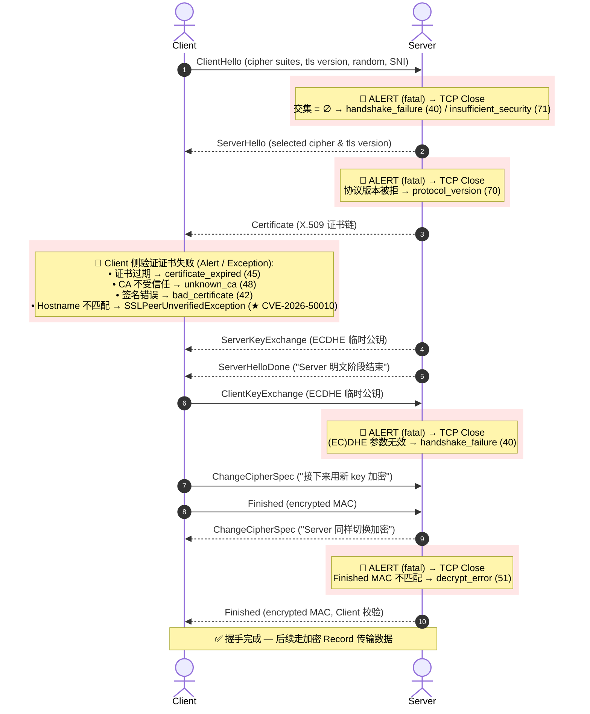
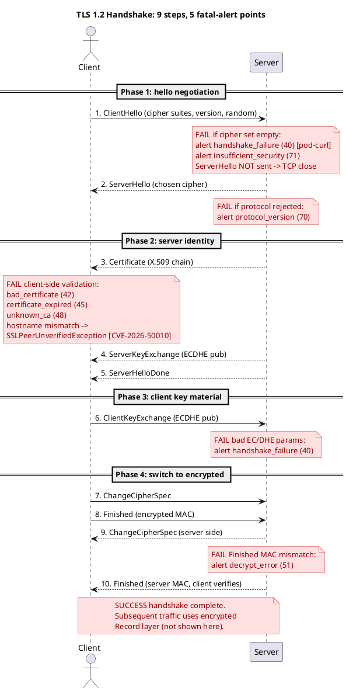
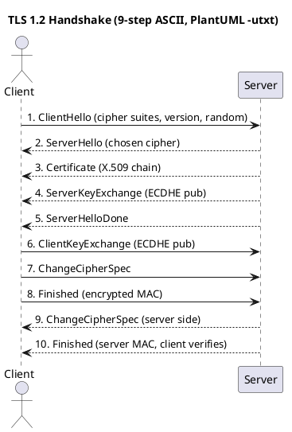

# TLS Handshake — 完整流程图(含每个阶段可能发生的报错)

> **这份文档只放一张图**。如果需要文字解释 / RFC 引用 / openssl 诊断命令,
> 看旁边的 `tls-handshake-explained.md`(协议层)和
> `develop/java/java-auth/pod-curl.md` §4(Java 应用层)。

> **怎么读这张图**:
> - 中间是 Client ↔ Server 的 TLS 1.2 经典 9 步握手
> - 每一步下方的 `╔═══╗` 框是该阶段**可能触发的 fatal alert**
> - 带 `★` 的报错 = 跟我们 `java-auth/` 系列文档直接相关
> - 所有 fatal alert 后都跟 `TCP close`(没有重试 / 没有 retry)
> - 每个框内框宽度恒为 36 字符(便于阅读 + 自定义扩展)

```
   Client                              Server
   ──────────────────────────────────────────────────────────────────────────
   |-------- ClientHello ----------->|   ①  client 给出 cipher suites 列表
   |                                  |       + 协议版本 + 随机数 + SNI
   |                                  |
   |                                  |      ╔════════════════════════════════════╗
   |                                  |      ║ server 计算:                       ║
   |                                  |      ║   intersect(client_list,           ║
   |                                  |      ║     server_enabled_list)           ║
   |                                  |      ║                                    ║
   |                                  |      ║ 交集 = ∅ →                         ║
   |                                  |      ║   ALERT level=fatal:               ║
   |                                  |      ║   ├ handshake_failure      (40)    ║ ★ pod-curl §4
   |                                  |      ║   │                                ║
   |                                  |      ║   └ insufficient_security (71)     ║ ★ pod-curl §4
   |                                  |      ║                                    ║
   |                                  |      ║ 两种都关 TCP,无重试                ║
   |                                  |      ╚════════════════════════════════════╝
   |                                  |
   |<------- ServerHello ------------|   ②  server 选定 cipher + 协议版本
   |                                  |      ╔════════════════════════════════════╗
   |                                  |      ║ 协议版本被拒 → ALERT               ║
   |                                  |      ║   protocol_version (70)            ║
   |                                  |      ╚════════════════════════════════════╝
   |<------- Certificate ------------|   ③  server 给出 X.509 证书链
   |                                  |
   |  ┌─ (client 验证证书)           |
   |                                  |      ╔════════════════════════════════════╗
   |                                  |      ║ 证书链/有效期/CA/SAN:              ║
   |                                  |      ║   证书过期 →                       ║
   |                                  |      ║     certificate_expired (45)       ║
   |                                  |      ║   CA 不受信任 →                    ║
   |                                  |      ║     unknown_ca (48)                ║
   |                                  |      ║   签名错误 →                       ║
   |                                  |      ║     bad_certificate (42)           ║
   |                                  |      ║   hostname 不匹配 →                ║ ★ CVE-2026-50010
   |                                  |      ║     SSLPeerUnverifiedExc           ║
   |                                  |      ║     eption                         ║
   |  └───────────────────────────────|      ╚════════════════════════════════════╝
   |                                  |
   |<------- ServerHelloDone --------|   ④  "server 的明文阶段结束"
   |<------- ServerKeyExchange ------|   ⑤  server 的 ECDHE 临时公钥
   |                                  |
   |-------- ClientKeyExchange ----->|   ⑥  client 的 ECDHE 临时公钥
   |                                  |      ╔════════════════════════════════════╗
   |                                  |      ║ (EC)DHE 参数无效 →                 ║
   |                                  |      ║   handshake_failure (40)           ║
   |                                  |      ╚════════════════════════════════════╝
   |-------- ChangeCipherSpec ------>|   ⑦  "接下来用新 key 加密"
   |-------- Finished (encrypted) -->|   ⑧  client 给的 MAC
   |                                  |
   |<------- ChangeCipherSpec -------|   ⑨  server 同样切换
   |                                  |      ╔════════════════════════════════════╗
   |                                  |      ║ Finished MAC 不匹配 →              ║
   |                                  |      ║   decrypt_error (51)               ║
   |                                  |      ╚════════════════════════════════════╝
   |<------- Finished (encrypted) ---|   ⑩  server 的 MAC,client 校验
   |                                  |
   |        (application data)       |    ✓ 握手完成 — 后续走加密 record,    
   |                                  |      之后的 alert 跟握手失败无关
   ───────────────────────────────────
```

## 补充：Mermaid 矢量流程图（支持在 IDE / GitHub 中直接渲染）



## PlantUML 版本(自动生成,可编辑)

> 用 `plantuml-ascii` skill 生成。**目的不是替代前面的图**,而是给读者一份**机器可读、可一键编辑**的 `.puml` 源 —— 想改协议步骤、改 alert 名称、加新的失败分支,改 `.puml` 一行就行,不必像前面 ASCII 图那样手工算列宽。

### PlantUML 源文件(完整版,含 5 个 fatal alert 标注 — 用于 SVG 输出)

下面这份 `.puml` 源用 `note over ... end note` 标注了 5 个 fatal alert 锚点。**注意**:这份源**可以**用 `plantuml -tsvg` 导出 SVG;但**当前安装的 PlantUML 1.2026.7 在 `-txt / -utxt` 模式下会因 ASCII exporter 的 `NoteTile` 崩溃**(详见 plantuml-ascii skill 的 Pitfalls §6)。所以下面这份源是给 SVG 用,不是给 ASCII 用。



生成 SVG:

```bash
plantuml -tsvg tls-handshake.puml    # 输出 tls-handshake.svg (13 KB)
plantuml -tpng tls-handshake.puml    # 输出 tls-handshake.png
```

### PlantUML ASCII 输出(`-utxt` 模式 —— 仅基础流程,**无** alert 标注)

为了拿到 ASCII 输出,我们用一份**不带 `note` 块**的简化 `.puml`(PlantUML 1.2026.7 的 ASCII exporter 一碰到 `note` 就崩 —— 详见 plantuml-ascii skill §Pitfalls 6)。下面的 ASCII 是用这份简化源 `plantuml -utxt` 生成的:



`plantuml -utxt tls-ascii.puml` 的输出:

```
TLS 1.2 Handshake (9-step ASCII, PlantUML -utxt)

              ┌──────┐                                           ┌──────┐
              │Client│                                           │Server│
              └───┬──┘                                           └───┬──┘
                  │ 1. ClientHello (cipher suites, version, random)  │
                  │─────────────────────────────────────────────────>│
                  │                                                  │
                  │         2. ServerHello (chosen cipher)           │
                  │< ─ ─ ─ ─ ─ ─ ─ ─ ─ ─ ─ ─ ─ ─ ─ ─ ─ ─ ─ ─ ─ ─ ─ ─ │
                  │                                                  │
                  │          3. Certificate (X.509 chain)            │
                  │< ─ ─ ─ ─ ─ ─ ─ ─ ─ ─ ─ ─ ─ ─ ─ ─ ─ ─ ─ ─ ─ ─ ─ ─ │
                  │                                                  │
                  │        4. ServerKeyExchange (ECDHE pub)          │
                  │< ─ ─ ─ ─ ─ ─ ─ ─ ─ ─ ─ ─ ─ ─ ─ ─ ─ ─ ─ ─ ─ ─ ─ ─ │
                  │                                                  │
                  │               5. ServerHelloDone                 │
                  │< ─ ─ ─ ─ ─ ─ ─ ─ ─ ─ ─ ─ ─ ─ ─ ─ ─ ─ ─ ─ ─ ─ ─ ─ │
                  │                                                  │
                  │        6. ClientKeyExchange (ECDHE pub)          │
                  │─────────────────────────────────────────────────>│
                  │                                                  │
                  │               7. ChangeCipherSpec                │
                  │─────────────────────────────────────────────────>│
                  │                                                  │
                  │           8. Finished (encrypted MAC)            │
                  │─────────────────────────────────────────────────>│
                  │                                                  │
                  │        9. ChangeCipherSpec (server side)         │
                  │< ─ ─ ─ ─ ─ ─ ─ ─ ─ ─ ─ ─ ─ ─ ─ ─ ─ ─ ─ ─ ─ ─ ─ ─ │
                  │                                                  │
                  │   10. Finished (server MAC, client verifies)     │
                  │< ─ ─ ─ ─ ─ ─ ─ ─ ─ ─ ─ ─ ─ ─ ─ ─ ─ ─ ─ ─ ─ ─ ─ ─ │
                  │                                                  │
              ┌───┴──┐                                           ┌───┴──┐
              │Client│                                           │Server│
              └──────┘                                           └──────┘
```

### 三个版本的对比

| 版本 | 怎么生成 | 包含 alert 标注? | 可编辑性 | 渲染在哪 |
|------|---------|------------------|---------|---------|
| **手画 ASCII**(§0,~60 行) | 手工对齐(CJK 视觉宽度正确) | ✅ 5 个 alert + ★ 引用 | 改一行要重算列宽 | 任何 monospace 终端 |
| **Mermaid**(§补充,~30 行) | IDE / GitHub 原生渲染 | ✅ 5 个 alert | 编辑 `.md` 即时预览 | GitHub / VSCode / Obsidian |
| **PlantUML ASCII**(本节,~15 行) | `plantuml -utxt file.puml` | ❌(1.2026.7 ASCII exporter bug) | 改 `.puml` 重跑命令 | 任何 monospace 终端 |

**怎么选**:
- 你要**马上看到图**、不想装工具 → 看上面手画版
- 你在写 GitHub README / VSCode 文档 → 用 Mermaid 版(IDE 直接渲染)
- 你要**经常改协议细节**(协议升级 / 加新 alert),想用版本控制管理 → 用 PlantUML 版(`.puml` 源进 git,改一行重新生成即可)
- 你要可分享的**矢量图**(博客 / 幻灯片) → `plantuml -tsvg` 输出 SVG

### PlantUML 1.2026.7 ASCII exporter 的限制(详细)

实测发现,PlantUML 1.2026.7 的 `-txt / -utxt` 输出有以下 crash(全部抛 `java.lang.UnsupportedOperationException: NoteTile` / `DividerTile`):

| 触发条件 | 现象 |
|---------|------|
| `note over X ... end note`(多行块) | **crash**(`AsciiBlock.asciiDimension` not implemented) |
| `note left of X : text` / `note right of X : text` | **crash**(同上) |
| `== Section ==` divider 在 sequence diagram 里 | **crash**(`DividerTile` not implemented) |
| `rect rgb(...) ... end`(Mermaid 风格的彩色框) | **crash**(无 `rect` in sequence) |
| 不带任何 `note` 的纯消息序列 | ✅ 正常 |

**变通办法**:
1. 用 SVG 输出代替 ASCII(`plantuml -tsvg`,13 KB,CJK 正确)
2. 简化 `.puml` —— 把 alert 标注挪到箭头消息文本里(如上面简化版 ASCII 输出所示)
3. **降级 PlantUML 到 1.2024.x 系列**(那时 ASCII exporter 还是正常的)—— `brew install plantuml@1.2024` 然后 `brew switch plantuml 1.2024.x`

完整 pitfall 已记录在 plantuml-ascii skill 的 §Pitfalls。

---

## 列宽速查表(给想自己改图的人)

| 元素 | 起始列 | 结束列 | 宽度 |
|------|-------|-------|------|
| Client pipe `\|` | 3 | 3 | 1 |
| 消息箭头 `-------- ClientHello ----------->` | 4 | 37 | 34 |
| Server pipe `\|` | 38 | 38 | 1 |
| 失败框左 ║ | 45 | 45 | 1 |
| **失败框内文**(每行固定) | 46 | 81 | **36** |
| 失败框右 ║ | 82 | 82 | 1 |
| ★ 标注 | 84+ | — | 自由 |

**内框严格 36 字符宽**。如果你加新的报错框,把内容用空格补到 36 字符后再加右 ║。长内容必须换行(用多行 ║),不要试图塞进单行。

> **关于 CJK 字符**:上表中的「36 字符宽」是**视觉宽度**,不是 Python 字符串长度。CJK 字符(中文 / 日文 / 韩文)在等宽字体里占 2 个英文字符的宽度。如果你自己改这个图,内容里有中文的话,数视觉列数而不是字符数。

## 三个对照点(最常被问的)

| 现象 | 在图上的位置 | 性质 |
|------|-------------|------|
| **`Received fatal alert: handshake_failure`** + 没有任何 HTTP 响应 | **步骤 ①之后、②之前** — ClientHello 出去,ServerHello 没回来,直接收 7-byte Alert record | **server 拒绝 cipher 集合** — 协议层握手**根本没进 ServerHello** |
| **SSLPeerUnverifiedException: hostname 不匹配** | **步骤 ③之后、④之前** — Certificate 已收,客户端拒绝 | **客户端拒绝 server 身份** — 协议层走了 3 步,在客户端应用层抛 |
| **Closed by peer at Finished 阶段** / 随机数据 | **步骤 ⑧ / ⑩** — Finished MAC 校验失败 | **密钥不一致** — 双方算的 master_secret 不一致(罕见,通常是客户端实现 bug)|

## 跟 TLS 1.3 的关系

TLS 1.3 把这个图压缩成 1-RTT:**前 3 步**(ClientHello + ServerHello + EncryptedExtensions/Certificate)在第一个 round trip 里完成,**failure point 完全相同**——cipher 列表为空就在 ServerHello 之前发 `handshake_failure`,cert 校验失败就在 Certificate 之后发 `bad_certificate`。**也就是说,这张图的「客户能看到的报错位置」对 TLS 1.3 全部适用**,只是消息都加密了(`EncryptedExtensions` / `{Certificate}` / `{CertificateVerify}` 在握手阶段就被加密)。

唯一 1.3 新增的报错是 `missing_extension`(客户端没带 `key_share`)—— server 用 `HelloRetryRequest` 让客户端重试,**不算 fatal,不算 TCP close**,是 1.3 独有的弹性。

## 相关文档(按层级从协议 → 应用)

- `tls-handshake-explained.md` §2 / §3 — 详细文字说明 + RFC 引用 + openssl 诊断
- `tls-handshake-flow.html` — **HTML / SVG 版本**的可视化(这个 ASCII 版本的同伴)
- `develop/java/java-auth/pod-curl.md` §4 — Java 应用的 cipher 不匹配(`★ handshake_failure` 场景的具体 case)
- `develop/java/java-auth/cve-2026-50010-*.md` — `★ hostname verification` 被静默关掉的 CVE(跟 `SSLPeerUnverifiedException` 不直接相关,Netty 默认是**不报错地接受**——比这张图上 cert 校验失败的报错路径更隐蔽)
