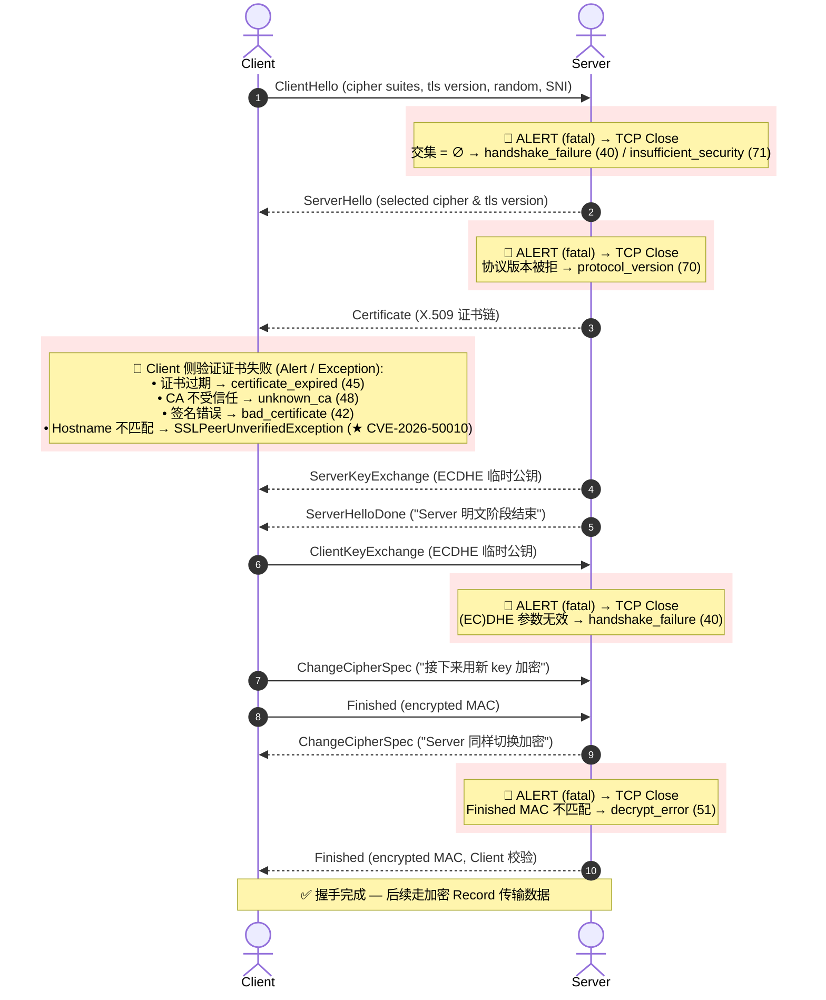

# TLS Handshake — 完整流程图(含每个阶段可能发生的报错)

> **这份文档只放一张图**。如果需要文字解释 / RFC 引用 / openssl 诊断命令,
> 看旁边的 `tls-handshake-explained.md`(协议层)和
> `develop/java/java-auth/pod-curl.md` §4(Java 应用层)。

> **怎么读这张图**:
> - 中间是 Client ↔ Server 的 TLS 1.2 经典 9 步握手
> - 每一步下方的 `╔═══╗` 框是该阶段**可能触发的 fatal alert**
> - 带 `★` 的报错 = 跟我们 `java-auth/` 系列文档直接相关
> - 所有 fatal alert 后都跟 `TCP close`(没有重试 / 没有 retry)
> - 每个框内框宽度恒为 36 字符(便于阅读 + 自定义扩展)

```
   Client                              Server
   ──────────────────────────────────────────────────────────────────────────
   |-------- ClientHello ----------->|   ①  client 给出 cipher suites 列表
   |                                  |       + 协议版本 + 随机数 + SNI
   |                                  |
   |                                  |      ╔════════════════════════════════════╗
   |                                  |      ║ server 计算:                       ║
   |                                  |      ║   intersect(client_list,           ║
   |                                  |      ║     server_enabled_list)           ║
   |                                  |      ║                                    ║
   |                                  |      ║ 交集 = ∅ →                         ║
   |                                  |      ║   ALERT level=fatal:               ║
   |                                  |      ║   ├ handshake_failure      (40)    ║ ★ pod-curl §4
   |                                  |      ║   │                                ║
   |                                  |      ║   └ insufficient_security (71)     ║ ★ pod-curl §4
   |                                  |      ║                                    ║
   |                                  |      ║ 两种都关 TCP,无重试                ║
   |                                  |      ╚════════════════════════════════════╝
   |                                  |
   |<------- ServerHello ------------|   ②  server 选定 cipher + 协议版本
   |                                  |      ╔════════════════════════════════════╗
   |                                  |      ║ 协议版本被拒 → ALERT               ║
   |                                  |      ║   protocol_version (70)            ║
   |                                  |      ╚════════════════════════════════════╝
   |<------- Certificate ------------|   ③  server 给出 X.509 证书链
   |                                  |
   |  ┌─ (client 验证证书)           |
   |                                  |      ╔════════════════════════════════════╗
   |                                  |      ║ 证书链/有效期/CA/SAN:              ║
   |                                  |      ║   证书过期 →                       ║
   |                                  |      ║     certificate_expired (45)       ║
   |                                  |      ║   CA 不受信任 →                    ║
   |                                  |      ║     unknown_ca (48)                ║
   |                                  |      ║   签名错误 →                       ║
   |                                  |      ║     bad_certificate (42)           ║
   |                                  |      ║   hostname 不匹配 →                ║ ★ CVE-2026-50010
   |                                  |      ║     SSLPeerUnverifiedExc           ║
   |                                  |      ║     eption                         ║
   |  └───────────────────────────────|      ╚════════════════════════════════════╝
   |                                  |
   |<------- ServerHelloDone --------|   ④  "server 的明文阶段结束"
   |<------- ServerKeyExchange ------|   ⑤  server 的 ECDHE 临时公钥
   |                                  |
   |-------- ClientKeyExchange ----->|   ⑥  client 的 ECDHE 临时公钥
   |                                  |      ╔════════════════════════════════════╗
   |                                  |      ║ (EC)DHE 参数无效 →                 ║
   |                                  |      ║   handshake_failure (40)           ║
   |                                  |      ╚════════════════════════════════════╝
   |-------- ChangeCipherSpec ------>|   ⑦  "接下来用新 key 加密"
   |-------- Finished (encrypted) -->|   ⑧  client 给的 MAC
   |                                  |
   |<------- ChangeCipherSpec -------|   ⑨  server 同样切换
   |                                  |      ╔════════════════════════════════════╗
   |                                  |      ║ Finished MAC 不匹配 →              ║
   |                                  |      ║   decrypt_error (51)               ║
   |                                  |      ╚════════════════════════════════════╝
   |<------- Finished (encrypted) ---|   ⑩  server 的 MAC,client 校验
   |                                  |
   |        (application data)       |    ✓ 握手完成 — 后续走加密 record,    
   |                                  |      之后的 alert 跟握手失败无关
   ───────────────────────────────────
```

## 补充：Mermaid 矢量流程图（支持在 IDE / GitHub 中直接渲染）



## 列宽速查表(给想自己改图的人)

| 元素 | 起始列 | 结束列 | 宽度 |
|------|-------|-------|------|
| Client pipe `\|` | 3 | 3 | 1 |
| 消息箭头 `-------- ClientHello ----------->` | 4 | 37 | 34 |
| Server pipe `\|` | 38 | 38 | 1 |
| 失败框左 ║ | 45 | 45 | 1 |
| **失败框内文**(每行固定) | 46 | 81 | **36** |
| 失败框右 ║ | 82 | 82 | 1 |
| ★ 标注 | 84+ | — | 自由 |

**内框严格 36 字符宽**。如果你加新的报错框,把内容用空格补到 36 字符后再加右 ║。长内容必须换行(用多行 ║),不要试图塞进单行。

> **关于 CJK 字符**:上表中的「36 字符宽」是**视觉宽度**,不是 Python 字符串长度。CJK 字符(中文 / 日文 / 韩文)在等宽字体里占 2 个英文字符的宽度。如果你自己改这个图,内容里有中文的话,数视觉列数而不是字符数。

## 三个对照点(最常被问的)

| 现象 | 在图上的位置 | 性质 |
|------|-------------|------|
| **`Received fatal alert: handshake_failure`** + 没有任何 HTTP 响应 | **步骤 ①之后、②之前** — ClientHello 出去,ServerHello 没回来,直接收 7-byte Alert record | **server 拒绝 cipher 集合** — 协议层握手**根本没进 ServerHello** |
| **SSLPeerUnverifiedException: hostname 不匹配** | **步骤 ③之后、④之前** — Certificate 已收,客户端拒绝 | **客户端拒绝 server 身份** — 协议层走了 3 步,在客户端应用层抛 |
| **Closed by peer at Finished 阶段** / 随机数据 | **步骤 ⑧ / ⑩** — Finished MAC 校验失败 | **密钥不一致** — 双方算的 master_secret 不一致(罕见,通常是客户端实现 bug)|

## 跟 TLS 1.3 的关系

TLS 1.3 把这个图压缩成 1-RTT:**前 3 步**(ClientHello + ServerHello + EncryptedExtensions/Certificate)在第一个 round trip 里完成,**failure point 完全相同**——cipher 列表为空就在 ServerHello 之前发 `handshake_failure`,cert 校验失败就在 Certificate 之后发 `bad_certificate`。**也就是说,这张图的「客户能看到的报错位置」对 TLS 1.3 全部适用**,只是消息都加密了(`EncryptedExtensions` / `{Certificate}` / `{CertificateVerify}` 在握手阶段就被加密)。

唯一 1.3 新增的报错是 `missing_extension`(客户端没带 `key_share`)—— server 用 `HelloRetryRequest` 让客户端重试,**不算 fatal,不算 TCP close**,是 1.3 独有的弹性。

## 相关文档(按层级从协议 → 应用)

- `tls-handshake-explained.md` §2 / §3 — 详细文字说明 + RFC 引用 + openssl 诊断
- `tls-handshake-flow.html` — **HTML / SVG 版本**的可视化(这个 ASCII 版本的同伴)
- `develop/java/java-auth/pod-curl.md` §4 — Java 应用的 cipher 不匹配(`★ handshake_failure` 场景的具体 case)
- `develop/java/java-auth/cve-2026-50010-*.md` — `★ hostname verification` 被静默关掉的 CVE(跟 `SSLPeerUnverifiedException` 不直接相关,Netty 默认是**不报错地接受**——比这张图上 cert 校验失败的报错路径更隐蔽)
