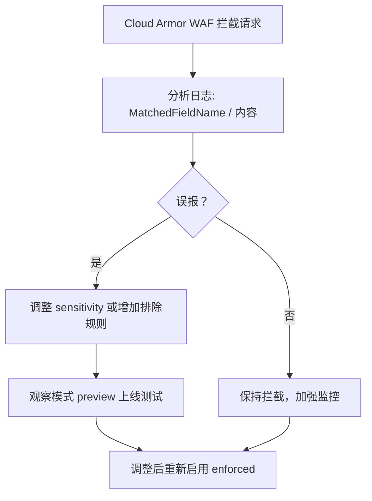

# ChatGPT

当 GCP Cloud Armor 阻挡了请求并命中某个 WAF（Web Application Firewall）规则（如 SQLi 检测规则），通常说明请求看起来具备潜在攻击特征。你提到的是：

```
EvaluatePreconfiguredWaf('sqli-v33-stable', {'sensitivity': 3})
MatchedFieldLength: 4070
MatchedFieldName: ...
```

## ✅ 问题解读

此类日志表示：

- Cloud Armor 使用了预设的 WAF 规则集（SQL 注入检测，版本 v33，稳定版）
- 敏感度为 3（范围是 1~5，值越大，匹配越”宽松”，误报可能性越高）
- 某个字段（可能是 URL 参数、Header、Body 等）长达 4070 字符，并被识别为潜在 SQLi 攻击
- 请求被阻止（enforced）

## 🧩 通用的排查和修复策略

### 1. 识别误报或真实攻击

|步骤 |操作                    |说明                                                           |
|---|----------------------|-------------------------------------------------------------|
|1.1|查看 Cloud Armor Logs 日志|查看 MatchedFieldName 是哪个字段命中（如 request_body, uri, query_param）|
|1.2|复制被拦截的请求内容进行分析        |看是否包含像 `' OR 1=1`, `--`, `SELECT *` 之类的 SQL 注入语法             |
|1.3|确认来源 IP、用户行为模式        |判断是否为恶意机器人、大规模扫描，或是正常业务误伤                                    |

### 2. 处理误报（误伤）的方法

#### ✅ 方法一：降低 WAF 敏感度

适用于：WAF 规则太敏感，误伤了正常业务流量

```bash
EvaluatePreconfiguredWaf('sqli-v33-stable', {'sensitivity': 2})
```

- `sensitivity=3` 是默认值（比较常见有误报）
- 可以尝试将敏感度调整为 2 或 1

🌟 **敏感度越低 → 检测越严格 → 误报越少，但也可能漏掉真实攻击**

#### ✅ 方法二：设置排除路径或字段（自定义例外）

适用于：某些特定路径、字段内容是正常业务，不应被拦截

```bash
request.path.starts_with("/safe-endpoint")
```

结合 WAF rule exclusion：

```json
{
  "expression": "request.path.starts_with('/api/report')",
  "targetRuleIds": ["9000000"],
  "targetRuleExclusion": {
    "target": "REQUEST_BODY"
  }
}
```

可以排除特定路径中的 body、header 或 query param 检测。

#### ✅ 方法三：调整拦截模式为观察（preview）

适用于：评估误报影响或在上线前进行测试

```json
"action": "preview"
```

这样不会拦截请求，只记录日志，便于逐步调整策略。

#### ✅ 方法四：调整匹配字段（Body 长度限制）

适用于：Body 太大容易触发规则

默认 Cloud Armor 对 `request_body` 检测是有大小限制的（一般不超过 8192 字节）。如果业务中大量使用大 JSON/POST Body，建议：

- 限制客户端请求字段长度
- 或者在前端网关（如 Cloud Load Balancer + NGINX）做 pre-validation，减少无效请求进入 WAF 检测逻辑

### 3. 其他建议

|建议项                                 |说明                                    |
|------------------------------------|--------------------------------------|
|使用测试工具回放请求                          |比如 curl + replay，从客户端重现并分析是否仍被拦截      |
|日志结构化导入 BigQuery                    |便于分析哪些字段/请求最容易误伤                      |
|配合 rate-based rule 或 IP allowlist 使用|某些路径可绑定 rate limit，某些用户 IP 可 whitelist|

## ✅ 最终建议流程图



## 📌 总结（修复通用手段）

|方式        |适用情况        |示例                                  |
|----------|------------|------------------------------------|
|降低 WAF 敏感度|误报多         |`sensitivity: 2`                    |
|添加路径/字段排除 |某些业务字段特例    |`path.starts_with("/api/v1/report")`|
|切换为观察模式   |评估误报        |`action: preview`                   |
|精准识别攻击特征  |实际攻击流量      |保持 `action: deny`                   |
|请求规范化     |长字段截断、无效输入过滤|限制请求 body 大小                        |

如需根据实际日志示例调试，我也可以帮你解析某段 Cloud Armor WAF 日志的匹配字段和建议 exclusion 配置。你可以贴出一段示例 MatchedFieldName 和命中内容。

-----

# Gemini

## 云架构师的 GCP Cloud Armor WAF 调优权威指南

### Part 1: 解构 Cloud Armor 预配置 WAF：有效调优的基础

在尝试对任何 Google Cloud Armor 规则进行调优之前，从业者必须首先掌握其基本工作机制。对这些核心机制的误解是导致调优效果不佳或过度放宽安全策略的主要原因。本节将为有效的问题诊断和修复奠定坚实的理论基础。

#### 1.1 WAF 规则的剖析：从 OWASP 到 GCP

Google Cloud Armor 的预配置 WAF 规则并非单一的实体，而是基于行业标准的 OWASP ModSecurity 核心规则集（CRS）构建的复杂规则集合。理解这一点至关重要，因为它意味着故障排除通常需要深入到特定的底层 CRS 签名逻辑，而不仅仅是停留在 Cloud Armor 的高级规则层面。

这种架构具有明确的层次结构，为精细化调优提供了设计基础。它允许管理员以外科手术般的精度移除单个有问题的签名，而无需放弃规则集中其余 99% 签名的保护价值。这种模块化设计直接反驳了在遇到误报时就禁用整个规则（例如 sqli-stable）的幼稚做法，将问题从一个简单的”开/关”二元选择，转变为一个细致的调优任务。

其层次结构可分解如下：

- **规则集（预配置表达式）**: 这是在安全策略中引用的顶层实体，例如 `sqli-v33-stable`
- **签名（规则 ID）**: 这是规则集内具体的攻击检测模式，每个模式都有一个唯一的 ID，例如 `owasp-crs-v030301-id942100-sqli`。绝大多数精细化调优都发生在这个层面
- **evaluatePreconfiguredWaf()表达式**: 这是 Cloud Armor 规则中调用 WAF 引擎的核心函数。理解这是 WAF 规则的核心，是后续通过操作它来进行调优的关键

#### 1.2 敏感度-偏执度谱系：首要且最重要的调优旋钮

每个预配置的 WAF 规则都提供了一个敏感度级别（0 到 4），这直接对应于 OWASP 的偏执度级别（Paranoia Level）。这个设置是调优工作的第一个，也是影响最广泛的控制手段。

敏感度级别的选择不仅仅是一个技术配置，它更是一种风险管理控制，体现了组织对误报（False Positives）与漏报（False Negatives）之间的容忍度。一个初创公司的简单博客网站可能会选择级别 1，接受稍高的复杂攻击漏报风险，以换取几乎为零的运营摩擦。相比之下，一个金融机构必须选择级别 3 或 4，接受调优误报所带来的高昂运营成本，以此作为最小化安全事件风险的必要业务开销。因此，“正确”的敏感度级别不能由安全工程师独立决定，它需要业务所有者、应用负责人和运营团队的共同参与，以确保技术控制与组织的风险偏好相一致。

各级别的含义如下：

- **级别 0**: 默认不启用任何规则，仅用于”选择性加入”（Opt-in）特定签名的场景
- **级别 1**: 包含最高置信度的签名，产生误报的可能性最低。这是初始部署或保护非关键应用的理想选择。例如，`sqli-v33-stable` 规则集在敏感度 1 时包含检测 `sleep()` 或 `benchmark()` 函数的签名，这些都是攻击行为的极高置信度指标
- **级别 2**: 包含更广泛的规则，例如检测常见的 SQL 操作符或逻辑重言式（Tautology）。此级别增强了安全性，但同时也增加了标记合法但复杂的查询请求的风险
- **级别 3 和 4**: 这是最严格的级别，适用于需要极高安全性的应用（如网上银行），但必须预期并准备好处理大量的误报。例如，`sqli-v33-stable` 在敏感度 3 时，会包含检测 HAVING 注入的签名 `owasp-crs-v030301-id942251-sqli`

一个关键点是，选择敏感度级别 N 会启用所有敏感度小于或等于 N 的签名。

#### 1.3 规则处理与优先级：“首次匹配即生效”原则

Cloud Armor 在处理安全策略中的规则时，遵循严格的优先级顺序。规则的优先级由一个正整数表示，数字越小，优先级越高。

其核心原则是”首次匹配即生效”（First Match Wins）：一旦一个传入的请求匹配了某条规则的条件，该规则定义的操作（例如 `allow` 或 `deny`）将被执行，并且 Cloud Armor 会立即停止处理该请求，后续所有优先级较低的规则都将被忽略。

**最佳实践**: 在初次配置策略时，强烈建议在规则优先级之间留出足够的间隔（例如，使用 10 或 100 的增量），以便将来可以在不重新编号整个策略的情况下插入新规则。

#### 1.4 基础预调优配置：避免不必要的错误

在深入进行 WAF 规则调优之前，确保以下基础配置到位可以避免许多不必要的误报。

- **JSON 解析**: 对于使用 REST API 和 JSON 格式的 POST 请求体的现代应用而言，启用 JSON 解析是必不可少的。如果不启用，WAF 会检查原始的 JSON 字符串，其中的特殊字符如 `{`, `}`, `:`, `"` 很容易触发 SQLi 或 XSS 规则的误报。启用 JSON 解析后，WAF 将只检查 JSON 结构中的值（values），从而极大地减少误报

可以使用以下 gcloud 命令启用标准 JSON 解析：

```bash
gcloud compute security-policies update [POLICY_NAME] --json-parsing=STANDARD
```

### Part 2: 系统性故障排除工作流：从警报到分析

本节提供了一个可重复的、分阶段的方法来调查 WAF 的拦截事件。它旨在引导用户从被动的应急响应状态，转向结构化的、法医式的分析过程。

#### 2.1 阶段一 - 黄金法则：始终从预览模式开始

预览模式（Preview Mode）是 Cloud Armor 提供的一个强大的非侵入性数据收集工具，也是部署任何新规则或修改规则时最重要的最佳实践。

在预览模式下，规则的 action（例如 `deny`）不会被实际执行，但其潜在的结果会被详细记录到日志中。这允许管理员在不影响生产流量的情况下，评估规则变更可能带来的影响。

- **启用预览模式**:
  - 使用 gcloud CLI 创建规则时，添加 `--preview` 标志：
    
    ```bash
    gcloud compute security-policies rules create 1000 \
      --security-policy [POLICY_NAME] \
      --expression "evaluatePreconfiguredWaf('sqli-v33-stable')" \
      --action deny-403 \
      --preview
    ```
- **监控预览结果**: 在 Cloud Logging 中，可以使用特定的过滤器来查找被预览模式”标记”的请求。这是一个至关重要的、可直接操作的技巧，能帮助你精确识别出哪些合法请求可能会被新规则拦截：
  
  ```
  resource.type="http_load_balancer"
  jsonPayload.previewSecurityPolicy.outcome="DENY"
  ```

#### 2.2 阶段二 - Cloud Logging 中的取证分析：定位”谁”和”什么”

故障排除的过程是一个不断缩小范围、提高精度的漏斗模型。它始于一个宽泛的 403 错误，然后逐步聚焦到具体的策略、规则、签名，最终精确定位到请求中触发问题的那个字符串。这种结构化的方法可以避免在压力下浪费时间进行无序的猜测。

- **定位日志**: 一个常见的混淆点是，Cloud Armor 的日志并非一个独立的产品，而是嵌入在与其关联的负载均衡器日志中的。因此，正确的查询起点是使用过滤器 `resource.type="http_load_balancer"`
- **启用详细日志**: 对于有效的 WAF 调优，标准日志记录通常是不够的。必须启用详细日志（Verbose Logging），因为它会在日志中增加关于匹配字段的关键信息（`matchedField...`），这对于诊断至关重要

使用以下命令为安全策略启用详细日志：

```bash
gcloud compute security-policies update [POLICY_NAME] --log-level=VERBOSE
```

- **WAF 分析的关键日志字段**: 为了帮助用户在复杂的 JSON 日志中快速找到所需信息，下表整合了多个来源的关键字段说明，它直接回答了诊断过程中”如何找到…“的问题。

|jsonPayload 中的字段路径                           |描述                                                      |在误报调查中的作用                                                                                              |
|---------------------------------------------|--------------------------------------------------------|-------------------------------------------------------------------------------------------------------|
|`statusDetails`                              |对最终结果的文本描述                                              |值为 `"denied_by_security_policy"` 表示一个真实的拦截事件，是生产事故调查的起点                                                |
|`enforcedSecurityPolicy.name`                |做出最终决定的安全策略的名称                                          |确认是哪个策略导致了拦截                                                                                           |
|`enforcedSecurityPolicy.priority`            |最终被执行的规则的优先级                                            |帮助识别匹配到的确切规则，在日志中没有规则描述时尤为重要                                                                           |
|`enforcedSecurityPolicy.outcome`             |被执行规则的动作结果                                              |对于拦截事件，该值将是 `"DENY"`                                                                                   |
|`enforcedSecurityPolicy.preconfiguredExprIds`|一个列表，包含被触发的具体 WAF 签名的 ID                                |这是最关键的字段。它告诉你 `sqli-v33-stable` 这样的规则集中是哪个具体签名被触发了。例如：`owasp-crs-v030001-id942140-sqli`。这个 ID 将是后续调优的目标|
|`previewSecurityPolicy`                      |一个对象，包含与 `enforcedSecurityPolicy` 相同的字段，但用于在预览模式下运行的规则  |这是测试阶段的焦点。查找 `previewSecurityPolicy.outcome="DENY"` 来识别那些本应被拦截的请求                                      |
|`matchedFieldType` (详细日志)                    |触发签名的请求字段类型（例如 `COOKIE_VALUES`, `ARG_VALUES`, `RAW_URI`）|告诉你 WAF 在请求的哪个部分发现了可疑模式。是 Cookie、查询参数还是 URI 路径？                                                        |
|`matchedFieldName` (详细日志)                    |如果匹配发生在键值对中，此字段保存键的名称（例如，Cookie 名或查询参数名）                |将调查范围缩小到特定字段，例如 `session_id` Cookie 或 `user_comment` 表单字段                                              |
|`matchedFieldValue` (详细日志)                   |触发签名的实际数据的片段（最多 16 字节）                                  |确凿的证据。它向你展示了 WAF 标记为恶意的确切字符串（例如，`' or 1=1--`）                                                          |

#### 2.3 阶段三 - 精确定位触发器：利用详细日志

通过一个实际的演练，可以展示如何结合 `matchedFieldType`、`matchedFieldName` 和 `matchedFieldValue` 来构建事件的全貌。

例如，一个日志条目显示：

- `matchedFieldType: "ARG_VALUES"`
- `matchedFieldName: "redirect_url"`
- `matchedFieldValue: "https://example"`

这组信息清晰地告诉分析师：WAF 拦截的原因是请求中名为 `redirect_url` 的查询参数的值包含了 WAF 认为可疑的内容。

**关键限制**: 需要明确指出，即使启用了详细日志，Cloud Armor 也不会记录完整的请求体（POST body）。这是一个已知的限制。`matchedFieldValue` 提供的片段通常足以进行诊断，但无法提供完整的上下文。

将预览模式和详细日志结合使用，可以为 DevSecOps 流程创建一个强大的反馈循环。开发人员提交代码后，CI/CD 流水线可以运行自动化测试。安全团队可以监控这些测试流量产生的 `previewSecurityPolicy` 日志。如果一个新功能导致了”预览拒绝”日志的激增，这个问题就可以在它进入生产环境并引发真实故障之前被捕获和解决。这使得 WAF 调优从一个部署后的被动任务，转变为一个部署前的主动协作过程。

### Part 3: 分诊：区分误报与真实威胁

在收集了”什么”被拦截的数据之后，本节将指导用户如何解读这些数据，回答”为什么”被拦截的问题。一个 WAF 拦截事件在经过分诊之前，不应被视为”安全事件”，它仅仅是一个”待处理的安全信号”。分诊过程需要丰富的应用知识，是区分真实攻击（被成功阻止）和误报（运营问题）的关键步骤。WAF 本身无法做出这种区分，只有具备上下文背景的人类分析师才能完成。

#### 3.1 分析师的分诊清单：是恶意还是误解？

以下是一系列关键问题，旨在基于第二部分收集到的取证数据，指导分析师做出判断：

- **上下文为王**: `matchedFieldValue` 中的内容在当前应用的业务逻辑下是否合理？例如，一个数据库管理工具提交 SQL 查询是正常的；但在一个用户名字段中出现相同的查询则极不正常
- **应用行为**: 应用后端在处理这部分输入时，是否进行了恰当的清理、验证或参数化？例如，如果后端对所有数据库查询都使用了参数化查询，那么即使用户输入了 `' or 1=1`，它也只会被当作无害的字符串处理，此时 WAF 的警报就是一次误报
- **来源可信度**: 请求的来源是什么？它是一个内部的健康检查、一个受信任的合作伙伴 API、一个已知的安全扫描器，还是一个来自高风险地区的未知 IP？
- **行为模式**: 这是一次孤立事件，还是同一来源 IP 在日志中表现出持续性探测模式的一部分？

#### 3.2 案例深度剖析：真实世界中的 sqli-v33-stable

通过对比两个场景，可以更直观地理解分诊过程。

- **场景 A (真实威胁)**: 一个请求访问 `/search?q=' OR 1=1;--`，触发了 `owasp-crs-v030301-id942130-sqli`（SQL 重言式攻击）签名。日志显示 `matchedFieldValue` 是 `' OR 1=1;--`。这是一个典型的、明确无误的 SQL 注入尝试。正确的响应是：无需任何操作，WAF 正在按预期工作
- **场景 B (典型误报)**: 一个 POST 请求发送到 API 端点 `/api/v1/update_document`，其 JSON 请求体为 `{"content": "The new policy states that 'data:text/plain' is a valid URI scheme."}`。这个请求可能会因为 `data:` 这个模式而触发 XSS 或 SQLi 规则（例如 `owasp-crs-v030301-id941170-xss`）。分析师了解该应用的功能是文档编辑，因此判断这是合法的用户输入内容。这是一个需要进行 WAF 调优的典型误报
- **场景 C (复杂误报)**: 用户提交一个包含数组字段的表单，例如 `city=New York&city=Los Angeles`。WAF 可能会错误地将 `&` 字符解释为特殊操作符，从而触发拦截。这突显了 WAF 在处理非标准但合法的 HTTP 编码时可能遇到的挑战

由合法应用功能引发的误报普遍存在，这揭示了通用安全规则与定制化应用之间的根本差距。这表明 WAF 调优并非一次性的设置任务，而是一个持续不断的过程，旨在协调应用不断演进的功能与 WAF 相对静态的规则集。随着新功能的增加，新的潜在误报点也会随之产生，这就要求一个持续的”预览、测试、调优”循环。

### Part 4: WAF 调优工具箱：全方位的修复技术

这是本指南的核心”如何修复”部分，它提供了一系列从简单到复杂的解决方案，并明确了每种方案的适用场景。这些调优方法构成了一个最佳实践的层级结构。从业者应始终优先选择能够解决问题的、最精细化的方法。理想的决策流程是：我能用字段排除解决吗？如果不能，我能通过排除单个签名来解决吗？只有当整个规则集都存在问题时，才应考虑降低敏感度。

#### 4.1 方法一：大刀阔斧 - 调整敏感度

- **适用场景**: 当整个规则集对于某个特定应用来说过于”嘈杂”，并且你愿意为了运营稳定性而接受稍低的安全级别时。适用于非关键应用或在初始部署阶段
- **实现方式**: 更新规则的表达式，将其敏感度级别调低，例如：`evaluatePreconfiguredWaf('sqli-v33-stable', {'sensitivity': 1})`
- **优点**: 实现简单、快速
- **缺点**: 这是一个”钝器”，会降低整个规则集的保护能力

#### 4.2 方法二：手术刀 - 排除特定签名（选择性退出）

- **适用场景**: 这是最理想的解决方案，适用于已从日志中识别出一两个特定的签名（`preconfiguredExprIds`）持续导致误报，但规则集的其余部分仍然很有价值的情况
- **实现方式**: 更新规则的表达式，包含一个要禁用的 ID 列表。例如，要从 `xss-stable` 规则中排除 ID `owasp-crs-v030001-id941180-xss`：
  
  ```
  evaluatePreconfiguredWaf('xss-stable', ['owasp-crs-v030001-id941180-xss'])
  ```
- **优点**: 针对性强；在不显著影响整体安全性的前提下移除了”害群之马”
- **缺点**: 需要从日志中精确识别出有问题的签名 ID

#### 4.3 方法三：激光笔 - 排除请求字段

- **适用场景**: 这是最强大、最精确的方法。当一个特定字段（例如，会话 Cookie、User-Agent 头或某个查询参数）中的合法值导致误报时使用。这使得 WAF 可以继续检查请求的其余部分
- **实现方式**: 使用 `gcloud compute security-policies rules add-preconfig-waf-exclusion` 命令
- **示例**: 停止对名为 `user_session_data` 的 Cookie 进行 `sqli-v33-stable` 规则检查：
  
  ```bash
  gcloud compute security-policies rules add-preconfig-waf-exclus
  ```