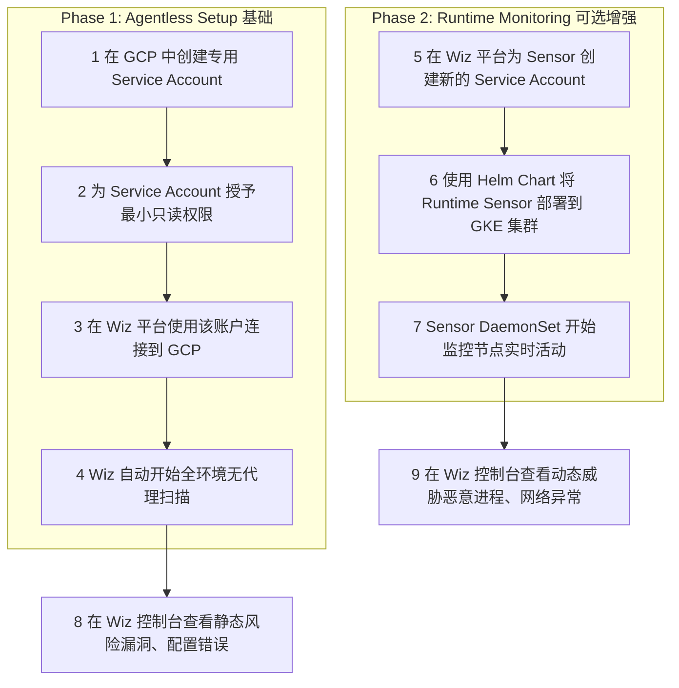
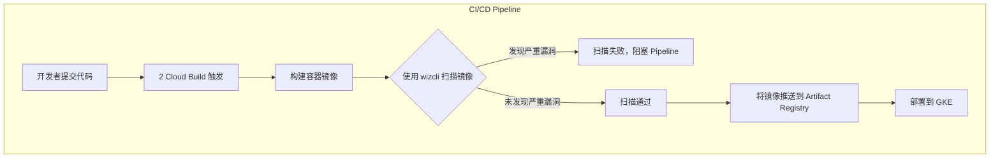

# Wiz 在 GCP 与 GKE 环境中的全面应用指南

本文档旨在为您提供关于 Wiz 云安全平台的详细信息，重点介绍如何在 Google Cloud Platform (GCP) 和 Google Kubernetes Engine (GKE) 环境中部署、使用和集成 Wiz，以实现全面的云安全监控。

---

## 1. Wiz 核心概念

Wiz 是一个**云原生应用保护平台 (CNAPP)**，其核心优势在于**无代理 (Agentless)**的扫描能力。它通过连接到您云环境的 API，全面扫描您的基础架构，而无需在每台虚拟机或容器中安装代理软件。

### 核心功能
- **安全图 (Security Graph)**: Wiz 将所有云资源（虚拟机、容器、Serverless）、配置、漏洞、网络路径、身份和权限关联起来，构建一个完整的攻击路径视图，帮助您准确定位和优先处理最关键的风险。
- **全覆盖扫描**: 无代理模式确保了对环境中 100% 资源的可见性，避免了因代理未安装或不兼容而产生的安全盲点。
- **运行时保护 (Optional)**: 除了无代理扫描，Wiz 还提供一个轻量级的 **Runtime Sensor**，用于监控 GKE 等环境中的实时活动，提供更深层次的动态威胁检测。

---

## 2. 部署流程：从连接到监控

在 GCP 和 GKE 中部署 Wiz 主要分为两个核心部分：**无代理连接**和**运行时传感器部署**。

### 部署流程总览



### 步骤详解

#### (1) 自动执行无代理扫描

这是集成 Wiz 的第一步，也是最基础的步骤。

1.  **创建 GCP Service Account**: 在您的 GCP 项目中，创建一个专为 Wiz 使用的 Service Account。
2.  **授予权限**: 遵循**最小权限原则**，为该 Service Account 授予必要的**只读**角色。常用角色包括：
    - `roles/viewer` (项目级查看者)
    - `roles/iam.securityReviewer` (IAM 安全审查者)
    - `roles/container.viewer` (GKE 集群查看者)
    - `roles/compute.viewer` (计算资源查看者)
    - `roles/storage.objectViewer` (存储对象查看者)
3.  **连接 Wiz**: 登录 Wiz 平台，在 "Cloud Connectors" 部分添加您的 GCP 项目，并提供之前创建的 Service Account 凭证。
4.  **自动扫描**: 连接成功后，Wiz 会立即开始通过 GCP API 自动扫描您的所有资源。这个过程是周期性的（通常每隔几小时），无需任何手动干预。

#### (2) 部署 Runtime Sensor (可选)

如果您需要监控容器的实时行为，可以部署 Runtime Sensor。

1.  **前提条件**:
    - GKE 集群版本不低于 `v1.20.9-gke.1000`。
    - 集群节点需要有到 Wiz 后端的出站 HTTPS (443) 访问权限。
2.  **获取部署信息**: 在 Wiz 平台，为 Runtime Sensor 创建一个新的 Service Account，并获取部署所需的 Helm Chart 地址和镜像拉取凭证。
3.  **使用 Helm 部署**: 通过 Helm 命令将 Sensor 以 **DaemonSet** 的形式部署到您的 GKE 集群。DaemonSet 会确保每个节点上都运行一个 Sensor Pod。
    ```bash
    # 示例命令，具体请参考 Wiz 官方文档
    helm repo add wiz-sensor <HELM_REPO_URL>
    helm install wiz-sensor wiz-sensor/sensor \
      --set image.pullSecret=<PULL_SECRET> \
      --set admission.enabled=true
    ```
4.  **自动监控**: 部署后，Sensor 会利用 eBPF 技术实时监控节点上的进程活动、网络连接和文件系统访问，并将异常事件发送到 Wiz 平台进行分析。

---

## 3. 无代理扫描 vs. Runtime Sensor：区别与选择

理解这两种模式的区别，能帮助您更好地制定安全策略。

| 特性 | 无代理扫描 (Agentless) | Runtime Sensor (基于代理) |
| :--- | :--- | :--- |
| **部署方式** | **无需安装**，通过云平台 API 连接 | 需要在 GKE 集群中部署一个轻量级 **DaemonSet** |
| **核心能力** | **静态分析** | **动态分析** |
| **扫描内容** | 漏洞 (CVEs)、错误配置、暴露的网络路径、IAM 权限、明文密钥、合规性基准 (CIS) | 实时进程活动、网络流量、文件访问、容器逃逸、恶意行为检测 |
| **性能影响** | **几乎为零**，扫描在 Wiz 后端进行 | **极低**，Sensor 经过优化，但仍占用少量节点资源 |
| **覆盖范围** | **100% 全覆盖**，只要资源在云账户内就能被看到 | 仅覆盖已部署 Sensor 的 GKE 集群 |
| **适用场景** | - 快速获取云环境的**全面资产和风险视图**<br>- 定期的漏洞和合规性评估 | - 保护生产环境中的**关键工作负载**<br>- 检测和响应**零日攻击**和实时威胁 |
| **GKE 示例** | 扫描 Deployment 引用的镜像是否存在已知漏洞 | 监控 Pod 内是否有异常进程启动（如反向 shell） |

**总结建议**:
- **先从无代理扫描开始**: 快速、无侵入地了解您完整的安全态势。
- **按需添加 Runtime Sensor**: 为运行关键业务、面向公网或处理敏感数据的 GKE 集群额外部署 Sensor，以获得纵深防御能力。

---

## 4. API 调用与 Pipeline 集成 (Shift-Left)

Wiz 提供了强大的 API 和 CLI 工具，支持将安全扫描集成到您的 CI/CD Pipeline 中，实现 "安全左移"。

### (1) 通过 API/CLI 自动化扫描

Wiz 提供 **GraphQL API** 和 `wizcli` 命令行工具，允许您：
- **查询资源**: `wizcli inventory list`
- **触发扫描**: `wizcli scan --image your-registry/your-app:latest`
- **获取漏洞报告**: 通过 API 查询指定资源的漏洞信息。

您可以编写脚本，通过 API 定期对特定资源（如新构建的容器镜像）执行扫描，并将结果集成到其他系统中。

### (2) 在 CI/CD Pipeline 中集成

将 Wiz 扫描嵌入到您的自动化构建和部署流程中，是实现 DevSecOps 的关键。

**工作流程示例 (Google Cloud Build)**:



**实践要点**:
- **镜像扫描**: 在 `docker build` 之后、`docker push` 之前，插入 `wizcli` 扫描步骤。
- **IaC 扫描**: 扫描 Terraform 或 Kubernetes YAML 文件，在部署前发现配置错误。
- **设置门禁 (Guardrails)**: 您可以定义策略，例如 "如果发现严重等级 (Critical) 的漏洞，则构建失败"，从而自动化地阻止有风险的部署。

通过这种方式，您可以在开发的早期阶段就发现并修复安全问题，而不是等到生产环境才进行响应。


# Gemini Explorer

https://g.co/gemini/share/10b7e7714fe2

# Wiz安全平台：针对Google Cloud Platform的技术实施与运营指南

## 第1节：Wiz云原生应用保护平台（CNAPP）简介

### 1.1. 架构概览：从扫描到情境化风险

Wiz并非一个简单的扫描工具，而是一个全面的云原生应用保护平台（Cloud-Native Application Protection Platform, CNAPP）。它将多个分散的安全领域，如云安全态势管理（CSPM）、云工作负载保护（CWPP）、云基础设施授权管理（CIEM）等，统一到一个单一、内聚的平台中 1。这种架构代表了云安全领域的一次范式转变，从使用孤立的工具转向依赖单一事实来源，这对于管理当今复杂的云环境至关生重要 2。

该平台的核心价值主张在于，它不再生成海量的、充满噪音的漏洞列表，而是通过深度分析识别出可操作的、经过优先级排序的攻击向量 1。传统安全工具常常让安全团队陷入警报疲劳的困境，难以从成千上万的发现中辨别出真正的威胁 3。Wiz通过将不同的风险因素关联起来，解决了这一核心痛点，使团队能够集中精力处理那些对业务构成真实威胁的问题。这种方法论的转变，是从以“检测”为中心的安全模式，演进为以“风险”为中心的安全模式。传统工具擅长发现孤立的问题，例如报告存在1000个CVE漏洞和500个配置错误 3。然而，安全团队资源有限，无法处理所有警报，导致大量问题被搁置 6。Wiz的安全图谱将这些分散的数据点连接起来，揭示出这样一个事实：在这1000个CVE中，可能只有5个存在于暴露在互联网上、且拥有访问敏感数据权限的虚拟机上 1。这种情境化的分析，使得安全团队能够将资源从宽泛、低效的补丁修复，重新分配到针对性的、高影响力的风险缓解上，从而直接将安全投入与业务风险降低联系起来。

### 1.2. Wiz安全图谱：关联您GCP环境中的所有风险

Wiz安全图谱是整个平台的中枢神经系统。它从云环境的每一层摄取数据——包括配置错误、漏洞、网络暴露、权限过高和敏感数据——以绘制出资源之间的复杂关系图 2。这个图谱构建了一个关于云环境安全关系的“数字孪生”，它不仅是一个静态的资产清单，更是一个动态的、可查询的风险模型。

通过这个图谱，Wiz能够识别所谓的“毒性组合”（Toxic Combinations）：一个看似低风险的漏洞，当与公共网络暴露和高权限IAM角色结合时，其威胁等级会急剧升高 1。例如，一个未被利用的漏洞本身可能无害，但如果它所在的虚拟机可以被外部访问，并且该虚拟机被授予了访问生产数据库的权限，这就构成了一条清晰的攻击路径。正是这种情境化分析能力，使得Wiz能够执行攻击路径分析（Attack Path Analysis），并准确地对最关键的风险进行优先级排序 8。这种能力将安全工作从被动的警报响应，转变为主动的风险狩猎。安全架构师可以提出复杂的查询，例如“显示所有从互联网到标记为‘生产’的数据库的攻击路径，且该路径必须经过一个带有严重漏洞的工作负载” 10，从而在攻击者利用之前发现并切断潜在的威胁通路。

### 1.3. 核心能力：CSPM、CWPP、CIEM及其他

Wiz平台整合了多种核心安全功能，并将其无缝应用于GCP环境中：

- **云安全态势管理 (CSPM):** 持续检测并帮助修复GCP服务中的配置错误，例如公开的Cloud Storage存储桶或过于宽松的防火墙规则 1。
    
- **云工作负载保护 (CWP):** 通过无代理扫描和运行时传感器，保护GCE虚拟机和GKE容器等工作负载的安全 1。
    
- **云基础设施授权管理 (CIEM):** 分析GCP IAM策略，识别权限过高的身份，并能自动生成遵循最小权限原则的策略建议 1。
    
- **容器与Kubernetes安全:** 为GKE环境提供从构建时到运行时的全生命周期整体安全性，覆盖镜像扫描、运行时威胁检测等 1。
    
- **基础设施即代码 (IaC) 扫描:** 将安全检查集成到开发生命周期中，支持扫描Terraform、Kubernetes清单和Dockerfile中的安全问题 1。
    

## 第2节：基础集成：将Wiz连接到您的GCP环境

### 2.1. 前提条件与IAM权限

在开始集成过程之前，必须确保满足一系列前提条件，这包括GCP端和Wiz端的权限配置 11。强烈建议在GCP组织（Organization）层面进行连接，这将使Wiz能够自动发现并扫描所有现有及未来创建的项目，从而消除安全盲点 11。在大型企业中，开发团队经常在没有通知中央安全团队的情况下创建新的GCP项目，这是一种常见的“影子IT”现象 4。如果仅在项目层面连接安全工具，这些新项目将成为未被监控的盲区。通过在组织根节点进行连接，Wiz能够自动发现每一个新项目，从根本上解决了因组织动态和去中心化云使用而产生的覆盖缺口，确保了安全态势的完整性。

下表总结了Wiz与GCP集成所需的关键IAM角色和权限。

**表2.1: Wiz集成所需的GCP IAM角色与权限**

|Wiz功能|GCP IAM角色/权限|目的|引用|
|---|---|---|---|
|**初始连接（组织层面）**|`roles/iam.serviceAccountAdmin`, `roles/iam.organizationRoleAdmin`, `roles/iam.securityAdmin`|允许Wiz在整个组织中创建所需的服务账号和自定义角色。|11|
|**无代理工作负载扫描**|`compute.disks.createSnapshot`, `compute.instances.get`|使Wiz能够为虚拟机磁盘创建临时的只读快照，以进行带外分析。|17|
|**数据扫描（加密磁盘）**|`roles/cloudkms.cryptoKeyEncrypterDecrypter`|授予在快照扫描期间解密由CMEK加密的磁盘的权限。|17|
|**威胁检测（日志摄取）**|`roles/pubsub.publisher`|允许Wiz将发现和事件发布到指定的GCP Pub/Sub主题。|11|
|**威胁检测（SCC发现）**|`roles/securitycenter.viewer`|授予对Google Security Command Center中发现的只读访问权限。|15|

### 2.2. 在GCP组织层面进行连接的步骤

Wiz提供了自动生成的脚本来简化连接过程，这大大降低了手动配置服务账号和角色的复杂性 15。

1. **登录Wiz控制台:** 导航至设置 > 云账户，并选择添加新的云账户。
    
2. **选择Google Cloud:** 选择GCP作为云提供商，并选择在组织层面进行连接。
    
3. **运行配置脚本:** Wiz将提供一个gcloud命令或Terraform脚本。在拥有前述组织级权限的GCP Cloud Shell或本地环境中执行此脚本。
    
4. **授权:** 脚本将引导您完成授权过程，它会在GCP中创建一个专用的Wiz服务账号，并为其分配必要的自定义角色和权限。
    
5. **完成连接:** 脚本执行成功后，Wiz将使用新创建的服务账号凭证通过GCP API进行身份验证，并开始自动发现和扫描您组织下的所有资源。
    

一旦连接完成，Wiz会调用GCP API来收集元数据和配置信息，从而构建一个涵盖所有Google服务的完整资产清单 15。

### 2.3. 为威胁检测配置云审计日志摄取

为了启用Wiz的云检测与响应（Cloud Detection and Response, CDR）功能，需要将GCP的审计日志流式传输到Wiz平台。

1. **创建Pub/Sub主题和订阅:** 在一个指定的GCP项目中，创建一个新的Pub/Sub主题和一个对应的订阅 11。
    
2. **配置日志接收器 (Log Sink):** 在GCP日志浏览器中，创建一个组织级别的日志接收器。配置该接收器，将“管理员活动”（Admin Activity）和“数据访问”（Data Access）审计日志过滤出来，并将其目标设置为上一步创建的Pub/Sub主题 11。
    
3. **在Wiz中连接订阅:** 返回Wiz控制台，在GCP连接器设置中，提供Pub/Sub订阅的ID。Wiz将使用其服务账号权限来拉取该订阅中的日志消息 11。
    

完成此设置后，Wiz就能近乎实时地接收GCP中的关键活动事件，并将这些事件与已有的态势和工作负载发现相关联，为潜在的安全威胁提供动态情境。

## 第3节：无代理扫描：实现无处不在的可见性

### 3.1. 技术架构：API驱动的快照扫描工作原理

Wiz的无代理扫描并非凭空实现，而是巧妙地利用了云原生API来完成 16。其核心机制是带外（out-of-band）快照分析，这一过程对生产工作负载的性能影响为零，从而根本上消除了安全与运维团队之间的一个主要矛盾点。传统代理会消耗生产工作负载的CPU和内存，常常引发运维团队对性能和稳定性的担忧 16。Wiz的快照分析在独立的临时实例上进行，完全不影响生产环境，这使得安全措施的实施不再被视为业务运营的障碍。

该过程具体如下：

1. **创建快照:** Wiz使用其被授予的IAM权限，调用GCP API为目标虚拟机的磁盘创建一个快照 17。
    
2. **挂载与扫描:** 该快照被作为一个只读卷，挂载到一个临时的、由Wiz管理的扫描器实例上。这个扫描器实例与目标虚拟机位于同一个GCP区域，确保了数据的驻留性 17。
    
3. **深度分析:** 扫描器对挂载的磁盘文件系统进行深度分析，检查操作系统配置、已安装的软件包、应用程序代码、配置文件等 17。
    
4. **元数据提取与销毁:** 扫描完成后，仅提取必要的元数据（如软件列表、漏洞信息、配置项）发送到Wiz后端，用于构建安全图谱。随后，磁盘快照和扫描器实例会被立即销毁，整个过程通常在几分钟内完成 17。
    

这种方法的另一个关键优势在于解决了传统安全工具长期面临的“部署摩擦”问题。传统代理工具需要在每个资产上进行安装、配置和维护，这个过程缓慢且容易产生覆盖缺口 16。Wiz的无代理方法仅需一次性的API连接，即可在数分钟内开始扫描所有资产，极大地缩短了价值实现时间，并确保了100%的覆盖率 1。

### 3.2. 在GCP中的部署与配置

对于无代理扫描，“部署”主要指在第2节中描述的初始连接过程。一旦连接建立，Wiz就会自动发现并开始扫描环境中的资源 19。用户可以进行一些高级配置，例如：

- **扫描非操作系统磁盘:** 在Wiz设置中，可以启用对附加数据盘的扫描，以发现存储在这些磁盘上的漏洞或敏感数据 15。
    
- **VPC服务控制 (VPC Service Controls):** 如果您的GCP项目受VPC服务控制边界的保护，需要在边界的入口策略（Ingress Policy）中添加入站规则，明确允许Wiz的服务账号从其指定的IP地址范围访问项目内的API，以确保扫描能够正常进行 15。
    

### 3.3. 收集的信息：深入了解发现的资产与风险

无代理扫描收集的数据是构建Wiz安全图谱的基石。它涵盖了云环境风险的方方面面：

- **漏洞:** 检查操作系统软件包、软件库和应用程序依赖项，并与CVE等漏洞数据库进行比对，识别已知漏洞 2。
    
- **配置错误:** 识别GCP服务中的不安全设置（如公开的Cloud Storage存储桶、过于宽松的VPC防火墙规则），以及工作负载内部操作系统和应用程序的配置弱点 11。
    
- **暴露的密钥:** 在文件系统中搜索硬编码的凭证、API密钥、私钥等敏感信息 2。
    
- **IAM策略:** 分析有效的IAM权限，识别权限过高的身份和潜在的权限提升路径 1。
    
- **网络暴露:** 全面分析VPC防火墙、负载均衡器和网络路由，精确判断哪些工作负载暴露于互联网以及暴露的端口和服务 2。
    
- **敏感数据:** 如果启用了数据扫描功能，Wiz会对文件进行采样分析，以分类和检测个人身份信息（PII）、受保护的健康信息（PHI）和财务数据 1。
    
- **恶意软件:** 对工作负载磁盘进行扫描，以检测已知的恶意软件签名 8。
    

### 3.4. 使用场景与局限性

- **主要使用场景:** 无代理扫描是实现100%资产可见性、进行全面态势管理、生成合规性报告（如对照CIS、PCI DSS、HIPAA等框架）以及对整个GCP环境（包括自动伸缩等短暂资源）进行漏洞管理的理想选择 1。
    
- **局限性:** 无代理扫描提供的是某个时间点的快照视图。它无法实时检测内存中的威胁（如无文件攻击）、活跃的恶意进程或实时的网络攻击。这正是Wiz运行时传感器旨在弥补的空白。
    

## 第4节：Wiz运行时传感器：GKE中的实时威胁检测

### 4.1. 技术架构：利用eBPF实现深度工作负载洞察

Wiz运行时传感器是一个轻量级的、基于eBPF技术的可执行文件 20。eBPF（扩展的伯克利数据包过滤器）是一项革命性的内核技术，它允许在内核空间中安全地运行沙箱程序，而无需更改内核源代码或加载内核模块。这使得Wiz传感器能够以极低的性能开销，直接从Linux内核层面观察系统调用、网络活动和进程执行，从而提供深度、实时的可见性 22。与传统的、侵入性更强的内核模块代理相比，eBPF更加安全和高效。

### 4.2. 部署指南：在GKE中通过Helm Chart安装传感器为DaemonSet

将传感器部署到GKE集群的过程非常标准化：

1. **前提条件:** 确认GKE集群版本不低于1.20.9-gke.1000，并确保集群节点具有出站HTTPS连接能力，以便与Wiz后端通信 15。
    
2. **配置:** 从Wiz控制台获取专用的Helm Chart和镜像拉取密钥（Image Pull Key） 15。
    
3. **部署:** 使用Helm将传感器部署为Kubernetes DaemonSet。DaemonSet是Kubernetes的一种工作负载，它能确保在集群中的每一个（或指定的）节点上都运行一个传感器的Pod副本。这种部署模式是云原生环境下的理想选择，因为它能确保安全覆盖随着集群的弹性伸缩而自动调整。当集群自动扩容增加新节点时，Kubernetes会自动在该节点上部署一个新的传感器Pod；当节点缩容时，传感器Pod也会随之被清理，无需任何手动干预 11。
    
4. **GKE Autopilot注意事项:** 对于使用GKE Autopilot模式的集群，由于其托管性质，Wiz传感器需要被添加到Google的白名单中，才能以必要的提升权限运行 24。
    

### 4.3. 实时能力：威胁检测、异常检测与漏洞验证

运行时传感器提供了超越无代理扫描的实时保护能力：

- **实时威胁检测:** 基于预定义和自定义的规则，实时检测并可选择性地阻止恶意活动，如恶意软件执行、加密货币挖矿、容器逃逸、以及利用漏洞进行的横向移动 20。
    
- **文件完整性监控 (FIM):** 实时监控对关键系统文件和配置文件的未授权更改，这是满足PCI DSS等合规性框架的关键要求 22。
    
- **漏洞验证:** 这是传感器最强大的功能之一。它能够识别出由无代理扫描发现的漏洞中，哪些正在被运行中的进程实际加载到内存中。这一能力极大地改变了漏洞管理的范式，从关注理论上的严重性（如CVSS评分）转变为关注实际的、即时的风险。一个存在于磁盘上但从未被调用的库漏洞，其紧急程度远低于一个正在被核心业务应用活跃使用的漏洞。这种“运行时验证”能够极大地减少噪音，让开发和安全团队集中精力修复真正构成威胁的漏洞 3。
    
- **取证与威胁狩猎:** 传感器会捕获每个工作负载的详细执行数据，包括完整的进程树、网络连接和文件访问活动。这些数据为事件响应提供了丰富的上下文，并使安全分析师能够主动进行威胁狩猎，寻找未知的攻击迹象 22。
    

### 4.4. 资源考量与性能概况

Wiz传感器被设计为轻量级。根据公开的工程文档，在极少数高负载情况下，其内存消耗可能达到300MB 23。为了防止在资源受限的节点上发生资源争用，最佳实践是在部署DaemonSet时，通过Kubernetes的资源请求（requests）和限制（limits）来明确为其分配CPU和内存，从而保证集群的整体稳定性 23。

## 第5节：战略性应用：无代理扫描与运行时传感器的对比与结合

### 5.1. 对比分析：部署、范围与数据粒度

为了帮助您制定最适合自身环境的安全策略，下表对无代理扫描和运行时传感器进行了直接比较。

**表5.1: 功能对比：无代理扫描 vs. 运行时传感器**

|特性|无代理扫描|Wiz运行时传感器|
|---|---|---|
|**部署方式**|单个API连接器连接到GCP组织|在每个GKE节点上通过Helm Chart部署DaemonSet|
|**覆盖范围**|100%的云资源（虚拟机、容器、无服务器等）|已部署的GKE节点和Linux主机|
|**性能影响**|对生产工作负载无影响|可忽略不计（基于eBPF）|
|**检测类型**|时间点快照式（静态分析）|实时、持续性（行为分析）|
|**数据来源**|磁盘快照、云提供商API|实时内核系统调用、进程执行、网络流量|
|**主要目标**|可见性、态势管理、合规性|威胁检测、主动防护、数字取证|
|**核心问题回答**|“我当前的安全风险态势是怎样的？”|“我的工作负载现在是否正遭受攻击？”|

### 5.2. 构建纵深防御策略：结合广泛覆盖与深度监控

理想的安全状态是结合两种方法的优势，构建一个纵深防御（Defense-in-Depth）体系 20。Wiz的双模策略（无代理优先，传感器可选）是一种务实的设计，它承认了单一云环境中不同工作负载的风险状况是多样化的。这种模式避免了传统安全工具“要么全有，要么全无”的困境。

推荐的策略是：

1. **基础层:** 在整个GCP环境中全面启用无代理扫描。这是实现广泛可见性、完整资产清单和基线安全态势管理的基础。这种方式成本效益高，部署无摩擦，可以覆盖100%的资产。
    
2. **强化层:** 在最关键、风险最高的工作负载上选择性地部署运行时传感器。这包括面向互联网的GKE集群、处理敏感数据的应用程序，或存在已知但暂时无法修复的高危漏洞的工作负载。这为“皇冠上的明珠”应用提供了额外的实时保护层。
    

这种分层模型优化了安全覆盖范围和运营成本，代表了一种比“一刀切”的代理部署策略更为成熟和经济合理的云安全方法。

### 5.3. 各扫描模式的推荐使用场景

- **无代理扫描:**
    
    - 进行合规性审计（PCI, HIPAA, GDPR等） 1。
        
    - 建立和维护完整的云资产清单。
        
    - 在所有环境（开发、测试、生产）中进行大规模漏洞管理。
        
    - 大规模识别和修复云服务和工作负载的配置错误。
        
- **运行时传感器:**
    
    - 保护生产环境中的GKE集群免受实时攻击 20。
        
    - 检测零日漏洞利用和无文件攻击。
        
    - 验证已知漏洞的实际活跃风险，以进行精确的修复优先级排序 22。
        
    - 进行安全事件的深度调查和数字取证 22。
        

## 第6节：自动化与程序化控制：Wiz API的应用

### 6.1. 理解Wiz GraphQL API：端点与身份验证

Wiz提供了一个基于GraphQL的强大API，用于程序化地访问其平台数据 10。与传统的REST API相比，GraphQL允许客户端在单次请求中精确地指定其所需的数据结构，这对于查询复杂的、相互关联的安全数据（如安全图谱）极为高效 28。如果使用REST API，要关联漏洞、资产和网络规则，可能需要进行多次API调用并由客户端进行数据聚合，而GraphQL可以在一次查询中完成。这种设计表明Wiz的API是为一个数据丰富的安全生态系统而构建的，它赋予用户构建高度定制化集成的能力。

要与API交互，首先需要在Wiz UI中创建一个服务账号，并授予其所需的API范围（例如，`read:resources`, `read:vulnerabilities`），然后您将获得一个客户端ID和客户端密钥 30。

**表6.1: Wiz API身份验证与端点摘要**

|参数|描述|示例值/格式|引用|
|---|---|---|---|
|**身份验证方法**|OAuth 2.0客户端凭证授权|N/A|30|
|**认证URL**|用于请求访问令牌的端点。|`https://auth.app.wiz.io/oauth/token`|32|
|**GraphQL API端点**|所有GraphQL查询的单一端点。|`https://api.<TENANT_DATA_CENTER>.app.wiz.io/graphql`|27|
|**客户端ID**|API服务账号的唯一标识符。|（创建服务账号时提供）|30|
|**客户端密钥**|API服务账号的密钥。|（创建服务账号时提供）|30|

### 6.2. API实用场景：查询漏洞、资产与安全问题

通过API，您可以执行复杂的查询来提取数据，用于自定义报告、仪表板或与其他系统集成。例如，您可以构建一个GraphQL查询来回答以下问题：

“查找所有GKE Deployment中，其容器镜像存在‘严重’级别漏洞，并且该Deployment关联的Service暴露在互联网上。”

这样的查询可以帮助您自动识别最高风险的容器化应用。查询结果可以被推送到工单系统（如Jira）或协作工具（如Slack），以通知相关团队 32。

### 6.3. 通过API调用实现安全工作流自动化

API的真正威力在于自动化。您可以构建脚本或与SOAR（安全编排、自动化与响应）平台集成，以实现以下工作流：

- **每日风险报告:** 编写一个脚本，每天查询新出现的严重和高危安全问题，并生成摘要报告发送给安全管理团队。
    
- **自动化工单创建:** 针对特定类型的发现（例如，在生产环境中发现暴露的密钥），自动在Jira或ServiceNow中为对应的应用团队创建高优先级的修复工单。
    
- **自动响应:** 与SOAR平台集成，当Wiz检测到严重威胁（例如，一个正在被利用的漏洞）时，可以触发自动响应剧本，如调用GCP API隔离受感染的虚拟机或应用更严格的防火墙规则 11。
    

## 第7节：左移安全：将Wiz集成到CI/CD流水线

### 7.1. Wiz CLI (`wizcli`) 简介

Wiz命令行界面（`wizcli`）是实现DevSecOps集成的核心工具 33。它允许开发人员和DevOps工程师在他们的本地开发环境和CI/CD流水线中直接调用Wiz的扫描能力。

`wizcli`的安装和配置非常简单，通常通过包管理器安装，并使用与API相同的客户端ID和密钥进行身份验证 34。

### 7.2. 扫描基础设施即代码（IaC）中的配置错误

将`wizcli`集成到CI/CD流水线（如GitLab CI, Jenkins, GitHub Actions）中，可以在代码提交或合并请求阶段自动扫描IaC文件（如Terraform或Kubernetes YAML） 14。

例如，在GitLab CI的`.gitlab-ci.yml`文件中可以添加一个扫描阶段：

YAML

```
iac-scan:
  stage: test
  script:
    - wizcli iac scan --path./terraform/ --policy 'Fail on high severity'
```

这可以在基础设施被部署到云环境之前，就发现并修复诸如定义了公开存储桶或允许任意IP访问SSH端口等配置错误，从而从源头上消除风险 7。

### 7.3. 在部署前扫描容器镜像中的漏洞

在CI流水线中，当一个容器镜像被成功构建后，可以立即使用`wizcli`对其进行扫描 34。

例如，在Jenkins Pipeline脚本中可以添加一个步骤：

Groovy

```
stage('Scan Container Image') {
    steps {
        sh 'wizcli docker scan my-gcr-repo/my-app:${BUILD_NUMBER}'
    }
}
```

这种“左移”方法能够在开发周期的早期发现漏洞，此时修复成本最低、最快捷，避免了在生产环境中发现问题后进行昂贵且紧急的修复 36。

### 7.4. 实施策略即代码以实现自动化门禁与强制执行

CI/CD集成的最终目标是实现自动化强制执行。`wizcli`在扫描后会根据结果返回不同的退出码（exit code）。如果发现违反策略的问题，它会返回一个非零退出码，这将导致CI/CD流水线作业失败 36。

您可以定义明确的“门禁”策略，例如：

- “如果容器镜像中发现任何‘严重’级别的漏洞，则构建失败。”
    
- “如果IaC代码定义了允许从`0.0.0.0/0`访问SSH的防火墙规则，则构建失败。”
    

通过这种方式，安全策略被编码为自动化检查，创建了一个默认安全的交付流水线，从根本上阻止了不安全的构件进入生产环境 33。这种集成将安全从一个孤立的、往往被视为瓶颈的审计职能，转变为一个协作的、自动化的质量控制环节。它赋予开发人员在自己的工作流程中处理安全问题的能力，使安全成为开发过程的内在组成部分，而非事后的审查，从而极大地改变了DevSecOps的文化和效率 14。

## 第8节：结论与战略建议

### 8.1. 分阶段实施路线图

对于Wiz的新用户，建议采用分阶段的方法来最大化平台价值并确保平稳落地：

1. **第一阶段（可见性）:** 将Wiz连接到您的GCP组织，全面启用无代理扫描。此阶段的目标是快速实现100%的资产可见性，并对当前整体的风险态势有一个全面的了解。
    
2. **第二阶段（优先级与修复）:** 利用Wiz安全图谱和攻击路径分析，识别出前10-20个最关键的风险（即“毒性组合”）。集中资源解决这些最高优先级的风险，以获得最大的安全投资回报。
    
3. **第三阶段（保护）:** 在最关键的GKE集群上部署Wiz运行时传感器，为核心业务应用增加一层实时的威胁检测与防护能力。
    
4. **第四阶段（预防）:** 将`wizcli`集成到最活跃的CI/CD流水线中，开始将安全能力“左移”，在开发阶段就阻止新的风险被引入。
    

### 8.2. 最大化价值与运营效率的最佳实践

- **从无代理开始:** 无代理扫描是获取广泛、即时价值的最快途径。它应该成为您云安全策略的基石。
    
- **精准使用传感器:** 将运行时传感器视为一种用于深度保护的“外科手术式”工具，部署在最需要它的地方，而不是盲目地覆盖所有工作负载。
    
- **赋能开发者:** 通过CI/CD集成，将安全能力交到开发者手中。这不仅能扩展安全团队的影响力，还能培养一种全员负责的安全文化。
    
- **拥抱自动化:** 充分利用GraphQL API将Wiz集成到您更广泛的安全生态系统中（如SOAR、工单系统、CMDB），以自动化报告、响应和修复流程，提高整体运营效率。