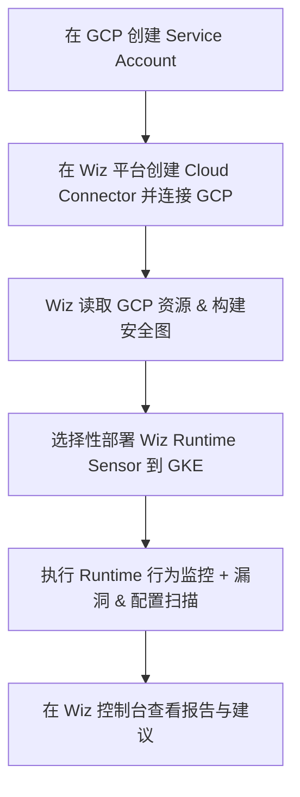
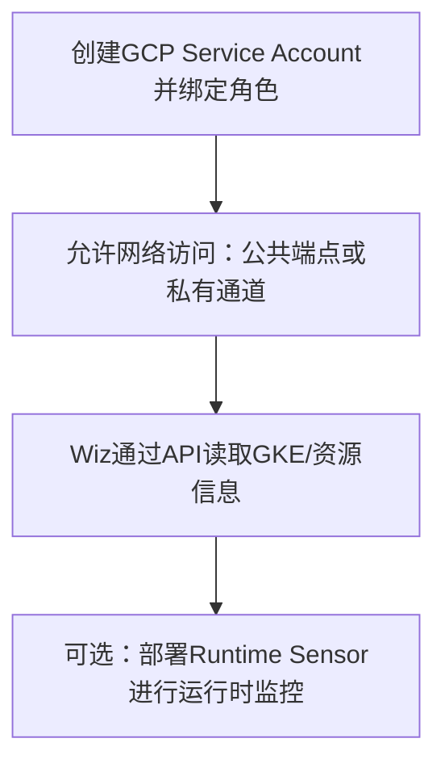
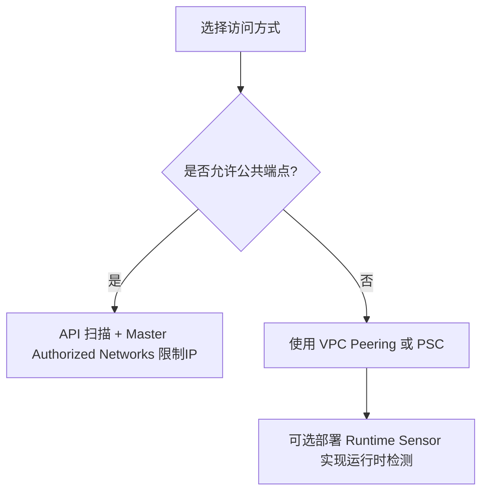

## **Wiz 在 GCP / GKE 中的工作原理概览**

  

Wiz 是一款**无代理（agentless）**的云安全平台，它通过读取云环境 API（如 GCP/GKE）来扫描整个云架构，而无需在主机或容器内安装代理。同时，它也支持在 GKE 集群部署**轻量级 sensor（Runtime Sensor）**以提供运行时监控。

- 它可扫描 VM、容器、Serverless、PaaS 等全栈资源，构建安全图（Security Graph），分析配置、漏洞、权限、暴露面等信息 。
    
- 也可部署 Runtime Sensor 作为 DaemonSet，进行实时行为检测 。
    

---

## **基本集成流程示意**



---

## **步骤详解


```mermaid
graph TD;
    A[在 GCP 创建 Service Account] --> B[在 Wiz 平台创建 Cloud Connector 并连接 GCP];
    B --> C[Wiz 读取 GCP 资源 & 构建安全图];
    C --> D[选择性部署 Wiz Runtime Sensor 到 GKE];
    D --> E[执行 Runtime 行为监控 + 漏洞 & 配置扫描];
    E --> F[在 Wiz 控制台查看报告与建议];
````


---

##  具体步骤说明

### 1. 创建 GCP Service Account 并授权 Wiz 只读访问
在 GCP 控制台或 via Terraform 创建一个专用的 Service Account，并赋予最低权限（例如读取 IAM、Compute、GKE、Storage 等）以供 Wiz 扫描使用 [oai_citation:3‡Google Cloud](https://cloud.google.com/architecture/partners/id-prioritize-security-risks-with-wiz?utm_source=chatgpt.com) [oai_citation:4‡Medium](https://medium.com/google-cloud/enhancing-cloud-security-on-google-cloud-with-wiz-9a854ff396dd?utm_source=chatgpt.com)。

### 2. 在 Wiz 平台配置云连接器（Cloud Connector）
登录 Wiz 平台，使用之前创建的 Service Account 凭据连接你的 GCP 环境，完成 API 级别的权限对接 [oai_citation:5‡Medium](https://medium.com/google-cloud/enhancing-cloud-security-on-google-cloud-with-wiz-9a854ff396dd?utm_source=chatgpt.com) [oai_citation:6‡wiz.io](https://www.wiz.io/environments/google-cloud-platform-gcp?utm_source=chatgpt.com)。

### 3. 自动执行无代理扫描
连接完成后，Wiz 即开始无代理扫描你的 GCP 项目，构建由配置、漏洞、网络、身份、秘密等组成的安全图，让你能全面看到安全状况 [oai_citation:7‡threatscape.com](https://www.threatscape.com/wp-content/uploads/2021/06/Wiz-Datasheet-April-2021.pdf?utm_source=chatgpt.com) [oai_citation:8‡DatoCMS](https://www.datocms-assets.com/75231/1690558591-wiz_gcp_better_together_july2023.pdf?utm_source=chatgpt.com)。

### 4. 部署 Runtime Sensor 到 GKE（可选，但推荐）
如果需要深度运行时检测（如检测容器逃逸、进程行为等）：

- 确保 GKE 版本为 v1.20.9-gke.1000 及以上，并允许 outbound HTTPS 通信 [oai_citation:9‡Google Cloud](https://cloud.google.com/architecture/partners/id-prioritize-security-risks-with-wiz?utm_source=chatgpt.com)。
- 在 Wiz 平台创建 Runtime Sensor 的 Service Account，获取 Helm Chart 和镜像 pull 授权信息。
- 使用 Helm 将 Runtime Sensor 以 DaemonSet 的形式部署在你的 GKE 集群。
- 执行部署后的信心检查（confidence check）以确保正确运行 [oai_citation:10‡Google Cloud](https://cloud.google.com/architecture/partners/id-prioritize-security-risks-with-wiz?utm_source=chatgpt.com)。

### 5. 查看扫描结果与建议
在 Wiz 控制台中，你可以查看：

- 漏洞（CVE）扫描结果与配置错误。
- 容器、K8s RBAC 与网络隔离等建议 [oai_citation:11‡Medium](https://medium.com/google-cloud/enhancing-cloud-security-on-google-cloud-with-wiz-9a854ff396dd?utm_source=chatgpt.com)。
- 安全策略管理 guardrails（如扫描 CI/CD 流程中的镜像、禁止特权容器、执行网络策略等） [oai_citation:12‡wiz.io](https://www.wiz.io/academy/gke-security-best-practices?utm_source=chatgpt.com) [oai_citation:13‡Medium](https://medium.com/google-cloud/enhancing-cloud-security-on-google-cloud-with-wiz-9a854ff396dd?utm_source=chatgpt.com)。

### 6. 向 DevSecOps 流程“左移”安全（Shift-left）
借助 Wiz CLI、镜像扫描和 CI/CD 阶段集成，可在构建、推送镜像前阻断带有漏洞或违规的镜像，从而实现开发阶段的安全防护 [oai_citation:14‡DatoCMS](https://www.datocms-assets.com/75231/1692390556-wiz-for-gcp-containers.pdf?utm_source=chatgpt.com) [oai_citation:15‡wiz.io](https://www.wiz.io/academy/multi-cloud-kubernetes-security-part-2?utm_source=chatgpt.com)。

---

##  总结表格（Markdown 原始格式）


| 步骤 | 描述 |
|------|------|
| 1 | 在 GCP 创建 Service Account 并赋予最小只读权限 |
| 2 | 在 Wiz 平台创建 Cloud Connector，连接 GCP |
| 3 | Wiz 无代理扫描 GCP 资源，构建安全图 |
| 4 | 可选：使用 Helm 在 GKE 部署 Wiz Runtime Sensor |
| 5 | 在 Wiz 控制台查看漏洞、配置问题及行为检测报告 |
| 6 | 集成至 CI/CD，实现 Shift-left 安全措施 |


---

如果需要，我还可以进一步帮你生成对应的 GCP IAM 角色示例、Helm 部署命令、或 CI/CD 集成示例。你接下来想先深入哪一步？


你提到的两部分——**网络访问** 和 **身份访问**——是 Wiz 在连接 GCP/GKE 时的关键条件。以下是详细解释及实践建议，保持 Markdown 格式：

---

## **1. 网络访问：集群需要公共端点？**

  

### **含义**

- **公共端点**指 GKE Master API Server（控制平面）可通过公网 IP 访问。
    
- Wiz 通过云 API（而非直接登录节点）读取 Kubernetes 资源、配置、镜像信息等，如果控制平面是**完全私有**的，Wiz 可能无法直接访问。
    
- 对于开启 **私有集群** 的情况，需通过 **VPC Peering、Private Service Connect** 或 **代理（如 Cloud NAT + Proxy Pod）** 提供访问路径。
    

  

### **常见配置方式**

```
gcloud container clusters update <CLUSTER_NAME> \
    --enable-master-authorized-networks \
    --master-authorized-networks=<WIZ_IP_RANGE>
```

- 允许 Wiz 的出站 IP 访问 Kubernetes API 端点。
    
- 或在 VPC 层面建立 Private Endpoint，并通过 VPC-SC 或专用网关与 Wiz 通信（需要 Wiz 支持 Private Link）。
    

---

## **2. 身份访问：GCP 原生角色支持**

  

### **含义**

- Wiz 需要以一个 **GCP Service Account** 身份通过 GCP API 获取资源清单、配置和安全信息。
    
- 官方推荐使用的权限最小化原则，角色组合通常包括：
    
    - **Viewer** 或更细化的只读角色，如：
        
        - roles/container.viewer（查看 GKE 集群配置）
            
        - roles/compute.viewer（查看 VM 实例）
            
        - roles/storage.objectViewer（查看存储桶配置）
            
        - roles/iam.securityReviewer（查看 IAM 策略与权限）
            
        
    

  

### **示例角色绑定**

```
gcloud projects add-iam-policy-binding <PROJECT_ID> \
    --member="serviceAccount:wiz-scanner@<PROJECT_ID>.iam.gserviceaccount.com" \
    --role="roles/container.viewer"
```

---

## **3. 建议部署方案**

  

### **如果集群必须保持私有**

- 需要 **Runtime Sensor** 部署在 GKE 集群内，通过 DaemonSet 直接从节点收集数据，避免外部网络访问。
    
- 此时云连接器仅需最小化 API 访问权限，其余由 Runtime Sensor 采集。
    

  

### **如果允许公共端点访问**

- 通过 **Master Authorized Networks** 限制 Wiz 出站 IP，安全性更高。
    
- 减少 Sensor 部署需求，降低 DaemonSet 维护成本。
    

---

## **4. Mermaid 流程图**



---

要不要我帮你整理一份 **所需 GCP IAM 角色最小权限清单（表格）**，并区分 **仅API扫描** 和 **启用Runtime Sensor** 两种模式？还是帮你输出 **公共端点 vs 私有端点** 的安全性对比方案？

以下是 **GCP IAM 角色最小权限清单**，分别针对 **仅 API 扫描模式** 和 **启用 Runtime Sensor 模式**，并以 Markdown 表格呈现，可直接放入文档。

---

## **1. GCP IAM 角色最小权限清单**

```
| 模式                | 角色 / 权限                   | 用途说明 |
|---------------------|------------------------------|---------|
| **API 扫描模式**    | `roles/viewer`               | 全局只读访问，适合快速接入 |
|                     | `roles/container.viewer`     | 查看 GKE 集群及资源配置 |
|                     | `roles/compute.viewer`       | 查看 Compute Engine VM 资源 |
|                     | `roles/iam.securityReviewer` | 查看 IAM 策略、角色绑定、权限 |
|                     | `roles/storage.objectViewer` | 查看 GCS 存储桶及对象元数据 |
| **Runtime Sensor 模式** | 继承 API 扫描模式所需角色      | 基础访问权限 |
|                     | `roles/artifactregistry.reader` | 用于读取容器镜像元数据 |
|                     | `roles/logging.viewer`       | 查看集群及节点日志信息 |
|                     | `roles/monitoring.viewer`    | 查看指标、运行时信息 |
```

---

## **2. 公共端点 vs 私有端点 安全性对比**

```
| 访问方式  | 优点 | 缺点 | 适用场景 |
|-----------|------|------|---------|
| 公共端点 + 授权IP | 配置简单，Wiz 可直接访问 GKE API；支持无代理扫描 | 需额外防火墙控制，暴露在公网 | 非高敏感集群，快速接入 Wiz |
| 私有端点 + VPC Peering/PSC | 数据不出专有网络，安全性高 | 需要网络工程配置，复杂度高 | 高安全要求场景（金融、医疗） |
| Runtime Sensor + 私有端点 | 无需公网访问，支持运行时检测 | 增加集群资源开销；需维护 DaemonSet | 高敏感、需运行时监控的场景 |
```

---

## **3. Mermaid 流程图**



---

要不要我帮你整理一份 **Helm 部署 Runtime Sensor 的示例 YAML + 命令**，并结合最小权限策略一起给出完整示例？还是想先要一份 **Terraform 脚本** 用于快速创建 Wiz 所需的 GCP 角色绑定？


