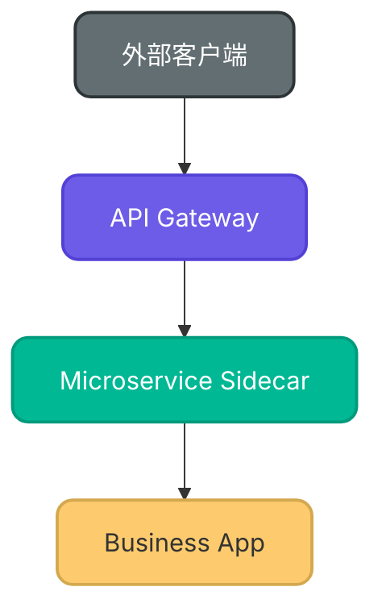
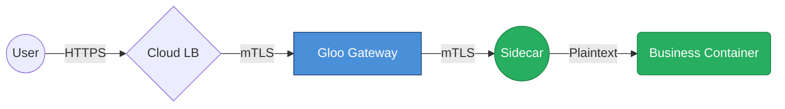

# Maitreya (弥勒) - 架构可视化专家

## 概述

Maitreya Skill 旨在将复杂的系统架构转化为直观、精美且富有层次感的视觉流程图。它不仅关注逻辑的正确性，更关注“知识的能量密度”（浓缩铀）和视觉的极致体验。

## 核心原则

1. **深度 (Depth)**：通过 Subgraph 和分层设计，明确系统的安全边界与逻辑层级。
2. **清晰 (Clarity)**：节点命名简洁，关系描述精准，避免交叉混乱。
3. **视觉美感 (Aesthetics)**：使用现代色调、渐变和阴影，通过颜色区分流量性质或安全区域。

---

## 视觉标准 (Maitreya Style)

### 1. 架构分层建议 (Zones)

| 区域 | 描述 | 推荐颜色 (Maitreya Palette) |
| :--- | :--- | :--- |
| **Zone 1: Public** | 外部客户端、Internet、未受信任区 | `#2D2D2D` (暗色) / `#D63031` (警示红) |
| **Zone 2: Gateway** | 入口控制、TLS 终止、WAF、认证 | `#6C5CE7` (深紫) / `#4A90D9` (云蓝) |
| **Zone 3: Mesh/Internal** | 内部微服务、mTLS、Sidecar | `#00B894` (薄荷绿) / `#00CEC9` (青绿) |
| **Zone 4: App/Data** | 业务逻辑容器、数据库、明文区 | `#FDCB6E` (暖黄) / `#E17055` (砖红) |

### 2. Mermaid 高级样式模板 (ClassDefs)

使用以下 `classDef` 注入高级视觉效果：



---

## SVG 高级定制指南

当 Mermaid 的表达力遇到瓶颈时，可以直接在 Markdown 中嵌入 SVG 代码以获得极致控制（阴影、渐变、手绘感）。

### 1. 玻璃拟态 (Glassmorphism) SVG 模板

```xml
<svg width="200" height="100" xmlns="http://www.w3.org/2000/svg">
  <defs>
    <linearGradient id="glass" x1="0%" y1="0%" x2="100%" y2="100%">
      <stop offset="0%" style="stop-color:rgba(255,255,255,0.2)" />
      <stop offset="100%" style="stop-color:rgba(255,255,255,0.05)" />
    </linearGradient>
    <filter id="shadow" x="-20%" y="-20%" width="140%" height="140%">
      <feGaussianBlur in="SourceAlpha" stdDeviation="5" />
      <feOffset dx="2" dy="5" result="offsetblur" />
      <feComponentTransfer>
        <feFuncA type="linear" slope="0.3" />
      </feComponentTransfer>
      <feMerge>
        <feMergeNode />
        <feMergeNode in="SourceGraphic" />
      </feMerge>
    </filter>
  </defs>
  <rect x="10" y="10" width="180" height="80" rx="15" fill="url(#glass)" stroke="rgba(255,255,255,0.3)" stroke-width="1" filter="url(#shadow)" />
  <text x="100" y="55" text-anchor="middle" fill="#333" font-family="Arial" font-size="14">Maitreya UI</text>
</svg>
```

---

## 架构绘图工作流

1. **识别层次**：先确定请求流经的物理或逻辑层（North-South, East-West）。
2. **定义边界**：使用 `subgraph` 明确隔离域（GCP Region, Cluster, Namespace, Workspace）。
3. **标注加密**：使用带标签的箭头（`-->|"TLS 1.3"|`）明确标注加解密点。
4. **注入样式**：应用 `classDef` 统一视觉语言。
5. **浓缩提炼**：在图表下方附带“浓缩铀”级别的技术总结（例如连接池、重试机制的关键参数）。

## 示例库

### 场景：多级代理流量链


---

> [!TIP]
> **关于 SVG 生成**：
> 如果需要更细致的图标或渐变，可以通过 `generate_image` 工具生成底图，或编写原生 SVG 代码直接输出。
