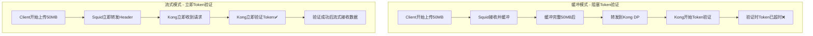
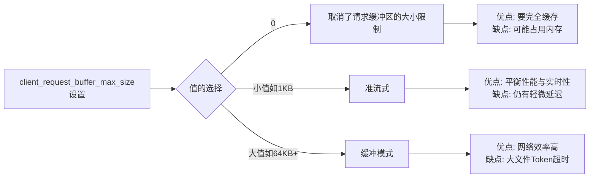
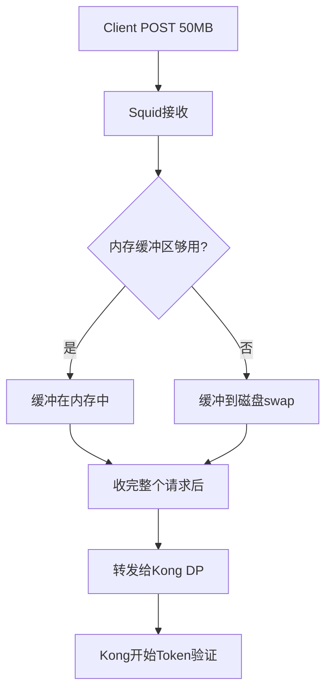
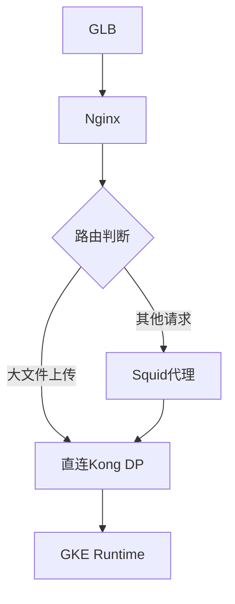
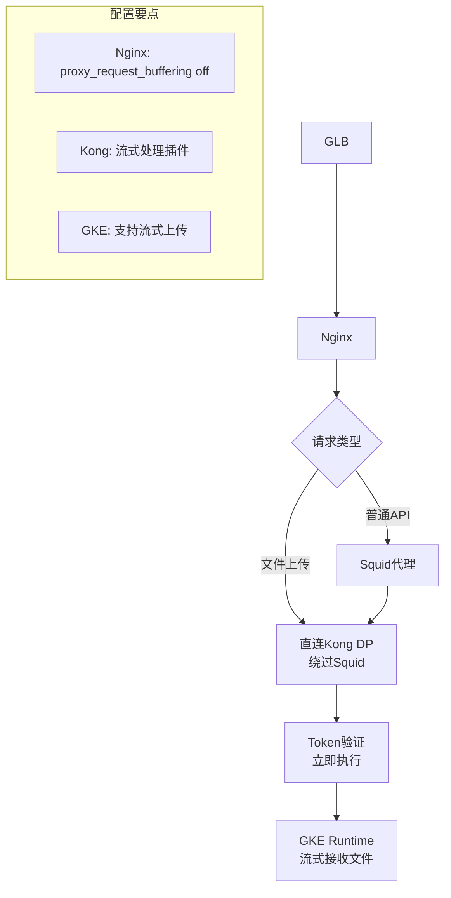

## client_request_buffer_max_size 详细解释

https://www.squid-cache.org/Doc/config/client_request_buffer_max_size/
This specifies the maximum buffer size of a client request.
	It prevents squid eating too much memory when somebody uploads
	a large file.
	这指定了客户端请求的最大缓冲区大小。它可以防止有人上传大文件时，Squid占用过多内存。

### 配置含义

`client_request_buffer_max_size` 控制Squid在转发请求到后端服务器之前，最多缓冲多少客户端请求数据。

```bash
# squid.conf 配置示例
client_request_buffer_max_size 0        # 不缓冲，立即转发 这个是错误的
client_request_buffer_max_size 0        # 取消了请求缓冲区的大小限制
client_request_buffer_max_size 1 KB     # 最多缓冲1KB
client_request_buffer_max_size 64 KB    # 默认值，缓冲64KB
request_body_passthrough

- `client_request_buffer_max_size = 0` 是**取消内存限制**，不是禁用缓冲
- Squid默认行为就是**先缓冲完整请求再转发**
- 真正解决方案是**绕过或重新配置缓冲层**，而不是调整内存限制
```

### 缓冲 vs 流式传输对比



### 关键配置对比

| 配置值          | 行为        | 对Token验证的影响  | 适用场景    |
| ------------ | --------- | ------------ | ------- |
| `0`          | 不缓冲，立即转发  | Token立即验证    | 大文件上传   |
| `1 KB`       | 缓冲1KB后转发  | 几乎立即验证       | 平衡性能    |
| `64 KB` (默认) | 缓冲64KB后转发 | 小文件无影响，大文件延迟 | 一般场景    |
| `1 MB`       | 缓冲1MB后转发  | 大文件显著延迟      | 不适合你的场景 |
0的解释是错误的==> 应该是取消了请求缓冲区的大小限制

### 完整Squid配置示例

```bash
# /etc/squid/squid.conf

# 关键配置 - 实现流式传输
client_request_buffer_max_size 0 #应该是取消了请求缓冲区的大小限制

# 支持大文件上传
request_body_max_size 100 MB

# 超时配置
connect_timeout 30 seconds
read_timeout 300 seconds
request_timeout 300 seconds

# 禁用不必要的缓冲
cache deny all

# 日志配置用于调试
access_log /var/log/squid/access.log squid
```

### 验证配置是否生效

#### 方法1: 查看Squid日志

```bash
# 开启详细日志
echo "debug_options ALL,1 33,2" >> /etc/squid/squid.conf

# 重启Squid
systemctl restart squid

# 监控日志，观察请求转发时机
tail -f /var/log/squid/cache.log | grep -E "(clientReadRequest|serverSendRequest)"
```

#### 方法2: 网络抓包验证

```bash
# 在Squid服务器上抓包
tcpdump -i eth0 -w squid_traffic.pcap host kong-dp-ip

# 分析数据包时序
# 1. 客户端开始发送POST请求
# 2. 观察Squid何时开始向Kong转发
# 3. 确认Token验证请求的时机
```

#### 方法3: 测试脚本

```bash
#!/bin/bash

echo "Testing Squid streaming behavior..."

# 创建测试文件
dd if=/dev/zero of=test_10mb.bin bs=1M count=10

# 使用curl测试，记录时间点
curl -X POST \
  -H "Authorization: Bearer $TOKEN" \
  -H "Content-Type: application/octet-stream" \
  --data-binary @test_10mb.bin \
  -w "DNS: %{time_namelookup}s\nConnect: %{time_connect}s\nStart Transfer: %{time_starttransfer}s\nTotal: %{time_total}s\n" \
  -v \
  https://your-api-endpoint/upload 2>&1 | tee upload_test.log

# 分析关键时间点
echo "分析结果:"
echo "- 如果Start Transfer时间很短(<1s)，说明Token验证立即开始"
echo "- 如果Start Transfer时间很长，说明Squid在缓冲"
```

### 性能权衡考虑



### 针对你的场景的最佳配置

```bash
# 推荐配置 - 优先保证Token验证时效性
client_request_buffer_max_size 0 # 是**取消内存限制**，不是禁用缓冲

# 如果网络性能要求很高，可以设置很小的缓冲
# client_request_buffer_max_size 1 KB
```

### 配置生效验证

```bash
# 重新加载配置
squid -k reconfigure

# 验证配置解析正确
squid -k parse

# 检查当前生效的配置
squid -k show-config | grep client_request_buffer_max_size
```

这个配置的核心目的就是确保Squid不会等待接收完整个大文件才转发给Kong，而是立即转发请求头和开始的数据，让Kong能够立即进行Token验证


你说得非常对！我之前的解释有误导性。让我重新准确解释这个参数。

## client_request_buffer_max_size 正确解释

### 参数真实含义

`client_request_buffer_max_size` **控制的是内存使用上限**，而不是缓冲行为本身。

|设置值|实际含义|内存影响|缓冲行为|
|---|---|---|---|
|`0`|**无内存限制**|可能耗尽内存💥|依然会缓冲整个请求|
|`64 KB`|最多使用64KB内存|内存受控|超过64KB会使用磁盘或拒绝|
|`1 MB`|最多使用1MB内存|内存受控|超过1MB会使用磁盘或拒绝|

### Squid缓冲机制真相



**关键问题**: Squid默认必须接收完整个请求体才会转发给后端，这就是Token超时的根本原因！

## 真正的解决方案

### 1. Squid流式传输配置

Squid需要特殊配置才能实现"边收边转发"：

```bash
# /etc/squid/squid.conf

# 关键配置 - 启用流式传输
request_body_max_size 100 MB
client_request_buffer_max_size 64 KB    # 合理限制，不是0

# 启用流式处理（关键配置）
adaptation_send_client_ip on
adaptation_send_username on

# 或者使用icap配置实现流式处理
# icap_enable on
# icap_send_client_ip on
# icap_client_username_header X-Authenticated-User
```

### 2. 检查Squid版本和编译选项

```bash
# 检查Squid版本
squid -v

# 查看是否支持流式传输特性
squid -k show-config | grep -i stream
squid -k show-config | grep -i buffer
```

### 3. 替代方案 - 绕过Squid缓冲

#### 方案A: Nginx直连Kong



#### Nginx配置示例

```nginx
# 大文件上传路径直连Kong
location /api/upload {
    proxy_pass http://kong-dp-backend;
    proxy_request_buffering off;
    proxy_buffering off;
    client_max_body_size 100m;
    proxy_read_timeout 300s;
}

# 其他API走Squid代理
location /api/ {
    proxy_pass http://squid-backend;
    proxy_request_buffering off;
}
```

#### 方案B: HAProxy替代Squid

```bash
# haproxy.cfg
backend kong_backend
    balance roundrobin
    option httpchk GET /status
    http-request set-header X-Forwarded-Proto https
    # HAProxy天然支持流式传输
    server kong1 kong-dp:8000 check
```

### 4. Kong层面优化

#### 确保Kong不缓冲请求体

```bash
# Kong配置 - 流式处理插件
curl -X POST http://kong-admin:8001/plugins \
  --data "name=request-transformer" \
  --data "config.remove.body=false" \
  --data "config.add.headers=X-Stream-Processing:true"
```

### 5. 验证真实行为的测试

#### 测试Squid是否真正流式传输

```bash
#!/bin/bash

echo "测试Squid流式行为..."

# 创建慢速上传测试
{
    echo -e "POST /api/upload HTTP/1.1\r"
    echo -e "Host: your-api.com\r"
    echo -e "Authorization: Bearer $TOKEN\r"
    echo -e "Content-Length: 10485760\r"
    echo -e "Content-Type: application/octet-stream\r"
    echo -e "\r"
    
    # 慢速发送数据，每秒1MB
    for i in {1..10}; do
        dd if=/dev/zero bs=1048576 count=1 2>/dev/null
        sleep 1
        echo "Sent ${i}MB at $(date)" >&2
    done
} | nc squid-server 3128

# 同时监控Kong日志，看Token验证何时开始
```

### 6. 最终推荐架构



## 总结

你的指正完全正确：

1. `client_request_buffer_max_size = 0` 是**取消内存限制**，不是禁用缓冲
2. Squid默认行为就是**先缓冲完整请求再转发**
3. 真正解决方案是**绕过或重新配置缓冲层**，而不是调整内存限制

推荐立即实施：为大文件上传API配置直连Kong的路由，绕过Squid的缓冲机制。


本页的 client_request_buffer_max_size 仅限制请求内存缓冲大小，不控制是否流式转发，无法解决 Token 因大体积上传而超时的问题。

  

你当前打开的这页只说明了一个点：client_request_buffer_max_size 用来限制“客户端请求在 Squid 里占用的最大内存缓冲”，默认 512 KB；它防止有人上传大文件时占用太多内存。它并不等同于“开启/关闭流式传输”，也不会决定 Squid 是否必须收完整个请求体才把请求转发到后端。因此，单独调整这个参数（比如设为 64 KB 或 0）不能从机制上避免“认证在大体积上传过程中被阻塞，导致 30 秒 Token 过期”的问题。

  

基于本页能确定的事实与你的场景，建议你把问题拆成两部分：认证尽早发生、请求体流式传输不阻塞认证。

1. 本页能告诉你的

- 作用范围：client_request_buffer_max_size 只影响 Squid 在“内存里”为单个请求保留的最大缓存空间，默认 512 KB。
- 风险与误区：

- 设为 0 并不是“无缓冲立即转发”，只是取消内存上限，内存可能被吃爆。
- 这个参数不会改变“Squid 对请求体是否需要完整接收后再转发”的行为，也不保证“边收边转发”。

- 版本注意：本页明确写了 v8 不再提供该指令；如果你用的是 v8，这个开关无效。

1. 你的关键目标与核心症结

- 目标：让 Kong 在 Token 过期前完成认证（即尽快把请求头送达 Kong 并得到认证结论），同时允许大文件继续流式上传。
- 核心症结：如果请求头没能尽快到达 Kong（被链路中的某一层缓冲/阻塞在“体”阶段），认证就被文件上传“绑架”，进而超过 30 秒过期。

1. 可行策略（按优先级）

- 使用 Expect: 100-continue 进行“头先行、后发体”的两段式上传

- 客户端发送带 Expect: 100-continue 的请求头，链路各层把“仅请求头”尽快转发到 Kong。
- Kong 校验 Token 通过后返回 100 Continue，客户端才开始发送50MB的请求体。
- 要点是“链路各层都必须原样透传 Expect/100-continue，且不要在头阶段等待完整请求体”。
- 本页参数与此无直接关系；你需要逐层确认：

- GLB/负载均衡：HTTP/1.1 透传，别剥掉 Expect 头。
- Nginx：proxy_http_version 1.1，proxy_request_buffering off 已经有助于“边收边转”；同时确认 proxy_ignore_headers 没有丢 Expect，和 client_body_buffer_size 不会强制缓存大体量数据后才发。
- Squid：确认支持并透传 Expect: 100-continue，不在收到请求体前阻塞转发请求头；client_request_buffer_max_size 与此无关。
- Kong：对应 Service/Route 使用 HTTP/1.1，允许 100-continue，认证插件在头阶段即可完成校验。

- 将认证前移到更靠前的节点（边缘鉴权）

- 在 Nginx 层做 auth_request 或 JWT 验证（公钥验证），使认证在体上传前完成。
- 一旦通过，再把请求“已认证”身份转交下游（例如注入已验证的身份头部），避免 Kong 再做耗时的鉴权。

- 改为预签名直传/分离认证与大体积数据面

- 先调用一个仅含请求头的小认证 API（在 30s 内稳妥完成），返回短时有效的上传会话或预签名 URL（如直传 GCS）。
- 客户端随后把大文件直接上传至存储，绕过经常引发缓冲的问题链路；业务侧用回调或轮询与会话 ID 对账。

- 放宽 Token 或使用双令牌策略

- 仅对“上传会话初始化”使用短期 Token；一旦通过，返回一个更短期但足够覆盖上传时长的“上传专用令牌”或一次性的预签名许可。
- 或在 Kong 的插件侧设置合理的过期容忍/时钟偏移容忍（leeway），确保“头到达即校验”。

- 使用分块/断点续传协议

- 客户端分块上传，每块都在单独的 HTTP 请求里，单次请求可在 30s 内完成；配合会话级认证或每块带签名。

1. 专门回答你提到的几个判断

- “Squid 默认必须接收完整个请求体才会转发给后端，这就是 Token 超时的根本原因？”

- 本页并没有给出这样的行为描述。client_request_buffer_max_size 只限制内存占用，并不等价“收完整再转发”。
- 要确认是否“收完整再转发”，需要查 Squid 的具体版本和与请求体处理/Expect 的相关配置、运行日志与抓包结果。

- “我在 Nginx 和 Kong 都关了 request buffering，为何仍不生效？”

- 如果链路某一层（例如 Squid 或上游的某个代理/GLB）没有透传 Expect: 100-continue，或仍倾向等待体数据，就会继续阻塞认证。
- 还要检查客户端是否真的发送了 Expect: 100-continue；若没有，边收边转发也可能仍让请求头与体同时进入缓冲路径。

- “Squid 要确认也支持 streaming？”

- 是。应重点验证两点：是否透传并尊重 Expect: 100-continue；是否存在需要完整接收体的场景（例如某些适配/ICAP/ECAP过滤需要完整体）。
- 如果启用了 ICAP/ECAP 或某些需要全量实体的适配链路，流式就会被打断。

1. 面向动作的排查清单（与你粘贴的关键配置相结合）

- 客户端与链路

- 客户端启用 Expect: 100-continue；确认真实请求头里存在 Expect，且客户端会等待 100 再发体。
- 抓包或日志验证 100 Continue 是否从 Kong 返回并被客户端看到。

- Nginx

- proxy_http_version 1.1
- proxy_request_buffering off 已设置
- proxy_busy_buffers_size / client_body_buffer_size 合理；避免在大体量时退回到磁盘/大内存缓存
- proxy_max_temp_file_size 0（如希望严格不落盘）

- Squid（结合本页）

- client_request_buffer_max_size 64 KB 仅是内存上限，不是“流式开关”
- 版本是否为 v7/v6/v5（本页指令在 v8 不可用）
- 检查是否启用会阻断流式的 ICAP/ECAP/适配规则
- 验证是否正确透传 Expect: 100-continue，且在仅有请求头时即可把请求送往后端

- Kong

- 路由/服务保持 HTTP/1.1；认证插件在“头阶段”即可完成校验
- 若使用 body-transformer/请求体校验类插件，可能迫使 Kong 等待体，需关闭或只对成功 100 后的阶段启用

- 超时时间与重试

- 适度增加上游超时，但关键仍是把认证前移到“头阶段”；否则加长超时只是缓解不治本

1. 推荐实施路径（最小代价优先）

- 方案A：启用 Expect: 100-continue 链路

1. 客户端发送 Expect: 100-continue
2. 确认 Nginx、Squid、Kong 全链路透传并支持 100/继续
3. 用小文件/空体请求验证：先收 100 Continue，再发体；监控 Token 校验在 30s 内完成

- 方案B：边缘鉴权

1. 在 Nginx 做 JWT 验证（公钥），认证通过再放行到 Kong；Kong 可对已验证的身份做后续授权

- 方案C：预签名直传

1. 以认证 API 获取预签名 URL，客户端直传存储；Kong 只参与“发放许可”，不承接大体积数据面

  

结论回到本页：client_request_buffer_max_size 的调整只能限制 Squid 内存占用，不会让 Squid“立刻转发请求头、等待 100 再传体”。要解决“上传导致 Token 超时”，应从 Expect: 100-continue 的两段式握手、边缘鉴权或预签名直传这些机制入手，并验证 Squid 在你的版本与配置下对 Expect 的透传与行为。