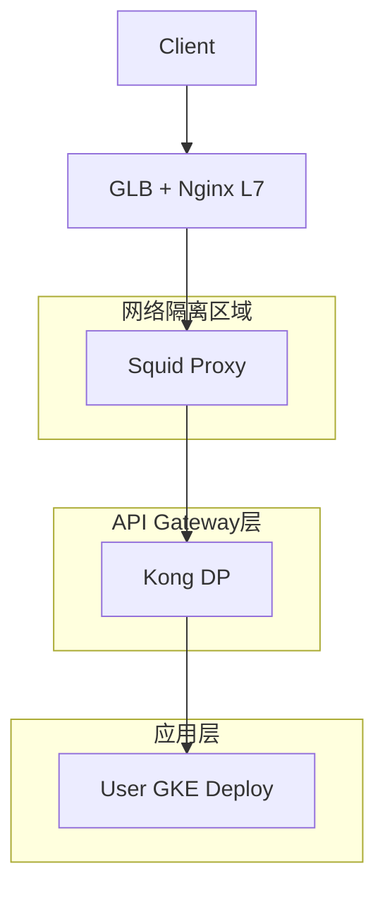
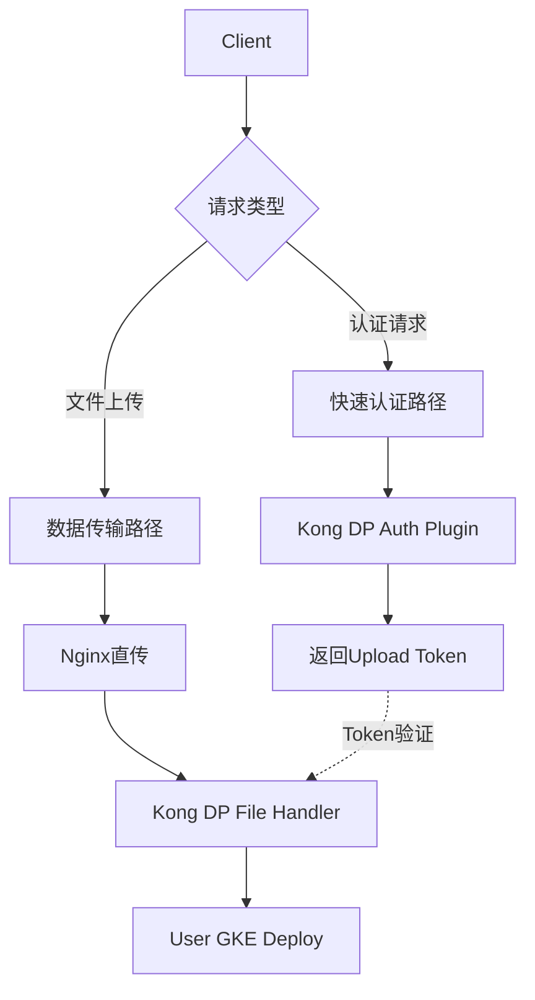
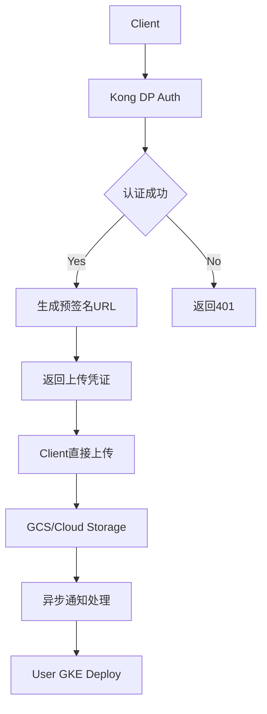

# GKE API平台大文件上传与Token认证优化方案

## 问题分析

### 当前架构流程



### 核心冲突问题

1. **大文件上传需求**：需要较长的传输时间和较大的缓冲区
2. **Token认证时效性**：Kong DP插件需要快速响应认证请求
3. **网络隔离限制**：Squid作为代理跳转，增加了延迟

## 优化方案

### 1. 分离认证与数据传输路径

#### 方案A：预认证机制



**实现步骤：**

1. **客户端先进行认证**
```bash
# 1. 获取上传Token
curl -X POST https://api.domain.com/auth/upload-token \
  -H "Authorization: Bearer ${ACCESS_TOKEN}" \
  -d '{"file_size": 52428800, "content_type": "application/octet-stream"}'

# 响应
{
  "upload_token": "eyJ0eXAiOiJKV1QiLCJhbGciOiJIUzI1NiJ9...",
  "upload_url": "https://api.domain.com/upload/files",
  "expires_in": 3600
}
```

2. **使用Upload Token进行文件上传**
```bash
curl -X POST https://api.domain.com/upload/files \
  -H "X-Upload-Token: ${UPLOAD_TOKEN}" \
  -F "file=@large_file.zip"
```

#### 方案B：异步上传机制



### 2. Nginx层优化配置

```nginx
# 针对不同请求类型的优化配置
upstream squid_backend {
    server squid-proxy:3128;
    keepalive 32;
}

upstream direct_upload {
    server upload-service:8080;
    keepalive 16;
}

# 快速认证路径
location ~ ^/api/(auth|token) {
    proxy_pass http://squid_backend;
    proxy_http_version 1.1;
    proxy_set_header Connection "";
    
    # 认证请求优化
    proxy_connect_timeout 5s;
    proxy_send_timeout 10s;
    proxy_read_timeout 10s;
    
    # 小缓冲区，快速响应
    proxy_buffering on;
    proxy_buffer_size 4k;
    proxy_buffers 8 4k;
}

# 大文件上传路径
location /api/upload/ {
    # 直接路由到上传服务或使用优化配置
    proxy_pass http://squid_backend;
    
    # 大文件上传优化
    proxy_request_buffering off;
    proxy_buffering off;
    proxy_http_version 1.1;
    proxy_set_header Connection "";
    
    # 扩展超时时间
    client_max_body_size 500m;
    client_body_timeout 300s;
    proxy_connect_timeout 60s;
    proxy_send_timeout 600s;
    proxy_read_timeout 600s;
    
    # 流式传输
    proxy_set_header X-Real-IP $remote_addr;
    proxy_set_header X-Forwarded-For $proxy_add_x_forwarded_for;
    proxy_set_header Host $host;
}

# 普通API请求
location /api/ {
    proxy_pass http://squid_backend;
    proxy_http_version 1.1;
    proxy_set_header Connection "";
    
    # 平衡配置
    client_max_body_size 10m;
    proxy_connect_timeout 30s;
    proxy_send_timeout 60s;
    proxy_read_timeout 60s;
    
    proxy_buffering on;
    proxy_buffer_size 8k;
    proxy_buffers 16 8k;
}
```

### 3. Squid代理优化配置

```squid
# 基础配置保持不变
pid_filename /var/run/squid/squid.pid

# 网络ACL配置
acl localnet src 192.168.0.0/16
acl Safe_ports port 443
acl Safe_ports port 3128
acl SSL_ports port 443
acl SSL_ports port 3128
acl CONNECT method CONNECT

# 优化：区分请求类型
acl auth_requests urlpath_regex ^/api/(auth|token)
acl upload_requests urlpath_regex ^/api/upload/
acl api_requests urlpath_regex ^/api/

# 域名和路由配置
acl to_metadata dst 169.254.169.254
acl drn_domains dstdomain .googleapis.com
acl drn_domains dstdomain .aibang
acl crowdstrike_domains dstdomain .cloudsink.net
acl api_gateway dstdomain .aibang-11111-project.internal

# 缓存策略优化
cache_peer cstrike-svr.it.global.aibang parent 37070 1
cache_peer_access cstrike-svr.it.global.aibang allow crowdstrike_domains

# 路由策略
always_direct allow drn_domains
always_direct allow api_gateway
never_direct allow crowdstrike_domains

# 端口配置
http_port 3128

# 访问控制
http_access deny to_localhost
http_access deny to_metadata
http_access deny !Safe_ports
http_access deny CONNECT !SSL_ports
http_access allow localnet crowdstrike_domains
http_access allow localnet drn_domains
http_access allow localnet api_gateway
http_access deny all

# 优化：针对不同请求类型的缓冲区配置
# 认证请求 - 小缓冲区，快速响应
request_body_max_size 1MB auth_requests
client_request_buffer_max_size 8KB auth_requests

# 上传请求 - 大缓冲区，流式处理
request_body_max_size 500MB upload_requests
client_request_buffer_max_size 1MB upload_requests

# 普通API请求 - 中等配置
request_body_max_size 10MB api_requests
client_request_buffer_max_size 64KB api_requests

# 默认配置
client_request_buffer_max_size 64KB
request_body_max_size 50MB

# 连接优化
tcp_outgoing_tos 0x20 auth_requests    # 低延迟
tcp_outgoing_tos 0x08 upload_requests  # 高吞吐量

# 日志配置
logformat squid-xff %ts.%03tu %6tr %>a %{X-Forwarded-For}>h %Ss/%03>Hs %<st %rm %ru %un %Sh/%<a %mt
access_log stdio:/var/log/squid/access.log squid-xff

# 缓存策略
cache deny all
positive_dns_ttl 1 minutes

# WebSocket支持
acl websocket_upgrade_req req_header Upgrade ^websocket$
request_header_add Upgrade "websocket" websocket_upgrade_req
request_header_add Connection "upgrade" websocket_upgrade_req
http_upgrade_request_protocols WebSocket allow all

# 安全配置
httpd_suppress_version_string on
reply_header_access X-Cache deny all
reply_header_access X-Cache-Lookup deny all
reply_header_access Via deny all

# 性能优化
refresh_pattern ^ftp: 1440 20% 10080
refresh_pattern ^gopher: 1440 0% 1440
refresh_pattern -i (/cgi-bin/|\?) 0 0% 0
refresh_pattern . 0 20% 4320

coredump_dir /var/spool/squid
logfile_rotate 0
```

### 4. Kong DP插件优化

#### 认证插件配置

```yaml
# kong-auth-plugin.yaml
apiVersion: configuration.konghq.com/v1
kind: KongPlugin
metadata:
  name: fast-auth-plugin
config:
  # 快速认证配置
  cache_ttl: 300
  timeout: 5000
  retry_count: 2
  
  # 针对上传请求的特殊处理
  upload_token_validation: true
  upload_token_ttl: 3600
  
  # 认证缓存策略
  auth_cache_key: "user_id:scope:resource"
  cache_strategy: "redis"
plugin: jwt
```

#### 上传处理插件

```yaml
# kong-upload-plugin.yaml
apiVersion: configuration.konghq.com/v1
kind: KongPlugin
metadata:
  name: upload-handler-plugin
config:
  # 大文件处理配置
  max_file_size: 524288000  # 500MB
  chunk_size: 1048576       # 1MB chunks
  
  # 流式处理
  streaming_mode: true
  buffer_size: 65536        # 64KB buffer
  
  # 超时配置
  upload_timeout: 600
  chunk_timeout: 30
  
plugin: file-upload-handler
```

### 5. 监控和告警配置

#### Prometheus监控指标

```yaml
# monitoring-config.yaml
apiVersion: v1
kind: ConfigMap
metadata:
  name: upload-monitoring
data:
  prometheus.yml: |
    global:
      scrape_interval: 15s
    
    scrape_configs:
    - job_name: 'nginx-upload'
      static_configs:
      - targets: ['nginx:9113']
      metrics_path: /metrics
      
    - job_name: 'squid-proxy'
      static_configs:
      - targets: ['squid:3401']
      
    - job_name: 'kong-gateway'
      static_configs:
      - targets: ['kong:8001']
      metrics_path: /metrics
```

#### 关键监控指标

| 指标名称 | 类型 | 描述 | 告警阈值 |
|---------|------|------|----------|
| `upload_request_duration` | Histogram | 上传请求耗时 | P95 > 300s |
| `auth_request_duration` | Histogram | 认证请求耗时 | P95 > 5s |
| `upload_success_rate` | Counter | 上传成功率 | < 95% |
| `token_validation_errors` | Counter | Token验证错误数 | > 10/min |
| `squid_connection_errors` | Counter | Squid连接错误 | > 5/min |

### 6. 部署和测试

#### 性能测试脚本

```bash
#!/bin/bash
# performance-test.sh

echo "=== 认证性能测试 ==="
for i in {1..100}; do
  time curl -s -X POST https://api.domain.com/auth/upload-token \
    -H "Authorization: Bearer test-token" \
    -d '{"file_size": 52428800}' > /dev/null
done

echo "=== 大文件上传测试 ==="
# 创建测试文件
dd if=/dev/zero of=test-50mb.bin bs=1M count=50

# 上传测试
time curl -X POST https://api.domain.com/upload/files \
  -H "X-Upload-Token: test-upload-token" \
  -F "file=@test-50mb.bin"

echo "=== 并发测试 ==="
# 使用ab进行并发测试
ab -n 1000 -c 10 -H "Authorization: Bearer test-token" \
  https://api.domain.com/auth/upload-token

# 清理
rm test-50mb.bin
```

## 最佳实践建议

### 1. 架构层面

- **分离关注点**：认证和数据传输使用不同的路径和配置
- **异步处理**：大文件上传采用异步机制，避免阻塞认证流程
- **缓存策略**：合理使用认证缓存，减少重复验证

### 2. 配置层面

- **分层超时**：不同层级设置合适的超时时间
- **缓冲区优化**：根据请求类型调整缓冲区大小
- **连接复用**：启用HTTP/1.1长连接和连接池

### 3. 监控层面

- **实时监控**：监控关键性能指标
- **告警机制**：设置合理的告警阈值
- **日志分析**：定期分析访问日志，优化配置

### 4. 安全层面

- **Token时效性**：合理设置Token过期时间
- **文件验证**：上传前进行文件类型和大小验证
- **访问控制**：严格的ACL配置和访问限制

## 注意事项

1. **测试验证**：在生产环境部署前，务必在测试环境验证所有配置
2. **渐进式部署**：建议分阶段部署优化方案，逐步验证效果
3. **备份配置**：修改配置前备份原有配置文件
4. **监控观察**：部署后密切监控系统性能和错误率
5. **回滚准备**：准备快速回滚方案，以应对异常情况

通过以上优化方案，可以有效解决大文件上传与Token认证时效性的冲突问题，提升整体系统性能和用户体验。