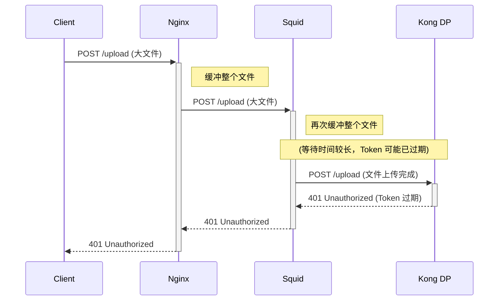
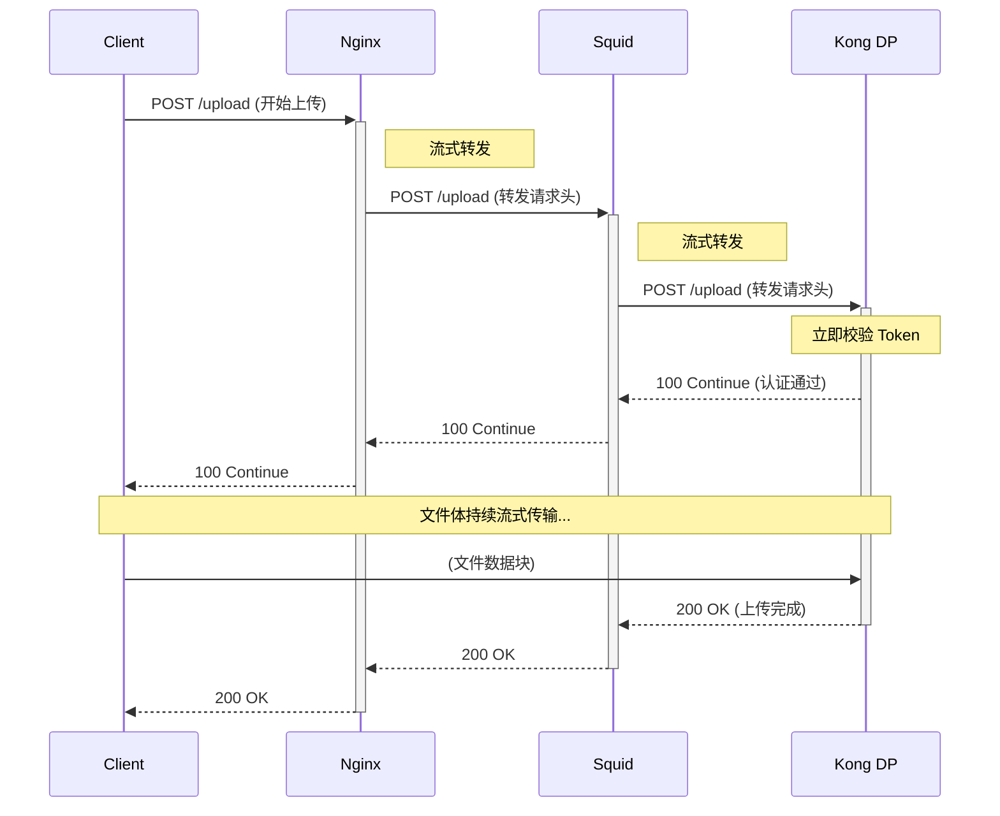

# GKE API 平台大文件上传与认证时效性优化方案
- request_body_passthrough 
- There is a fatal error here, which is that the parameter or the configuration file does not exist. 
## 1. 问题分析

在 `GLB+nginxL7 ==> Squid ==> KongDP ==> User GKE Deploy` 架构中，当用户上传大文件时，默认情况下 Nginx 和 Squid 都会对请求体（Request Body）进行缓冲。这意味着后端服务（Kong DP）必须等待整个文件被完整接收并缓存后，才能开始处理请求。

这个过程会导致以下问题：

- **认证延迟**：Kong DP 的认证插件（Plugin）无法在文件上传开始时立即校验 Token，必须等待文件上传完成。
- **Token 过期**：如果文件过大，上传时间超过了 Token 的有效期限，当请求最终到达 Kong DP 时，Token 可能已经失效，导致认证失败。
- **资源占用**：代理层（Nginx/Squid）需要占用大量内存或磁盘空间来缓冲整个文件，增加了系统的资源压力。

## 2. 核心问题定位

问题的根源在于 **请求缓冲（Request Buffering）**。您在 Nginx 中使用 `proxy_request_buffering off;` 是正确的方向，但这只解决了第一层代理的问题。数据流到 Squid 后，Squid 默认仍然会缓冲请求体，导致瓶颈转移到了 Squid。

因此，我们的目标是实现 **端到端的请求体流式传输（End-to-End Streaming）**，让数据流像管道一样直接穿过 Nginx 和 Squid，最终到达 Kong DP。

## 3. 最佳实践方案：请求体穿透 (Request Body Passthrough)

最佳解决方案是在 Squid 中启用 `request_body_passthrough` 功能。这允许 Squid 在接收到请求头之后，立即将其转发给后端（Kong DP），同时将请求体数据流式传输过去。

### 优势

- **即时认证**：Kong DP 几乎可以立即收到请求头和认证信息（如 `Authorization` Header），并开始校验 Token，此时文件体仍在传输中。
- **降低延迟**：后端服务可以更快地开始处理请求，无需等待整个文件上传完毕。
- **节省资源**：Squid 无需在内存或磁盘中缓冲巨大的请求体。

## 4. 架构流程优化

通过禁用请求缓冲，数据流的处理模式将从“存储转发”变为“流式处理”。

### 优化前：缓冲模式 (Buffering Mode)



### 优化后：流式穿透模式 (Streaming Passthrough Mode)



## 5. 配置实施

### 5.1. Squid 配置 (`squid.conf`)

为了实现请求体穿透，您需要在 `squid.conf` 中添加或修改以下指令。这是基于您提供的配置的优化版本。

```bash
# 开启请求体穿透
request_body_passthrough on

# 当 request_body_passthrough 开启时，Squid 不再检查请求体的大小。
# request_body_max_size 仍然可以设置，但它只对不穿透的请求生效。
# 文件大小限制现在主要由 Nginx 的 client_max_body_size 控制。
request_body_max_size 0 MB

# 客户端请求头的缓冲区大小，64KB 对于包含长 Token 的场景是合理的。
client_request_buffer_max_size 64 KB

# ==============================================================
# 以下是您现有配置的整合
# ==============================================================
pid_filename /var/run/squid/squid.pid
acl localnet src 192.168.0.0/16 # local vpc
acl Safe_ports port 443          # https
acl Safe_ports port 3128
acl SSL_ports port 443
acl SSL_ports port 3128
acl CONNECT method CONNECT
acl hasRequest default request
acl has-xff req_header X-Forwarded-For ^((([0-9]+)\.([0-9]+)\.([0-9]+)\.([0-9]+)|([0-9a-fA-F]{1,4}:|:))(([0-9]+)\.([0-9]+)\.([0-9]+)\.([0-9]+)|([0-9a-fA-F]{1,4}:|:))?(\.([0-9]+)\.([0-9]+)\.([0-9]+)\.([0-9]+)|([0-9a-fA-F]{1,4}:|:))?)$ # requests that have X-Forwarded-For header with a value
acl to_metadata dst 169.254.169.254 # google metadata
acl drn_domains dstdomain .googleapis.com
acl drn_domains dstdomain .aibang
always_direct allow drn_domains
acl api_gateway dstdomain .aibang-11111.internal
always_direct allow api_gateway
# internet_domains # 这一行似乎不完整，建议检查或删除
http_port 3128
http_access deny to_localhost
http_access deny to_metadata
http_access deny !Safe_ports
http_access deny CONNECT !SSL_ports
http_access allow localnet drn_domains
http_access allow localnet api_gateway
http_access deny all
logformat squid-xff %ts.%03tu %6tr %>a %{X-Forwarded-For}>h %Ss/%03>Hs %<st %rm %ru %un %Sh/%<a %mt
access_log none !hasRequest
access_log stdio:/var/log/squid/access.log squid !has-xff
access_log stdio:/var/log/squid/access.log squid-xff has-xff

# 明确禁用缓存，因为 Squid 在这里是纯代理角色
cache deny all

positive_dns_ttl 1 minutes
coredump_dir /var/spool/squid
refresh_pattern ^ftp: 1440 20% 10080
refresh_pattern ^gopher: 1440 0% 1440
refresh_pattern -i (/cgi-bin/|\?) 0 0% 0
refresh_pattern . 0 20% 4320
logfile_rotate 0
httpd_suppress_version_string on
reply_header_access X-Cache deny all
reply_header_access X-Cache-Lookup deny all
reply_header_access Via deny all

# Websocket 配置与文件上传无关，但可以保留
acl websocket_upgrade_req req_header Upgrade ^websocket$
request_header_add Upgrade "websocket" websocket_upgrade_req
request_header_add Connection "upgrade" websocket_upgrade_req
http_upgrade_request_protocols WebSocket allow all
```

**关键变更解释**：

- `request_body_passthrough on`: 这是解决问题的核心指令。
- `request_body_max_size 0 MB`: 设置为 0 表示对于需要穿透的请求体大小无限制。实际的大小限制将由 Nginx 或最终的应用服务来执行。

### 5.2. Nginx 配置

您提供的 Nginx 配置是完全正确的，它与 Squid 的穿透模式完美配合。

```nginx
location /api/ {
    # 关键：关闭请求体缓冲，实现流式转发
    proxy_request_buffering off;
    proxy_buffering off;

    # 使用 HTTP/1.1 以支持块编码（chunked encoding）流式传输
    proxy_http_version 1.1;

    # 在 Nginx 层强制执行最大文件上传大小
    client_max_body_size 100m;

    # 延长超时时间以适应大文件上传
    proxy_read_timeout 300s;
    proxy_send_timeout 300s;

    proxy_pass http://squid_backend;
}
```

## 6. 注意事项

1. **后端服务兼容性**：最终的应用（您的 GKE Deploy）必须能够处理 `Transfer-Encoding: chunked` 的请求，现代 Web 框架通常都支持。
2. **大小限制的转移**：启用穿透后，Squid 不再是文件上传大小的限制点。您必须依赖 Nginx 的 `client_max_body_size` 和/或 Kong DP/后端应用自身的限制来控制上传大小。
3. **安全性**：由于请求体直接穿透，任何针对请求体的安全扫描（如 WAF）如果部署在 Squid 上，可能会失效。安全检查需要前移到 Nginx 或后移到 Kong DP/应用层。
4. **`always_direct` 和 `never_direct`**：您配置中的 `always_direct` 和 `never_direct` 规则会影响 Squid 的路由决策，但不会影响 `request_body_passthrough` 的行为。对于发往 `api_gateway` 的请求，它们将被直接转发，并且请求体将按配置进行穿透。
