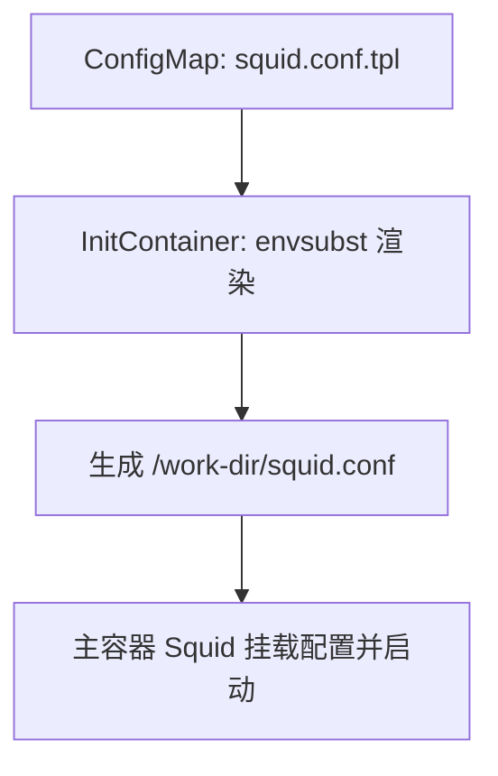

我现在遇到这样一个. Build a squid Images 但是 squid.conf 文件大部分内容写死了. 里面定义了几个变量是通过 Deployment 的传参来覆盖的
比如这个部分.大概如下

```squid.conf
acl app_proxy dstdomain {{TARGET_FQDN}} 
cache_peer {{ENV}}-proxy.aliyun.cloud.{{REGION}}.local parent 3128 0
cache_peer_access {{ENV}}-proxy.aliyun.cloud.{{REGION}}.local allow app_proxy
```

那么我如果按照原来的方式部署.这几个参数是满足需求的.
但是我现在来了一个新的需求
比如我需要我真正的配置如下.也就是没有了参数的那部分覆盖,比如变成了如下 squid2.conf

```squid.conf
acl app_proxy dstdomain {{TARGET_FQDN}} 
cache_peer my_local.proxy.aibang parent 8080 0
cache_peer_access my_local.proxy.aibang allow app_proxy
```

那么我在不修改我原来 Squid.conf 的情况下如何来满足 2 个需求. 我测试比如把我需要的 Squid2.conf. 放到 configmap 里面然后修改原来的 deployment.yaml 来挂载 configmap 可以实现
我想探索更平滑的或者说一般的最佳实践的方式.

# ChatGPT

好的，这个场景我理解了 👍。你现在面临的问题是：

- 你有一个 **写死了大部分配置** 的 squid.conf，其中部分参数是通过 **Deployment 的环境变量** 覆盖的（例如 TARGET_FQDN、ENV、REGION）。
- 新需求要求你可以直接替换掉某些配置段（比如 cache_peer），而不仅仅是通过环境变量拼出来。
- 你目前想到的做法是：额外挂载一个 squid2.conf（来自 ConfigMap），并在 Deployment 里修改挂载路径，让 Squid 用这个配置启动。这能实现，但不够“平滑”。

我给你整理几个更通用的 **最佳实践方案**，让你在不同需求下灵活选择：

---

## **1.** ##  **InitContainer 模板渲染（推荐）**

在 squid.conf 中保留 **变量占位符**，然后使用一个 InitContainer 在 Pod 启动时，动态渲染最终配置文件。

- 你原来的 squid.conf 可以作为模板文件（squid.conf.tpl）。
- InitContainer 用 envsubst 或 gomplate 等模板工具，将环境变量替换进去，生成 /etc/squid/squid.conf。

```
volumes:
  - name: squid-config
    emptyDir: {}

initContainers:
  - name: render-squid-config
    image: alpine:3
    command:
      - sh
      - -c
      - |
        apk add --no-cache gettext
        envsubst < /config/squid.conf.tpl > /work-dir/squid.conf
    volumeMounts:
      - name: squid-template
        mountPath: /config
      - name: squid-config
        mountPath: /work-dir

containers:
  - name: squid
    image: your-squid-image
    volumeMounts:
      - name: squid-config
        mountPath: /etc/squid/squid.conf
        subPath: squid.conf
```

这样你就可以通过环境变量控制，或者在 ConfigMap 里替换模板逻辑，保持灵活。

---

## **2.** ## **多 ConfigMap 配置 + Sidecar 热加载**

如果配置差异大（例如 squid.conf vs squid2.conf），可以：

- 用 **多个 ConfigMap**，每个 ConfigMap 代表一种环境配置（prod/dev/local）。
- 在 Deployment 中，通过 values.yaml 或 Helm chart 来选择挂载哪个 ConfigMap。
- 甚至可以加一个 sidecar（如 configmap-reload），监听 ConfigMap 更新，然后 squid -k reconfigure 热加载。

---

## **3.** ## **入口脚本启动模式**

把配置选择逻辑放在 **容器 entrypoint 脚本** 里：

```
#!/bin/sh
if [ "$USE_LOCAL_PROXY" = "true" ]; then
  cp /config/squid2.conf /etc/squid/squid.conf
else
  cp /config/squid.conf /etc/squid/squid.conf
fi
exec squid -N -d 1
```

这样通过 Deployment 环境变量（如 USE_LOCAL_PROXY=true）就能切换配置。

---

## **4.**  ## **Kubernetes Config Management 工具（Helm / Kustomize）**

- 如果你已经用 Helm 部署 Squid，可以把 squid.conf 写成模板，通过 values.yaml 控制 cache_peer 的内容。
- 如果用 Kustomize，可以用 configMapGenerator 来管理多个 squid.conf 版本，根据 overlay 选择。

---

## **对比与建议**

| **方案**           | **特点**                   | **适用场景**                             |
| ------------------ | -------------------------- | ---------------------------------------- |
| InitContainer 渲染 | 灵活、通用、可保留模板变量 | 适合有参数化需求、配置差异较小           |
| 多 ConfigMap       | 简单直观，但配置冗余       | 不同环境差异较大，配置无法抽象成模板     |
| 入口脚本           | 简单，但逻辑散落在镜像里   | 想快速切换小块配置，不改镜像不行         |
| Helm/Kustomize     | 部署级别灵活               | CI/CD 流程已经使用 Helm/Kustomize 的团队 |

---

✅ **最佳实践建议**：

如果你的配置只是 **部分字段需要替换**，推荐 **InitContainer + 模板渲染**（方案 1），既能保持 squid.conf 通用性，也能在不同需求下快速切换。

如果以后需求变多，迁移到 Helm/Kustomize 管理配置会更方便。

---

要不要我帮你写一个 **完整的 ConfigMap + InitContainer 渲染示例**，直接套在你现有的 Squid Deployment 上？

好 👍 我给你写一个 **完整的 Kubernetes 配置示例**：包含 ConfigMap（存放模板）、InitContainer（渲染配置）和 Deployment（运行 Squid）。

  

这样你不用改原来的 squid.conf 模板，只需要修改 ConfigMap 或环境变量，就能生成不同的配置。

---

## **1. ConfigMap（squid.conf.tpl 模板）**

```
apiVersion: v1
kind: ConfigMap
metadata:
  name: squid-config-template
  namespace: proxy
data:
  squid.conf.tpl: |
    http_port 3128

    acl app_proxy dstdomain ${TARGET_FQDN}

    cache_peer ${CACHE_PEER_HOST} parent ${CACHE_PEER_PORT} 0
    cache_peer_access ${CACHE_PEER_HOST} allow app_proxy

    # 其他通用配置
    http_access allow app_proxy
    http_access deny all
```

👉 模板里用了环境变量 ${TARGET_FQDN}、${CACHE_PEER_HOST}、${CACHE_PEER_PORT}。

例如你可以设置：

- **默认方式**：CACHE_PEER_HOST=${ENV}-proxy.aliyun.cloud.${REGION}.local，CACHE_PEER_PORT=3128
    
- **新需求方式**：CACHE_PEER_HOST=my_local.proxy.aibang，CACHE_PEER_PORT=8080
    

---

## **2. Deployment（带 InitContainer 渲染）**

```yaml
apiVersion: apps/v1
kind: Deployment
metadata:
  name: squid
  namespace: proxy
spec:
  replicas: 1
  selector:
    matchLabels:
      app: squid
  template:
    metadata:
      labels:
        app: squid
    spec:
      volumes:
        - name: squid-config-template
          configMap:
            name: squid-config-template
        - name: squid-config
          emptyDir: {}
      initContainers:
        - name: render-squid-config
          image: alpine:3.20
          command:
            - sh
            - -c
            - |
              apk add --no-cache gettext
              envsubst < /config/squid.conf.tpl > /work-dir/squid.conf
              echo "==== Rendered squid.conf ===="
              cat /work-dir/squid.conf
          env:
            - name: TARGET_FQDN
              value: "example.com"
            - name: CACHE_PEER_HOST
              value: "my_local.proxy.aibang"
            - name: CACHE_PEER_PORT
              value: "8080"
          volumeMounts:
            - name: squid-config-template
              mountPath: /config
            - name: squid-config
              mountPath: /work-dir
      containers:
        - name: squid
          image: sameersbn/squid:latest
          ports:
            - containerPort: 3128
          volumeMounts:
            - name: squid-config
              mountPath: /etc/squid/squid.conf
              subPath: squid.conf
```

---

## **3. 使用方式**

  

### **默认模式（原来逻辑）**

  

在 Deployment 的 env 中设置：

```
- name: CACHE_PEER_HOST
  value: "prd-proxy.aliyun.cloud.us-central1.local"
- name: CACHE_PEER_PORT
  value: "3128"
```

### **新模式（覆盖为本地 proxy）**

```
- name: CACHE_PEER_HOST
  value: "my_local.proxy.aibang"
- name: CACHE_PEER_PORT
  value: "8080"
```

---

## **4. 整体流程**



---

## **✅ 注意事项**

1. **安全**：envsubst 会替换所有 ${VAR} 变量，避免使用未定义的环境变量。
    
2. **热更新**：ConfigMap 更新后需要 kubectl rollout restart deployment squid，才能重新渲染配置。
    
3. **多环境支持**：你可以用 Helm/Kustomize 把 env 部分参数化，适应 dev/stg/prd。
    

---

要不要我再帮你写一个 **Helm values.yaml + 模板示例**，这样可以直接用 Helm chart 管理不同环境的 Squid 配置？
