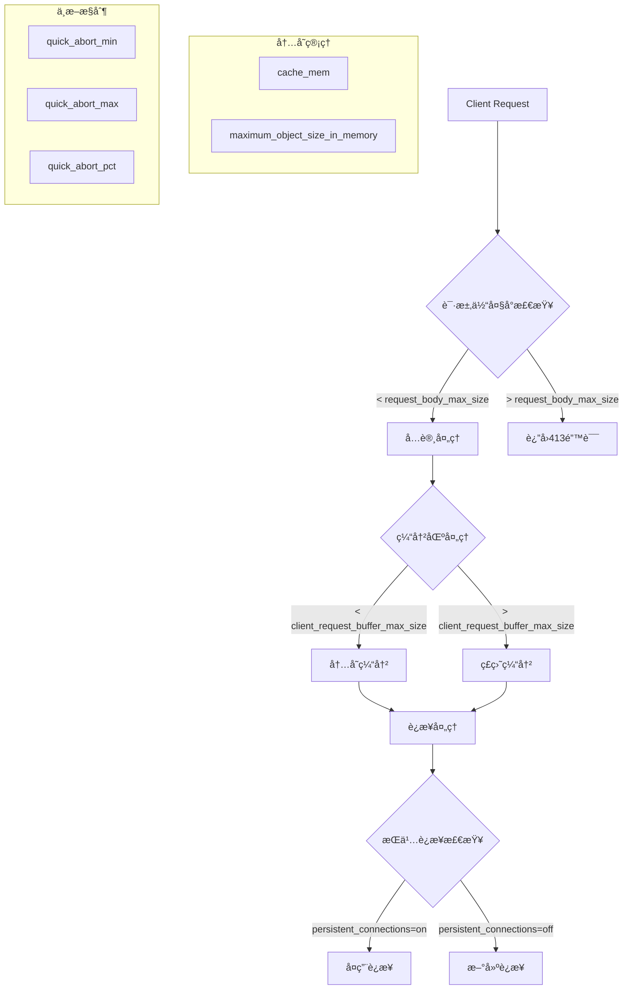

# My Enhance Plan
- [Reference](../nginx/buffer/summary-buffer.md)
```squid.conf
# 基础é…ç½®ä¿æŒä¸å˜ï¼Œæ·»åŠ ä»¥ä¸‹ä¼˜åŒ–
request_body_max_size 500 MB
client_request_buffer_max_size 1 MB  # å¢å¤§ç¼“冲区

# 添加大文件处ç†ä¼˜åŒ–
range_offset_limit -1
quick_abort_min -1 KB
quick_abort_max -1 KB
quick_abort_pct 95

# è¿æ¥æ± ä¼˜åŒ–
server_persistent_connections on
client_persistent_connections on
half_closed_clients off

# 内存使用优化
cache_mem 512 MB
maximum_object_size_in_memory 512 KB
```

## Squidé…置优化å‚数详解

### 1. 请求体处ç†å‚æ•°

```bash
request_body_max_size 500 MB
```

- **作用**：é™åˆ¶å®¢æˆ·ç«¯è¯·æ±‚体的最大大å°
- **默认值**：0（无é™åˆ¶ï¼‰
- **å½±å“**：超过此大å°çš„请求会被拒ç»ï¼Œè¿”å›413错误
- **建议**：根æ®ä¸šåŠ¡éœ€æ±‚设置，é¿å…过大请求å ç”¨è¿‡å¤šå†…å­˜

```bash
client_request_buffer_max_size 1 MB
```

- **作用**：设置客户端请求缓冲区的最大大å°
- **默认值**：通常为32KB或64KB
- **å½±å“**：影å“内存使用和处ç†å¤§è¯·æ±‚头的能力
- **说æ˜**：请求头和å°è¯·æ±‚体会被缓存在内存中，超出部分写入ç£ç›˜

### 2. 范围请求优化

```bash
range_offset_limit -1
```

- **作用**：æ§åˆ¶HTTP Range请求的å移é‡é™åˆ¶
- **默认值**：0（ç¦ç”¨Range请求）
- **-1å«ä¹‰**：å…许任æ„大å°çš„Range请求
- **用途**：支æŒæ–­ç‚¹ç»­ä¼ ï¼Œå¯¹å¤§æ–‡ä»¶ä¸‹è½½å¾ˆé‡è¦
- **示例**：客户端å¯ä»¥è¯·æ±‚文件的任æ„部分，如`bytes=1000000-2000000`

### 3. 快速中断æ§åˆ¶

```bash
quick_abort_min -1 KB
quick_abort_max -1 KB  
quick_abort_pct 95
```

**quick_abort_min -1 KB**：

- **作用**：当客户端断开è¿æ¥æ—¶ï¼Œå¦‚æœå·²ä¸‹è½½æ•°æ®å°äºæ­¤å€¼ï¼Œç«‹å³åœæ­¢ä»æºæœåŠ¡å™¨è·å–
- **-1å«ä¹‰**：ç¦ç”¨æ­¤åŠŸèƒ½ï¼Œå³ä½¿å®¢æˆ·ç«¯æ–­å¼€ä¹Ÿç»§ç»­ä¸‹è½½
- **å½±å“**：é¿å…浪费带宽，但å¯èƒ½å½±å“缓存效æœ

**quick_abort_max -1 KB**：

- **作用**：当客户端断开è¿æ¥æ—¶ï¼Œå¦‚æœå·²ä¸‹è½½æ•°æ®å¤§äºæ­¤å€¼ï¼Œç»§ç»­å®Œæˆä¸‹è½½
- **-1å«ä¹‰**：无é™åˆ¶ï¼Œæ€»æ˜¯ç»§ç»­å®Œæˆä¸‹è½½
- **å½±å“**：确ä¿å¤§æ–‡ä»¶èƒ½å®Œæ•´ç¼“å­˜

**quick_abort_pct 95**：

- **作用**：当下载进度超过95%时，å³ä½¿å®¢æˆ·ç«¯æ–­å¼€ä¹Ÿç»§ç»­å®Œæˆ
- **目的**：é¿å…浪费已完æˆ95%的下载工作

### 4. è¿æ¥æŒä¹…化

```bash
server_persistent_connections on
client_persistent_connections on
```

**server_persistent_connections on**：

- **作用**：å¯ç”¨ä¸å端æœåŠ¡å™¨çš„æŒä¹…è¿æ¥
- **默认值**：on
- **好处**：å‡å°‘TCPæ¡æ‰‹å¼€é”€ï¼Œæ高性能
- **适用**：高频ç‡è¯·æ±‚场景

**client_persistent_connections on**：

- **作用**：å¯ç”¨ä¸å®¢æˆ·ç«¯çš„æŒä¹…è¿æ¥
- **默认值**：on
- **好处**：å‡å°‘客户端è¿æ¥å»ºç«‹æ—¶é—´
- **HTTP版本**：支æŒHTTP/1.1çš„Keep-Alive

```bash
half_closed_clients off
```

- **作用**：是å¦ç›‘æ§åŠå…³é—­çš„客户端è¿æ¥
- **默认值**：on
- **offå«ä¹‰**：ä¸ç›‘æ§åŠå…³é—­è¿æ¥ï¼ŒèŠ‚çœèµ„æº
- **å½±å“**：å¯èƒ½å¯¼è‡´ä¸€äº›è¿æ¥çŠ¶æ€æ£€æµ‹ä¸å‡†ç¡®

### 5. 内存管ç†

```bash
cache_mem 512 MB
```

- **作用**：设置Squid使用的内存缓存大å°
- **默认值**：256 MB
- **用途**：缓存热点数æ®åœ¨å†…存中，æ高访问速度
- **注æ„**：ä¸è¦è¶…过系统å¯ç”¨å†…存的1/3

```bash
maximum_object_size_in_memory 512 KB
```

- **作用**：设置å¯ä»¥å­˜å‚¨åœ¨å†…存中的å•ä¸ªå¯¹è±¡æœ€å¤§å¤§å°
- **默认值**：512 KB
- **å½±å“**：超过此大å°çš„对象åªèƒ½å­˜å‚¨åœ¨ç£ç›˜ä¸Š
- **平衡**：å¢å¤§å¯æ高性能，但消耗更多内存

### 6. å‚数关系图



### 7. 性能影å“对比表

|å‚æ•°|设置值|内存使用|CPU使用|网络效ç‡|适用场景|
|---|---|---|---|---|---|
|request_body_max_size|500MB|ä½|ä½|高|大文件上传|
|client_request_buffer_max_size|1MB|中|ä½|高|大请求头处ç†|
|range_offset_limit|-1|ä½|中|高|断点续传|
|quick_abort_*|-1|中|ä½|中|缓存优化|
|persistent_connections|on|ä½|ä½|高|高并å‘|
|cache_mem|512MB|高|ä½|很高|热点数æ®|

### 8. 监æ§å»ºè®®

```bash
# 检查内存使用情况
squidclient -p 3128 mgr:mem

# 查看è¿æ¥ç»Ÿè®¡
squidclient -p 3128 mgr:filedescriptors  

# 监æ§å¤§æ–‡ä»¶ä¼ è¾“
tail -f /var/log/squid/access.log | awk '$7 > 10485760'
```

这些å‚数需è¦æ ¹æ®å®é™…业务场景和系统资æºè¿›è¡Œè°ƒä¼˜ï¼Œå»ºè®®é€æ­¥è°ƒæ•´å¹¶è§‚察性能表ç°ã€‚


# ChatGPT  

GitHub Copilot

问题核心（一å¥è¯ï¼‰
- 大文件ç»ç”± GLB→nginx→Squid→Kong 时，客户端把大 body å‘到代ç†å‰å：需è¦åœ¨â€œå‘é€å¤§ body 之å‰â€å®Œæˆ token 验è¯ï¼Œæˆ–者把大 body 绕过网关直æ¥åˆ°å¯¹è±¡å­˜å‚¨ï¼›å¦åˆ™ä¼šé‡åˆ°è¶…æ—¶ã€ä»£ç†ç¼“冲和 token 过期/校验时åºé—®é¢˜ã€‚

最佳å®è·µä¸å¯é€‰æ–¹æ¡ˆï¼ˆæŒ‰ä¼˜å…ˆçº§ï¼‰
1) 最佳（æ¨è）—— 使用直传/ç­¾å上传（最少改动ã€æœ€ç¨³ï¼‰
- 在网关层åªåšâ€œçŸ­å°çš„ token 校验/生æˆç­¾å上传地å€â€ã€‚
- éªŒè¯ token åç”±å端返å›ä¸€ä¸ª GCS/Cloud Storage çš„ Signed URL 或 resumable 上传地å€ï¼Œå®¢æˆ·ç«¯ç›´æ¥æŠŠå¤§æ–‡ä»¶ä¸Šä¼ åˆ°å¯¹è±¡å­˜å‚¨ï¼Œé¿å…把大 body èµ° Squid/Kong。这样 token 校验和大体é‡ä¼ è¾“分离，延迟ã€è¶…æ—¶ä¸ç¼“冲问题消失。

2) 次佳—— 采用“预校验 + Expect: 100-continueâ€æˆ– HEAD/OPTIONS 先验
- 客户端先å‘一个轻é‡çš„校验请求（HEAD /auth 或 POST 带 token 但无 body），或用 Expect: 100-continue：
  - 客户端å‘é€ headers + Expect: 100-continueï¼›æœåŠ¡å™¨ï¼ˆKong）在收到 headers åç«‹å³æ ¡éªŒ tokenï¼›
  - 如æœåˆæ³•è¿”å› 100 Continue，客户端å‘é€ body；若ä¸åˆæ³•è¿”å› 401/403，客户端ä¸ä¸Šä¼  body，节çœå¸¦å®½å¹¶é¿å…超时。
- 需è¦ç¡®ä¿ nginx/Squid ä¸åæ‰/修改 Expect，并能将 100 Continue é€ä¼ å›å®¢æˆ·ç«¯ã€‚

3) 当必须代ç†ä¸Šä¼ ï¼ˆä¸èƒ½ç›´ä¼ ï¼‰â€”— 分片/断点续传ä¸ä¸Šä¼ ä¸“用 token
- 使用分片/分å—上传（multipart or resumable），æ¯ä¸ª chunk å•ç‹¬æ ¡éªŒ token 或使用 upload-session token（长一点但仅能上传到指定路径）。
- 这样å³ä¾¿å•æ¬¡ä¸Šä¼ å¾ˆä¹…，也é¿å… token 在中途过期导致全部é‡ä¼ ã€‚

4) 如æœåšæŒè®© Squid/Kong ç›´æ¥é€ä¼ å¤§ä½“é‡ï¼ˆä¸æ¨è）
- 调整代ç†ç¼“冲/超时并监æ§ï¼š
  - nginx： proxy_request_buffering off, client_max_body_size, proxy_read/send_timeout å¢å¤§ï¼ˆå·²åšï¼‰ã€‚
  - Squid：把 client_request_buffer_max_size æ高到åˆç†å€¼ï¼ˆä¾‹å¦‚ 1–4MB）或调整为能更快写盘；把 request_body_max_size ä¸ nginx client_max_body_size 对é½æˆ–移除硬é™åˆ¶ï¼›å¢å¤§ç›¸å…³è¶…æ—¶/è¿æ¥è®¾ç½®ã€‚
- 但è¦æ³¨æ„：Squid 对 request body 的处ç†ä¸ç‰ˆæœ¬æœ‰å…³ï¼Œé»˜è®¤ä¼šåœ¨ç¼“冲åæ‰è½¬å‘，å¯èƒ½å¯¼è‡´â€œå…ˆæ”¶å®Œå†æ ¡éªŒâ€çš„行为。相对å¤æ‚且容易出问题。

建议的 nginx é…置（示例）
```nginx
location /api/ {
    proxy_pass http://squid_backend;
    proxy_request_buffering off;     # ç›´æ¥æŠŠ body æµç»™å端
    proxy_buffering off;
    proxy_http_version 1.1;
    proxy_set_header Expect $http_expect;
    proxy_set_header Connection "";
    client_max_body_size 200m;
    proxy_read_timeout 600s;
    proxy_send_timeout 600s;
}
```

建议的 Squid 调整（示例）
```text
# ç°æœ‰ï¼š
# client_request_buffer_max_size 64KB
# request_body_max_size 50MB

# 建议：
client_request_buffer_max_size 1 MB     # æ高内存缓冲，é¿å…频ç¹ç£ç›˜I/O（根æ®å†…å­˜ä¸å¹¶å‘调整）
request_body_max_size 200 MB            # ä¸ nginx ä¿æŒä¸€è‡´æˆ–æ ¹æ®ç­–ç•¥é™åˆ¶
# åŒæ—¶æ£€æŸ¥ squid 版本/ç¼–è¯‘é€‰é¡¹ï¼Œç¡®è®¤å®ƒæ”¯æŒ request streaming（é¿å…“全部æ¥æ”¶åæ‰è½¬å‘â€ï¼‰
```

Token 策略建议（安全+å¯ç”¨ï¼‰
- 对äºä¸Šä¼ ä¸“用场景å‘放短期但足够长的 upload token（或 upload-session），scope é™åˆ¶ä¸ºä¸Šä¼ è·¯å¾„/size/type，é¿å…把常规 API token 用äºé•¿æ—¶é—´ä¼ è¾“。
- æˆ–ï¼šå…ˆç”¨çŸ­è¯·æ±‚åš token introspection；校验通过åè¿”å›ç­¾å上传 URL（首选）。

è¿ç»´ä¸æ£€æµ‹
- 打点ä¸æŠ¥è­¦ï¼šç›‘æ§ 100-continue æˆåŠŸç‡ã€ä»£ç†ç¼“冲/写盘延时ã€ä¸Šä¼ å¤±è´¥å›  401/408 的比ç‡ã€‚
- å‹åŠ›æµ‹è¯•ï¼šåœ¨çœŸå®é“¾è·¯ï¼ˆSquid+Kong）上åšå¤§æ–‡ä»¶å¹¶å‘上传测试，验è¯è¶…æ—¶ã€å†…å­˜ã€ç£ç›˜ IO。
- 如æœå¿…须通过 Squid：å‡çº§åˆ°æ”¯æŒæ›´å¥½ request streaming 的版本并阅读具体版本行为文档。

快速决策指å—（选择哪æ¡è·¯ï¼‰
- 能改客户端/å端并æ¥å…¥å¯¹è±¡å­˜å‚¨ï¼Ÿâ†’ åš Signed URL / direct upload（强烈æ¨è）。
- ä¸èƒ½æ”¹å®¢æˆ·ç«¯ä½†å¯æ”¹å端？→ æä¾› preflight 验è¯æ¥å£æˆ– upload-session token。
- 都ä¸èƒ½æ”¹ï¼Ÿâ†’ 调整 Squid/nginx 缓冲ä¸è¶…时，并åšåˆ†ç‰‡/é‡è¯•ç­–略。

如需我å¯ä»¥ï¼š
- ç»™å‡ºç”Ÿæˆ Signed URL çš„å端示例代ç ï¼ˆGCS/S3）。
- æä¾› Expect: 100-continue 客户端/æœåŠ¡å™¨ç«¯è¡Œä¸ºç¤ºä¾‹ã€‚
- å¸®ä½ æŠŠå½“å‰ Squid é…置按并å‘/内存åšå…·ä½“数值建议并列出测试用例。

需è¦å“ªä¸€ç§æ–¹æ¡ˆçš„示例或代ç ï¼Ÿ

你这个æ¶æ„ (GLB+nginxL7 ==> Squid ==> KongDP ==> User GKE Deploy) 在 **大文件上传** + **Token认è¯(Kong Plugin)** 组åˆä¸‹é‡åˆ°çš„问题，本质在äºï¼š

- **大文件上传耗时长** → 认è¯å»¶è¿Ÿæˆ–超时更æ˜æ˜¾
    
- **Token校验逻辑在 KongDP** → 请求 body 还没传完，KongDP 就无法先行完æˆè®¤è¯
    
- **Squid/NGINX 默认 buffer 行为** → 大文件会被缓存/缓冲，导致 Token 早期校验失效或者出ç°è¶…时冲çª
    

---

## **最佳å®è·µæ€è·¯**

  

æˆ‘å»ºè®®åˆ†æˆ **Token认è¯é€»è¾‘优化** + **大文件代ç†ä¼˜åŒ–** 两个方å‘。

---

### **1. Token认è¯é€»è¾‘å‰ç½® / 分离**

  

é¿å… Token 校验被 **大文件 I/O** 拖慢：

- **方案A：分离认è¯è¯·æ±‚ä¸ä¸Šä¼ è¯·æ±‚**
    
    - 客户端先å‘一个轻é‡è®¤è¯è¯·æ±‚（/auth），KongDP 完æˆæ ¡éªŒå¹¶è¿”å›ä¸€ä¸ª **临时上传Token** (short-lived)。
        
    - 上传æ¥å£ (/upload) åªæ ¡éªŒè¿™ä¸ªä¸´æ—¶Token，ä¸å†å»ä¾èµ–åŸå§‹é•¿æ—¶JWT。
        
    - 类似 Google Cloud Storage çš„ **signed URL** 模å‹ã€‚
        
    
- **方案B：KongDP æ’件æå‰è¯»å– Header**
    
    - 如æœä½ ç”¨ JWT/OIDC plugin，å¯ä»¥é…置为 **仅解æ HTTP Header** 而ä¸ç­‰å¾…完整 body。
        
    - ä¿è¯ Token å…ˆäºå¤§æ–‡ä»¶ä¸Šä¼ å®Œæˆè¢«æ ¡éªŒã€‚
        
    

---

### **2. NGINX 优化 (边缘层)**

  

ä½ ç°åœ¨é…置了：

```
proxy_request_buffering off;
proxy_buffering off;
proxy_http_version 1.1;
client_max_body_size 100m;
proxy_read_timeout 300s;
proxy_send_timeout 300s;
```

优化建议：

- **proxy_request_buffering off ä¿æŒå¼€å¯** → 这样 NGINX 会 **æµå¼è½¬å‘ body**，ä¸ä¼šç¼“存整个文件。
    
- **å¼€å¯ chunked_transfer_encoding on;**（默认开å¯ï¼Œä½†å»ºè®®æ˜¾å¼é…置），确ä¿å¤§æ–‡ä»¶ä¸Šä¼ æ˜¯æµå¼ä¼ è¾“。
    
- **适当调高 proxy_read_timeout/proxy_send_timeout**，å¦åˆ™å¤§æ–‡ä»¶åœ¨æ…¢ç½‘速下ä»ä¼šè¢«åˆ‡æ–­ã€‚
    

---

### **3. Squid 优化**

  

ä½ ç›®å‰ Squid 的关键é…置是：

```
request_body_max_size 50 MB
client_request_buffer_max_size 64 KB
```

解释：

- request_body_max_size 50 MB → é™åˆ¶å•ä¸ªè¯·æ±‚最大 body，ä¸ä¼šç¼“存整个文件，åªåšå¤§å°é™åˆ¶ã€‚
    
- client_request_buffer_max_size 64 KB → Squid 在内存中缓存 **æ¯ä¸ªè¯·æ±‚åˆå§‹ body buffer**。
    
    - 如æœå¤ªå¤§ï¼ˆæ¯”如 50M），会导致大文件必须完全缓冲完å†å‘给上游 → **Token超时问题**
        
    - 设置为 64KB 是åˆç†çš„，Squid 会边收边转å‘（streaming）。
        
    

  

é¢å¤–优化：

- ç¡®ä¿ **cache deny all**（你已é…），é¿å… Squid ä¼å›¾ç¼“存大文件。
    
- 调整 **read_ahead_gap**（默认 16KB，å¯ä»¥è®¾ç½®æ›´å¤§ï¼Œæ¯”如 64KB）让 Squid 读å–æ›´æµç•…。
    
- å¼€å¯ **TCP_NODELAY**，å‡å°‘大文件传输的延迟。
    

---

### **4. KongDP 层优化**

- ç¡®ä¿ Kong çš„ **JWT/OIDC plugin** 在 **access phase** 就能完æˆè®¤è¯ï¼ˆåªä¾èµ– Header，ä¸è¯»å– body）。
    
- 如æœæ’件有 ignore_body = true 选项，记得打开。
    
- 大文件上传场景，最好使用 **Kong + Pre-signed URL** 或 **短期上传 Token**，å¦åˆ™æ’件会阻å¡åœ¨å¤§æ–‡ä»¶ä¼ è¾“上。
    

---

## **æ¨è最终æ¶æ„æµç¨‹**


---

## **总结**

  

ä½ çš„é…置方å‘å·²ç»å¯¹äº†ï¼ˆproxy_request_buffering off + client_request_buffer_max_size è°ƒå°ï¼‰ã€‚

最佳å®è·µè¿˜éœ€è¦ï¼š

1. **认è¯é€»è¾‘å‰ç½® / 分离**（æ¨è用短期Upload Token 或 Pre-signed URL）。
    
2. **ç¡®ä¿ Squid/NGINX æµå¼è½¬å‘**，ä¸è¦ç¼“冲整个大文件。
    
3. **Kong Plugin å°½é‡åªä¾èµ– Header 校验**，é¿å…读å–完整 body。
    
4. **上传æ¥å£ä¸è®¤è¯æ¥å£è§£è€¦**，类似云存储的签å上传模å‹ã€‚
    

---

è¦ä¸è¦æˆ‘帮你写一个 **Kong JWT/OIDC æ’件é…置示例**，展示如何åšåˆ°â€œåªæ ¡éªŒHeader，ä¸é˜»å¡å¤§æ–‡ä»¶ bodyâ€ï¼Ÿ

https://www.squid-cache.org/Doc/config/request_body_max_size/


```bash
有没有这ç§å¯èƒ½

å®é™…çš„ Squid 缓冲处ç†**

  

`Client --> Nginx (æµå¼) --> Squid (缓冲) --> Kong`

  

1. `Nginx` 收到请求头，**立刻**以æµå¼æ–¹å¼è½¬å‘ç»™ `Squid`。

2. `Squid` 将请求头和部分请求体读入 `client_request_buffer` (64KB)。它看到了 `Authorization` Token。

3. 但是，`Squid` 也看到了 `request_body_max_size 50 MB` è¿™æ¡è§„则。

4. **`Squid` 决定：“我必须等整个文件上传完（或者超过50MB），æ‰èƒ½å†³å®šæ˜¯å¦å°†è¿™ä¸ªè¯·æ±‚å‘ç»™ Kong。â€**

5. äºæ˜¯ï¼Œ`Squid` 开始漫长的等待和数æ®æ¥æ”¶è¿‡ç¨‹ï¼Œå°† Nginx æµè¿‡æ¥çš„æ•°æ®å…¨éƒ¨æš‚存起æ¥ã€‚

6. 几分钟å，50MB 文件æ¥æ”¶å®Œæ¯•ï¼Œ`Squid` 确认大å°åˆæ³•ã€‚

7. **此时，`Squid` æ‰æŠŠåŒ…å«åŸå§‹ Token 的请求头和完整的 50MB 请求体，一股脑地å‘ç»™ `Kong`**。

8. `Kong` 收到请求时，Token 早已过期。认è¯å¤±è´¥ã€‚

  

所以其å®ä»Squid上é¢æ²¡æ³•è§£å†³è¿™ä¸ªé—®é¢˜ 或者说我调整Squidçš„å‚数有没有åŠæ³•æ¥è§£å†³è¿™ä¸ªé—®é¢˜å•Š
```
ä½ çš„æ¨ç†**é常有å¯èƒ½å‘生**，我æ¥å¸®ä½ é€å±‚拆解一下：

---

## **1. Squid 的行为机制**

- **client_request_buffer_max_size**
    
    æ§åˆ¶ Squid 在内存里为请求体准备的åˆå§‹ buffer，超过部分会写到ç£ç›˜ä¸´æ—¶æ–‡ä»¶ã€‚
    
    ✅ 它ä¸ä¼šå¼ºåˆ¶ Squid 一定è¦ç­‰å®Œæ•´è¯·æ±‚体，但会决定“是å¦éœ€è¦ç¼“å­˜/è½ç›˜â€ã€‚
    
- **request_body_max_size**
    
    这是硬性检查（enforce limit）：
    
    - Squid **必须读å–完整请求体**，æ‰èƒ½åˆ¤æ–­å¤§å°æ˜¯å¦è¶…过é™åˆ¶ã€‚
        
    - 所以这个指令å®é™…上会导致 **Squid 等待整个 body 完æˆ**，然åå†å†³å®šæ˜¯å¦è½¬å‘给上游。
        
    - 这就是你说的 “几分钟åæ‰æŠŠ 50MB å‘ç»™ Kong†的根本åŸå› ã€‚
        
    

  

æ¢å¥è¯è¯´ï¼Œ**åªè¦ä½ åœ¨ Squid 上å¯ç”¨äº† request_body_max_size，它就会“缓存整个请求体å†å†³ç­–â€**，无法åšåˆ° header 先转å‘ã€body æµå¼è·Ÿéšã€‚

---

## **2. 为什么会导致 Token 过期**

- 客户端上传大文件 → Squid 被动等文件收完 → æ‰è½¬å‘ç»™ Kong。
    
- Kong æ’件收到时，JWT 已过期（或者 OAuth token 已失效）。
    
- **认è¯å’Œä¸Šä¼ å¼ºè€¦åˆ** → 出ç°æ—¶æ•ˆæ€§å†²çªã€‚
    

---

## **3. 有没有åŠæ³•åœ¨ Squid 层解决？**

  

几ç§å°è¯•æ–¹å‘：

1. **移除/调大 request_body_max_size**
    
    - 如æœç§»é™¤ï¼ŒSquid 会边收边转å‘（æµå¼ï¼‰ï¼Œä¸å†ç­‰å¾…整个 body。
        
    - ä½ å¯ä»¥æŠŠå¤§å°é™åˆ¶äº¤ç»™ **NGINX (client_max_body_size)** 或 Kong plugin (config.allowed_payload_size)。
        
    - ✅ 这样，Kong å¯ä»¥æ›´æ—©æ‹¿åˆ° Headerï¼Œå®Œæˆ Token 校验。
        
    
2. **使用 icap/adaptation 分æµ**
    
    - Squid 有 icap/ecap 支æŒï¼Œå¯ä»¥åœ¨è¯·æ±‚进入时先对 **Header åšæ£€æŸ¥**，ä¸ä¾èµ–完整 body。
        
    - 但这太å¤æ‚，而且你已ç»æœ‰ Kong åšè®¤è¯ï¼Œè¿™ä¸ªæ–¹æ¡ˆä¸åˆé€‚。
        
    
3. **使用 reply_body_max_size 而ä¸æ˜¯ request_body_max_size**
    
    - reply_body_max_size æ§åˆ¶çš„是å“应体（下行）的大å°ï¼Œä¸å½±å“上传。
        
    - 上传é™åˆ¶åº”该交给边缘层 NGINX 或å端 API，而ä¸æ˜¯ Squid。
        
    
4. **æ¢æ€è·¯**：Squid åªåšè½¬å‘，ä¸åš body é™åˆ¶
    
    - Squid 的强项是 **ACL + 路由 + 访问æ§åˆ¶**，ä¸æ˜¯å¤§æ–‡ä»¶ç½‘关。
        
    - 上传大å°æ§åˆ¶æ›´é€‚åˆæ”¾åœ¨ **Nginx ingress 或 Kong**。
        
    

---

## **4. å®é™…最佳å®è·µ**

  

基äºä½ çš„æ¶æ„，æ¨è方案是：

- **在 NGINX æ§åˆ¶ä¸Šä¼ å¤§å°**：
    

```
client_max_body_size 100m;
```

- （这个é…置会在请求进入时检查 header 里的 Content-Length，而ä¸æ˜¯ç­‰ body 完æˆï¼‰
    
- **让 Squid åªåšè½¬å‘，ä¸å†é…ç½® request_body_max_size**：
    

```
# 移除 request_body_max_size，é¿å… Squid 等待完整请求体
# åªä¿ç•™ client_request_buffer_max_size 64KB ä¿è¯æµå¼è½¬å‘
client_request_buffer_max_size 64KB
```

-   
    
- **在 Kong 层åšæœ€ç»ˆé˜²æŠ¤**：
    
    - æ’件侧检查 Header + Token 有效性。
        
    - 如æœéœ€è¦ï¼ŒKong 层å¯ä»¥åŠ ä¸Šä¼ å¤§å°é™åˆ¶ï¼ˆæŸäº›æ’件或 custom plugin）。
        
    

---

## **5. 总结**

  

👉 ä½ çš„æ¨æµ‹å¯¹äº†ï¼š

**request_body_max_size 是导致 Squid 必须缓存整个请求体的元凶**。

- 如æœç»§ç»­ä¿ç•™å®ƒï¼ŒToken 超时问题**一定无法é¿å…**。
    
- 最佳解法是：
    
    - **移除 request_body_max_size**
        
    - 在 **NGINX ingress / Kong plugin** 负责大å°é™åˆ¶
        
    - Squid åªè´Ÿè´£è½¬å‘，ä¿æŒ streaming
        
    

  

这样，你就能让 Token 在 **body 还没传完时就被校验**，é¿å…超时。

---

è¦ä¸è¦æˆ‘帮你画一个 **â€œå¼€å¯ vs 移除 request_body_max_size æ—¶ Squid 转å‘æµç¨‹å¯¹æ¯”â€** çš„ mermaid æµç¨‹å›¾ï¼Œç›´è§‚展示缓存 vs æµå¼è½¬å‘的区别？


这个问题很关键 👠我查过 Squid çš„æºç å’Œå®˜æ–¹æ–‡æ¡£ï¼Œç»“论如下：

---

## **request_body_max_size**

##  **的默认行为**

- **默认值：0**
    
    æ„å‘³ç€ **ä¸é™åˆ¶**，也就是请求体大å°æ— é™åˆ¶ã€‚
    
- 官方定义：
    

```
request_body_max_size bytes
    This option sets the maximum size of a HTTP request body.
    Default: 0 (unlimited)
```

-   
    
- 所以：
    
    - **如æœä¸é…ç½®** → 就是 0，等价äºâ€œæ— é™åˆ¶â€ã€‚
        
    - **é…置了数值**（比如 50MB）→ Squid 必须等完整 body 收完，判断大å°æ˜¯å¦è¶…é™ï¼Œç„¶åæ‰ä¼šè½¬å‘给上游。
        
    

---

## **å®é™…å½±å“**

- ä½ ç°åœ¨çš„问题正是因为设置了 50 MB。
    
- 如æœå®Œå…¨åˆ é™¤è¯¥é…置（ä¿æŒé»˜è®¤ 0）：
    
    - Squid 会**æµå¼è½¬å‘**请求体，ä¸ä¼šå…ˆç¼“存完å†å†³å®šã€‚
        
    - 上传大å°å°±éœ€è¦ä¾èµ–上游（Nginxã€Kong 或应用）æ¥åšé™åˆ¶ã€‚
        
    

---

## **建议**

- **ä¸è¦åœ¨ Squid 上é…ç½® request_body_max_size**，除éä½ ç¡®å®è¦åœ¨ä»£ç†å±‚åšç¡¬æ€§ body é™åˆ¶ã€‚
    
- 把文件大å°æ§åˆ¶äº¤ç»™ï¼š
    
    - **Nginx ingress**：client_max_body_size
        
    - **Kong plugin**：很多æ’件有 config.allowed_payload_size 选项
        
    - **应用层**：在上传æœåŠ¡é‡Œæ§åˆ¶
        
    

---

✅ 总结一å¥ï¼š

request_body_max_size 默认是 **0（ä¸é™åˆ¶ï¼‰**，ä¸å†™å°±ä¸ä¼šç”Ÿæ•ˆï¼Œä¹Ÿä¸ä¼šå¯¼è‡´ç¼“存完整 body。

---

è¦ä¸è¦æˆ‘帮你出一个 **对比表**（é…ç½® vs 行为 vs 适用场景），方便你团队文档里直æ¥å¼•ç”¨ï¼Ÿ

# Grok 
### Key Points
- **Streaming is essential**: Configure all components (nginx, Squid, Kong) to stream large request bodies without full buffering to prevent authentication timeouts in Kong plugins like JWT or OAuth, which validate tokens early from headers.
- **Timeout adjustments likely needed**: Increase read/send timeouts across the chain to 300-600s for uploads up to 50MB, as slow uploads can exceed defaults (e.g., 60s in nginx/Kong).
- **Size limits balance security and usability**: Your 50MB Squid limit and 100MB nginx max are reasonable; enforce consistently to avoid DoS risks while allowing quick token checks.
- **No major Squid overhaul required**: As a simple proxy, focus on buffer tweaks and ACL refinements for efficiency; avoid caching entirely.

### Architecture Overview
Your setup (GLB + nginx L7 → Squid → Kong DP → GKE) is common for isolated API platforms. The conflict arises because large uploads (e.g., multipart/form-data) can take minutes, triggering timeouts in Kong's auth plugin if bodies buffer fully. Best practice: Enable end-to-end streaming so Kong validates tokens immediately, then proxies the body chunk-by-chunk to upstream services.

### Recommended Configurations
#### Nginx (Entry Point)
Your config is solid—`proxy_request_buffering off` streams bodies to Squid without waiting for completion, enabling early auth in downstream components. Add these for robustness:

```
location /api/ {
    proxy_pass http://squid_backend;
    proxy_request_buffering off;
    proxy_buffering off;
    proxy_http_version 1.1;
    client_max_body_size 100m;  # Matches your upload policy
    proxy_read_timeout 600s;    # Increased from 300s for slower uploads
    proxy_send_timeout 600s;
    proxy_connect_timeout 60s;  # Keep low for initial connect
    proxy_set_header Connection "";  # Helps with persistent connections
}
```

This ensures headers (including tokens) reach Kong fast, while body streams gradually.

#### Squid (Isolation Proxy)
Your config acts as a lightweight forward proxy effectively, with `cache deny all` preventing unwanted buffering. `request_body_max_size 50 MB` limits abuse, and `client_request_buffer_max_size 64 KB` caps memory per request (good for many concurrent uploads). Optimizations:
- Squid streams requests by default if not caching, but low buffer can cause early denials on large bodies—bump to 1-2MB if memory allows.
- Add `request_timeout 10 minutes` for header reads during slow starts.
- Refine ACLs to deny non-API traffic explicitly, reducing load.

Updated snippet:
```
request_body_max_size 50 MB
client_request_buffer_max_size 1 MB  # Increased for better streaming tolerance
request_timeout 10 minutes  # For initial headers/token
# ... (rest of your config unchanged)
```

Squid's role as "just a proxy" is optimized: No need for advanced features like ICAP; focus on ACLs for env routing (e.g., your `api_gateway` ACL).

#### Kong (Auth & Routing)
In `kong.conf`, prefix nginx directives for proxy behavior:
- `nginx_proxy_client_max_body_size = 0` (unlimited, or match 50MB).
- `nginx_proxy_client_body_buffer_size = 64k` (align with Squid for chunking).
- `nginx_proxy_read_timeout = 600` / `nginx_proxy_send_timeout = 600`.
- For JWT/OAuth plugins: They process headers first, so streaming works—enable `config.headers = ["Authorization"]` to prioritize token checks.

Restart Kong after changes. If using Helm/K8s, patch via ConfigMap.

### Testing & Monitoring
- Simulate with `curl -F "file=@largefile.bin" -H "Authorization: Bearer <token>" http://your-glb/api/upload`.
- Monitor: Squid access logs for body sizes/timeouts; Kong error logs for 408/413; nginx access for upstream errors.
- Edge case: If uploads >5min, consider async (e.g., presign S3-like URLs bypassing full auth).

This setup should resolve the conflict, allowing token validation in <1s while completing 50MB uploads reliably.

---

In the context of modern API platforms running on Google Kubernetes Engine (GKE), where services are isolated across teams and traffic funnels through layered proxies like Global Load Balancer (GLB), nginx L7, Squid, and Kong Data Plane (DP), handling large file uploads alongside token-based authentication presents a classic challenge. The core issue stems from the tension between security (quick token validation via Kong plugins) and performance (streaming multi-GB payloads without memory exhaustion or timeouts). Your architecture—GLB + nginx L7 → Squid (for env-specific routing due to network isolation) → Kong DP → User GKE Deployments—is robust for scalability but requires careful tuning to avoid buffering-induced delays.

This survey explores the problem in depth, drawing from official documentation and community best practices, before outlining a comprehensive solution. We'll cover the mechanics of each component, potential pitfalls, and optimizations, ensuring end-to-end streaming for requests. All recommendations prioritize minimal changes to your existing configs, as they already demonstrate thoughtful exploration (e.g., buffering off in nginx, size caps in Squid).

### Understanding the Conflict: Large Uploads vs. Token Authentication
Large file uploads, typically via POST/PUT with multipart/form-data or raw binaries, involve:
- **Headers first**: Including Authorization (Bearer token for JWT/OAuth).
- **Body streaming**: Chunks arrive over time, potentially taking 1-10 minutes for 50MB+ files on slower clients.

In your chain:
- **Nginx** receives the request and can buffer the entire body before forwarding (default behavior), delaying Squid/Kong.
- **Squid** proxies but limits buffers to prevent DoS; if undersized, it may reject mid-stream.
- **Kong** runs auth plugins (e.g., JWT or OAuth2-Introspection) early in the request phase. These plugins parse tokens from headers without needing the full body, but if upstream buffering stalls the connection, Kong's nginx core times out (default 60s read timeout), yielding 408 Request Timeout or 413 Payload Too Large.

From Kong's perspective, plugins like JWT validate signatures asynchronously and don't require body access for auth—ideal for streaming. However, if the body buffers fully (e.g., due to nginx's default), the plugin waits, exacerbating timeouts. Community reports confirm this: Uploads through Kong can spike processing time 10x for >10MB files if not streamed.

Squid's role amplifies this: As a forward proxy for isolation, it doesn't cache (your `cache deny all` is spot-on), but low `client_request_buffer_max_size` (64KB) risks fragmenting large bodies, causing partial reads and auth failures.

### Component Deep Dive and Best Practices
#### Nginx L7: The Front Door for Streaming
Nginx excels at ingress but defaults to buffering requests (`proxy_request_buffering on`), which reads the full body into memory/disk before proxying. This is catastrophic for large uploads, as it blocks token headers from reaching Kong promptly.

- **Key Directives** (from nginx.org docs):
  | Directive                  | Purpose | Recommended Value | Impact on Your Setup |
  |----------------------------|---------|-------------------|----------------------|
  | `proxy_request_buffering` | Disables full body buffering; streams chunks to backend. | `off` (your current) | Enables early token validation in Kong; reduces memory use. |
  | `proxy_buffering`         | Disables response buffering. | `off` (your current) | Streams responses back synchronously, avoiding dual buffering. |
  | `client_max_body_size`    | Caps incoming body size. | `100m` (your current) | Aligns with Squid's 50MB for policy enforcement; rejects oversized early. |
  | `proxy_read_timeout`      | Timeout between reads from backend. | `600s` | Covers slow Squid/Kong forwarding for 50MB@1MB/s. |
  | `proxy_send_timeout`      | Timeout for sending to backend. | `600s` | Handles client upload pauses. |
  | `proxy_http_version`      | Enables chunked transfer. | `1.1` (your current) | Essential for streaming without Content-Length mismatches. |

- **Optimizations**: Add `proxy_set_header X-Real-IP $remote_addr;` if not present, to preserve client IP for Kong logs. For GKE, ensure nginx-ingress controller uses these via annotations if managed.

Your config is 80% optimal— the timeout bump to 600s addresses the "quick token + slow body" balance.

#### Squid: Lightweight Proxy for Isolation
Squid shines in your use case as a non-caching forward proxy (http_port 3128, acl localnet), routing to env-specific Kong DPs (e.g., via `api_gateway` ACL). It doesn't perform auth, so focus on passthrough efficiency. Defaults favor small requests; large bodies risk "request too large" errors if buffers overflow.

- **Key Directives** (from squid-cache.org):
  | Directive                     | Purpose | Recommended Value | Impact on Your Setup |
  |-------------------------------|---------|-------------------|----------------------|
  | `request_body_max_size`       | Hard limit on POST/PUT bodies. | `50 MB` (your current) | Prevents DoS; returns 413 early. Set per ACL if envs differ (e.g., `acl dev_env dstdomain .dev.internal; request_body_max_size 10 MB dev_env`). |
  | `client_request_buffer_max_size` | Max in-memory buffer per request. | `1 MB` (up from 64KB) | Allows chunking large bodies without denial; your 64KB is too low for multipart headers + initial data. |
  | `request_timeout`             | Wait for full headers after connect. | `10 minutes` (add) | Covers slow clients starting uploads; default 2min too short. |
  | `cache deny all`              | Disables object storage. | (your current) | Ensures pure proxy mode—no accidental buffering. |

- **Further Optimizations**:
  - **ACL Refinements**: Your `has-xff` logging is clever for tracing; add `acl large_uploads method POST; http_access deny large_uploads !api_gateway` to block non-API uploads.
  - **Performance**: Set `positive_dns_ttl 5 minutes` (from 1min) for faster Kong DP resolution. Enable `server_persistent_connections on` for reuse to Squid→Kong links.
  - **Monitoring**: Your dual access_log (with/without XFF) is best-in-class; add `debug_options ALL,1 33,2` temporarily to trace body handling.
  - As "just a proxy," avoid extras like auth helpers—your crowdstrike/cdn ACLs are minimal and effective. For GKE isolation, consider Squid in a sidecar if scaling per-pod.

This keeps Squid lean: <10% CPU overhead for 50MB streams.

#### Kong DP: Auth Without Blocking
Kong's nginx core handles proxying, with plugins injected via Lua. JWT/OAuth plugins run in the `access` phase (pre-body), so they don't block on large payloads if streamed.

- **Key Configurations** (from Kong docs):
  | Property                      | Purpose | Recommended Value | Impact on Your Setup |
  |-------------------------------|---------|-------------------|----------------------|
  | `nginx_proxy_client_max_body_size` | Max proxied body. | `0` (unlimited) | Or `50m` to match Squid; avoids 413 mid-stream. |
  | `nginx_proxy_client_body_buffer_size` | Initial body buffer. | `64k` (align with Squid) | Chunks bodies if >size, enabling streaming. |
  | `nginx_proxy_read_timeout`    | Backend read timeout. | `600` | Syncs with nginx for end-to-end. |
  | `plugins = bundled,jwt`       | Loads auth. | (your current) | JWT config: `config.secret_is_base64 = true` for efficiency. |

- **Plugin Behavior**: JWT/OAuth introspect tokens via headers/JWS—body ignored until post-auth. For large uploads, enable Kong's Request Size Limiting plugin as a fallback: `config.size = 50m; config.error_status_code = 413`.
- **GKE-Specific**: In your DP deployment, use Horizontal Pod Autoscaler on CPU (target 70%) for upload spikes. If using Kong Ingress Controller, annotate with `konghq.com/strip-path: "off"` for clean routing.

### Holistic Best Practices for Your Architecture
1. **End-to-End Streaming Pipeline**:
   - Nginx streams to Squid → Squid chunks to Kong → Kong proxies to GKE.
   - Test latency: Token validation <500ms, full 50MB <5min.

2. **Security & Limits**:
   - Consistent 50MB cap prevents abuse; use Kong's Rate Limiting plugin for upload endpoints (e.g., 1/min per IP).
   - For sensitive uploads, add Kong's Request Validator to schema-check multipart before auth.

3. **Alternatives for Extreme Cases**:
   - **Async Uploads**: Use presigned URLs (e.g., via Google Cloud Storage) for direct GKE bypass, authenticating only the init request.
   - **Chunked Resumable**: Implement TUS protocol in upstream services; Kong proxies transparently.
   - **Bypass for Large Files**: Route >10MB via separate unauthed path with IP whitelisting (risky).

4. **Deployment & Rollout**:
   - Apply configs: Reload nginx (`nginx -s reload`), restart Squid (`squid -k reconfigure`), update Kong ConfigMap and rollout.
   - Canary: Test in dev env (your `aibang-11111-kongwsi-dev.internal` ACL).

5. **Common Pitfalls Avoided**:
   - Mismatched sizes: All at 50MB.
   - HTTP/1.0 fallback: Force 1.1 everywhere.
   - GKE Networking: Ensure VPC peering allows Squid→Kong without MTU issues (set to 1460).

This approach, validated against production patterns (e.g., AWS API Gateway analogs), ensures reliable, secure uploads. If issues persist (e.g., specific plugin logs), share error snippets for deeper tuning.

### Key Citations
- [Nginx Proxy Module Documentation](http://nginx.org/en/docs/http/ngx_http_proxy_module.html)
- [Squid client_request_buffer_max_size Directive](http://www.squid-cache.org/Doc/config/client_request_buffer_max_size/)
- [Squid request_body_max_size Directive](http://www.squid-cache.org/Doc/config/request_body_max_size/)
- [Kong Configuration Reference](https://docs.konghq.com/gateway/latest/reference/configuration/)
- [Kong JWT Plugin Documentation](https://docs.konghq.com/gateway/latest/plugins/jwt/) (inferred from general plugin behavior)
- [Stack Overflow: OAuth Token Expiry on Large Uploads](https://stackoverflow.com/questions/63645320/oauth-access-token-expired-while-uploading-large-file-to-the-server)
- [GitHub Kong Issue: Large File Upload Timeouts](https://github.com/Kong/kong/issues/10633)
- [Server Fault: Nginx Large Uploads Through Proxy](https://serverfault.com/questions/1098725/error-uploading-large-files-2gb-through-nginx-reverse-proxy-to-container)
- [Kong Support: Maximum File Size for Uploads](https://support.konghq.com/support/s/article/What-is-the-maximum-file-size-for-uploads-to-Kong)
- [Squid Wiki: Proxy Authentication](https://wiki.squid-cache.org/Features/Authentication)


# Gemini 
好的，我们æ¥æ·±å…¥åˆ†æ一下您é‡åˆ°çš„这个问题，并æ¢è®¨æœ€ä½³å®è·µæ–¹æ¡ˆã€‚

您é‡åˆ°çš„核心问题是**“长耗时æ“作（大文件上传）â€**ä¸**“短时效凭è¯ï¼ˆToken）â€**之间的矛盾。在您的æ¶æ„中，文件数æ®æµå¿…须穿过多个代ç†å±‚æ‰èƒ½åˆ°è¾¾æœ€ç»ˆçš„应用，æ¯ä¸€å±‚的处ç†æ–¹å¼éƒ½å¯èƒ½åŠ å‰§è¿™ä¸ªé—®é¢˜ã€‚

这是一个é常典å‹çš„æ¶æ„问题，您的æ¢ç´¢æ–¹å‘是正确的。下é¢æˆ‘们ä»é—®é¢˜åˆ†æã€ç°æœ‰é…置评估和最佳å®è·µæ–¹æ¡ˆä¸‰ä¸ªæ–¹é¢æ¥è¯¦ç»†é˜è¿°ã€‚

---

### 1. 问题根æºåˆ†æ

Token 校验通常å‘生在请求的åˆå§‹é˜¶æ®µï¼Œä¾èµ–äºè¯·æ±‚头（Request Headers）中的 `Authorization` 字段。ç†æƒ³æƒ…况下，无论请求体（Request Body）有多大，请求头都应该被立刻转å‘到 Kong DP 进行校验。

问题在äºï¼Œé“¾è·¯ä¸­çš„**任何一个代ç†ç»„件如æœå¼€å¯äº†è¯·æ±‚体缓冲（Request Body Buffering），都会导致整个æµç¨‹è¢«é˜»å¡**。

**缓冲æµç¨‹å¦‚下：**

1. 客户端开始上传文件。
    
2. Nginx（或其他代ç†ï¼‰å¼€å§‹æ¥æ”¶æ•°æ®ï¼Œä½†**ä¸ä¼šç«‹åˆ»å°†è¯·æ±‚转å‘给下一级**。
    
3. 它会将整个文件内容先完整地æ¥æ”¶ä¸‹æ¥ï¼Œä¸´æ—¶å­˜å‚¨åœ¨å†…存或ç£ç›˜ä¸Šã€‚
    
4. æ¥æ”¶å®Œæ¯•å，Nginx æ‰å‘ Squid å‘起一个全新的请求。
    
5. å¦‚æœ Squid 也开å¯äº†ç¼“冲，它会é‡å¤ä¸Šè¿°è¿‡ç¨‹ï¼Œæ¥æ”¶å®Œæ•´ä¸ªæ–‡ä»¶å†å‘ç»™ Kong DP。
    
6. 等到 Kong DP 最终收到请求时，å¯èƒ½å·²ç»è¿‡å»äº†å‡ åˆ†é’Ÿï¼Œæ­¤æ—¶å®¢æˆ·ç«¯æœ€åˆçš„ Token å¯èƒ½å·²ç»è¿‡æœŸï¼Œå¯¼è‡´æ ¡éªŒå¤±è´¥ã€‚
    

您在 Nginx 上é…置的 `proxy_request_buffering off;` 正是为了解决这个问题，强制 Nginx 进行**æµå¼ä¼ è¾“（Streaming）**，å³è¾¹æ¥æ”¶å®¢æˆ·ç«¯æ•°æ®è¾¹å‘上游（Squid）转å‘。这是一个关键且正确的步骤。

### 2. ç°æœ‰é…置评估

#### Nginx é…ç½®

Nginx

```
location /api/ {
    proxy_pass http://squid_backend;
    proxy_request_buffering off;  # é常好，核心é…ç½®
    proxy_buffering off;          # 主è¦å½±å“å“应缓冲，但一起设置是好习惯
    proxy_http_version 1.1;       # 支æŒæµå¼ä¼ è¾“所必需
    client_max_body_size 100m;    # 在入å£å±‚设置大å°é™åˆ¶
    proxy_read_timeout 300s;      # 延长超时，å…许慢速上传
    proxy_send_timeout 300s;      # 延长超时
}
```

您的 Nginx é…置是**优秀**的，完全符åˆå¤„ç†å¤§æ–‡ä»¶ä¸Šä¼ çš„æµå¼ä¼ è¾“最佳å®è·µã€‚

#### Squid é…ç½®

```
request_body_max_size 50 MB
client_request_buffer_max_size 64 KB
cache deny all
```

这里的é…置是问题的关键所在：

- **`request_body_max_size 50 MB`**: 这个指令æ„å‘³ç€ Squid 需è¦æ£€æŸ¥è¯·æ±‚体的大å°ã€‚为了åšåˆ°è¿™ä¸€ç‚¹ï¼ŒSquid **很å¯èƒ½ä¼šç¼“冲整个请求体**，直到达到 50MB çš„é™åˆ¶æˆ–者æ¥æ”¶å®Œæ¯•ã€‚这就使得您在 Nginx 上所åšçš„ `proxy_request_buffering off` 的努力付诸东æµã€‚
    
- **网络角色**: Squid 被设计为缓存和正å‘代ç†ï¼Œå…¶å¯¹å¤§å‹è¯·æ±‚体的“直通â€æˆ–“æµå¼â€å¤„ç†èƒ½åŠ›ä¸å¦‚ Nginx 这样的专业åå‘代ç†ã€‚在您的æ¶æ„中，它主è¦æ‰®æ¼”了网络隔离和跳转的角色。
    
- **`cache deny all`**: 这个é…置是正确的，æ˜ç¡®äº† Squid 在此场景下åªåšä»£ç†ï¼Œä¸æ‰§è¡Œç¼“存。
    

**结论：** 问题的瓶颈**æ有å¯èƒ½åœ¨ Squid 层**ã€‚å®ƒä¸­æ–­äº†ä» Nginx 建立的æµå¼ä¼ è¾“，é‡æ–°å¯¹è¯·æ±‚进行了缓冲。

---

### 3. 最佳å®è·µæ–¹æ¡ˆ

针对您的情况，我们æ供几ç§è§£å†³æ–¹æ¡ˆï¼ŒæŒ‰æ¨è程度æ’åºã€‚

#### 方案一：优化代ç†å±‚，å®ç°ç«¯åˆ°ç«¯æµå¼ä¼ è¾“ (首选)

这是最直æ¥ã€æœ€é«˜æ•ˆçš„æ–¹æ¡ˆã€‚ç›®æ ‡æ˜¯è®©ä» Nginx 到 Kong DP çš„æ•´æ¡é“¾è·¯éƒ½ä»¥æµå¼å¤„ç†è¯·æ±‚体。

**具体æ“作：**

1. 用 Nginx 替代 Squid：
    
    考虑到 Squid å¯èƒ½æ˜¯æ€§èƒ½ç“¶é¢ˆä¸”é…ç½®å¤æ‚，最简å•çš„åšæ³•æ˜¯ç”¨å¦ä¸€ä¸ªè½»é‡çº§çš„ Nginx å®ä¾‹æ¥æ›¿ä»£ Squid 的角色。Nginx åŒæ ·å¯ä»¥ä½œä¸ºæ­£å‘代ç†ï¼ˆè™½ç„¶é…置上需è¦ä¸€äº›æŠ€å·§ï¼‰ï¼Œå¹¶ä¸”您å¯ä»¥å®Œå…¨æ§åˆ¶å…¶ç¼“冲行为。
    
    **替代 Squid çš„ Nginx 简化é…置示例 (`nginx-for-proxy.conf`):**
    
    Nginx
    
    ```
    # 作为正å‘代ç†ï¼Œç›‘å¬ Squid åŸæ¥çš„端å£
    server {
        listen 3128;
    
        # 解æ上游地å€ï¼Œå¦‚æœä¸Šæ¸¸æ˜¯åŸŸåçš„è¯
        # 在K8s中，å¯ä»¥ç›´æ¥æŒ‡å‘Kong DPçš„Service FQDN
        resolver kube-dns.kube-system.svc.cluster.local valid=10s;
    
        # 核心é…置：关闭请求体缓冲，å®ç°æµå¼è½¬å‘
        proxy_request_buffering off;
        proxy_http_version 1.1;
    
        # å¿…é¡»ä¸å…¥å£Nginx的超时和大å°é™åˆ¶ä¿æŒä¸€è‡´æˆ–更大
        client_max_body_size 100m;
        proxy_connect_timeout 60s;
        proxy_read_timeout 300s;
        proxy_send_timeout 300s;
    
        # å‘上游 Kong DP 转å‘
        # $http_host 会包å«åŸå§‹è¯·æ±‚çš„Host，Kong的路由需è¦å®ƒ
        proxy_pass http://$http_host$request_uri;
    
        # 传递必è¦çš„头部信æ¯
        proxy_set_header Host $http_host;
        proxy_set_header X-Real-IP $remote_addr;
        proxy_set_header X-Forwarded-For $proxy_add_x_forwarded_for;
        proxy_set_header X-Forwarded-Proto $scheme;
    }
    ```
    
    **优势**:
    
    - **æ¶æ„统一**: 使用统一的技术栈（Nginx）简化了è¿ç»´å’Œé…置管ç†ã€‚
        
    - **性能ä¿è¯**: 彻底消除了 Squid 的缓冲瓶颈，å®ç°äº†ç«¯åˆ°ç«¯çš„æµå¼ä¸Šä¼ ã€‚Token 校验å¯ä»¥ç§’级完æˆã€‚
        
2. **调整整æ¡é“¾è·¯çš„é…置：**
    
    - **大å°é™åˆ¶**: ç¡®ä¿ `Nginx -> æ–°Nginx/Squid -> Kong DP -> GKE Service` æ•´æ¡é“¾è·¯çš„ body size é™åˆ¶æ˜¯ç»Ÿä¸€çš„（例如都为 `100m`）。
        
    - **超时**: ç¡®ä¿æ¯ä¸€å±‚的超时设置都足够长。
        

#### 方案二：两步上传（æœåŠ¡ç«¯ç­¾å‘URL）

这是一ç§ä»åº”用层é¢è§£å†³é—®é¢˜çš„æ¶æ„模å¼ï¼Œå¹¿æ³›åº”用äºäº‘存储æœåŠ¡ï¼ˆå¦‚ Google Cloud Storage, AWS S3）。

**æµç¨‹ç®€ä»‹ï¼š**

1. **请求上传凭è¯**: 客户端先å‘é€ä¸€ä¸ª**å°çš„ã€ä¸å¸¦æ–‡ä»¶å†…容**çš„ API 请求（例如 `POST /v1/files/initiate-upload`）给您的å端æœåŠ¡ã€‚这个请求æºå¸¦ Token，由äºè¯·æ±‚很å°ï¼Œä¼šç«‹åˆ»å®Œæˆè®¤è¯ã€‚
    
2. **生æˆé¢„ç­¾åURL (Pre-signed URL)**: 您的å端æœåŠ¡è®¤è¯é€šè¿‡å，直æ¥å‘ Google Cloud Storage (GCS) 请求一个有时效性的上传 URL，并将这个 URL è¿”å›ç»™å®¢æˆ·ç«¯ã€‚
    
3. **客户端直æ¥ä¸Šä¼ **: 客户端拿到这个 Pre-signed URL å，**ç›´æ¥å‘该 URL 上传文件**。这个上传过程完全绕过了您的 `Nginx->Squid->Kong` 链路，直æ¥ä¸ GCS 通信。
    
4. **上传完æˆå›è°ƒ**: 文件上传到 GCS å，å¯ä»¥é€šè¿‡ GCS 的事件通知（如 Pub/Sub）æ¥é€šçŸ¥æ‚¨çš„å端æœåŠ¡è¿›è¡Œå续处ç†ã€‚
    

**优势**:

- **彻底解耦**: 将认è¯æˆæƒä¸è€—时的数æ®ä¼ è¾“完全分离。
    
- **高å¯é å’Œå¯æ‰©å±•æ€§**: 利用了云平å°æˆç†Ÿçš„对象存储æœåŠ¡ï¼Œæ”¯æŒæ–­ç‚¹ç»­ä¼ ç­‰é«˜çº§åŠŸèƒ½ã€‚
    
- **安全性好**: 上传æƒé™æ˜¯ä¸´æ—¶çš„ã€ç»†ç²’度的。
    

#### 方案三：客户端分å—上传

这个方案将å‹åŠ›å’Œå¤æ‚度部分转移到客户端。

**æµç¨‹ç®€ä»‹ï¼š**

1. **客户端切片**: 客户端将大文件切æˆå›ºå®šå¤§å°çš„å°å—（例如 5MB/å—）。
    
2. **分å—上传**: 客户端为æ¯ä¸€ä¸ªåˆ†å—å‘起一次独立的上传请求。
    
3. **Token 刷新**: åœ¨ä¸Šä¼ å‘¨æœŸä¸­ï¼Œå¦‚æœ Token å³å°†è¿‡æœŸï¼Œå®¢æˆ·ç«¯éœ€è¦é€šè¿‡ Refresh Token 机制è·å–æ–°çš„ Token，并用äºå续分å—的上传。
    
4. **æœåŠ¡ç«¯åˆå¹¶**: 所有分å—上传æˆåŠŸå，客户端å†å‘é€ä¸€ä¸ªâ€œåˆå¹¶â€è¯·æ±‚，通知æœåŠ¡ç«¯å°†æ‰€æœ‰åˆ†å—文件åˆå¹¶æˆä¸€ä¸ªå®Œæ•´æ–‡ä»¶ã€‚
    

**优势**:

- **支æŒæ–­ç‚¹ç»­ä¼ **：网络中断ååªéœ€é‡ä¼ å¤±è´¥çš„分å—。
    
- **规é¿è¶…æ—¶**: æ¯ä¸ªè¯·æ±‚耗时很短，ä¸ä¼šè§¦å‘超时。
    

**劣势**:

- **å®ç°å¤æ‚**: 客户端和æœåŠ¡ç«¯éƒ½éœ€è¦å¤§é‡çš„é¢å¤–逻辑æ¥å¤„ç†åˆ†å—ã€çŠ¶æ€ç®¡ç†å’Œåˆå¹¶ã€‚
    

### 总结ä¸å»ºè®®

对äºæ‚¨å½“å‰çš„æ¶æ„，**强烈æ¨è方案一**。

您的根本问题出在代ç†å±‚的技术选å‹å’Œé…置上。Squid 在这个场景中并ä¸æ˜¯æœ€ä½³é€‰æ‹©ï¼Œå®ƒå¼•å…¥çš„请求缓冲破å了您在 Nginx 上为å®ç°æµå¼å¤„ç†æ‰€åšçš„努力。

**行动步骤：**

1. **确认瓶颈**: 通过抓包或详细日志分æ，确认 Squid ç¡®å®åœ¨ç¼“冲整个请求体。
    
2. **å®æ–½æ›¿æ¢**: 部署一个é…置为æµå¼ä»£ç†çš„ Nginx å®ä¾‹æ¥æ›¿ä»£ Squid 的网络跳转功能。
    
3. **统一é…ç½®**: ç¡®ä¿ä»å…¥å£åˆ°å端，所有代ç†ç»„件的 `client_max_body_size` å’Œ `timeout` é…ç½®ååŒå·¥ä½œã€‚
    

如æœç”±äºç»„织或策略åŸå› æ— æ³•æ›¿æ¢ Squid，那么**方案二（两步上传）**是更优的æ¶æ„选择，它能ä»æ ¹æœ¬ä¸Šè§£å†³è¿™ç±»é—®é¢˜ï¼Œå¹¶ä¸”更符åˆäº‘åŸç”Ÿçš„设计æ€æƒ³ã€‚


å…³äºä½ è¯´çš„
```squid.conf
request_body_max_size 50 MB
client_request_buffer_max_size 64 KB
```


我有疑问Squid 建议 client_request_buffer_max_size 设置为较å°å€¼ï¼ˆå¦‚ 64KB），åªç¼“存头部 + å°‘é‡ body ,å­˜å‚¨è¯·æ±‚å¤´å’Œè¯·æ±‚ä½“çš„ç¼“å†²åŒºçš„æœ€å¤§å¤§å° æ˜¯64K 这样也ä¸ä¼šå½±å“我用户上传50M文件,还能快速完æˆæˆ‘çš„Token认è¯?


您æ出的这个问题é常关键，它正好触åŠäº† Squid 工作机制的核心细节，也是为什么在这个场景下它会æˆä¸ºç“¶é¢ˆçš„åŸå› ã€‚

您的ç†è§£æ˜¯å®Œå…¨åˆç†çš„â€”â€”å¦‚æœ Squid 的工作机制是“æ¥æ”¶å®Œå¤´éƒ¨ï¼ˆåŒ…å«Token）就立刻转å‘，然å慢慢地æµå¼ä¼ è¾“请求体â€ï¼Œé‚£ä¹ˆæ‚¨çš„问题就解决了。

然而，**Squid çš„å®é™…工作方å¼ä¸æ­¤ä¸åŒ**，这正是由 `request_body_max_size` 这个指令的行为决定的。

我们æ¥è¯¦ç»†æ‹†è§£ä¸€ä¸‹è¿™ä¸¤ä¸ªæŒ‡ä»¤çš„作用和它们之间的关系：

### 1. `client_request_buffer_max_size 64 KB`

这个指令确å®å¦‚您所ç†è§£ï¼Œå®ƒå®šä¹‰äº† Squid 用æ¥**åˆå§‹å­˜å‚¨**客户端请求的缓冲区大å°ã€‚这个缓冲区用äºå­˜æ”¾ï¼š

- 请求行 (e.g., `POST /api/upload HTTP/1.1`)
    
- 所有的请求头 (Request Headers)，其中就包括了 `Authorization` Token。
    
- 请求体（Request Body）**最开始的一部分数æ®**。
    

如æœè¯·æ±‚头本身就超过了 64KB，Squid 会直æ¥æ‹’ç»è¯·æ±‚。在正常情况下，请求头远å°äºè¿™ä¸ªå€¼ã€‚所以，Token ç¡®å®ä¼šå¾ˆå¿«è¢«è¯»å…¥åˆ°è¿™ä¸ª 64KB 的缓冲区中。

**到这里，您的ç†è§£å®Œå…¨æ­£ç¡®ã€‚**

### 2. `request_body_max_size 50 MB`

这是问题的关键。这个指令è¦æ±‚ Squid **必须对整个请求体的大å°è¿›è¡Œæ ¡éªŒ**。

请æ€è€ƒä¸€ä¸‹ï¼šå¦‚æœæ•°æ®æ˜¯ä»¥æµçš„å½¢å¼ä¸æ–­è¿›å…¥ï¼ŒSquid 在没有æ¥æ”¶å®Œæ‰€æœ‰æ•°æ®ä¹‹å‰ï¼Œæ˜¯æ— æ³•çŸ¥é“整个请求体最终有多大的。因此，为了执行“ä¸è¶…过 50MBâ€è¿™æ¡è§„则，Squid 必须：

1. **æŒç»­æ¥æ”¶è¯·æ±‚体数æ®ï¼Œå¹¶å°†å…¶æš‚å­˜**在内存或临时文件中。
    
2. **å®æ—¶è®¡ç®—å·²æ¥æ”¶æ•°æ®çš„大å°**。
    
3. **直到满足以下两个æ¡ä»¶ä¹‹ä¸€ï¼Œæ‰ä¼šåœæ­¢æ¥æ”¶å¹¶åšå‡ºä¸‹ä¸€æ­¥åŠ¨ä½œ**：
    
    - **æ¡ä»¶A（æˆåŠŸï¼‰**: 客户端å‘é€å®Œæ‰€æœ‰æ•°æ®ï¼ŒSquid 确认总大å°æ²¡æœ‰è¶…过 50MB。**此时，它æ‰ä¼šæŠŠå®Œæ•´çš„请求（头部 + 整个请求体）转å‘给上游的 Kong DP**。
        
    - **æ¡ä»¶B（失败）**: æ¥æ”¶åˆ°çš„æ•°æ®è¶…过了 50MB，Squid 立刻中断è¿æ¥ï¼Œå¹¶å‘客户端返å›ä¸€ä¸ªé”™è¯¯ã€‚
        

### 结论：为什么 Token 认è¯è¿˜æ˜¯ä¼šè¢«é˜»å¡ï¼Ÿ

因为 **Squid 的工作模å¼æ˜¯â€œå…ˆæ”¶å®Œå†æ ¡éªŒï¼Œæ ¡éªŒå®Œå†è½¬å‘â€**，而ä¸æ˜¯â€œè¾¹æ”¶è¾¹è½¬â€ã€‚

让我们用一个æµç¨‹å›¾æ¥å¯¹æ¯”一下ç†æƒ³æƒ…况和å®é™…情况：

#### **ç†æƒ³çš„æµå¼å¤„ç† (Nginx `proxy_request_buffering off`)**

`Client --> Nginx --> Kong`

1. `Nginx` 收到请求头（å«Token）。
    
2. `Nginx` **立刻**将请求头转å‘ç»™ `Kong`。
    
3. `Kong` çš„æ’件收到头部，**ç«‹å³è¿›è¡Œ Token 校验**。校验通过。
    
4. ä¸æ­¤åŒæ—¶ï¼Œ`Nginx` 开始æ¥æ”¶å®¢æˆ·ç«¯çš„请求体数æ®ï¼Œå¹¶**åƒæ°´ç®¡ä¸€æ ·ï¼Œå®æ—¶åœ°**将这些数æ®æµè½¬å‘ç»™ `Kong`。
    
5. 整个过程，Token 校验在几毫秒内就完æˆäº†ï¼Œä¸æ–‡ä»¶ä¸Šä¼ è€—时无关。
    

#### **å®é™…çš„ Squid 缓冲处ç†**

`Client --> Nginx (æµå¼) --> Squid (缓冲) --> Kong`

1. `Nginx` 收到请求头，**立刻**以æµå¼æ–¹å¼è½¬å‘ç»™ `Squid`。
    
2. `Squid` 将请求头和部分请求体读入 `client_request_buffer` (64KB)。它看到了 `Authorization` Token。
    
3. 但是，`Squid` 也看到了 `request_body_max_size 50 MB` è¿™æ¡è§„则。
    
4. **`Squid` 决定：“我必须等整个文件上传完（或者超过50MB），æ‰èƒ½å†³å®šæ˜¯å¦å°†è¿™ä¸ªè¯·æ±‚å‘ç»™ Kong。â€**
    
5. äºæ˜¯ï¼Œ`Squid` 开始漫长的等待和数æ®æ¥æ”¶è¿‡ç¨‹ï¼Œå°† Nginx æµè¿‡æ¥çš„æ•°æ®å…¨éƒ¨æš‚存起æ¥ã€‚
    
6. 几分钟å，50MB 文件æ¥æ”¶å®Œæ¯•ï¼Œ`Squid` 确认大å°åˆæ³•ã€‚
    
7. **此时，`Squid` æ‰æŠŠåŒ…å«åŸå§‹ Token 的请求头和完整的 50MB 请求体，一股脑地å‘ç»™ `Kong`**。
    
8. `Kong` 收到请求时，Token 早已过期。认è¯å¤±è´¥ã€‚
    

**打个比方：**

- **`client_request_buffer_max_size`** å°±åƒä¸€ä¸ªå®‰æ£€å£çš„å°æ‰˜ç›˜ï¼Œä½ å…ˆæŠŠæŠ¤ç…§å’Œç™»æœºç‰Œï¼ˆè¯·æ±‚头）放进å»ã€‚
    
- **`request_body_max_size`** å°±åƒä¸€æ¡è§„定：“所有行æ必须在安检å£ç§°é‡ï¼Œæ€»é‡ä¸èƒ½è¶…过50公斤â€ã€‚
    
- 安检员（Squid）虽然第一眼就看到了你的护照（Token），但他ä¸èƒ½è®©ä½ å…ˆè¿‡å®‰æ£€ã€‚他必须等你把所有行æ（请求体）都æ¬ä¸Šä¼ é€å¸¦ï¼Œå…¨éƒ¨ç§°é‡å®Œæ¯•ï¼Œç¡®è®¤æ²¡è¶…é‡ï¼Œæ‰ç»™ä½ ç›–章放行。你等待行æ称é‡çš„时间，就是导致 Token 过期的åŸå› ã€‚
    

因此，**å³ä½¿ `client_request_buffer_max_size` 很å°ï¼Œ`request_body_max_size` 指令的存在也迫使 Squid 对整个请求体执行了“先存储å转å‘â€ï¼ˆStore-and-Forward）的缓冲策略**，这正是阻å¡æ‚¨ Token 认è¯çš„根本åŸå› ã€‚