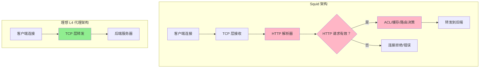
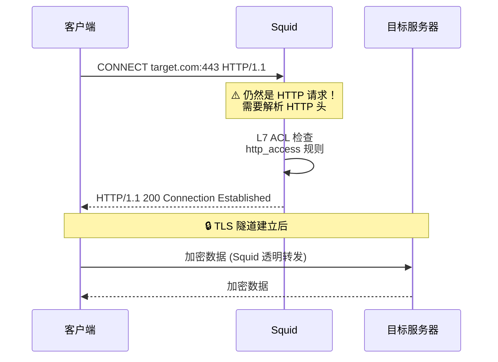
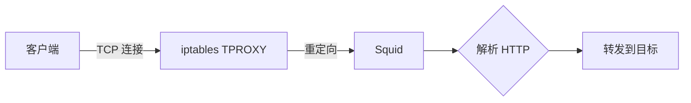
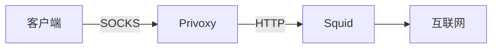
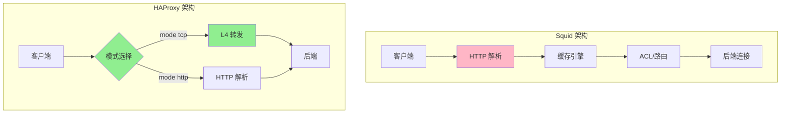
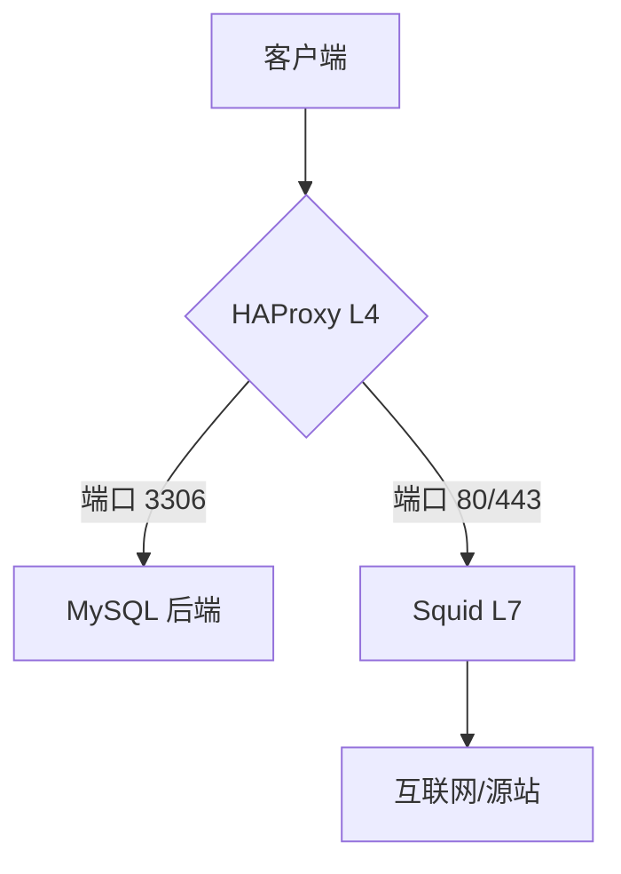
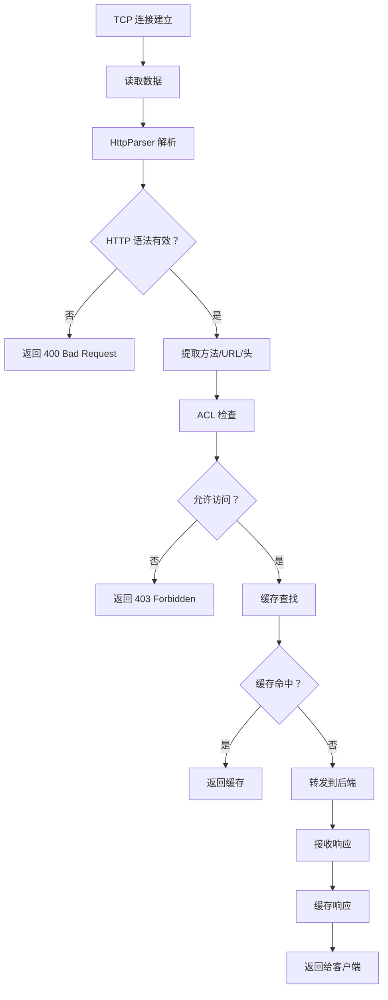
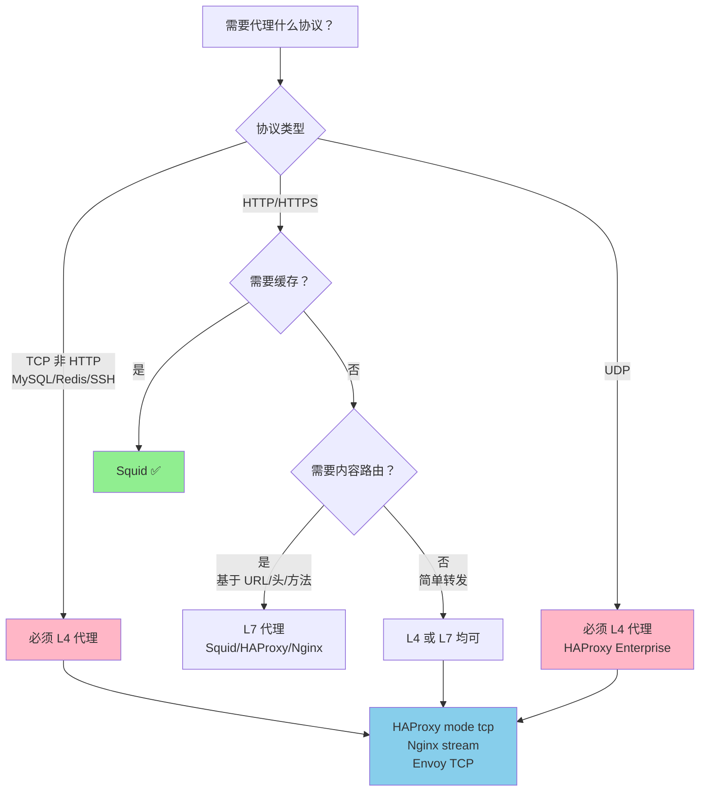
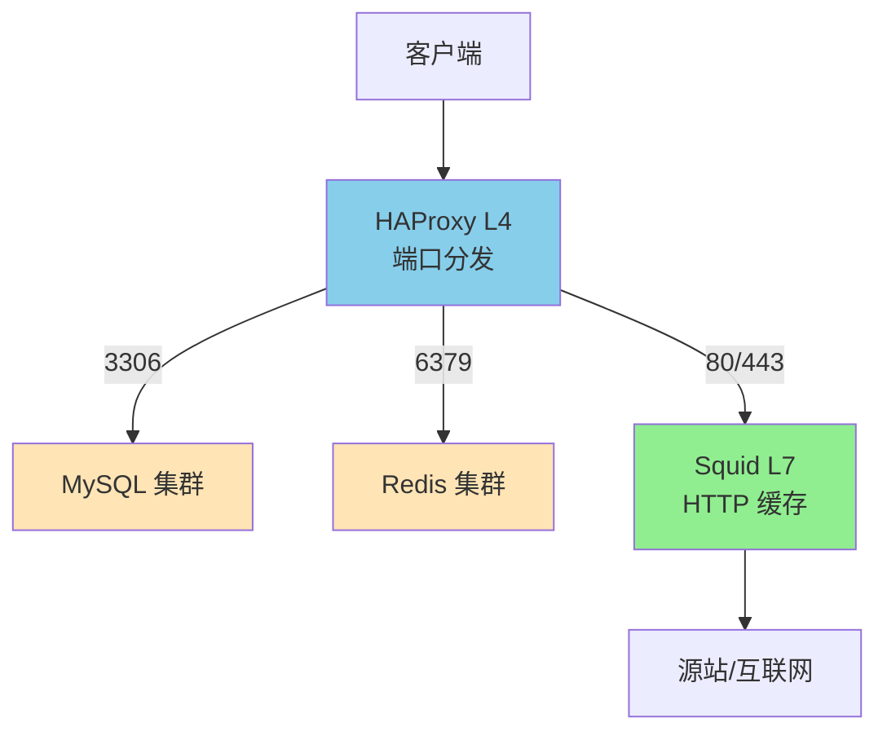

# Squid 能否作为 L4 代理使用？深度探索

## 核心结论

**Squid 不能作为纯 L4（四层）代理使用。**

Squid 从架构设计上就是一个 **HTTP 应用层代理**，它必须解析 HTTP 协议才能工作。如果你需要 L4 代理，应该选择 HAProxy、Nginx stream 或其他专门的 L4 代理工具。

---

## 为什么 Squid 不能做 L4 代理？

### 1. 架构层面的限制



**关键差异**：
- Squid 必须经过 **HTTP 解析器**
- L4 代理直接 **TCP 层转发**，不关心应用层协议

### 2. 官方文档明确说明

根据 Squid 官方文档和 Wikipedia：

> "Squid is a caching and forwarding **HTTP web proxy**"
> 
> Squid 是一个缓存和转发的 **HTTP Web 代理**

**不支持的协议**：
- ❌ SOCKS 协议（官方明确不支持）
- ❌ 纯 TCP 转发
- ❌ UDP 流量

### 3. 代码层面的证据

```cpp
// Squid 源码架构简化示意
class HttpConnection {
    void parseRequest() {
        // 必须解析 HTTP 请求行
        // 必须解析 HTTP 头部
        // 验证 HTTP 协议合规性
    }
    
    void processRequest() {
        // 基于 HTTP 方法做决策
        // 基于 HTTP 头做缓存判断
        // 基于 URL 做路由
    }
};
```

Squid 的每个连接都必须经过 `parseRequest()`，这意味着：
- 非 HTTP 流量会被拒绝
- 无法做到"收到字节就转发"

---

## 实验验证：Squid 对非 HTTP 流量的反应

### 实验 1：发送纯 TCP 流量到 Squid

```bash
# 尝试用 netcat 发送原始 TCP 数据到 Squid
echo "Hello, this is not HTTP" | nc squid-server 3128

# Squid 的响应
# 连接会立即被关闭，或者收到 HTTP 错误响应
```

**预期结果**：
```
HTTP/1.1 400 Bad Request
Content-Type: text/html

<html>
<body>
<h1>Invalid Request</h1>
<p>Squid received a non-HTTP request</p>
</body>
</html>
```

### 实验 2：发送二进制协议到 Squid

```bash
# 尝试发送 MySQL 协议数据
mysql -h squid-server --port=3128 -u root -p

# 结果：连接被拒绝或协议错误
```

### 实验 3：正确的 L4 代理行为（HAProxy 对比）

```haproxy
# HAProxy TCP 模式配置
frontend mysql_tcp
    bind :3306
    mode tcp
    default_backend mysql_servers

backend mysql_servers
    mode tcp
    server mysql1 192.168.1.10:3306
```

```bash
# HAProxy 会直接转发所有 TCP 数据
mysql -h haproxy-server --port=3306 -u root -p
# ✅ 成功连接
```

---

## Squid 的"类 L4"功能探索

虽然 Squid 不能做纯 L4 代理，但它有一些**看似 L4** 的功能：

### 1. CONNECT 隧道（最接近 L4 的场景）



**关键点**：
- ✅ 隧道建立后，Squid 透明转发 TCP 数据
- ❌ **但隧道建立前必须经过 HTTP 解析**
- ❌ 无法用于非 HTTP 协议

### 2. TPROXY/Intercept 模式（透明代理）

```squid.conf
# Linux TPROXY 透明代理配置
http_port 3128 tproxy intercept

# ACL 基于 IP 做路由
acl localnet src 10.0.0.0/8
http_access allow localnet
```

**工作原理**：


**限制**：
- 仍然需要 HTTP 协议
- 只是"透明"，不是"L4"

### 3. PROXY Protocol 支持

```squid.conf
# 接收 HAProxy 传来的 PROXY 协议
http_port 3128 require-proxy-header

# 验证 PROXY 头
proxy_protocol_access allow localnet
```

**说明**：
- 这是为了接收 **L4 代理（如 HAProxy）** 传来的客户端 IP
- Squid 本身仍然是 L7 代理

---

## SOCKS 协议支持情况

### 官方状态

根据 Squid Wiki 的 [SOCKS Support](https://wiki.squid-cache.org/Features/Socks) 页面：

| 项目 | 状态 |
|------|------|
| 当前状态 | **Testing** (测试中) |
| 预计完成时间 | **未知** |
| 开发者 | Amos Jeffries |

### 当前变通方案

```bash
# 编译时启用 SOCKS（不推荐）
export CFLAGS=" -Dbind=SOCKSbind -Dconnect=SOCKSconnect "
export CXXFLAGS=" -Dbind=SOCKSbind -Dconnect=SOCKSconnect "
export LDADD=" -lsocks "
./configure && make && make install
```

**严重限制**：
- ❌ SOCKS 应用于**所有**连接
- ❌ 无法混合 SOCKS 和非 SOCKS 连接
- ❌ 分支代码存在但未合并到主线

### 官方建议

> "Squid does not support the SOCKS protocol, unlike Privoxy, with which Squid can be used in order to provide SOCKS support."
> 
> Squid 不支持 SOCKS 协议，但可以与 Privoxy 配合使用来提供 SOCKS 支持。

**推荐架构**：


---

## Squid vs HAProxy：L4/L7 能力对比

### 功能对比表

| 功能 | Squid | HAProxy |
|------|-------|---------|
| **HTTP 正向代理** | ✅ 专业 | ⚠️ 有限支持 |
| **HTTP 反向代理** | ✅ | ✅ 专业 |
| **L4 TCP 代理** | ❌ | ✅ |
| **L4 UDP 代理** | ❌ | ✅ (HAProxy Enterprise) |
| **SOCKS 代理** | ❌ | ⚠️ 有限支持 |
| **HTTP 缓存** | ✅ 专业 | ❌ |
| **基于 URL 路由** | ✅ | ✅ |
| **基于 IP/Port 路由** | ⚠️ (需 HTTP) | ✅ 原生 |
| **数据库负载均衡** | ❌ | ✅ |
| **SSL 终止** | ⚠️ 有限 | ✅ 专业 |
| **SNI 路由** | ❌ | ✅ |
| **健康检查** | ⚠️ HTTP | ✅ TCP+HTTP |

### 架构对比



---

## 实际场景：什么时候选择什么工具

### 场景 1：需要 L4 代理

**需求**：
```
客户端 --> 代理 --> MySQL 数据库 (端口 3306)
```

**❌ Squid 方案**：不可行
```squid.conf
# 这样的配置不存在
tcp_port 3306  # Squid 不支持
```

**✅ HAProxy 方案**：
```haproxy
frontend mysql
    bind :3306
    mode tcp
    default_backend mysql_servers

backend mysql_servers
    mode tcp
    balance leastconn
    server db1 192.168.1.10:3306 check
    server db2 192.168.1.11:3306 check
```

### 场景 2：需要 HTTP 缓存 + 正向代理

**需求**：
```
客户端 --> 代理 --> 互联网 (缓存热门内容)
```

**✅ Squid 方案**（推荐）：
```squid.conf
http_port 3128
cache_dir ufs /var/spool/squid 10000 16 256
cache_mem 512 MB
refresh_pattern . 0 20% 4320
```

**⚠️ HAProxy 方案**：不推荐（无缓存功能）

### 场景 3：混合需求（L4 + L7）

**需求**：
```
- 数据库流量 (L4)
- Web 流量 (L7 + 缓存)
```

**✅ 组合架构**：


**配置示例**：

```haproxy
# HAProxy 配置
frontend multi_protocol
    bind :3306
    mode tcp
    default_backend mysql

    bind :80
    mode tcp  # TCP 模式转发给 Squid
    default_backend squid

backend mysql
    mode tcp
    server db1 192.168.1.10:3306

backend squid
    mode tcp
    server squid1 192.168.1.20:3128
```

```squid.conf
# Squid 配置
http_port 3128
# ... HTTP 代理配置
```

---

## 为什么会有"Squid 可以做 L4"的误解？

### 误解来源 1：CONNECT 隧道

```bash
curl -x squid:3128 https://example.com
```

**误解**：
> "Squid 在转发 HTTPS 流量时不做解密，所以它是 L4 代理"

**事实**：
- CONNECT 方法本身是 **HTTP 请求**（L7）
- Squid 在建立隧道前做了完整的 **HTTP 解析和 ACL 检查**
- 隧道建立后是 L4 转发，但**整体架构是 L7**

### 误解来源 2：透明代理

**误解**：
> "透明代理不修改请求，所以是 L4"

**事实**：
- 透明代理只是**客户端无感知**
- Squid 仍然解析 HTTP 协议
- 仍然做缓存、ACL、路由等 L7 操作

### 误解来源 3：PROXY Protocol

**误解**：
> "Squid 支持 PROXY Protocol，所以可以做 L4"

**事实**：
- PROXY Protocol 是**L4 代理传给 L7 代理**的协议
- Squid 是**接收端**，不是发送端
- 目的是保留客户端 IP，不是做 L4 转发

---

## 技术深度：Squid 的 HTTP 解析流程

### 请求处理流水线



### 关键代码路径（简化）

```cpp
// Squid 源码简化示意
void
HttpConnection::processRequest()
{
    // 1. 解析 HTTP 请求
    HttpRequestParser parser;
    parser.parse(buffer);  // 必须解析 HTTP
    
    // 2. 验证请求
    if (!parser.isValid()) {
        sendError("400 Bad Request");
        return;
    }
    
    // 3. 提取 HTTP 信息
    HttpMethod method = parser.getMethod();      // GET/POST/CONNECT
    SBuf url = parser.getUrl();                  // http://...
    HttpHeader headers = parser.getHeaders();    // Host, User-Agent, etc.
    
    // 4. 基于 HTTP 信息做决策
    if (aclCheck(method, url, headers)) {
        forwardToBackend(method, url, headers);
    } else {
        sendError("403 Forbidden");
    }
}
```

**关键点**：
- `parser.parse()` 是**必须**的步骤
- 无法跳过 HTTP 解析直接转发 TCP

---

## 替代方案：真正的 L4 代理工具

### 1. HAProxy（推荐）

```haproxy
# 纯 L4 TCP 代理
frontend tcp_proxy
    bind :8080
    mode tcp
    tcp-request connection accept if { src 10.0.0.0/8 }
    default_backend tcp_servers

backend tcp_servers
    mode tcp
    balance leastconn
    server srv1 192.168.1.10:8080 check
    server srv2 192.168.1.11:8080 check
```

**特点**：
- ✅ 真正的 L4 代理
- ✅ 支持 L7（mode http）
- ✅ 高性能
- ✅ 健康检查
- ❌ 无缓存功能

### 2. Nginx Stream 模块

```nginx
# L4 TCP 代理
stream {
    upstream backend {
        server 192.168.1.10:8080;
        server 192.168.1.11:8080;
    }

    server {
        listen 8080;
        proxy_pass backend;
        proxy_timeout 1s;
        proxy_connect_timeout 500ms;
    }
}
```

**特点**：
- ✅ L4 代理
- ✅ 与 HTTP 配置统一管理
- ✅ 高性能
- ❌ 无缓存

### 3. Envoy Proxy

```yaml
# Envoy L4 监听器
static_resources:
  listeners:
  - name: tcp_listener
    address:
      socket_address: { address: 0.0.0.0, port_value: 8080 }
    filter_chains:
    - filters:
      - name: envoy.filters.network.tcp_proxy
        typed_config:
          "@type": type.googleapis.com/envoy.extensions.filters.network.tcp_proxy.v3.TcpProxy
          cluster: backend_cluster

  clusters:
  - name: backend_cluster
    connect_timeout: 5s
    type: STRICT_DNS
    lb_policy: ROUND_ROBIN
    load_assignment:
      cluster_name: backend_cluster
      endpoints:
      - lb_endpoints:
        - endpoint:
            address:
              socket_address: { address: 192.168.1.10, port_value: 8080 }
```

**特点**：
- ✅ L4 + L7
- ✅ 现代架构
- ✅ 可观测性强
- ⚠️ 配置复杂

### 4. 简单工具（一次性/临时使用）

```bash
# socat - 简单 TCP 转发
socat TCP-LISTEN:8080,fork TCP:192.168.1.10:8080

# iptables - NAT 转发
iptables -t nat -A PREROUTING -p tcp --dport 8080 -j DNAT --to-destination 192.168.1.10:8080

# nginx stream
# 见上方配置
```

---

## 决策树：选择 L4 还是 L7 代理



---

## 总结

### Squid 不能做 L4 代理的原因

| 原因 | 说明 |
|------|------|
| **架构设计** | 必须解析 HTTP 协议才能工作 |
| **代码实现** | 每个连接都经过 HttpParser |
| **官方定位** | "HTTP web proxy" |
| **协议支持** | 不支持 SOCKS、纯 TCP、UDP |

### 如果你的需求是...

| 需求 | 推荐方案 |
|------|----------|
| HTTP 正向代理 + 缓存 | ✅ Squid |
| HTTP 反向代理 | ✅ Nginx / HAProxy |
| L4 TCP 代理 | ✅ HAProxy (mode tcp) |
| L4 + L7 混合 | ✅ HAProxy + Squid 组合 |
| SOCKS 代理 | ✅ Privoxy / Dante |
| 数据库负载均衡 | ✅ HAProxy / ProxySQL |

### 最佳实践架构



**这个架构**：
- HAProxy 做 L4 端口分发
- 非 HTTP 流量直接到后端
- HTTP 流量到 Squid 做缓存和代理
- 各司其职，发挥各自优势

---

## 参考资料

1. [Squid 官方文档 - http_port](https://www.squid-cache.org/Doc/config/http_port/)
2. [Squid Wiki - SOCKS Support](https://wiki.squid-cache.org/Features/Socks)
3. [HAProxy 配置手册 - TCP 模式](http://docs.haproxy.org/3.3/configuration.html)
4. [HAProxy Blog - L4 vs L7 Proxy Mode](https://www.haproxy.com/blog/layer-4-and-layer-7-proxy-mode)
5. [Wikipedia - Squid (software)](https://en.wikipedia.org/wiki/Squid_(software))

---

**文档版本**: 1.0
**最后更新**: 2026-02-26
**作者**: 基于实际调研和官方文档
