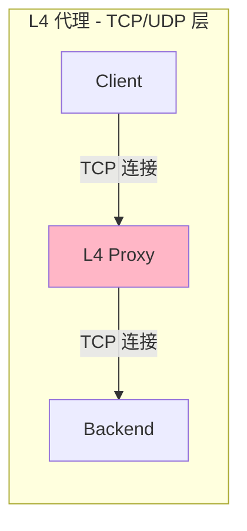
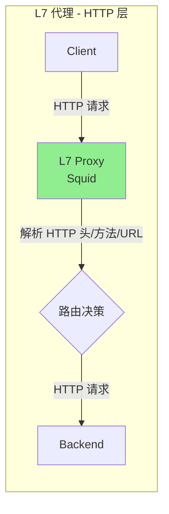
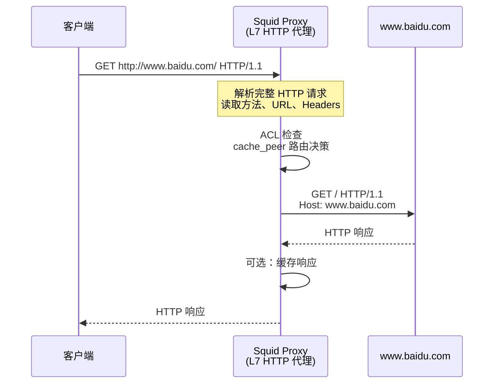
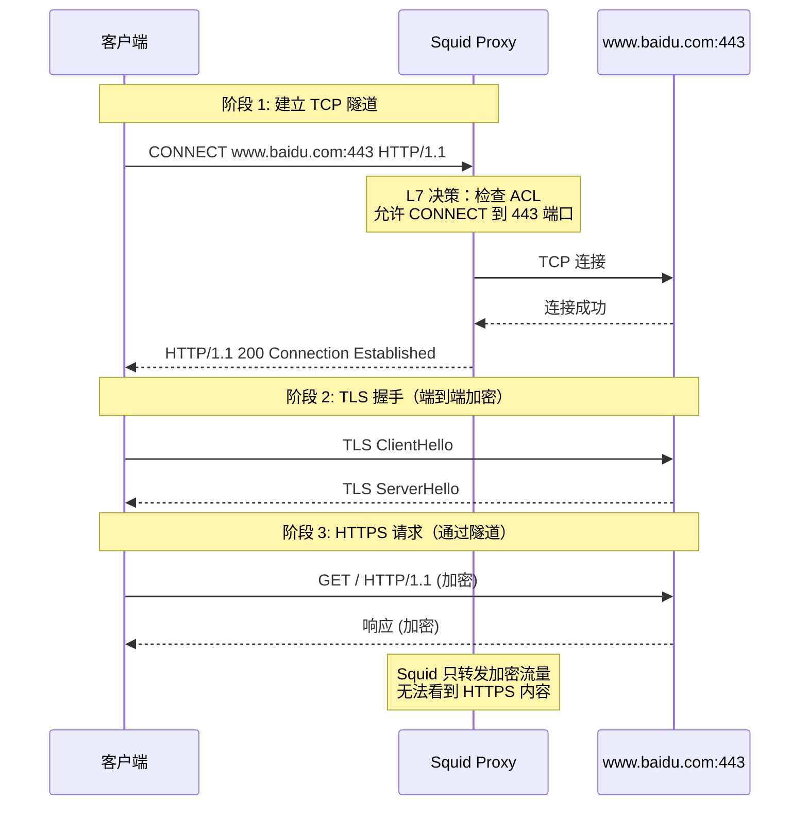
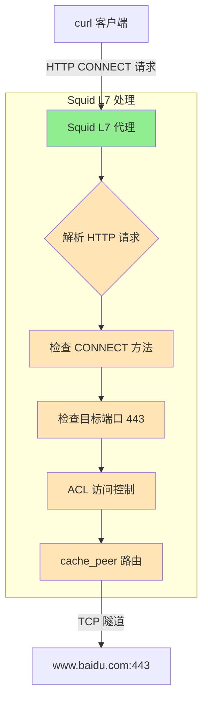
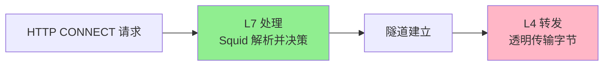
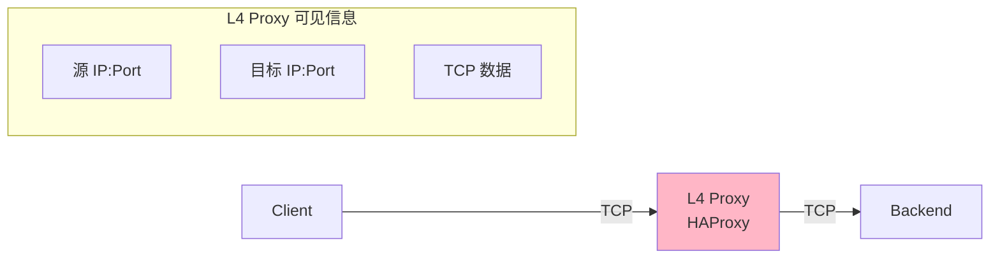
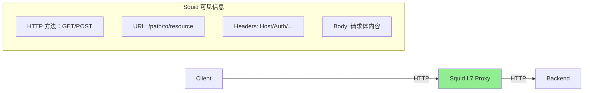

# Squid 是 L4 还是 L7 代理？

## 核心结论

**Squid 是一个 L7（应用层）HTTP 代理服务器**，它不理解 L4（传输层）代理的概念。

---

## 问题背景

当你执行以下命令时：

```bash
curl -x squid.proxy.abc.com:3128 https://www.baidu.com
```

这个代理是**正向代理（Forward Proxy）**，但它工作在 **OSI 七层模型的第 7 层（应用层）**。

---

## L4 代理 vs L7 代理的区别

### L4 代理（传输层代理）



**特点**：
- 只处理 TCP/UDP 连接
- **不理解** HTTP 协议
- 无法解析 HTTP 请求头、方法、URL
- 无法基于 HTTP 内容做路由决策
- 典型代表：HAProxy (TCP 模式)、Nginx (stream 模块)、iptables

**配置示例（HAProxy L4）**：
```haproxy
frontend tcp_front
    bind *:3128
    mode tcp
    default_backend tcp_back

backend tcp_back
    mode tcp
    server backend1 10.0.0.1:443
```

### L7 代理（应用层代理）



**特点**：
- 完整解析 HTTP/HTTPS 协议
- 可以理解请求方法（GET、POST、CONNECT 等）
- 可以读取和修改 HTTP 请求头
- 可以基于 URL、域名、方法做路由
- 支持缓存、认证、内容过滤
- 典型代表：Squid、Nginx (HTTP 模式)、Kong

---

## Squid 的工作原理

### HTTP 正向代理模式



### HTTPS 代理模式（CONNECT 隧道）



**关键点**：
- CONNECT 方法本身是 **L7 HTTP 请求**
- Squid 在建立隧道前会进行 **L7 ACL 检查**
- 隧道建立后，Squid 变成 **透明的 TCP 转发器**
- 但整体架构仍然是 **L7 代理**

---

## 为什么 Squid 不是 L4 代理？

### 1. 协议理解

|特性|L4 代理|Squid (L7)|
|---|---|---|
|理解 TCP/UDP|✅|✅|
|理解 HTTP 协议|❌|✅|
|解析 HTTP 方法|❌|✅ (GET/POST/CONNECT)|
|读取 HTTP 头|❌|✅ (Host/Authorization 等)|
|基于 URL 路由|❌|✅ (dstdomain/url_regex)|

### 2. Squid 的 L7 配置示例

```squid.conf
# ACL 基于 L7 信息
acl allowed_domains dstdomain .baidu.com .google.com
acl allowed_methods method GET POST
acl blocked_urls url_regex -i \.(exe|zip|rar)$
acl ssl_ports port 443

# 基于 L7 的访问控制
http_access allow allowed_domains
http_access deny blocked_urls
http_access allow CONNECT ssl_ports

# 基于域名的路由
cache_peer parent-proxy.example.com parent 3128 0
cache_peer_access parent-proxy.example.com allow allowed_domains
```

### 3. L4 代理无法实现的功能

Squid 作为 L7 代理可以实现：

```squid.conf
# 1. 基于 HTTP 方法的控制
acl upload_requests method POST PUT
request_body_max_size 100 MB upload_requests

# 2. 基于请求头的路由
acl has_auth req_header Authorization -i ^Bearer
http_access allow has_auth

# 3. 基于域名的缓存策略
refresh_pattern -i \.googleapis\.com 1440 50% 10080

# 4. 基于 URL 的内容过滤
acl blocked_sites dstdomain .facebook.com .twitter.com
http_access deny blocked_sites

# 5. X-Forwarded-For 头部处理
forwarded_for on
request_header_access X-Forwarded-For deny all
```

**这些功能 L4 代理都无法实现**。

---

## 你的场景分析

### 请求流程

```bash
curl -x squid.proxy.abc.com:3128 https://www.baidu.com
```



### 关键点

1. **curl 与 Squid 之间**：HTTP 协议（L7）
   - curl 发送 `CONNECT www.baidu.com:443 HTTP/1.1`
   - Squid 解析这个 HTTP 请求

2. **Squid 的决策过程**：L7 处理
   - 检查 `acl CONNECT method CONNECT`
   - 检查 `acl SSL_ports port 443`
   - 检查 `http_access` 规则
   - 查找 `cache_peer` 路由配置

3. **Squid 与目标之间**：TCP 隧道（L4）
   - 隧道建立后，Squid 只转发字节
   - 但这是 **L7 决策后的结果**

---

## 常见误解澄清

### 误解 1："正向代理就是 L4"

**错误**。正向/反向代理是**部署模式**，L4/L7 是**工作层级**：

|维度|正向代理|反向代理|
|---|---|---|
|定义|代表客户端访问外部|代表服务器接收请求|
|工作层级|可以是 L4 或 L7|可以是 L4 或 L7|
|例子|Squid (L7)、SOCKS (L5)|Nginx (L7)、HAProxy (L4/L7)|

### 误解 2："CONNECT 隧道就是 L4"

**不完全正确**。CONNECT 隧道的工作流程：



- **隧道建立前**：L7 HTTP 处理
- **隧道建立后**：L4 TCP 转发
- **整体架构**：L7 代理（因为决策在 L7）

### 误解 3："Squid 可以配置成 L4"

**错误**。Squid 的设计就是 HTTP 代理：

```squid.conf
# Squid 只能监听 HTTP 端口
http_port 3128
https_port 3129 cert=... key=...

# 没有类似这样的配置
# tcp_port 3128  ❌ Squid 不支持
```

如果需要 L4 代理，应该使用：
- HAProxy (mode tcp)
- Nginx (stream 模块)
- iptables
- socat

---

## 架构对比

### 纯 L4 代理架构



### Squid L7 代理架构



---

## 何时选择 L4 vs L7

### 选择 L4 代理的场景

|需求|推荐方案|
|---|---|
|高性能 TCP 转发|HAProxy (mode tcp)|
|TLS 终止（不关心 HTTP）|Nginx stream + SSL|
|数据库代理|HAProxy / ProxySQL|
|简单端口转发|iptables / socat|

### 选择 L7 代理（Squid）的场景

|需求|推荐方案|
|---|---|
|HTTP 缓存|Squid|
|基于 URL 的路由|Squid (cache_peer)|
|内容过滤|Squid (ACL)|
|正向代理|Squid|
|基于请求头的认证|Squid + ICAP|

---

## 总结

### 关于你的问题

> "Squid 做正向代理的时候，是理解为四层还是七层？"

**答案：七层（L7）HTTP 代理**

### 关键要点

1. **Squid 永远是 L7 代理**，无论正向还是反向模式
2. **CONNECT 隧道**是 L7 决策后的 L4 转发
3. **正向代理**是部署模式，不是工作层级
4. **L4 代理无法理解 HTTP**，Squid 的核心功能都依赖 HTTP 理解

### 你的命令解析

```bash
curl -x squid.proxy.abc.com:3128 https://www.baidu.com
```

|阶段|协议|层级|Squid 行为|
|---|---|---|---|
|curl → Squid|HTTP CONNECT|L7|解析请求、ACL 检查、路由决策|
|Squid → 百度|TCP 隧道|L4|透明转发加密字节|
|整体架构|HTTP 代理|L7|基于 HTTP 理解的代理服务|

---

## 参考配置

### Squid 最小正向代理配置

```squid.conf
# L7 HTTP 代理监听
http_port 3128

# L7 ACL 定义
acl localnet src 10.0.0.0/8
acl SSL_ports port 443
acl CONNECT method CONNECT

# L7 访问控制
http_access allow localnet
http_access allow CONNECT SSL_ports
http_access deny all

# L7 路由（可选）
cache_peer parent.example.com parent 3128 0
cache_peer_access parent.example.com allow localnet
```

### 如果需要 L4 代理

使用 HAProxy 代替 Squid：

```haproxy
# L4 TCP 代理
frontend tcp_proxy
    bind *:3128
    mode tcp
    default_backend tcp_servers

backend tcp_servers
    mode tcp
    balance roundrobin
    server backend1 10.0.0.1:443
```

---

**文档版本**: 1.0
**最后更新**: 2026-02-26
