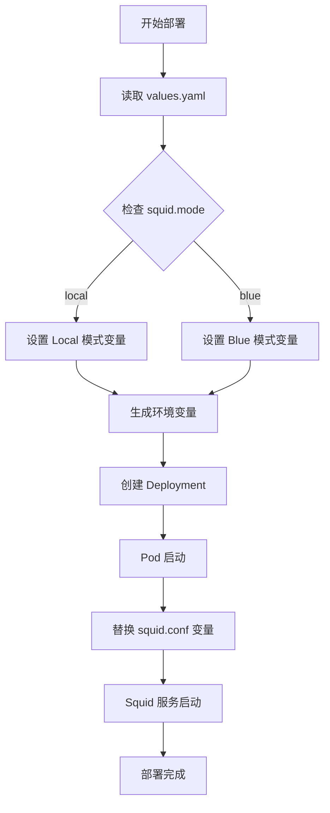

# Squid 多配置部署最佳实践

## 问题背景

当前 Squid 部署面临的挑战：
- 现有 squid.conf 大部分内容写死，通过环境变量替换部分参数
- 需要支持两种不同的代理配置模式：
  - **模式1（原有）**: `{{ENV}}-proxy.aliyun.cloud.{{REGION}}.local:3128`
  - **模式2（新需求）**: `my_local.proxy.aibang:8080`

## 解决方案对比

### 方案1: InitContainer 模板渲染 ⭐️ 推荐

**优势**: 灵活、通用、保持配置模板化
**适用**: 配置差异较小，需要参数化控制

### 方案2: 多 ConfigMap 切换

**优势**: 简单直观，配置独立
**适用**: 配置差异较大，环境完全不同

### 方案3: 条件配置脚本

**优势**: 运行时动态选择
**适用**: 需要根据运行时条件切换配置

## 推荐实现：InitContainer 模板渲染

### 1. ConfigMap 配置模板

```yaml
apiVersion: v1
kind: ConfigMap
metadata:
  name: squid-config-template
  namespace: proxy
data:
  squid.conf.tpl: |
    # Squid 基础配置
    http_port 3128
    
    # 访问控制
    acl app_proxy dstdomain ${TARGET_FQDN}
    
    # 代理配置 - 通过环境变量动态配置
    cache_peer ${CACHE_PEER_HOST} parent ${CACHE_PEER_PORT} 0
    cache_peer_access ${CACHE_PEER_HOST} allow app_proxy
    
    # 访问规则
    http_access allow app_proxy
    http_access deny all
    
    # 日志配置
    access_log /var/log/squid/access.log
    cache_log /var/log/squid/cache.log
```

### 2. Deployment 配置

```yaml
apiVersion: apps/v1
kind: Deployment
metadata:
  name: squid-proxy
  namespace: proxy
spec:
  replicas: 1
  selector:
    matchLabels:
      app: squid-proxy
  template:
    metadata:
      labels:
        app: squid-proxy
    spec:
      volumes:
        - name: squid-config-template
          configMap:
            name: squid-config-template
        - name: squid-config
          emptyDir: {}
        - name: squid-logs
          emptyDir: {}
      
      initContainers:
        - name: config-renderer
          image: alpine:3.20
          command:
            - sh
            - -c
            - |
              echo "开始渲染 Squid 配置..."
              apk add --no-cache gettext
              envsubst < /templates/squid.conf.tpl > /config/squid.conf
              echo "==== 生成的配置文件 ===="
              cat /config/squid.conf
              echo "==== 配置渲染完成 ===="
          env:
            - name: TARGET_FQDN
              value: "${TARGET_FQDN}"
            - name: CACHE_PEER_HOST
              value: "${CACHE_PEER_HOST}"
            - name: CACHE_PEER_PORT
              value: "${CACHE_PEER_PORT}"
          volumeMounts:
            - name: squid-config-template
              mountPath: /templates
            - name: squid-config
              mountPath: /config
      
      containers:
        - name: squid
          image: sameersbn/squid:3.5.27-2
          ports:
            - containerPort: 3128
              name: proxy
          env:
            - name: SQUID_CONFIG_FILE
              value: "/etc/squid/squid.conf"
          volumeMounts:
            - name: squid-config
              mountPath: /etc/squid/squid.conf
              subPath: squid.conf
            - name: squid-logs
              mountPath: /var/log/squid
          resources:
            requests:
              memory: "256Mi"
              cpu: "100m"
            limits:
              memory: "512Mi"
              cpu: "500m"
```

### 3. 环境配置示例

#### 模式1：GCP 代理配置

```yaml
# kustomization.yaml 或 values.yaml
env:
  - name: TARGET_FQDN
    value: "example.com"
  - name: CACHE_PEER_HOST
    value: "prd-proxy.aliyun.cloud.us-central1.local"
  - name: CACHE_PEER_PORT
    value: "3128"
```

#### 模式2：本地代理配置

```yaml
env:
  - name: TARGET_FQDN
    value: "example.com"
  - name: CACHE_PEER_HOST
    value: "my_local.proxy.aibang"
  - name: CACHE_PEER_PORT
    value: "8080"
```

## 部署流程

### 1. 创建 ConfigMap

```bash
kubectl apply -f squid-configmap.yaml
```

### 2. 部署 Squid

```bash
# 模式1 - GCP 代理
kubectl set env deployment/squid-proxy \
  TARGET_FQDN=example.com \
  CACHE_PEER_HOST=prd-proxy.aliyun.cloud.us-central1.local \
  CACHE_PEER_PORT=3128

# 模式2 - 本地代理  
kubectl set env deployment/squid-proxy \
  TARGET_FQDN=example.com \
  CACHE_PEER_HOST=my_local.proxy.aibang \
  CACHE_PEER_PORT=8080
```

### 3. 验证配置

```bash
# 查看生成的配置
kubectl logs deployment/squid-proxy -c config-renderer

# 测试代理连接
kubectl exec -it deployment/squid-proxy -- curl -x localhost:3128 http://example.com
```

## 高级用法

### 使用 Helm Chart 管理

```yaml
# values.yaml
squid:
  config:
    targetFqdn: "example.com"
    cachePeer:
      host: "{{ .Values.environment }}-proxy.aliyun.cloud.{{ .Values.region }}.local"
      port: 3128
  
  # 环境特定覆盖
  environments:
    local:
      cachePeer:
        host: "my_local.proxy.aibang"
        port: 8080
```

### 使用 Kustomize 管理

```yaml
# base/kustomization.yaml
resources:
  - squid-configmap.yaml
  - squid-deployment.yaml

# overlays/local/kustomization.yaml
bases:
  - ../../base

patchesStrategicMerge:
  - squid-env-patch.yaml
```

## 最佳实践建议

1. **配置验证**: 在 InitContainer 中添加配置语法检查
2. **日志管理**: 统一日志收集和监控
3. **健康检查**: 添加 readiness 和 liveness 探针
4. **安全考虑**: 使用 Secret 管理敏感配置
5. **版本管理**: 通过 Git 管理配置模板版本

## 故障排查

### 常见问题

1. **配置渲染失败**
   ```bash
   kubectl logs deployment/squid-proxy -c config-renderer
   ```

2. **Squid 启动失败**
   ```bash
   kubectl describe pod <squid-pod>
   kubectl logs <squid-pod> -c squid
   ```

3. **代理连接问题**
   ```bash
   kubectl exec -it <squid-pod> -- squid -k check
   ```

## 总结

这个方案的核心优势：
- ✅ 保持原有配置模板不变
- ✅ 通过环境变量灵活切换配置
- ✅ 支持多环境部署
- ✅ 配置变更可追踪
- ✅ 易于 CI/CD 集成

通过 InitContainer 模板渲染的方式，既保持了配置的灵活性，又避免了维护多个配置文件的复杂性。
## 基于
现有 Helm Chart 的配置方案

### 当前部署方式分析

基于你提供的 Helm 安装命令：
```bash
helm upgrade --install $namespace-${e%-*}-${proxy_code} ./charts \
  -f $proxy_value_yaml_path \
  --set proxy.name=${proxy_code} \
  --set targetFQDN.name="target_fqdn"
```

### 方案：扩展 values.yaml 支持多配置模式

#### 1. 增强版 values.yaml 结构

```yaml
# values.yaml
proxy:
  name: "default-proxy"
  # 新增：配置模式选择
  configMode: "gcp"  # 可选值: "gcp", "local", "custom"
  
  # 原有配置保持兼容
  image:
    repository: "your-squid-image"
    tag: "latest"
  
  # 新增：多模式配置定义
  configs:
    gcp:
      cachePeer:
        host: "{{ .Values.env }}-proxy.aliyun.cloud.{{ .Values.region }}.local"
        port: 3128
    local:
      cachePeer:
        host: "my_local.proxy.aibang"
        port: 8080
    custom:
      cachePeer:
        host: "{{ .Values.proxy.customPeer.host }}"
        port: "{{ .Values.proxy.customPeer.port }}"
  
  # 自定义配置支持
  customPeer:
    host: ""
    port: 3128

# 原有配置保持不变
targetFQDN:
  name: "example.com"

env: "prd"
region: "us-central1"

# 新增：配置模板开关
useConfigTemplate: true
```

#### 2. 修改 Helm Template (deployment.yaml)

```yaml
# templates/deployment.yaml
apiVersion: apps/v1
kind: Deployment
metadata:
  name: {{ .Values.proxy.name }}
spec:
  template:
    spec:
      {{- if .Values.useConfigTemplate }}
      volumes:
        - name: squid-config-template
          configMap:
            name: {{ .Values.proxy.name }}-config-template
        - name: squid-config
          emptyDir: {}
      
      initContainers:
        - name: config-renderer
          image: alpine:3.20
          command:
            - sh
            - -c
            - |
              echo "渲染 Squid 配置 - 模式: {{ .Values.proxy.configMode }}"
              apk add --no-cache gettext
              envsubst < /templates/squid.conf.tpl > /config/squid.conf
              echo "==== 生成的配置 ===="
              cat /config/squid.conf
          env:
            - name: TARGET_FQDN
              value: "{{ .Values.targetFQDN.name }}"
            - name: CACHE_PEER_HOST
              {{- if eq .Values.proxy.configMode "gcp" }}
              value: "{{ .Values.env }}-proxy.aliyun.cloud.{{ .Values.region }}.local"
              {{- else if eq .Values.proxy.configMode "local" }}
              value: "{{ .Values.proxy.configs.local.cachePeer.host }}"
              {{- else if eq .Values.proxy.configMode "custom" }}
              value: "{{ .Values.proxy.customPeer.host }}"
              {{- end }}
            - name: CACHE_PEER_PORT
              {{- if eq .Values.proxy.configMode "gcp" }}
              value: "{{ .Values.proxy.configs.gcp.cachePeer.port }}"
              {{- else if eq .Values.proxy.configMode "local" }}
              value: "{{ .Values.proxy.configs.local.cachePeer.port }}"
              {{- else if eq .Values.proxy.configMode "custom" }}
              value: "{{ .Values.proxy.customPeer.port }}"
              {{- end }}
          volumeMounts:
            - name: squid-config-template
              mountPath: /templates
            - name: squid-config
              mountPath: /config
      {{- end }}
      
      containers:
        - name: squid
          image: {{ .Values.proxy.image.repository }}:{{ .Values.proxy.image.tag }}
          {{- if .Values.useConfigTemplate }}
          volumeMounts:
            - name: squid-config
              mountPath: /etc/squid/squid.conf
              subPath: squid.conf
          {{- end }}
```

#### 3. ConfigMap Template

```yaml
# templates/configmap.yaml
{{- if .Values.useConfigTemplate }}
apiVersion: v1
kind: ConfigMap
metadata:
  name: {{ .Values.proxy.name }}-config-template
data:
  squid.conf.tpl: |
    http_port 3128
    
    acl app_proxy dstdomain ${TARGET_FQDN}
    
    cache_peer ${CACHE_PEER_HOST} parent ${CACHE_PEER_PORT} 0
    cache_peer_access ${CACHE_PEER_HOST} allow app_proxy
    
    http_access allow app_proxy
    http_access deny all
    
    access_log /var/log/squid/access.log
    cache_log /var/log/squid/cache.log
{{- end }}
```

### 部署使用方式

#### 方式1：通过 values.yaml 文件配置

**GCP 模式 (values-gcp.yaml)**:
```yaml
proxy:
  configMode: "gcp"
env: "prd"
region: "us-central1"
```

**本地模式 (values-local.yaml)**:
```yaml
proxy:
  configMode: "local"
```

**自定义模式 (values-custom.yaml)**:
```yaml
proxy:
  configMode: "custom"
  customPeer:
    host: "custom.proxy.example.com"
    port: 8080
```

#### 方式2：通过命令行参数覆盖

```bash
# GCP 模式部署
helm upgrade --install $namespace-${e%-*}-${proxy_code} ./charts \
  -f $proxy_value_yaml_path \
  --set proxy.name=${proxy_code} \
  --set targetFQDN.name="target_fqdn" \
  --set proxy.configMode="gcp" \
  --set env="prd" \
  --set region="us-central1"

# 本地模式部署
helm upgrade --install $namespace-${e%-*}-${proxy_code} ./charts \
  -f $proxy_value_yaml_path \
  --set proxy.name=${proxy_code} \
  --set targetFQDN.name="target_fqdn" \
  --set proxy.configMode="local"

# 自定义模式部署
helm upgrade --install $namespace-${e%-*}-${proxy_code} ./charts \
  -f $proxy_value_yaml_path \
  --set proxy.name=${proxy_code} \
  --set targetFQDN.name="target_fqdn" \
  --set proxy.configMode="custom" \
  --set proxy.customPeer.host="my_local.proxy.aibang" \
  --set proxy.customPeer.port="8080"
```

### 环境特定的 values 文件

你可以为不同环境创建专门的 values 文件：

**values-prod-gcp.yaml**:
```yaml
proxy:
  configMode: "gcp"
env: "prd"
region: "us-central1"
useConfigTemplate: true
```

**values-dev-local.yaml**:
```yaml
proxy:
  configMode: "local"
useConfigTemplate: true
```

### 向后兼容性

为了保持向后兼容，你可以添加一个开关：

```yaml
# 在 values.yaml 中
useConfigTemplate: false  # 设为 false 使用原有配置方式
```

当 `useConfigTemplate: false` 时，Helm chart 会使用原有的配置方式，不会创建 ConfigMap 和 InitContainer。

### 部署脚本示例

```bash
#!/bin/bash

NAMESPACE=$1
ENV=$2
PROXY_CODE=$3
CONFIG_MODE=${4:-"gcp"}  # 默认使用 gcp 模式

case $CONFIG_MODE in
  "gcp")
    VALUES_FILE="values-gcp.yaml"
    ;;
  "local")
    VALUES_FILE="values-local.yaml"
    ;;
  "custom")
    VALUES_FILE="values-custom.yaml"
    ;;
  *)
    echo "不支持的配置模式: $CONFIG_MODE"
    exit 1
    ;;
esac

helm upgrade --install $NAMESPACE-${ENV%-*}-${PROXY_CODE} ./charts \
  -f $VALUES_FILE \
  --set proxy.name=${PROXY_CODE} \
  --set targetFQDN.name="target_fqdn" \
  --set proxy.configMode=${CONFIG_MODE}
```

### 优势总结

1. **完全向后兼容** - 原有部署方式不受影响
2. **灵活配置** - 支持通过 values.yaml 或命令行参数切换模式
3. **环境隔离** - 不同环境可以使用不同的配置文件
4. **易于维护** - 所有配置逻辑集中在 Helm templates 中
5. **CI/CD 友好** - 可以轻松集成到现有的部署流程

这样你就可以在不改变现有部署命令结构的情况下，通过简单的参数调整来支持多种配置模式。#
# 简化方案：直接扩展 squid.conf 变量

### 问题分析

你希望：
1. 保持现有的 Helm 部署方式不变
2. 在 squid.conf 中增加 `{{HOST}}` 和 `{{PORT}}` 变量
3. 通过 values.yaml 支持两种默认配置：
   - **local 模式**（原有）：使用 `{{ENV}}-proxy.aliyun.cloud.{{REGION}}.local:3128`
   - **Blue 模式**（新增）：使用自定义的 `{{HOST}}:{{PORT}}`

### 解决方案

#### 1. 修改 squid.conf 模板

```bash
# squid.conf (在你的镜像中或 ConfigMap 中)
http_port 3128

acl app_proxy dstdomain {{TARGET_FQDN}}

# 使用新的变量替代硬编码
cache_peer {{HOST}} parent {{PORT}} 0
cache_peer_access {{HOST}} allow app_proxy

http_access allow app_proxy
http_access deny all

access_log /var/log/squid/access.log
cache_log /var/log/squid/cache.log
```

#### 2. 增强 values.yaml 配置

```yaml
# values.yaml
proxy:
  name: "default-proxy"
  mode: "local"  # 可选值: "local", "blue"
  
  # 原有变量保持不变
  env: "prd"
  region: "us-central1"
  targetFQDN: "example.com"
  
  # 新增：预定义配置模式
  modes:
    local:
      host: "{{ENV}}-proxy.aliyun.cloud.{{REGION}}.local"
      port: "3128"
    blue:
      host: "my_local.proxy.aibang"
      port: "8080"
  
  # 可选：完全自定义模式
  custom:
    host: ""
    port: ""

# 向后兼容
targetFQDN:
  name: "example.com"
```

#### 3. 修改 Deployment Template

```yaml
# templates/deployment.yaml
apiVersion: apps/v1
kind: Deployment
metadata:
  name: {{ .Values.proxy.name }}
spec:
  template:
    spec:
      containers:
        - name: squid
          image: {{ .Values.proxy.image.repository }}:{{ .Values.proxy.image.tag }}
          env:
            # 原有变量
            - name: TARGET_FQDN
              value: "{{ .Values.targetFQDN.name }}"
            - name: ENV
              value: "{{ .Values.proxy.env }}"
            - name: REGION
              value: "{{ .Values.proxy.region }}"
            
            # 新增变量 - 根据模式动态设置
            {{- if eq .Values.proxy.mode "local" }}
            - name: HOST
              value: "{{ .Values.proxy.env }}-proxy.aliyun.cloud.{{ .Values.proxy.region }}.local"
            - name: PORT
              value: "{{ .Values.proxy.modes.local.port }}"
            {{- else if eq .Values.proxy.mode "blue" }}
            - name: HOST
              value: "{{ .Values.proxy.modes.blue.host }}"
            - name: PORT
              value: "{{ .Values.proxy.modes.blue.port }}"
            {{- else if eq .Values.proxy.mode "custom" }}
            - name: HOST
              value: "{{ .Values.proxy.custom.host }}"
            - name: PORT
              value: "{{ .Values.proxy.custom.port }}"
            {{- end }}
```

### 部署使用方式

#### 方式1：通过 values 文件

**values-local.yaml** (原有 GCP 模式):
```yaml
proxy:
  mode: "local"
  env: "prd"
  region: "us-central1"
targetFQDN:
  name: "example.com"
```

**values-blue.yaml** (新的 Blue 模式):
```yaml
proxy:
  mode: "blue"
targetFQDN:
  name: "example.com"
```

#### 方式2：通过命令行参数

```bash
# Local 模式部署（原有方式）
helm upgrade --install $namespace-${e%-*}-${proxy_code} ./charts \
  -f $proxy_value_yaml_path \
  --set proxy.name=${proxy_code} \
  --set targetFQDN.name="target_fqdn" \
  --set proxy.mode="local" \
  --set proxy.env="prd" \
  --set proxy.region="us-central1"

# Blue 模式部署（新需求）
helm upgrade --install $namespace-${e%-*}-${proxy_code} ./charts \
  -f $proxy_value_yaml_path \
  --set proxy.name=${proxy_code} \
  --set targetFQDN.name="target_fqdn" \
  --set proxy.mode="blue"

# 完全自定义模式
helm upgrade --install $namespace-${e%-*}-${proxy_code} ./charts \
  -f $proxy_value_yaml_path \
  --set proxy.name=${proxy_code} \
  --set targetFQDN.name="target_fqdn" \
  --set proxy.mode="custom" \
  --set proxy.custom.host="custom.proxy.example.com" \
  --set proxy.custom.port="9090"
```

### 配置验证

部署后可以通过以下方式验证配置：

```bash
# 查看环境变量
kubectl exec deployment/${proxy_code} -- env | grep -E "(HOST|PORT|TARGET_FQDN)"

# 查看生成的 squid.conf（如果你的镜像支持变量替换）
kubectl exec deployment/${proxy_code} -- cat /etc/squid/squid.conf
```

### 预期的 squid.conf 生成结果

**Local 模式**:
```bash
cache_peer prd-proxy.aliyun.cloud.us-central1.local parent 3128 0
cache_peer_access prd-proxy.aliyun.cloud.us-central1.local allow app_proxy
```

**Blue 模式**:
```bash
cache_peer my_local.proxy.aibang parent 8080 0
cache_peer_access my_local.proxy.aibang allow app_proxy
```

### 部署脚本示例

```bash
#!/bin/bash

NAMESPACE=$1
ENV=$2
PROXY_CODE=$3
MODE=${4:-"local"}  # 默认使用 local 模式

case $MODE in
  "local")
    helm upgrade --install $NAMESPACE-${ENV%-*}-${PROXY_CODE} ./charts \
      -f values.yaml \
      --set proxy.name=${PROXY_CODE} \
      --set targetFQDN.name="target_fqdn" \
      --set proxy.mode="local" \
      --set proxy.env=${ENV} \
      --set proxy.region="us-central1"
    ;;
  "blue")
    helm upgrade --install $NAMESPACE-${ENV%-*}-${PROXY_CODE} ./charts \
      -f values.yaml \
      --set proxy.name=${PROXY_CODE} \
      --set targetFQDN.name="target_fqdn" \
      --set proxy.mode="blue"
    ;;
  *)
    echo "不支持的模式: $MODE (支持: local, blue)"
    exit 1
    ;;
esac

echo "部署完成 - 模式: $MODE"
```

### 优势

1. **最小改动** - 只需在 squid.conf 中增加两个变量
2. **保持兼容** - 现有的部署命令结构完全不变
3. **简单直观** - 通过一个 `mode` 参数就能切换配置
4. **易于扩展** - 未来添加新模式只需在 values.yaml 中增加配置

这个方案是最轻量级的，只需要修改 squid.conf 模板和 values.yaml，就能满足你的两种配置需求。


# Claude Squid 配置多模式支持方案

## 问题分析

您需要在不修改现有 Squid 镜像的前提下，通过 Helm 支持两种配置模式：

- **Local 模式**：使用变量 `{{ENV}}-proxy.aliyun.cloud.{{REGION}}.local:3128`
- **Blue 模式**：使用变量 `{{HOST}}:{{PORT}}`

## 解决方案

### 1. 修改 squid.conf 配置

将原有的 cache_peer 相关配置修改为：

```bash
acl app_proxy dstdomain {{TARGET_FQDN}}
cache_peer {{CACHE_PEER_HOST}} parent {{CACHE_PEER_PORT}} 0
cache_peer_access {{CACHE_PEER_HOST}} allow app_proxy
```

### 2. values.yaml 配置结构

```yaml
# Squid 配置模式
squid:
  # 配置模式: local 或 blue
  mode: "local"
  
  # 公共配置
  targetFqdn: "example.com"
  
  # Local 模式配置
  local:
    env: "prod"
    region: "us-central1"
  
  # Blue 模式配置
  blue:
    host: "my_local.proxy.aibang"
    port: 8080
```

### 3. Helm Template 配置

在 `templates/deployment.yaml` 中添加环境变量配置：

```yaml
apiVersion: apps/v1
kind: Deployment
metadata:
  name: {{ include "squid.fullname" . }}
spec:
  template:
    spec:
      containers:
      - name: squid
        image: "{{ .Values.image.repository }}:{{ .Values.image.tag }}"
        env:
        - name: TARGET_FQDN
          value: "{{ .Values.squid.targetFqdn }}"
        {{- if eq .Values.squid.mode "local" }}
        - name: CACHE_PEER_HOST
          value: "{{ .Values.squid.local.env }}-proxy.aliyun.cloud.{{ .Values.squid.local.region }}.local"
        - name: CACHE_PEER_PORT
          value: "3128"
        {{- else if eq .Values.squid.mode "blue" }}
        - name: CACHE_PEER_HOST
          value: "{{ .Values.squid.blue.host }}"
        - name: CACHE_PEER_PORT
          value: "{{ .Values.squid.blue.port }}"
        {{- end }}
```

### 4. 部署流程图



### 5. 使用示例

**Local 模式部署：**

```bash
helm upgrade squid-proxy ./squid-chart \
  --set squid.mode=local \
  --set squid.local.env=prod \
  --set squid.local.region=us-central1 \
  --set squid.targetFqdn=example.com
```

**Blue 模式部署：**

```bash
helm upgrade squid-proxy ./squid-chart \
  --set squid.mode=blue \
  --set squid.blue.host=my_local.proxy.aibang \
  --set squid.blue.port=8080 \
  --set squid.targetFqdn=example.com
```

### 6. 配置对照表

|模式|CACHE_PEER_HOST|CACHE_PEER_PORT|实际配置|
|---|---|---|---|
|local|`${ENV}-proxy.aliyun.cloud.${REGION}.local`|`3128`|`prod-proxy.aliyun.cloud.us-central1.local parent 3128 0`|
|blue|`my_local.proxy.aibang`|`8080`|`my_local.proxy.aibang parent 8080 0`|

## 注意事项

1. **配置验证**：部署前确认 `squid.mode` 值只能为 `local` 或 `blue`
2. **环境变量检查**：验证所有必需的环境变量都已正确设置
3. **网络连通性**：确保 Pod 能够访问对应的 cache_peer 地址
4. **配置热更新**：修改配置后需要重启 Pod 使变更生效

## 最佳实践

- 在 values.yaml 中为每种模式设置合理的默认值
- 添加配置验证逻辑，防止无效的模式参数
- 使用 Helm hooks 在部署前进行配置检查
- 考虑添加健康检查确保 Squid 服务正常运行

通过这种方案，您可以用最小的改动实现两种配置模式的切换，只需修改 squid.conf 中的变量名称和 Helm 模板配置即可。