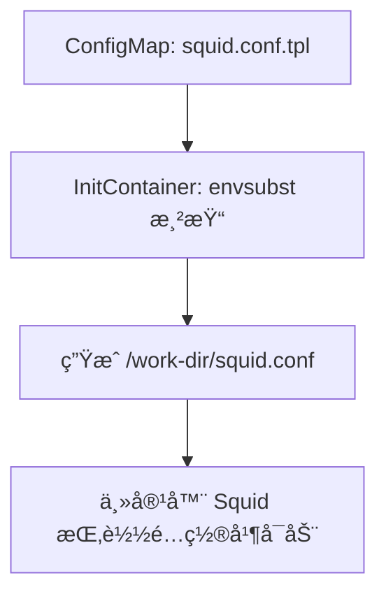

我ç°åœ¨é‡åˆ°è¿™æ ·ä¸€ä¸ª. Build a squid Images 但是 squid.conf 文件大部分内容写死了. 里é¢å®šä¹‰äº†å‡ ä¸ªå˜é‡æ˜¯é€šè¿‡ Deployment çš„ä¼ å‚æ¥è¦†ç›–çš„
比如这个部分.大概如下

```squid.conf
acl app_proxy dstdomain {{TARGET_FQDN}} 
cache_peer {{ENV}}-proxy.aliyun.cloud.{{REGION}}.local parent 3128 0
cache_peer_access {{ENV}}-proxy.aliyun.cloud.{{REGION}}.local allow app_proxy
```

那么我如æœæŒ‰ç…§åŸæ¥çš„æ–¹å¼éƒ¨ç½².这几个å‚数是满足需求的.
但是我ç°åœ¨æ¥äº†ä¸€ä¸ªæ–°çš„需求
比如我需è¦æˆ‘真正的é…置如下.也就是没有了å‚数的那部分覆盖,比如å˜æˆäº†å¦‚下 squid2.conf

```squid.conf
acl app_proxy dstdomain {{TARGET_FQDN}} 
cache_peer my_local.proxy.aibang parent 8080 0
cache_peer_access my_local.proxy.aibang allow app_proxy
```

那么我在ä¸ä¿®æ”¹æˆ‘åŸæ¥ Squid.conf 的情况下如何æ¥æ»¡è¶³ 2 个需求. 我测试比如把我需è¦çš„ Squid2.conf. 放到 configmap 里é¢ç„¶å修改åŸæ¥çš„ deployment.yaml æ¥æŒ‚è½½ configmap å¯ä»¥å®ç°
我想æ¢ç´¢æ›´å¹³æ»‘的或者说一般的最佳å®è·µçš„æ–¹å¼.

# ChatGPT

好的，这个场景我ç†è§£äº† ğŸ‘。你ç°åœ¨é¢ä¸´çš„问题是：

- 你有一个 **写死了大部分é…ç½®** çš„ squid.conf，其中部分å‚数是通过 **Deployment çš„ç¯å¢ƒå˜é‡** 覆盖的（例如 TARGET_FQDNã€ENVã€REGION）。
- 新需求è¦æ±‚ä½ å¯ä»¥ç›´æ¥æ›¿æ¢æ‰æŸäº›é…置段（比如 cache_peer），而ä¸ä»…仅是通过ç¯å¢ƒå˜é‡æ‹¼å‡ºæ¥ã€‚
- ä½ ç›®å‰æƒ³åˆ°çš„åšæ³•æ˜¯ï¼šé¢å¤–挂载一个 squid2.conf（æ¥è‡ª ConfigMap），并在 Deployment 里修改挂载路径，让 Squid 用这个é…ç½®å¯åŠ¨ã€‚这能å®ç°ï¼Œä½†ä¸å¤Ÿâ€œå¹³æ»‘â€ã€‚

我给你整ç†å‡ ä¸ªæ›´é€šç”¨çš„ **最佳å®è·µæ–¹æ¡ˆ**，让你在ä¸åŒéœ€æ±‚下çµæ´»é€‰æ‹©ï¼š

---

## **1.** ##  **InitContainer 模æ¿æ¸²æŸ“（æ¨è）**

在 squid.conf 中ä¿ç•™ **å˜é‡å ä½ç¬¦**，然å使用一个 InitContainer 在 Pod å¯åŠ¨æ—¶ï¼ŒåŠ¨æ€æ¸²æŸ“最终é…置文件。

- ä½ åŸæ¥çš„ squid.conf å¯ä»¥ä½œä¸ºæ¨¡æ¿æ–‡ä»¶ï¼ˆsquid.conf.tpl）。
- InitContainer 用 envsubst 或 gomplate 等模æ¿å·¥å…·ï¼Œå°†ç¯å¢ƒå˜é‡æ›¿æ¢è¿›å»ï¼Œç”Ÿæˆ /etc/squid/squid.conf。

```
volumes:
  - name: squid-config
    emptyDir: {}

initContainers:
  - name: render-squid-config
    image: alpine:3
    command:
      - sh
      - -c
      - |
        apk add --no-cache gettext
        envsubst < /config/squid.conf.tpl > /work-dir/squid.conf
    volumeMounts:
      - name: squid-template
        mountPath: /config
      - name: squid-config
        mountPath: /work-dir

containers:
  - name: squid
    image: your-squid-image
    volumeMounts:
      - name: squid-config
        mountPath: /etc/squid/squid.conf
        subPath: squid.conf
```

这样你就å¯ä»¥é€šè¿‡ç¯å¢ƒå˜é‡æ§åˆ¶ï¼Œæˆ–者在 ConfigMap 里替æ¢æ¨¡æ¿é€»è¾‘，ä¿æŒçµæ´»ã€‚

---

## **2.** ## **多 ConfigMap é…ç½® + Sidecar 热加载**

如æœé…置差异大（例如 squid.conf vs squid2.conf），å¯ä»¥ï¼š

- 用 **多个 ConfigMap**，æ¯ä¸ª ConfigMap 代表一ç§ç¯å¢ƒé…置（prod/dev/local）。
- 在 Deployment 中，通过 values.yaml 或 Helm chart æ¥é€‰æ‹©æŒ‚载哪个 ConfigMap。
- 甚至å¯ä»¥åŠ ä¸€ä¸ª sidecar（如 configmap-reloadï¼‰ï¼Œç›‘å¬ ConfigMap 更新，然å squid -k reconfigure 热加载。

---

## **3.** ## **å…¥å£è„šæœ¬å¯åŠ¨æ¨¡å¼**

把é…置选择逻辑放在 **容器 entrypoint 脚本** 里：

```
#!/bin/sh
if [ "$USE_LOCAL_PROXY" = "true" ]; then
  cp /config/squid2.conf /etc/squid/squid.conf
else
  cp /config/squid.conf /etc/squid/squid.conf
fi
exec squid -N -d 1
```

这样通过 Deployment ç¯å¢ƒå˜é‡ï¼ˆå¦‚ USE_LOCAL_PROXY=true）就能切æ¢é…置。

---

## **4.**  ## **Kubernetes Config Management 工具（Helm / Kustomize）**

- 如æœä½ å·²ç»ç”¨ Helm 部署 Squid，å¯ä»¥æŠŠ squid.conf 写æˆæ¨¡æ¿ï¼Œé€šè¿‡ values.yaml æ§åˆ¶ cache_peer 的内容。
- 如æœç”¨ Kustomize，å¯ä»¥ç”¨ configMapGenerator æ¥ç®¡ç†å¤šä¸ª squid.conf ç‰ˆæœ¬ï¼Œæ ¹æ® overlay 选择。

---

## **对比ä¸å»ºè®®**

| **方案**           | **特点**                   | **适用场景**                             |
| ------------------ | -------------------------- | ---------------------------------------- |
| InitContainer 渲染 | çµæ´»ã€é€šç”¨ã€å¯ä¿ç•™æ¨¡æ¿å˜é‡ | 适åˆæœ‰å‚数化需求ã€é…ç½®å·®å¼‚è¾ƒå°           |
| 多 ConfigMap       | 简å•ç›´è§‚，但é…置冗余       | ä¸åŒç¯å¢ƒå·®å¼‚较大，é…置无法抽象æˆæ¨¡æ¿     |
| å…¥å£è„šæœ¬           | 简å•ï¼Œä½†é€»è¾‘æ•£è½åœ¨é•œåƒé‡Œ   | 想快速切æ¢å°å—é…置，ä¸æ”¹é•œåƒä¸è¡Œ         |
| Helm/Kustomize     | 部署级别çµæ´»               | CI/CD æµç¨‹å·²ç»ä½¿ç”¨ Helm/Kustomize 的团队 |

---

✅ **最佳å®è·µå»ºè®®**：

如æœä½ çš„é…ç½®åªæ˜¯ **部分字段需è¦æ›¿æ¢**，æ¨è **InitContainer + 模æ¿æ¸²æŸ“**（方案 1），既能ä¿æŒ squid.conf 通用性，也能在ä¸åŒéœ€æ±‚下快速切æ¢ã€‚

如æœä»¥å需求å˜å¤šï¼Œè¿ç§»åˆ° Helm/Kustomize 管ç†é…置会更方便。

---

è¦ä¸è¦æˆ‘帮你写一个 **完整的 ConfigMap + InitContainer 渲染示例**，直æ¥å¥—在你ç°æœ‰çš„ Squid Deployment 上？

好 👠我给你写一个 **完整的 Kubernetes é…置示例**ï¼šåŒ…å« ConfigMap（存放模æ¿ï¼‰ã€InitContainer（渲染é…置）和 Deployment（è¿è¡Œ Squid）。

  

这样你ä¸ç”¨æ”¹åŸæ¥çš„ squid.conf 模æ¿ï¼Œåªéœ€è¦ä¿®æ”¹ ConfigMap 或ç¯å¢ƒå˜é‡ï¼Œå°±èƒ½ç”Ÿæˆä¸åŒçš„é…置。

---

## **1. ConfigMap（squid.conf.tpl 模æ¿ï¼‰**

```
apiVersion: v1
kind: ConfigMap
metadata:
  name: squid-config-template
  namespace: proxy
data:
  squid.conf.tpl: |
    http_port 3128

    acl app_proxy dstdomain ${TARGET_FQDN}

    cache_peer ${CACHE_PEER_HOST} parent ${CACHE_PEER_PORT} 0
    cache_peer_access ${CACHE_PEER_HOST} allow app_proxy

    # 其他通用é…ç½®
    http_access allow app_proxy
    http_access deny all
```

👉 模æ¿é‡Œç”¨äº†ç¯å¢ƒå˜é‡ ${TARGET_FQDN}ã€${CACHE_PEER_HOST}ã€${CACHE_PEER_PORT}。

例如你å¯ä»¥è®¾ç½®ï¼š

- **默认方å¼**：CACHE_PEER_HOST=${ENV}-proxy.aliyun.cloud.${REGION}.local，CACHE_PEER_PORT=3128
    
- **新需求方å¼**：CACHE_PEER_HOST=my_local.proxy.aibang，CACHE_PEER_PORT=8080
    

---

## **2. Deployment（带 InitContainer 渲染）**

```yaml
apiVersion: apps/v1
kind: Deployment
metadata:
  name: squid
  namespace: proxy
spec:
  replicas: 1
  selector:
    matchLabels:
      app: squid
  template:
    metadata:
      labels:
        app: squid
    spec:
      volumes:
        - name: squid-config-template
          configMap:
            name: squid-config-template
        - name: squid-config
          emptyDir: {}
      initContainers:
        - name: render-squid-config
          image: alpine:3.20
          command:
            - sh
            - -c
            - |
              apk add --no-cache gettext
              envsubst < /config/squid.conf.tpl > /work-dir/squid.conf
              echo "==== Rendered squid.conf ===="
              cat /work-dir/squid.conf
          env:
            - name: TARGET_FQDN
              value: "example.com"
            - name: CACHE_PEER_HOST
              value: "my_local.proxy.aibang"
            - name: CACHE_PEER_PORT
              value: "8080"
          volumeMounts:
            - name: squid-config-template
              mountPath: /config
            - name: squid-config
              mountPath: /work-dir
      containers:
        - name: squid
          image: sameersbn/squid:latest
          ports:
            - containerPort: 3128
          volumeMounts:
            - name: squid-config
              mountPath: /etc/squid/squid.conf
              subPath: squid.conf
```

---

## **3. 使用方å¼**

  

### **默认模å¼ï¼ˆåŸæ¥é€»è¾‘）**

  

在 Deployment 的 env 中设置：

```
- name: CACHE_PEER_HOST
  value: "prd-proxy.aliyun.cloud.us-central1.local"
- name: CACHE_PEER_PORT
  value: "3128"
```

### **新模å¼ï¼ˆè¦†ç›–为本地 proxy）**

```
- name: CACHE_PEER_HOST
  value: "my_local.proxy.aibang"
- name: CACHE_PEER_PORT
  value: "8080"
```

---

## **4. 整体æµç¨‹**



---

## **✅ 注æ„事项**

1. **安全**：envsubst 会替æ¢æ‰€æœ‰ ${VAR} å˜é‡ï¼Œé¿å…使用未定义的ç¯å¢ƒå˜é‡ã€‚
    
2. **热更新**：ConfigMap æ›´æ–°åéœ€è¦ kubectl rollout restart deployment squid，æ‰èƒ½é‡æ–°æ¸²æŸ“é…置。
    
3. **多ç¯å¢ƒæ”¯æŒ**：你å¯ä»¥ç”¨ Helm/Kustomize 把 env 部分å‚数化，适应 dev/stg/prd。
    

---

è¦ä¸è¦æˆ‘å†å¸®ä½ å†™ä¸€ä¸ª **Helm values.yaml + 模æ¿ç¤ºä¾‹**，这样å¯ä»¥ç›´æ¥ç”¨ Helm chart 管ç†ä¸åŒç¯å¢ƒçš„ Squid é…置？
