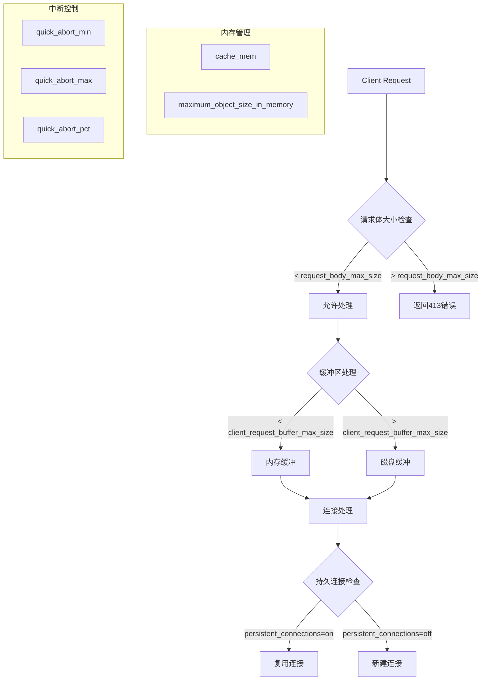

# My Enhance Plan
- [Reference](./nginx/buffer/summary-buffer.md)
```squid.conf
# 基础配置保持不变，添加以下优化
request_body_max_size 500 MB
client_request_buffer_max_size 1 MB  # 增大缓冲区

# 添加大文件处理优化
range_offset_limit -1
quick_abort_min -1 KB
quick_abort_max -1 KB
quick_abort_pct 95

# 连接池优化
server_persistent_connections on
client_persistent_connections on
half_closed_clients off

# 内存使用优化
cache_mem 512 MB
maximum_object_size_in_memory 512 KB
```

## Squid配置优化参数详解

### 1. 请求体处理参数

```bash
request_body_max_size 500 MB
```

- **作用**：限制客户端请求体的最大大小
- **默认值**：0（无限制）
- **影响**：超过此大小的请求会被拒绝，返回413错误
- **建议**：根据业务需求设置，避免过大请求占用过多内存

```bash
client_request_buffer_max_size 1 MB
```

- **作用**：设置客户端请求缓冲区的最大大小
- **默认值**：通常为32KB或64KB
- **影响**：影响内存使用和处理大请求头的能力
- **说明**：请求头和小请求体会被缓存在内存中，超出部分写入磁盘

### 2. 范围请求优化

```bash
range_offset_limit -1
```

- **作用**：控制HTTP Range请求的偏移量限制
- **默认值**：0（禁用Range请求）
- **-1含义**：允许任意大小的Range请求
- **用途**：支持断点续传，对大文件下载很重要
- **示例**：客户端可以请求文件的任意部分，如`bytes=1000000-2000000`

### 3. 快速中断控制

```bash
quick_abort_min -1 KB
quick_abort_max -1 KB  
quick_abort_pct 95
```

**quick_abort_min -1 KB**：

- **作用**：当客户端断开连接时，如果已下载数据小于此值，立即停止从源服务器获取
- **-1含义**：禁用此功能，即使客户端断开也继续下载
- **影响**：避免浪费带宽，但可能影响缓存效果

**quick_abort_max -1 KB**：

- **作用**：当客户端断开连接时，如果已下载数据大于此值，继续完成下载
- **-1含义**：无限制，总是继续完成下载
- **影响**：确保大文件能完整缓存

**quick_abort_pct 95**：

- **作用**：当下载进度超过95%时，即使客户端断开也继续完成
- **目的**：避免浪费已完成95%的下载工作

### 4. 连接持久化

```bash
server_persistent_connections on
client_persistent_connections on
```

**server_persistent_connections on**：

- **作用**：启用与后端服务器的持久连接
- **默认值**：on
- **好处**：减少TCP握手开销，提高性能
- **适用**：高频率请求场景

**client_persistent_connections on**：

- **作用**：启用与客户端的持久连接
- **默认值**：on
- **好处**：减少客户端连接建立时间
- **HTTP版本**：支持HTTP/1.1的Keep-Alive

```bash
half_closed_clients off
```

- **作用**：是否监控半关闭的客户端连接
- **默认值**：on
- **off含义**：不监控半关闭连接，节省资源
- **影响**：可能导致一些连接状态检测不准确

### 5. 内存管理

```bash
cache_mem 512 MB
```

- **作用**：设置Squid使用的内存缓存大小
- **默认值**：256 MB
- **用途**：缓存热点数据在内存中，提高访问速度
- **注意**：不要超过系统可用内存的1/3

```bash
maximum_object_size_in_memory 512 KB
```

- **作用**：设置可以存储在内存中的单个对象最大大小
- **默认值**：512 KB
- **影响**：超过此大小的对象只能存储在磁盘上
- **平衡**：增大可提高性能，但消耗更多内存

### 6. 参数关系图



### 7. 性能影响对比表

|参数|设置值|内存使用|CPU使用|网络效率|适用场景|
|---|---|---|---|---|---|
|request_body_max_size|500MB|低|低|高|大文件上传|
|client_request_buffer_max_size|1MB|中|低|高|大请求头处理|
|range_offset_limit|-1|低|中|高|断点续传|
|quick_abort_*|-1|中|低|中|缓存优化|
|persistent_connections|on|低|低|高|高并发|
|cache_mem|512MB|高|低|很高|热点数据|

### 8. 监控建议

```bash
# 检查内存使用情况
squidclient -p 3128 mgr:mem

# 查看连接统计
squidclient -p 3128 mgr:filedescriptors  

# 监控大文件传输
tail -f /var/log/squid/access.log | awk '$7 > 10485760'
```

这些参数需要根据实际业务场景和系统资源进行调优，建议逐步调整并观察性能表现。