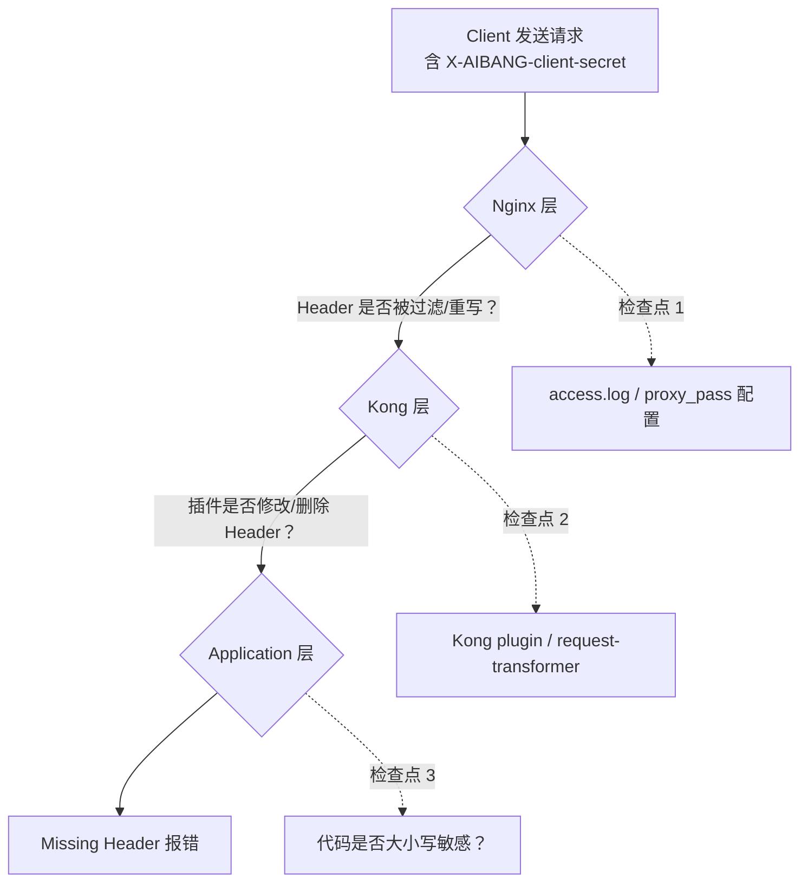
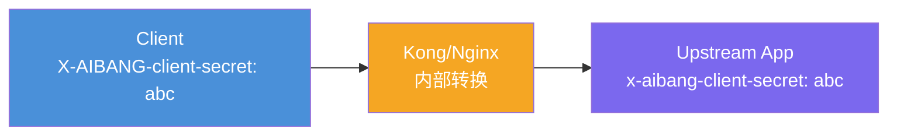
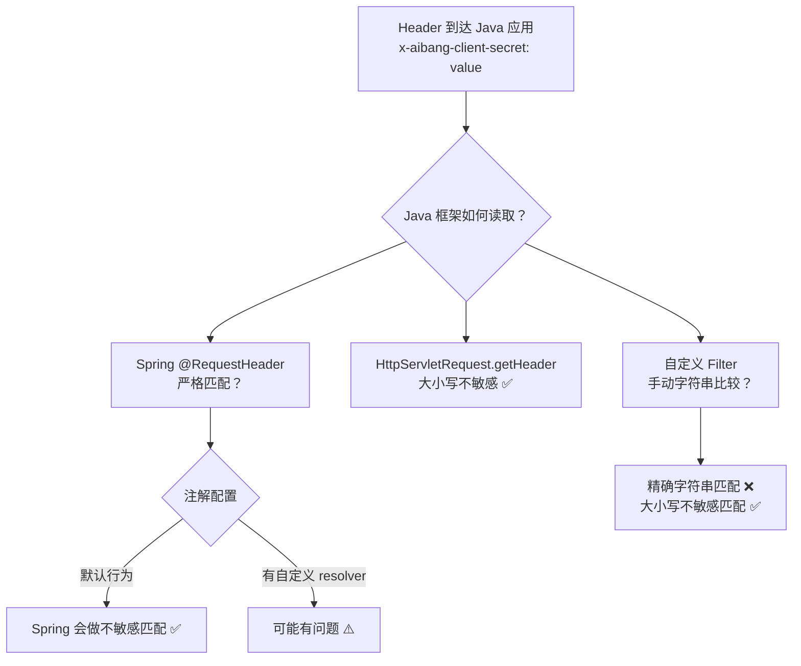
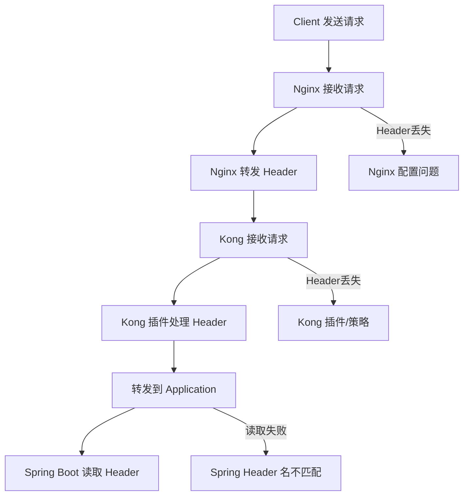
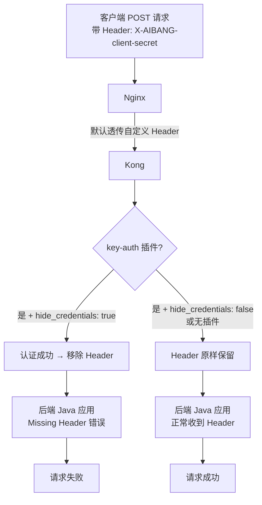

# 深度排查：`X-AIBANG-client-secret` Header 丢失问题
- question
- 我现在想要你读这段日志，然后看一下。我们用户说的是，他的请求会丢失这个对应的Header。但是后面我通过模拟测试，看到这样的Header请求是可以到我的Kong上面的，也但是呢，它有一个大小写的转换。那么这个可能的问题最大出现在哪里呢？
## 问题分析

先回答你的核心疑问：

> **"客户端发送 POST 请求，这个 Header 是由谁来决定要不要发的？"**

**答：Header 由客户端负责发送，中间件（Nginx/Kong）负责透传或处理，应用层负责读取。**

报错 `Missing Header: X-AIBANG-client-secret` 说明：**应用层没有收到这个 Header**，但不代表客户端没发——它可能在中间某个环节被丢弃或覆盖了。

---

## 请求链路全景




---

## 逐层排查方案

### 第一步：验证客户端确实发送了 Header

在排查中间件之前，先确认客户端行为。

```bash
# 用 curl 模拟客户端，直接打到 Nginx 入口
curl -X POST https://your-platform/api/endpoint \
  -H "X-AIBANG-client-secret: your-secret-value" \
  -H "Content-Type: application/json" \
  -d '{"test": "payload"}' \
  -v 2>&1 | grep -i "client-secret"
```

**如果能复现报错 → 说明问题在服务端链路，继续排查**

---

### 第二步：Nginx 层排查

#### 检查点 A：`proxy_pass` 是否有 Header 过滤

```nginx
# 危险配置：这会清除所有自定义 Header
proxy_set_header X-AIBANG-client-secret "";

# 或者存在 underscores_in_headers 问题（虽然这个 header 没有下划线开头，但要确认）
underscores_in_headers off;  # 默认 off，会丢弃带下划线的 header
```

```bash
# 检查 Nginx 配置中是否有对这个 Header 的处理
grep -r "client-secret\|client_secret" /etc/nginx/
grep -r "proxy_set_header" /etc/nginx/ | grep -v "#"
```

#### 检查点 B：开启 Nginx 详细日志，确认 Header 是否到达

```nginx
# 在 nginx.conf 中临时添加，记录请求头
log_format debug_headers '$remote_addr - $http_x_aibang_client_secret - $request';
access_log /var/log/nginx/debug.log debug_headers;
```

```bash
# 发送请求后查看
tail -f /var/log/nginx/debug.log
# 如果看到 "-" 占位，说明 Nginx 没收到这个 Header
```

---

### 第三步：Kong 层排查（**重点，最可能的问题所在**）

#### 检查点 A：是否有 `request-transformer` 插件删除了该 Header

```bash
# 列出所有插件配置
curl -s http://localhost:8001/plugins | python3 -m json.tool | grep -A5 "request-transformer"

# 或者查看特定 Service/Route 的插件
curl -s http://localhost:8001/services/{service-name}/plugins
curl -s http://localhost:8001/routes/{route-id}/plugins
```

重点检查是否有类似配置：

```json
{
  "name": "request-transformer",
  "config": {
    "remove": {
      "headers": ["X-AIBANG-client-secret"]
    }
  }
}
```

#### 检查点 B：Kong 的 `key-auth` 或 `hmac-auth` 插件是否消费了该 Header

```bash
# 查看是否有认证类插件
curl -s http://localhost:8001/plugins | python3 -m json.tool | grep '"name"'
```

> ⚠️ **关键点**：某些 Kong 认证插件（如 `key-auth`）在验证完 key 之后，**默认会从请求中删除该 Header**，不再传递给 upstream。

```bash
# 检查 key-auth 插件的 hide_credentials 配置
curl -s http://localhost:8001/plugins | python3 -m json.tool | grep -A10 "key-auth"
# 如果 hide_credentials: true → Header 会被删除
```

#### 检查点 C：用 Kong 的 Debug 模式抓请求

```bash
# 在 Kong 上启用请求日志插件（临时）
curl -X POST http://localhost:8001/services/{your-service}/plugins \
  --data "name=http-log" \
  --data "config.http_endpoint=http://your-log-collector/log"

# 或者使用 file-log 插件
curl -X POST http://localhost:8001/plugins \
  --data "name=file-log" \
  --data "config.path=/tmp/kong-request.log"
```

```bash
# 实时观察
tail -f /tmp/kong-request.log | python3 -m json.tool | grep -i "client-secret"
```

---

### 第四步：应用层代码排查

#### 检查点 A：Java 代码 Header 名称大小写

HTTP Header 名称**理论上不区分大小写**（RFC 7230），但某些框架实现有问题：

```java
// 检查 Java 代码中读取 Header 的方式
// 方式1：Spring MVC @RequestHeader
@PostMapping("/api")
public Response handle(
    @RequestHeader("X-AIBANG-client-secret") String clientSecret
) { ... }

// 方式2：直接从 HttpServletRequest 获取
String secret = request.getHeader("X-AIBANG-client-secret");
// getHeader() 是大小写不敏感的，这个没问题

// 方式3：检查是否用了 getHeaders() 做了精确匹配
```

#### 检查点 B：是否有 Filter/Interceptor 提前拦截

```bash
# 在代码中搜索是否有自定义过滤器处理这个 Header
grep -r "client-secret\|client_secret\|clientSecret" src/ --include="*.java"
grep -r "OncePerRequestFilter\|HandlerInterceptor" src/ --include="*.java"
```

---

## 快速定位：二分法验证

用下表快速定位问题层：

| 测试方式                                            | 预期结果 | 结论                 |
| --------------------------------------------------- | -------- | -------------------- |
| curl 直接打 **Application 端口**（绕过 Nginx+Kong） | 成功     | 问题在 Nginx 或 Kong |
| curl 直接打 **Kong 端口**（绕过 Nginx）             | 成功     | 问题在 Nginx         |
| curl 打 **Nginx 入口**                              | 失败     | 结合上面缩小范围     |
| curl 打 **Application 端口**                        | 失败     | 问题在应用代码       |

```bash
# 直接打应用端口（假设 8080）
curl -X POST http://app-pod-ip:8080/api/endpoint \
  -H "X-AIBANG-client-secret: test-value" \
  -H "Content-Type: application/json" \
  -d '{}'

# 直接打 Kong 端口（假设 8000）
curl -X POST http://kong-ip:8000/api/endpoint \
  -H "X-AIBANG-client-secret: test-value" \
  -H "Content-Type: application/json" \
  -d '{}'
```

---

## 最可能的原因（按概率排序）

| 排名 | 原因                                                | 说明                                        |
| ---- | --------------------------------------------------- | ------------------------------------------- |
| 🥇    | **Kong `key-auth` 插件的 `hide_credentials: true`** | 认证成功后删除该 Header                     |
| 🥈    | **Kong `request-transformer` 插件主动 remove**      | 平台配置问题                                |
| 🥉    | **Nginx `proxy_set_header` 覆盖或清空**             | 配置不当                                    |
| 4    | **客户端代码未正确发送**                            | CICD 流水线中构建的客户端 Header 拼装有 bug |
| 5    | **Java 代码 Header 名称不匹配**                     | 概率低，`getHeader()` 不区分大小写          |

---

## 注意事项

> ⚠️ **安全提醒**：`X-AIBANG-client-secret` 作为 Header 传输 secret 是常见做法，但要确保全链路 HTTPS，避免中间件日志记录该值后泄露。

> ⚠️ **CICD 2.0 特殊性**：如果是流水线部署后才出现，重点检查 Kong 的插件配置是否在部署时被覆盖或重置，这是最典型的"部署后行为变化"场景。


## curl testing 
```bash
# 用 curl 模拟客户端，直接打到 Nginx 入口
curl -X POST https://your-platform/api/endpoint \
  -H "X-AIBANG-client-secret: your-secret-value" \
  -H "Content-Type: application/json" \
  -d '{"test": "payload"}' \
  -v 2>&1 | grep -i "client-secret"
```
# 深度解析：Kong 将 Header 转为小写的问题

## 核心结论

**这是正常行为，不是 Bug。**

Kong 基于 `ngx_lua`（OpenResty），其底层 Nginx 在处理 HTTP/1.1 请求时，会将所有 Header 名称**统一转为小写**存储和传递。



---

## 为什么会发生这个转换？

### HTTP 协议规范层面

RFC 7230 明确规定：

> Header field names are **case-insensitive**

所以 `X-AIBANG-client-secret` 和 `x-aibang-client-secret` 在协议层面是**完全等价**的。

### Nginx/OpenResty 实现层面

```
HTTP/1.x → Nginx 接收 → 内部 ngx_http_headers_in_t 结构体 → 统一小写存储
```

Kong 使用 OpenResty，所有 Header 在 Lua 层面通过 `ngx.req.get_headers()` 获取时**全部是小写 key**，这是框架设计决定的。

### HTTP/2 层面

HTTP/2 规范 (RFC 7540) **强制要求** Header 名称必须小写，这是强制规范：

```
HTTP/2 → HPACK 压缩 → 强制 lowercase header names
```

---

## 问题真正的根源在哪里？

既然协议允许，那问题一定出在 **Java 应用的读取方式**上。



---

## 逐一排查 Java 应用代码

### 情况 1：使用 `@RequestHeader` 注解

```java
// ✅ 这种写法 Spring 会做大小写不敏感匹配，没有问题
@PostMapping("/endpoint")
public ResponseEntity handle(
    @RequestHeader("X-AIBANG-client-secret") String secret
) { ... }

// ✅ 同样没问题
@RequestHeader("x-aibang-client-secret") String secret
```

> Spring MVC 的 `RequestHeaderMethodArgumentResolver` 内部调用的是 `HttpServletRequest.getHeader()`，而 Servlet 规范要求该方法**大小写不敏感**。

**验证方式：**

```java
// 在 Controller 里临时加这段，打印所有收到的 Header
@PostMapping("/endpoint")
public ResponseEntity handle(HttpServletRequest request) {
    Enumeration<String> headerNames = request.getHeaderNames();
    while (headerNames.hasMoreElements()) {
        String name = headerNames.nextElement();
        System.out.println("Header: [" + name + "] = [" + request.getHeader(name) + "]");
    }
    // ...
}
```

---

### 情况 2：自定义 Filter 或 Interceptor（**高风险区域**）

```java
// ❌ 危险写法：手动字符串精确比较
public class SecretValidationFilter extends OncePerRequestFilter {
    @Override
    protected void doFilterInternal(HttpServletRequest request, ...) {
        // 这里如果用 Map 的 get()，key 大小写必须完全匹配
        String secret = request.getHeader("X-AIBANG-client-secret");
        
        // ⚠️ 如果框架把 header 存成 map 后用精确匹配，就会取到 null
        if (secret == null || !secret.equals(expectedSecret)) {
            response.sendError(400, "Missing Header : X-AIBANG-client-secret");
            return;
        }
    }
}
```

```java
// ✅ 正确写法：HttpServletRequest.getHeader() 是大小写不敏感的
String secret = request.getHeader("X-AIBANG-client-secret");  // 能取到
String secret = request.getHeader("x-aibang-client-secret");  // 也能取到
```

---

### 情况 3：使用了某些框架的 Header Map（**最高风险**）

```java
// ❌ 如果用了 Spring 的 HttpHeaders 对象然后做精确 get
HttpHeaders headers = new HttpHeaders();
// HttpHeaders 内部是 case-insensitive 的 LinkedCaseInsensitiveMap，这个是安全的

// ❌ 但如果有人把 headers 转成了普通 HashMap 再操作
Map<String, String> headerMap = new HashMap<>();
request.getHeaderNames().asIterator().forEachRemaining(name -> 
    headerMap.put(name, request.getHeader(name))
);
// 此时 key 全是小写（因为 Kong 传来的是小写）
// headerMap.get("X-AIBANG-client-secret") → null ❌
// headerMap.get("x-aibang-client-secret") → value ✅
```

---

## 排查命令：直接绕过所有中间层验证

```bash
# 1. 直接打 Java 应用端口，发送大写 Header
curl -X POST http://java-app-ip:8080/endpoint \
  -H "X-AIBANG-client-secret: test123" \
  -H "Content-Type: application/json" \
  -d '{}' -v

# 2. 直接打 Java 应用端口，发送小写 Header（模拟 Kong 转换后）
curl -X POST http://java-app-ip:8080/endpoint \
  -H "x-aibang-client-secret: test123" \
  -H "Content-Type: application/json" \
  -d '{}' -v
```

| 测试结果           | 结论                                    |
| ------------------ | --------------------------------------- |
| 大写成功，小写失败 | Java 代码有大小写敏感问题               |
| 大写失败，小写成功 | Java 代码在做精确小写匹配（反向问题）   |
| 两者都失败         | 问题不在大小写，在其他逻辑              |
| 两者都成功         | 问题在 Kong/Nginx 层，Header 值被修改了 |

---

## 最终解决方案

### 方案 A：修复 Java 代码（推荐，治本）

```java
// 使用 Servlet 标准 API，天然大小写不敏感
String secret = request.getHeader("X-AIBANG-client-secret");

// 如果必须用 Map，使用 Spring 的 case-insensitive 实现
import org.springframework.util.LinkedCaseInsensitiveMap;
Map<String, String> safeMap = new LinkedCaseInsensitiveMap<>();
```

### 方案 B：Kong 端用 `request-transformer` 强制还原大小写（治标）

```bash
curl -X POST http://localhost:8001/services/{your-service}/plugins \
  --data "name=request-transformer" \
  --data "config.rename.headers=x-aibang-client-secret:X-AIBANG-client-secret"
```

> ⚠️ 方案 B 只是掩盖问题，HTTP/2 场景下还会再变小写，根本解法是方案 A。

---

## 结论

```
问题本质：不是 Kong 的问题，是 Java 应用对 Header 大小写敏感
正确做法：始终使用 HttpServletRequest.getHeader()，永远不要用精确字符串 Map 匹配 Header key
```

---

# GKE + Nginx + Kong Header 丢失问题深度排查指南

---

## 1. 问题分析

从你的描述可以提炼出几个关键点：

- **请求链路**：Client → Nginx → Kong → Application (Java)
- **应用报错**：`Missing Header: X-AIBANG-client-secret`
- **现象**：
  - ❌ **带 header 时失败**
  - ✅ **去掉校验（不依赖 header）后成功**
  - 🤔 用户怀疑：Kong 截断 header

---

### 核心结论（先给你一个判断）

👉 **这个问题 90% 不是"必须不必须传 header"的问题，而是：**

> Header 在链路中"丢失 / 被修改 / 未透传"

---

### HTTP 基础澄清

对于 POST 请求：

| 项目                                       | 是否必须      |
| ------------------------------------------ | ------------- |
| Body                                       | ❌（可选）     |
| Header                                     | ❌（可选）     |
| 自定义 Header（如 X-AIBANG-client-secret） | ❌协议层不强制 |

👉 **是否必须传 header，完全由"应用逻辑"决定，而不是 HTTP 协议**

---

## 2. 可能原因（按概率排序）

### 🔴 1. Nginx 未透传 Header（最常见）

Nginx 默认行为：

- 会透传大多数 header
- ❗但在以下情况可能丢失：
  - 使用了 `proxy_set_header` 覆盖
  - rewrite / internal 转发
  - header 名拼写不一致

#### 常见问题配置

```nginx
proxy_set_header X-AIBANG-client-secret "";

# 或者：

proxy_set_header Host $host;
# 没有显式透传自定义 header
```

---

### 🔴 2. Kong 插件或策略影响

Kong 可能会：
- 删除 header（security plugin）
- 修改 header（transform plugin）
- 认证失败提前返回

常见插件：

| 插件                | 影响             |
| ------------------- | ---------------- |
| request-transformer | 修改/删除 header |
| key-auth            | 依赖 header      |
| acl / oauth2        | 拦截请求         |

---

### 🔴 3. Header 名不符合规范（隐蔽问题）

HTTP Header 标准：
- 大小写不敏感
- 但某些框架（特别是 Java Spring）：👉 大小写 / 格式敏感

⚠️ **特别注意：**

`X-AIBANG-client-secret` 可能被转换为：

`x-aibang-client-secret`

👉 Spring Boot 有时获取不到

---

### 🔴 4. Kong / Nginx Header Size 限制

如果 header 太长：
- Nginx: `large_client_header_buffers`
- Kong（基于 Nginx）也有限制

👉 超出会：
- 被截断 ❌
- 或直接丢弃 ❌

---

### 🔴 5. 客户端实际没有发送（用户代码问题）

非常常见：

```bash
# 正确写法
curl -X POST http://xxx \
  -H "X-AIBANG-client-secret: abc123"

# 错误写法 ❌
curl -X POST http://xxx \
  -H "X-AIBANG-client-secret=abc123"
```

---

## 3. 排查方案（逐层定位）

---

### Step 1：在 Application 层确认

在 Java 中打印所有 Header：

```java
@RequestMapping("/test")
public ResponseEntity<?> test(HttpServletRequest request) {
    Enumeration<String> headers = request.getHeaderNames();
    while (headers.hasMoreElements()) {
        String name = headers.nextElement();
        System.out.println(name + ": " + request.getHeader(name));
    }
    return ResponseEntity.ok("ok");
}
```

👉 判断：
- header 是否存在
- 名字是否变化

---

### Step 2：在 Kong 层抓包 / 日志

**方法 1：开启 Kong access log**

```bash
kubectl logs <kong-pod> -n <ns>
```

**方法 2：临时 echo upstream**

```yaml
apiVersion: v1
kind: Pod
metadata:
  name: echo
spec:
  containers:
  - name: echo
    image: ealen/echo-server
```

👉 查看请求 header：

```bash
curl http://echo-service
```

---

### Step 3：在 Nginx 层验证

打印 header：

```nginx
log_format custom '$http_x_aibang_client_secret';
access_log /var/log/nginx/access.log custom;
```

👉 看是否进入 Nginx

---

### Step 4：客户端验证（最关键）

让用户执行：

```bash
curl -v -X POST https://your-api \
  -H "X-AIBANG-client-secret: test123"
```

👉 重点看：

```
> X-AIBANG-client-secret: test123
```

---

## 4. 全链路流程图



---

## 5. 建议解决方案（生产级）

### ✅ 1. Nginx 显式透传 Header

```nginx
proxy_set_header X-AIBANG-client-secret $http_x_aibang_client_secret;
```

---

### ✅ 2. Kong 禁止修改 Header（排查阶段）

```bash
# 检查 plugin
curl http://kong-admin/plugins
```

---

### ✅ 3. Spring Boot 兼容写法

```java
@RequestHeader(value = "X-AIBANG-client-secret", required = false)
```

👉 或统一转小写处理

---

### ✅ 4. 增加 Header Debug 能力（平台侧）

建议你平台加一个 debug endpoint：

```
/headers
```

用于输出所有 header

---

### ✅ 5. 限制 Header 长度

```nginx
large_client_header_buffers 4 16k;
```

---

## 6. 注意事项（非常关键）

### ⚠️ 1. Header 不存在 ≠ 用户没传

可能是：
- 被 Nginx/Kong 覆盖
- 被 plugin 删除
- 被大小写影响

---

### ⚠️ 2. "去掉校验就成功"的真正含义

👉 说明：

请求是通的，但 Header 没到应用

不是：

Header 不能传

---

### ⚠️ 3. Kong 不会默认截断 Header

👉 除非：
- 超过 size limit
- plugin 修改
- upstream rewrite

---

## 7. 一句话总结

这是一个典型的"自定义 Header 在多层代理链路中丢失"的问题，本质不是 POST 是否需要 Header，而是 Header 在 Nginx/Kong/Application 之间没有正确透传。

---

如果你需要，我可以帮你做一个：

**✅ Kong + Nginx Header 全链路 Debug 标准方案（可直接落地）**

包括：
- debug service
- 日志模板
- 一键排查脚本

---

## 问题分析：CICD 2.0 部署后的 Case

客户报告的 Case 核心是：客户端在 POST 请求中明确添加了自定义 Header `X-AIBANG-client-secret`（客户端密钥），但后端 Java 应用（`CreateFvqProcessController`）始终收到 "Missing Header" 错误。只有在"移除对客户端密钥的验证"后请求才能成功处理。客户猜测是 Kong 部署后将该 Header "截断"（即移除）后再传递给控制器。

结合流水线（CICD 2.0）部署后才出现的问题、平台流量路径 **客户端 → Nginx → Kong → Application** 以及 Header 名称（典型的 API Key 风格），**最可能的原因是 Kong 的 `key-auth` 插件配置了 `hide_credentials: true`**。该选项会在认证成功后主动移除凭证 Header（由 `key_names` 定义），防止凭证泄露到后端。

- **如果不发送 Header** → Kong 会直接返回 401（但客户可能未测试此场景）。
- **发送 Header** → Kong 认证通过但移除 Header → 后端应用报 Missing Header。
- **移除验证（即临时禁用 key-auth 插件）** → Header 原样透传 → 请求成功。

Nginx 默认不会主动移除自定义 `X-` Header，`request-transformer` 插件也不会默认删除，因此问题定位点在 Kong 的插件配置（CICD 部署的 declarative config / KongPlugin CRD）。

---

## 解决方案

### 1. 确认当前 key-auth 插件配置

重点查看 `hide_credentials` 和 `key_names`。

### 2. 若确认是 `hide_credentials: true`，根据业务决定：

- **推荐方案**：后端应用改为依赖 Kong 注入的 `X-Consumer-*` Header（已通过认证，无需重复校验原始 secret）。
- **临时方案**：将 `hide_credentials` 改为 `false`，让 Header 继续透传到应用。

### 3. 验证修复

重新部署后，用 curl/Postman 带 Header 测试，观察应用日志。

### 4. 额外调试

临时开启 Header 日志插件，逐层确认 Header 是否在 Nginx / Kong / 应用三处存在。

---

## 代码示例

### 1. 查看当前 Route/Service 关联的 key-auth 插件

```bash
# 假设使用 Kong Ingress Controller / CRD
kubectl get kongplugin -n <namespace> -o yaml | grep -A 20 key-auth

# 或通过 Kong Admin API（需 port-forward 或暴露 admin 端口）
curl -s http://localhost:8001/plugins | jq '.data[] | select(.name == "key-auth") | {name, config}'
```

### 2. 示例：修改/创建 key-auth 插件（推荐 `hide_credentials: false`）

```yaml
apiVersion: configuration.konghq.com/v1
kind: KongPlugin
metadata:
  name: aibang-client-secret-auth
  annotations:
    konghq.com/plugin: "key-auth"
plugin: key-auth
config:
  key_names:
  - "X-AIBANG-client-secret"
  hide_credentials: false   # 关键：改为 false 让 Header 透传
  anonymous: ""             # 如需匿名消费者可配置
```

### 3. 将插件绑定到对应 Route/Service

```bash
kubectl patch kongroute <route-name> -n <namespace> --type=merge -p '{"pluginRefs": ["aibang-client-secret-auth"]}'
```

### 4. 临时添加 http-log 插件调试 Header

```yaml
apiVersion: configuration.konghq.com/v1
kind: KongPlugin
metadata:
  name: debug-headers
plugin: http-log
config:
  http_endpoint: "http://your-log-collector:8080"  # 或 file-log 插件写本地文件
  method: POST
  headers:
    Content-Type: application/json
```

---

## 流程图



---

## 注意事项

### 权限检查

操作 Kong CRD / Admin API 前请确认当前 kubectl 上下文和 RBAC 权限；CICD 流水线部署的 config 通常由 decK 或 GitOps 管理，修改后必须重新 `deck sync` 或触发流水线。

### 最佳实践

- 生产环境推荐 `hide_credentials: true` + 后端使用 Kong 注入的 `X-Consumer-ID` / `X-Consumer-Username` 等 Header，避免敏感密钥透传到业务 Pod。
- Java 侧读取 Header 时使用 `request.getHeader("X-AIBANG-client-secret")`（Servlet API 对大小写不敏感）。
- Header 值中若包含特殊字符，建议 Base64 编码后再传输。

### 故障排除建议

- 若仍未解决，检查 Nginx 配置中是否显式 `proxy_set_header X-AIBANG-client-secret "";` 或 `underscores_in_headers on;`（虽本 Header 无下划线，但可作为通用检查）。
- 启用 Kong access log 打印 `$(request.headers)` 或使用 post-function 插件在 Lua 中打印 `kong.request.get_header("x-aibang-client-secret")`。
- 验证 YAML 正确性后重新部署，避免 CICD 回滚导致配置漂移。

按照以上步骤定位和修复，即可确认是否为 Kong 插件导致的 Header 被"截断"，并快速恢复正常流程。
