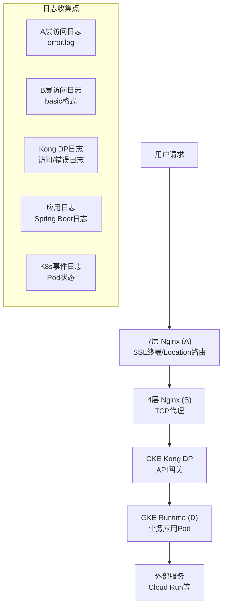
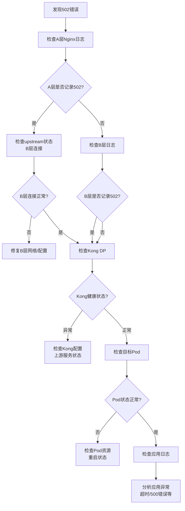
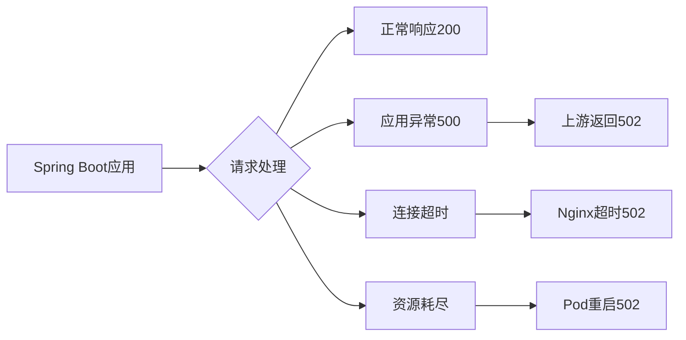
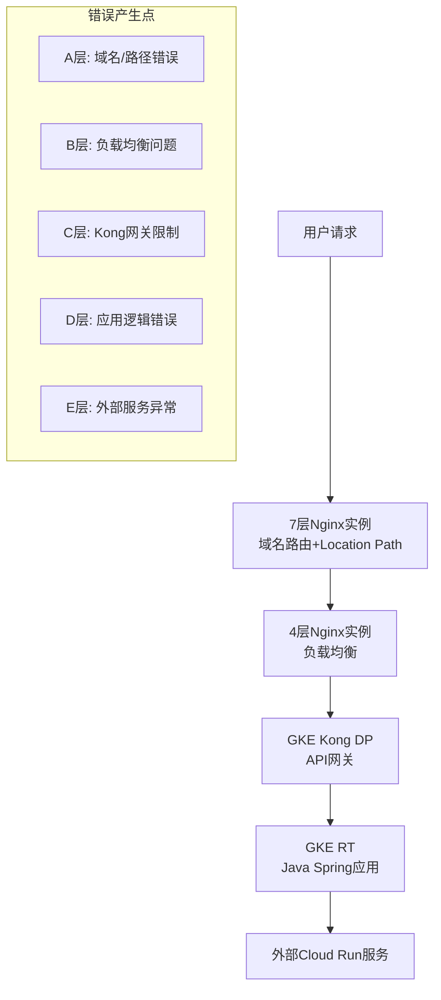
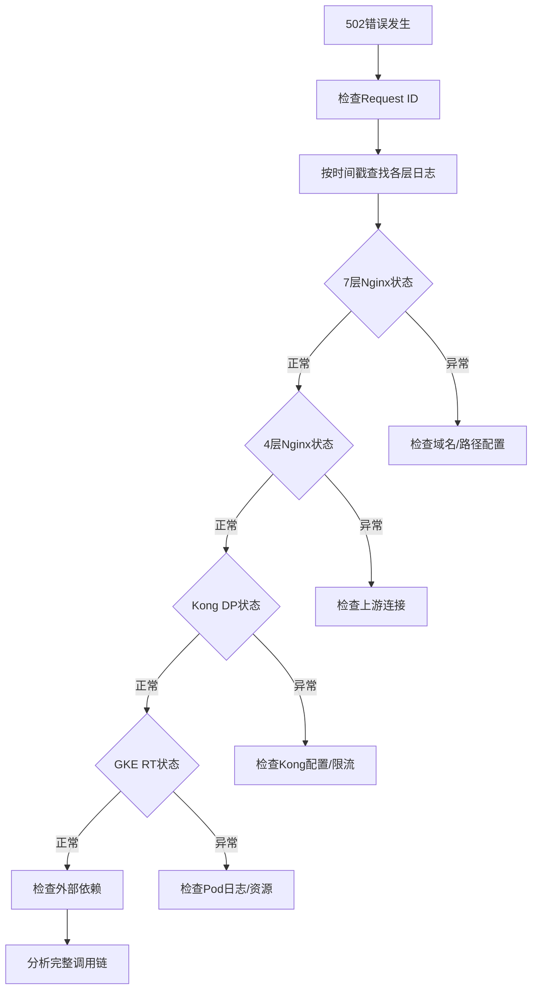
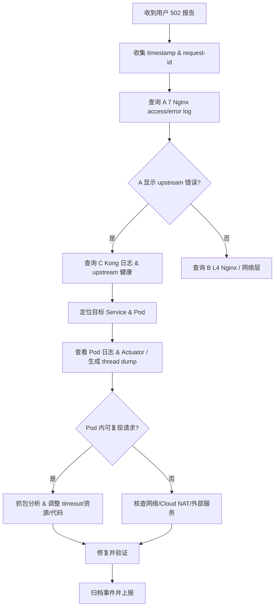
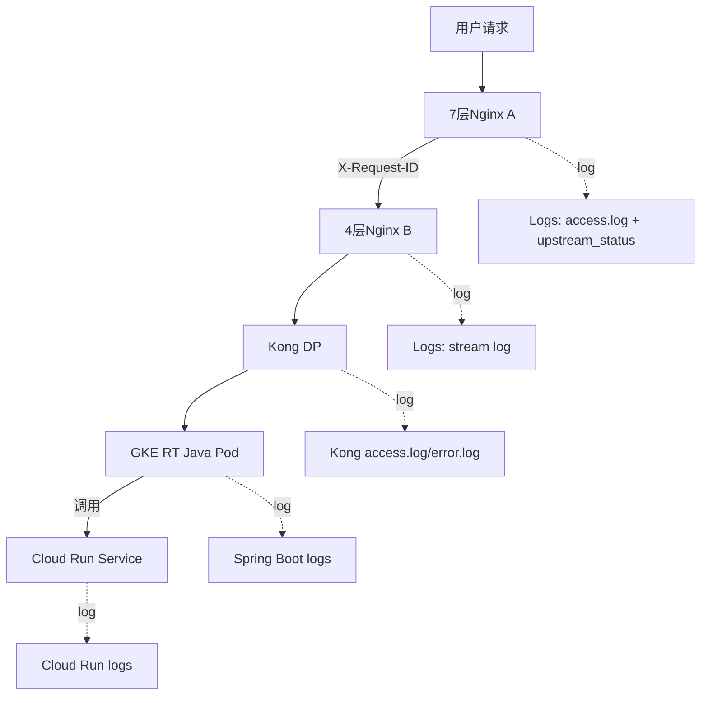

- [Claude](#claude)
  - [错误分类和定位表](#错误分类和定位表)
  - [架构流量路径分析](#架构流量路径分析)
  - [502错误快速诊断流程](#502错误快速诊断流程)
  - [分层日志分析策略](#分层日志分析策略)
    - [1. A层 (7层Nginx) 日志分析](#1-a层-7层nginx-日志分析)
    - [2. B层 (4层Nginx) 日志分析](#2-b层-4层nginx-日志分析)
    - [3. Kong DP 日志分析](#3-kong-dp-日志分析)
    - [4. 应用层 (GKE Runtime) 诊断](#4-应用层-gke-runtime-诊断)
  - [Java Spring应用502问题分析](#java-spring应用502问题分析)
    - [常见502触发场景](#常见502触发场景)
    - [Spring Boot应用监控配置](#spring-boot应用监控配置)
  - [分布式链路追踪实现](#分布式链路追踪实现)
    - [1. 请求ID传递链](#1-请求id传递链)
    - [2. 外部服务调用监控](#2-外部服务调用监控)
  - [502错误排查清单](#502错误排查清单)
  - [自动化监控脚本](#自动化监控脚本)
- [Claude 2](#claude-2)
- [云服务 API 架构 502 错误调试指南](#云服务-api-架构-502-错误调试指南)
  - [架构流程图](#架构流程图)
  - [502 错误快速定位策略](#502-错误快速定位策略)
    - [1. 日志分层收集配置](#1-日志分层收集配置)
    - [2. Kong DP 日志配置](#2-kong-dp-日志配置)
    - [3. GKE Runtime Java Spring 配置](#3-gke-runtime-java-spring-配置)
  - [快速调试流程](#快速调试流程)
  - [调试命令集合](#调试命令集合)
    - [1. 实时日志监控](#1-实时日志监控)
    - [2. 健康检查脚本](#2-健康检查脚本)
  - [Java Spring 应用调试配置](#java-spring-应用调试配置)
    - [1. 请求追踪配置](#1-请求追踪配置)
    - [2. 外部服务调用监控](#2-外部服务调用监控-1)
  - [错误分类和定位表](#错误分类和定位表-1)
  - [监控告警配置](#监控告警配置)
- [ChatGPT](#chatgpt)
- [**问题分析**](#问题分析)
- [**解决方案（现场快速定位与处置清单 — 优先级顺序）**](#解决方案现场快速定位与处置清单--优先级顺序)
  - [**1) 立刻收集关键字段（来自用户或前端）**](#1-立刻收集关键字段来自用户或前端)
  - [**2) 在 A（L7 Nginx）上快速查 access/error log**](#2-在-al7-nginx上快速查-accesserror-log)
  - [**3) 在 B（L4 Nginx / TCP）上检查（如果 B 有 TCP 层日志）**](#3-在-bl4-nginx--tcp上检查如果-b-有-tcp-层日志)
  - [**4) 在 Kong DP（C）上查 proxy / error log \& admin API**](#4-在-kong-dpc上查-proxy--error-log--admin-api)
  - [**5) 定位负责该请求的 GKE 后端 Pod（D）**](#5-定位负责该请求的-gke-后端-podd)
  - [**6) 从 Pod 内部复现实测（追踪到 D 后端）**](#6-从-pod-内部复现实测追踪到-d-后端)
  - [**7) 如果后端调用外部服务（例如 Cloud Run），在后端 Pod 内做外部调用检查**](#7-如果后端调用外部服务例如-cloud-run在后端-pod-内做外部调用检查)
  - [**8) 收集 Java（Spring）侧的诊断信息**](#8-收集-javaspring侧的诊断信息)
  - [**9) 网络层抓包（必要时）**](#9-网络层抓包必要时)
  - [**10) 在日志中心/BigQuery 里做关联查询（若你们已把日志集中）**](#10-在日志中心bigquery-里做关联查询若你们已把日志集中)
- [**快速判断常见日志关键字（在各层寻找这些关键词）**](#快速判断常见日志关键字在各层寻找这些关键词)
- [**典型修复建议（根据排查结果采取）**](#典型修复建议根据排查结果采取)
- [**示例配置与日志格式（建议长期改进）**](#示例配置与日志格式建议长期改进)
- [**运行演练（incident runbook 快速版）**](#运行演练incident-runbook-快速版)
- [**流程图（快速 triage 流程）**](#流程图快速-triage-流程)
- [**注意事项（Operations / 安全 / 最佳实践）**](#注意事项operations--安全--最佳实践)
- [**你现在可以立刻做的三件事（最小集合）**](#你现在可以立刻做的三件事最小集合)
  - [你选哪一个？](#你选哪一个)
- [ChatGPT](#chatgpt-1)
  - [**1. 问题分析**](#1-问题分析)
  - [**2. 解决方案**](#2-解决方案)
    - [**(1) 给每个请求加** ](#1-给每个请求加)
    - [**Correlation ID**](#correlation-id)
    - [**(2) 各层日志关键字段**](#2-各层日志关键字段)
    - [**(3) Debug 步骤**](#3-debug-步骤)
  - [**3. 示例代码/日志格式**](#3-示例代码日志格式)
  - [**4. 流程图**](#4-流程图)
  - [**5. 注意事项**](#5-注意事项)

# Claude

## 错误分类和定位表

| 错误状态码 | 可能位置   | 排查重点      | 常见原因                 |
| ---------- | ---------- | ------------- | ------------------------ |
| 502        | 7 层 Nginx | upstream 连接 | 4 层 Nginx 宕机/配置错误 |
| 502        | 4 层 Nginx | backend 连接  | Kong DP 服务不可达       |
| 502        | Kong DP    | upstream 服务 | GKE RT Pod 重启/异常     |
| 500        | GKE RT     | 应用逻辑      | 代码异常/依赖服务异常    |
| 504        | 任意层     | 超时配置      | 请求处理时间过长         |


```
我们是谷歌平台上的一个云服务API的提供商,我们是做的API的接入,我们的基础架构是这样的。
流量路径:
用户请求 -> A(7层Nginx instance ) -> B(4层Nginx instance) -> C (GKE KongDP) --> D (GKE RT)
7层的配置一个域名然后根据nginx location path 来分发用户请求,其实对应的Location Path就是用户的API-NAME 
我现在在探索一个如何debug用户的问题 比如说我们会在日志里面看到 有用户的请求是502 对于502的请求我如何去快速debug 
用户为什么出现这个问题 因为我也在思考可能最终的问题 出在用户的最终的这个GKE的Runtime
 那么对于用户的这个业务流程 我如何去把控 比如说它是一个JavaSpring开发的一个应用程序 那么其对应 比如说要返回一些对应的请求 它是一个POST的请求 进来的时候它要返回对应的数据? 那么它是如何工作的 
因为很明显,在我的整个服务的follow流程当中有很多跳点, 那么关于这些不同的跳点记录的日志, 我如何快速地定位是我的上游还是我的下游返回的状态码等等, 这些问题我也需要深入地了解。 又比如,我最终运行在我的JKEY Runtime里面的这个POD, 它会请求一个另外工程的一个对应的服务, 比如说,我会请求另外工程的一个Cloud Run, 那么,这个时候,我对应的这个POD, 抛出来了错误异常,我应该如何去分析, 比如说,我代码里面定义的500,或者超时,等等,类似请求。
因为我们是GCP平台,所以,所有的日志都会记录在Logs Explorer
我这里给一些例子
```
基于您的架构描述，我来为您提供一个完整的502错误诊断和调试方案。

## 架构流量路径分析



## 502错误快速诊断流程



## 分层日志分析策略

### 1. A层 (7层Nginx) 日志分析

```bash
# 查看502错误的请求
tail -f /appvol/nginx/logs/access.log | grep " 502 "

# 按request_id追踪特定请求
grep "your_request_id" /appvol/nginx/logs/access.log /appvol/nginx/logs/error.log
```

**A层日志格式解析:**

| 字段 | 说明 | 502诊断价值 |
|------|------|-------------|
| $status | HTTP状态码 | 确认是否在此层产生502 |
| $request_id | 请求唯一ID | 跨层追踪请求 |
| $upstream_response_time | 上游响应时间 | 识别超时问题 |
| $upstream_status | 上游状态码 | 区分上游错误 |

### 2. B层 (4层Nginx) 日志分析

```bash
# 查看TCP连接异常
tail -f /opt/log/abc.log | grep -E "(timeout|refused|failed)"

# 分析连接时间和字节传输
awk '{print $4, $5, $6, $7}' /opt/log/abc.log | sort | uniq -c
```

### 3. Kong DP 日志分析

```bash
# 查看Kong访问日志中的502
kubectl logs -n kong-system deployment/kong-dp | grep "502"

# 检查Kong健康检查日志
kubectl logs -n kong-system deployment/kong-dp | grep -E "(upstream|health)"
```

### 4. 应用层 (GKE Runtime) 诊断

```bash
# 查看Pod状态和事件
kubectl describe pod <pod-name> -n <namespace>

# 查看应用日志中的异常
kubectl logs <pod-name> -n <namespace> --tail=1000 | grep -E "(ERROR|Exception|500)"

# 监控Pod资源使用
kubectl top pod <pod-name> -n <namespace>
```

## Java Spring应用502问题分析

### 常见502触发场景



### Spring Boot应用监控配置

```yaml
# application.yml
management:
  endpoints:
    web:
      exposure:
        include: health,metrics,info
  endpoint:
    health:
      show-details: always
      
server:
  tomcat:
    connection-timeout: 30s
    max-connections: 200
    threads:
      max: 200
      min-spare: 10

logging:
  level:
    org.springframework.web: DEBUG
    your.package.name: DEBUG
  pattern:
    console: "%d{yyyy-MM-dd HH:mm:ss} [%thread] %-5level [%X{traceId}] %logger{36} - %msg%n"
```

## 分布式链路追踪实现

### 1. 请求ID传递链

```nginx
# A层添加request_id
proxy_set_header X-Request-ID $request_id;
```

```java
// Spring Boot中获取和传递request_id
@Component
public class RequestIdFilter implements Filter {
    @Override
    public void doFilter(ServletRequest request, ServletResponse response, FilterChain chain) {
        HttpServletRequest httpRequest = (HttpServletRequest) request;
        String requestId = httpRequest.getHeader("X-Request-ID");
        if (requestId == null) {
            requestId = UUID.randomUUID().toString();
        }
        MDC.put("traceId", requestId);
        chain.doFilter(request, response);
        MDC.clear();
    }
}
```

### 2. 外部服务调用监控

```java
@Component
public class HttpClientConfig {
    
    @Bean
    public RestTemplate restTemplate() {
        RestTemplate template = new RestTemplate();
        template.getInterceptors().add(new LoggingInterceptor());
        return template;
    }
    
    private static class LoggingInterceptor implements ClientHttpRequestInterceptor {
        @Override
        public ClientHttpResponse intercept(
                HttpRequest request, 
                byte[] body, 
                ClientHttpRequestExecution execution) throws IOException {
            
            long startTime = System.currentTimeMillis();
            String traceId = MDC.get("traceId");
            
            // 添加trace header
            request.getHeaders().add("X-Request-ID", traceId);
            
            try {
                ClientHttpResponse response = execution.execute(request, body);
                long duration = System.currentTimeMillis() - startTime;
                
                log.info("HTTP_CALL traceId={} method={} url={} status={} duration={}ms", 
                    traceId, request.getMethod(), request.getURI(), 
                    response.getStatusCode(), duration);
                    
                return response;
            } catch (Exception e) {
                long duration = System.currentTimeMillis() - startTime;
                log.error("HTTP_CALL_ERROR traceId={} method={} url={} error={} duration={}ms", 
                    traceId, request.getMethod(), request.getURI(), e.getMessage(), duration);
                throw e;
            }
        }
    }
}
```

## 502错误排查清单

| 检查层级 | 检查项 | 排查命令 | 问题指标 |
|----------|--------|----------|----------|
| A层Nginx | 上游连接 | `nginx -t && systemctl status nginx` | connection refused |
| B层Nginx | TCP代理 | `netstat -tlnp \| grep 8081` | 端口监听状态 |
| Kong DP | 服务发现 | `kubectl get svc -n kong-system` | Service端点 |
| K8s Pod | 资源状态 | `kubectl top pods` | CPU/内存使用 |
| 应用层 | 业务逻辑 | `kubectl logs <pod> \| grep ERROR` | 应用异常 |

## 自动化监控脚本

```bash
#!/bin/bash
# 502错误自动诊断脚本

API_NAME=$1
NAMESPACE=$2
TIME_RANGE="5m"

echo "=== 502错误诊断开始 ==="
echo "API: $API_NAME"
echo "时间范围: $TIME_RANGE"

# 1. 检查A层502错误
echo "1. 检查A层Nginx 502错误"
grep " 502 " /appvol/nginx/logs/access.log | tail -10

# 2. 检查Kong DP状态
echo "2. 检查Kong DP状态"
kubectl get pods -n kong-system | grep kong-dp

# 3. 检查目标Pod状态
echo "3. 检查应用Pod状态"
kubectl get pods -n $NAMESPACE | grep $API_NAME

# 4. 检查最近的错误日志
echo "4. 检查应用错误日志"
kubectl logs -n $NAMESPACE deployment/$API_NAME --since=$TIME_RANGE | grep -E "(ERROR|Exception|502)"

# 5. 检查资源使用情况
echo "5. 检查资源使用"
kubectl top pods -n $NAMESPACE | grep $API_NAME
```

这个方案可以帮助您快速定位502错误的根本原因，通过分层日志分析和链路追踪，精确识别问题出现在哪个组件层级。


# Claude 2

# 云服务 API 架构 502 错误调试指南

## 架构流程图



## 502 错误快速定位策略

### 1. 日志分层收集配置

```bash
# 7层Nginx配置示例
server {
    server_name api.example.com;

    location /api-name-1/ {
        access_log /var/log/nginx/api-name-1.access.log main;
        error_log /var/log/nginx/api-name-1.error.log;
        proxy_pass http://4layer-nginx;

        # 关键调试headers
        proxy_set_header X-Request-ID $request_id;
        proxy_set_header X-Real-IP $remote_addr;
        proxy_set_header X-Forwarded-For $proxy_add_x_forwarded_for;
    }
}

# 4层Nginx配置
upstream gke-kong {
    server kong-dp-service:8000;
    # 健康检查
    keepalive 32;
}

log_format upstream_time '$remote_addr - $remote_user [$time_local] '
                        '"$request" $status $body_bytes_sent '
                        '"$upstream_addr" "$upstream_status" '
                        '$upstream_response_time $request_time';
```

### 2. Kong DP 日志配置

```yaml
# Kong配置
apiVersion: v1
kind: ConfigMap
metadata:
  name: kong-config
data:
  kong.conf: |
    log_level = info
    proxy_access_log = /dev/stdout
    proxy_error_log = /dev/stderr
    admin_access_log = /dev/stdout
    admin_error_log = /dev/stderr

    # 启用请求追踪
    plugins = bundled,correlation-id
```

### 3. GKE Runtime Java Spring 配置

```yaml
# application.yml
logging:
  level:
    com.yourcompany: DEBUG
    org.springframework.web: DEBUG
    org.springframework.web.client: DEBUG
  pattern:
    console: "%d{yyyy-MM-dd HH:mm:ss} [%thread] %-5level [%X{traceId:-},%X{spanId:-}] %logger{36} - %msg%n"

management:
  endpoints:
    web:
      exposure:
        include: health,info,metrics,httptrace
  endpoint:
    health:
      show-details: always
```

## 快速调试流程



## 调试命令集合

### 1. 实时日志监控

```bash
# 多层日志实时监控
#!/bin/bash
# debug-502.sh

REQUEST_ID=$1
TIMESTAMP=$2

echo "=== 7层Nginx日志 ==="
kubectl logs -f nginx-7layer-pod | grep "$REQUEST_ID"

echo "=== 4层Nginx日志 ==="
kubectl logs -f nginx-4layer-pod | grep "$REQUEST_ID"

echo "=== Kong DP日志 ==="
kubectl logs -f -n kong kong-dp-deployment | grep "$REQUEST_ID"

echo "=== GKE RT日志 ==="
kubectl logs -f -n runtime your-app-pod | grep "$REQUEST_ID"
```

### 2. 健康检查脚本

```bash
#!/bin/bash
# health-check.sh

API_NAME=$1
DOMAIN=$2

# 检查各层健康状态
echo "=== 检查7层Nginx ==="
curl -I "http://$DOMAIN/$API_NAME/health"

echo "=== 检查Kong DP ==="
kubectl exec -n kong kong-dp-pod -- curl -I localhost:8001/status

echo "=== 检查GKE RT ==="
kubectl get pods -n runtime -l app=$API_NAME
kubectl top pods -n runtime -l app=$API_NAME
```

## Java Spring 应用调试配置

### 1. 请求追踪配置

```java
// TraceFilter.java
@Component
public class TraceFilter implements Filter {

    @Override
    public void doFilter(ServletRequest request, ServletResponse response,
                        FilterChain chain) throws IOException, ServletException {

        HttpServletRequest httpRequest = (HttpServletRequest) request;
        HttpServletResponse httpResponse = (HttpServletResponse) response;

        String requestId = httpRequest.getHeader("X-Request-ID");
        if (requestId == null) {
            requestId = UUID.randomUUID().toString();
        }

        MDC.put("requestId", requestId);
        MDC.put("apiName", extractApiName(httpRequest.getRequestURI()));

        long startTime = System.currentTimeMillis();

        try {
            chain.doFilter(request, response);
        } finally {
            long duration = System.currentTimeMillis() - startTime;
            logger.info("Request completed: {} {} - Status: {} - Duration: {}ms",
                       httpRequest.getMethod(), httpRequest.getRequestURI(),
                       httpResponse.getStatus(), duration);
            MDC.clear();
        }
    }
}
```

### 2. 外部服务调用监控

```java
// ExternalServiceClient.java
@RestController
public class ExternalServiceClient {

    @Autowired
    private RestTemplate restTemplate;

    public ResponseEntity<String> callCloudRun(String data) {
        String requestId = MDC.get("requestId");

        HttpHeaders headers = new HttpHeaders();
        headers.set("X-Request-ID", requestId);
        headers.set("Content-Type", "application/json");

        HttpEntity<String> entity = new HttpEntity<>(data, headers);

        try {
            long startTime = System.currentTimeMillis();
            ResponseEntity<String> response = restTemplate.postForEntity(
                "https://cloudrun-service-url/api", entity, String.class);

            long duration = System.currentTimeMillis() - startTime;

            logger.info("External call completed - URL: {} - Status: {} - Duration: {}ms",
                       "https://cloudrun-service-url/api",
                       response.getStatusCode(), duration);

            return response;

        } catch (HttpClientErrorException | HttpServerErrorException e) {
            logger.error("External call failed - Status: {} - Body: {}",
                        e.getStatusCode(), e.getResponseBodyAsString());
            throw new ExternalServiceException("Cloud Run调用失败", e);
        } catch (ResourceAccessException e) {
            logger.error("External call timeout or connection error", e);
            throw new ExternalServiceException("连接超时", e);
        }
    }
}
```

## 错误分类和定位表

| 错误状态码 | 可能位置   | 排查重点      | 常见原因                 |
| ---------- | ---------- | ------------- | ------------------------ |
| 502        | 7 层 Nginx | upstream 连接 | 4 层 Nginx 宕机/配置错误 |
| 502        | 4 层 Nginx | backend 连接  | Kong DP 服务不可达       |
| 502        | Kong DP    | upstream 服务 | GKE RT Pod 重启/异常     |
| 500        | GKE RT     | 应用逻辑      | 代码异常/依赖服务异常    |
| 504        | 任意层     | 超时配置      | 请求处理时间过长         |

## 监控告警配置

```yaml
# prometheus-rules.yaml
groups:
  - name: api-502-errors
    rules:
      - alert: High502ErrorRate
        expr: rate(nginx_http_requests_total{status="502"}[5m]) > 0.1
        for: 2m
        labels:
          severity: critical
        annotations:
          summary: "API {{ $labels.api_name }} 502错误率过高"
          description: "在过去5分钟内，502错误率超过10%"

      - alert: PodRestartFrequent
        expr: increase(kube_pod_container_status_restarts_total[1h]) > 3
        labels:
          severity: warning
        annotations:
          summary: "Pod重启频繁: {{ $labels.pod }}"
```

通过这套完整的调试体系，你可以快速定位 502 错误的根本原因，并建立有效的监控和预警机制。关键是要在每一层都记录详细的日志，并使用统一的 Request ID 进行全链路追踪。

# ChatGPT

# **问题分析**

502（Bad Gateway）通常表示**上游服务没有正确返回给下游代理/网关**——常见原因有：上游进程崩溃/抛异常、上游超时、连接被重置、没有可用后端（health check fail）、上游返回了非法/不完整的响应，或网络层（SYN/RST/DNS）问题。

在你的链路里（用户 -> A L7 Nginx -> B L4 Nginx -> C Kong DP -> D GKE Runtime）任何一跳都能产生 502，关键是**快速定位是哪一跳失败并收集可复现证据**（时间、request-id、path、client ip、上游地址/端口、错误日志片段、对应的 K8s Pod）。

---

# **解决方案（现场快速定位与处置清单 — 优先级顺序）**

下面给出一个可复制的“事故演练/排查”清单（含命令、日志片段示例与判断要点）。把每一步作为 runbook 执行并把得到的信息写入工单/告警 Ticket。

## **1) 立刻收集关键字段（来自用户或前端）**

- 时间戳（精确到秒）
- 请求路径/方法（POST /api/xyz）
- 客户端 IP
- 任意 Request-Id（若无，尽量使用 access log 的字段）

> 有 request-id 的场景排查速度会显著提升。建议在入口 A 增加 X-Request-Id（若客户端未带则由 A 生成并向下游透传）。

## **2) 在 A（L7 Nginx）上快速查 access/error log**

```
# 按时间和状态筛选（假设日志格式 standard，$status 在第9列）
sudo awk '$9==502 && $4 ~ /2025-09-19/ {print $0}' /var/log/nginx/access.log | tail -100

# 如果已记录 X-Request-Id，可按该字段筛选（示例）
sudo awk -F'"' '/<REQUEST_PATH>/ && /502/ {print $0}' /var/log/nginx/access.log | grep "<REQUEST_ID>"
sudo tail -n 200 /var/log/nginx/error.log
```

**判断要点**：看 upstream 字段（如果有）是哪台上游 IP/端口；是否有 connect() failed、upstream timed out、recv() failed 之类的 error。

## **3) 在 B（L4 Nginx / TCP）上检查（如果 B 有 TCP 层日志）**

```
# 查看 connection reset/timeout 信息
sudo tail -n 200 /var/log/nginx/error.log
# 或 netstat 检查短时大量 TIME_WAIT / RST
sudo ss -tanp | head
```

**判断要点**：是否为 L4 层就断开（TCP RST）或者 B 没把请求正确转发到 C。

## **4) 在 Kong DP（C）上查 proxy / error log & admin API**

```
# 本地查看日志（容器/Pod）
kubectl -n kong logs <kong-dp-pod> -c proxy --since=5m | tail -200

# Kong Admin API 查看 upstream / targets 健康
curl -s http://127.0.0.1:8001/upstreams | jq
curl -s http://127.0.0.1:8001/upstreams/<upstream-id>/health | jq

# 查看最近的 502 相关条目（如果 Kong 有 request-id header）
kubectl -n kong logs <kong-dp-pod> -c proxy --since=1h | grep '502' | tail -50
```

**判断要点**：Kong 报的是 no live upstream / upstream timed out / connect failed 还是只是转发收到 502（上游返回）？同时看 proxy_latency 与 upstream_latency。

## **5) 定位负责该请求的 GKE 后端 Pod（D）**

```
# 查 Service -> endpoints -> Pod IP
kubectl -n <ns> get svc <service-name> -o yaml
kubectl -n <ns> get endpoints <service-name> -o wide

# 如果有 request-id，按 Pod 日志查
kubectl -n <ns> logs -l app=<app-label> --since=10m | grep "<REQUEST_ID>" -n

# 精准查看某 Pod 日志
kubectl -n <ns> logs <pod-name> -c <container> --since=10m | sed -n '1,200p'
kubectl -n <ns> describe pod <pod-name>
kubectl -n <ns> get events --sort-by='.metadata.creationTimestamp' | tail -50
```

**判断要点**：应用是否抛出异常堆栈（500）？是否有超时/连接下游异常？Pod 是否频繁重启（CrashLoopBackOff）或 OOMKilled？

## **6) 从 Pod 内部复现实测（追踪到 D 后端）**

```
# 在集群内跑一个短暂 debug pod，并从集群内向服务发请求（避免外部网络差异）
kubectl -n <ns> run -it --rm debugcurl --image=radial/busyboxplus:curl --restart=Never -- sh
# 然后在 pod 里
curl -v -H "X-Request-Id: <REQUEST_ID>" "http://<service-cluster-ip>:<port>/path"
```

**判断要点**：能否从集群内成功访问后端？如果内部访问正常，说明可能是 Kong->Pod 的某种网络/路由/conn-limit 问题或跨节点问题。

## **7) 如果后端调用外部服务（例如 Cloud Run），在后端 Pod 内做外部调用检查**

```
# 在后端 Pod 内做外部请求（看是否超时/SSL/500）
curl -v "https://abcd.a.run.app/endpoint" -H "Host: abcd.a.run.app" --max-time 15
# 若需要 DNS/路由层面抓包
tcpdump -i any -n host <cloud-run-ip> and port 443 -c 200 -w /tmp/capture.pcap
```

**判断要点**：是外部服务返回 5xx/timeout，还是 TLS 握手失败，或 DNS 解析不一致。

## **8) 收集 Java（Spring）侧的诊断信息**

```
# 如果能进入容器，查看最近的 JVM 崩溃/Garbage collection 日志与应用日志
kubectl -n <ns> exec -it <pod> -- ps aux | grep java

# 生成线程快照（jstack），或用 jcmd 获取堆栈/heap/info（容器需安装 JDK 工具）
kubectl -n <ns> exec -it <pod> -- jstack <pid> > /tmp/thread_dump.txt
kubectl -n <ns> cp <ns>/<pod>:/tmp/thread_dump.txt ./thread_dump.txt

# 查看 Spring Actuator（如果启用）
curl -s http://<pod-ip>:<port>/actuator/health
curl -s http://<pod-ip>:<port>/actuator/metrics/http.server.requests | jq
```

**判断要点**：是否线程耗尽（大量 BLOCKED），GC Stop-the-world 导致请求阻塞，或连接池耗尽（HikariCP maxPoolSize）导致抛错。

## **9) 网络层抓包（必要时）**

```
# 在节点或 pod 内抓包，用 request-id 或目标 port 过滤
tcpdump -i any -nn host <client-ip> and port <port> -w /tmp/trace.pcap -c 500
# 本地用 tshark/wireshark 打开并过滤 TCP RST / retransmissions
```

**判断要点**：是否出现大量 RST、SYN 重试、或者 MSS/片段问题。

## **10) 在日志中心/BigQuery 里做关联查询（若你们已把日志集中）**

下面给出一个 BigQuery 的示例（假设每条日志里包含 jsonPayload.request_id、component、status、timestamp）来把 A/B/C/D 的日志按 request_id 串联起来。

```
-- 找出指定 request_id 的所有日志（按时间排序）
SELECT timestamp, component, jsonPayload.message, jsonPayload.status, jsonPayload.upstream_addr
FROM `project.dataset.logs_table`
WHERE jsonPayload.request_id = "REQ-xxxxx"
ORDER BY timestamp ASC;
```

或按时间段查 502 高峰：

```
SELECT jsonPayload.component, COUNT(1) as count_502
FROM `project.dataset.logs_table`
WHERE jsonPayload.status = 502
  AND timestamp BETWEEN TIMESTAMP('2025-09-19 08:00:00') AND TIMESTAMP('2025-09-19 09:00:00')
GROUP BY jsonPayload.component
ORDER BY count_502 DESC;
```

**判断要点**：哪个组件在时间窗口里产出最多 502 —— 优先排查该组件的上下游交互。

---

# **快速判断常见日志关键字（在各层寻找这些关键词）**

- Nginx / Kong: upstream timed out, connect() failed, no live upstreams, upstream sent invalid response, recv() failed, connection reset by peer
- Java / Spring: Exception, Timeout, SocketTimeoutException, Connection refused, HikariPool - Timeout after waiting
- System / Node: OOMKilled, Killed process, segfault

---

# **典型修复建议（根据排查结果采取）**

- **上游抛 500 / 5xx**：查看后端异常堆栈，修复程序 bug；短期内考虑返回降级逻辑或限流。
- **超时（upstream timed out）**：调整 downstream（Kong/Nginx）与 upstream（app）的 timeout 配置；同时分析后端耗时原因（DB、外部 API）。
- **no live upstream / health check fail**：检查 K8s readiness probe、service endpoints、Pod 状态；修复探针或扩容。
- **连接被重置 / TCP RST**：检查资源限制（ulimit、net.core.somaxconn），检查 Keepalive 设置、NAT/Cloud NAT 会话超时、或中间防火墙。
- **线程/连接池耗尽（Java）**：提升 Tomcat/maxThreads 或优化长耗时阻塞调用；增加 Hikari 最大连接数或优化 DB 性能；考虑异步或队列化处理。
- **POST 请求的重试策略**：对非幂等请求不要盲目重试；若要重试需引入幂等键或服务端幂等实现。

---

# **示例配置与日志格式（建议长期改进）**

**1. 在每个组件加入并透传 X-Request-Id，并在日志中记录：**

```
# nginx log_format（A 层）
log_format with_reqid '$remote_addr - $remote_user [$time_local] "$request" '
                      '$status $body_bytes_sent "$http_referer" "$http_user_agent" '
                      '$request_time $upstream_response_time $upstream_status '
                      '"$upstream_addr" "$http_x_request_id"';

access_log /var/log/nginx/access.log with_reqid;
```

**2. Kong：确保 proxy log 包含 upstream_latency / kong_latency / request_id（若使用插件可进一步增强）**

**3. Java Spring（MDC 打 RequestId）示例：**

```
// 在 filter 中把 X-Request-Id 放入 MDC，方便日志追踪
String reqId = request.getHeader("X-Request-Id");
if (reqId == null) reqId = UUID.randomUUID().toString();
MDC.put("requestId", reqId);
response.setHeader("X-Request-Id", reqId);
filterChain.doFilter(request, response);
MDC.clear();
```

---

# **运行演练（incident runbook 快速版）**

1. 收集 request_id + 时间。
2. 查询 A 的 access.log，记录 upstream_addr/port 与 upstream_status。
3. 查询 C(Kong) 的日志 & admin API，确认 upstream 健康。
4. 定位目标 Service/Pod（kubectl get endpoints），拉取 Pod 日志。
5. 从集群内用 curl 复现请求并观察差异。
6. 若 Pod 调外部服务，再从 Pod 发起外部请求做复现。
7. 如必要抓包（tcpdump）分析 TCP 层。
8. 收集 Java 线程 / heap / GC 信息（jstack / jmap / gc logs）。
9. 根据根因制定短中长期修复（timeout、扩容、代码修复、重试/幂等、健康探针调整）。
10. 归档本次事件（时间线、root cause、变更项、回滚策略、预防措施）。

---

# **流程图（快速 triage 流程）**



---

# **注意事项（Operations / 安全 / 最佳实践）**

- **不要在生产里盲目增加重试机制用于 POST**，先分析幂等性与副作用。
- **全链路透传唯一请求 ID（X-Request-Id）并集中日志**，便于在 BigQuery/Logging 中 join。
- 开启并收集**分布式追踪（OpenTelemetry/Jaeger/Zipkin）**，能把延迟/错误点直接可视化。
- 为 Java 后端开启 Actuator（/health、/metrics）并导出到 Prometheus；设置关键的 alert（5xx 增加、请求延迟升高、线程数接近上限）。
- 在 Nginx / Kong 层设置合理的 proxy_connect_timeout / proxy_read_timeout / proxy_send_timeout，并记录 upstream_response_time 与 request_time。
- 生产变更前请 **在 staging 测试**：time-out 调整、keepalive、max_connections、probe 更改等都会影响可用性。
- 日志中避免记录敏感 PII，遵守合规与隐私策略。

---

# **你现在可以立刻做的三件事（最小集合）**

1. 确保入口 A 生成或透传 X-Request-Id 并写入所有组件日志（A/B/C/D）。
2. 当用户报 502 时按上面的 runbook 执行：从 A->C->D 逐跳排查并把每一步结果记录在 Ticket。
3. 尽快在测试环境开启**分布式 tracing**（OpenTelemetry）+ **集中化日志（BigQuery/Cloud Logging）**，以便下次 1 次查询定位全链路问题。

---

如果你愿意，我可以直接生成：

- 一份可复制到 A/Kong/Java 的日志配置片段（包含 X-Request-Id、log_format），
- 一份 Incident Runbook 的 Markdown 模板（带命令占位符 <REQUEST_ID>、<NAMESPACE> 等），
- 或者根据你提供的一个真实 request-id 与时间戳，帮你写好要在 BigQuery / kubectl / Kong admin API 一次性运行的具体命令列表并标注“期待输出/如何判定”。

你选哪一个？
---


# ChatGPT  


好的，我帮你把这个问题拆解一下。你现在的核心痛点是 **用户请求出现 502/500 错误时，如何快速定位到底是哪一层出了问题**。你的架构是多跳（7层Nginx → 4层Nginx → KongDP → GKE Runtime → 可能还会请求外部 Cloud Run），所以 debug 的关键是 **日志链路化** 和 **分层排查**。下面我给你一个方法论。

---

## **1. 问题分析**

  

502/500 的错误可能出现在任意一层：

- **A (7层 Nginx)**：转发错误（upstream 不可达/超时/证书问题）。
    
- **B (4层 Nginx)**：TCP/SSL 握手失败，超时。
    
- **C (KongDP)**：路由规则错误、插件失败、上游不可达。
    
- **D (GKE Runtime Java Spring Pod)**：应用抛出异常、代码定义的 500、调用外部 API 超时。
    
- **下游外部 API（Cloud Run）**：目标服务返回错误。
    

  

你的目标是：

- 快速知道错误是 **上游返回的**，还是 **本层产生的**；
    
- 确认请求在哪一层丢失或被拒绝；
    
- 在 GCP Logs Explorer 中能串起来。
    

---

## **2. 解决方案**

  

### **(1) 给每个请求加** 

### **Correlation ID**

- 在 A (7层 Nginx) 入口生成一个 X-Request-ID 并传递下去。
    
- 每一层日志都打出这个 ID，这样 Logs Explorer 里可以全链路追踪。
    

```
proxy_set_header X-Request-ID $request_id;
```

Kong、Java Spring 也要配置 log/trace，把这个 header 打出来。

---

### **(2) 各层日志关键字段**

- **A 层 (7层 Nginx)**
    
    - access.log 里记录 $request_id $status $upstream_status $upstream_response_time
        
    - 如果 $upstream_status 是空的，说明请求没送到 B 层。
        
    
- **B 层 (4层 Nginx)**
    
    - stream log 里 $status（502, 504）直接表明 TCP 建立失败。
        
    - 如果 $bytes_received 很小，说明连接未建立成功。
        
    
- **C 层 (KongDP)**
    
    - 查看 Kong access.log 和 error.log，重点看：
        
        - upstream status（是 502/504 还是 5xx 来自下游 Pod）。
            
        - Kong 插件是否拦截请求。
            
        
    
- **D 层 (Java Spring Pod)**
    
    - 查看 org.springframework.web.servlet.DispatcherServlet 日志：
        
        - 500 = 应用内部错误。
            
        - 超时 = Java HttpClient 调用外部 API 超时。
            
        
    - 应用内的 access log（比如 Spring Boot Actuator 或 logback）要打印出 URL + Status + TraceID。
        
    
- **外部 API (Cloud Run)**
    
    - 去 Cloud Run 日志看对应 traceID，如果 Cloud Run 返回 500，说明是目标服务的问题。
        
    

---

### **(3) Debug 步骤**

1. **在 A 层日志确认**：是否 502？看 upstream_status，有没有转发到 B。
    
2. **看 B 层日志**：如果 TCP 握手失败，status 会是 502，确认是不是 RT Pod 不可达。
    
3. **看 Kong 日志**：是否 plugin 拦截，还是返回的 upstream 502。
    
4. **看 RT Pod 应用日志**：如果是 Java 500，应用栈会有异常日志。
    
    - 如果是调用 Cloud Run，日志里会有 HttpClient Timeout/500。
        
    - 再去看 Cloud Run 日志对应 traceID。
        
    

---

## **3. 示例代码/日志格式**

  

A 层 access.log 格式（推荐）：

```nginx.conf
log_format correlation '$request_id $remote_addr [$time_local] '
                      '"$request" $status $upstream_status '
                      '$body_bytes_sent $request_time $upstream_response_time';
```

B 层 stream log：

```nginx.conf
log_format basic '$remote_addr [$time_local] '
                 '$protocol $status $bytes_sent $bytes_received '
                 '$session_time $ssl_preread_server_name $server_port $proxy_protocol_addr';
```

Java Spring 日志 MDC：

```java
MDC.put("requestId", request.getHeader("X-Request-ID"));
log.info("RequestId={}, method={}, uri={}, status={}", requestId, method, uri, status);
```


## **4. 流程图**



---

## **5. 注意事项**

- **务必统一日志字段**（至少要有 X-Request-ID、status、upstream_status、response_time）。
    
- **明确分层职责**：
    
    - A/B 层负责 **网络连通性**；
        
    - C 层负责 **路由和网关逻辑**；
        
    - D 层负责 **业务逻辑和外部依赖**。
        
    
- **Logs Explorer 里建议建 Dashboard**，基于 X-Request-ID 来做全链路搜索。
    
- 对于用户反馈的错误，直接根据 request_id 一键回溯整个链路。
    

---

要不要我帮你整理一个 **标准化日志字段表格**（每一层都要打哪些关键字段），这样你们团队可以直接统一规范，快速排查 502/500？