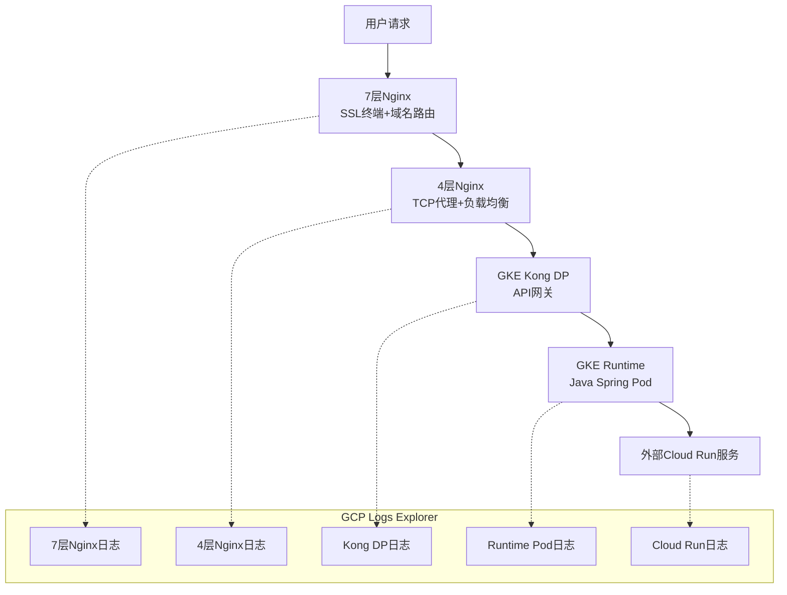

# GCP云服务API 502错误全链路调试指南

## 架构流量路径分析

### 完整流量链路



### 各层组件职责分析

| 层级 | 组件 | 主要职责 | 配置特点 | 日志位置 |
|------|------|---------|---------|---------|
| **A层** | 7层Nginx | SSL终端、域名路由、Location Path分发 | 按API-NAME配置location | `/appvol/nginx/logs/` |
| **B层** | 4层Nginx | TCP代理、负载均衡 | Stream模块、SSL预读 | `/opt/log/` |
| **C层** | Kong DP | API网关、插件处理 | K8s Service | GKE容器日志 |
| **D层** | Runtime | Java Spring应用 | K8s Pod | GKE容器日志 |
| **E层** | Cloud Run | 外部微服务 | 托管服务 | Cloud Run日志 |

## 基于实际配置的调试策略

### A层 (7层Nginx) 调试要点

**配置分析:**
```nginx
# 关键配置点
log_format correlation '$remote_addr - $remote_user [$time_local] "$status $bytes_sent" 
                       "$http_referer" "$http_user_agent" "$http_x_forwarded_for" "$request_id"';

location /api_name1_version/v1/ {
    proxy_pass https://10.98.0.188:8081/;  # 指向B层
    proxy_set_header Host www.aibang.com;
    proxy_set_header X-Real-IP $remote_addr;
}
```

**调试思路:**
1. **路由正确性**: 检查location path是否匹配用户请求
2. **上游连接**: 验证到B层(10.98.0.188:8081)的连接
3. **SSL证书**: 确认SSL配置正确

**GCP Logs Explorer查询:**
```sql
-- 查看A层502错误
resource.type="gce_instance"
resource.labels.instance_id="nginx-7layer-instance-id"
jsonPayload.status="502"
timestamp>="2024-01-15T10:00:00Z"
```

**快速诊断命令:**
```bash
# 检查A层到B层的连接
curl -I https://10.98.0.188:8081/api_name1_version/v1/health

# 查看A层访问日志中的502
grep "502" /appvol/nginx/logs/access.log | tail -20

# 检查A层错误日志
tail -50 /appvol/nginx/logs/error.log | grep -E "(upstream|proxy|ssl)"
```

### B层 (4层Nginx) 调试要点

**配置分析:**
```nginx
# Stream模块配置
server {
    listen 8081;
    ssl_preread on;           # SSL预读
    proxy_connect_timeout 5s; # 连接超时5秒
    proxy_pass 192.168.64.33:443; # 指向Kong DP
    access_log /opt/log/abc.log basic;
}
```

**调试思路:**
1. **TCP连接**: 检查到Kong DP的TCP连接状态
2. **SSL预读**: 验证SSL预读功能正常
3. **超时配置**: 确认5秒连接超时是否合理

**GCP Logs Explorer查询:**
```sql
-- 查看B层连接日志
resource.type="gce_instance"
resource.labels.instance_id="nginx-4layer-instance-id"
textPayload:("192.168.64.33" AND ("timeout" OR "refused" OR "reset"))
```

**快速诊断命令:**
```bash
# 检查B层到Kong的连接
telnet 192.168.64.33 443

# 查看B层访问日志
tail -50 /opt/log/abc.log

# 检查B层错误日志
tail -50 /appvol/nginx/logs/error.log | grep -E "(stream|upstream|proxy)"

# 检查网络连通性
ping 192.168.64.33
traceroute 192.168.64.33
```

### C层 (Kong DP) 调试要点

**在GKE中的Kong配置特点:**
- 运行在Kubernetes Pod中
- 通过Service暴露服务
- 日志输出到stdout/stderr

**调试思路:**
1. **Pod状态**: 检查Kong Pod是否正常运行
2. **Service连通性**: 验证Service到Pod的连接
3. **上游服务**: 检查到Runtime Pod的连接

**GCP Logs Explorer查询:**
```sql
-- 查看Kong DP日志
resource.type="k8s_container"
resource.labels.cluster_name="your-gke-cluster"
resource.labels.namespace_name="kong"
resource.labels.container_name="proxy"
jsonPayload.status>=500
```

**快速诊断命令:**
```bash
# 检查Kong Pod状态
kubectl get pods -n kong -l app=kong

# 查看Kong日志
kubectl logs -n kong -l app=kong -c proxy --tail=100

# 检查Kong配置
kubectl exec -n kong kong-dp-pod -- curl -s http://localhost:8001/status

# 检查Kong upstream健康状态
kubectl exec -n kong kong-dp-pod -- curl -s http://localhost:8001/upstreams
```

### D层 (GKE Runtime) 调试要点

**Java Spring应用特点:**
- 运行在GKE Pod中
- 可能调用外部Cloud Run服务
- 需要关注JVM指标和业务逻辑

**调试思路:**
1. **Pod健康状态**: 检查Pod是否正常运行
2. **JVM状态**: 监控内存、GC、线程状态
3. **业务逻辑**: 分析应用日志中的异常
4. **外部调用**: 检查对Cloud Run的调用

**GCP Logs Explorer查询:**
```sql
-- 查看Runtime Pod日志
resource.type="k8s_container"
resource.labels.cluster_name="your-gke-cluster"
resource.labels.namespace_name="runtime"
resource.labels.container_name="app"
(jsonPayload.level="ERROR" OR textPayload:"Exception" OR textPayload:"timeout")
```

**快速诊断命令:**
```bash
# 检查Runtime Pod状态
kubectl get pods -n runtime -l api=api_name1

# 查看Pod资源使用
kubectl top pods -n runtime

# 查看Pod日志
kubectl logs -n runtime -l api=api_name1 --tail=100

# 检查Pod健康状态
kubectl describe pod -n runtime pod-name

# 进入Pod检查应用状态
kubectl exec -it -n runtime pod-name -- curl http://localhost:8080/actuator/health
```

### E层 (Cloud Run) 调试要点

**Cloud Run服务特点:**
- 托管服务，自动扩缩容
- 可能存在冷启动问题
- 日志自动集成到Cloud Logging

**调试思路:**
1. **服务状态**: 检查Cloud Run服务是否正常
2. **冷启动**: 分析是否存在冷启动延迟
3. **资源限制**: 检查内存、CPU配置
4. **网络连接**: 验证从GKE到Cloud Run的网络

**GCP Logs Explorer查询:**
```sql
-- 查看Cloud Run服务日志
resource.type="cloud_run_revision"
resource.labels.service_name="your-cloud-run-service"
(severity="ERROR" OR httpRequest.status>=500)
```

## 全链路调试实战流程

### 第一步：快速定位问题层级

**使用GCP Logs Explorer进行全链路日志关联:**

```sql
-- 按时间窗口查看所有层级的502错误
(
  (resource.type="gce_instance" AND jsonPayload.status="502") OR
  (resource.type="k8s_container" AND jsonPayload.status>=500) OR
  (resource.type="cloud_run_revision" AND httpRequest.status>=500)
)
AND timestamp>="2024-01-15T10:00:00Z"
AND timestamp<="2024-01-15T11:00:00Z"
ORDER BY timestamp ASC
```

### 第二步：按层级深入分析

**A层分析脚本:**
```bash
#!/bin/bash
# debug-a-layer.sh
API_NAME=$1
TIMESTAMP=$2

echo "=== A层 (7层Nginx) 分析 ==="
echo "API: $API_NAME, 时间: $TIMESTAMP"

# 检查对应API的location配置
grep -A 5 "location /$API_NAME" /etc/nginx/conf.d/*.conf

# 查看该时间段的502错误
grep "$TIMESTAMP" /appvol/nginx/logs/access.log | grep "502"

# 检查到B层的连接
curl -I https://10.98.0.188:8081/$API_NAME/v1/health
```

**B层分析脚本:**
```bash
#!/bin/bash
# debug-b-layer.sh
TIMESTAMP=$1

echo "=== B层 (4层Nginx) 分析 ==="
echo "时间: $TIMESTAMP"

# 查看该时间段的连接日志
grep "$TIMESTAMP" /opt/log/abc.log

# 检查到Kong的连接
telnet 192.168.64.33 443

# 检查网络状态
ss -tuln | grep 8081
```

**C层分析脚本:**
```bash
#!/bin/bash
# debug-c-layer.sh
API_NAME=$1

echo "=== C层 (Kong DP) 分析 ==="
echo "API: $API_NAME"

# 检查Kong Pod状态
kubectl get pods -n kong -o wide

# 查看Kong日志
kubectl logs -n kong -l app=kong --tail=50 | grep -E "(502|upstream|timeout)"

# 检查Kong服务配置
kubectl exec -n kong kong-dp-pod -- curl -s http://localhost:8001/services | jq ".data[] | select(.name | contains(\"$API_NAME\"))"
```

**D层分析脚本:**
```bash
#!/bin/bash
# debug-d-layer.sh
API_NAME=$1

echo "=== D层 (Runtime) 分析 ==="
echo "API: $API_NAME"

# 检查Pod状态
kubectl get pods -n runtime -l api=$API_NAME -o wide

# 查看Pod资源使用
kubectl top pods -n runtime -l api=$API_NAME

# 查看应用日志
kubectl logs -n runtime -l api=$API_NAME --tail=100 | grep -E "(ERROR|Exception|timeout)"

# 检查JVM状态 (如果Pod支持)
kubectl exec -n runtime pod-name -- jstack 1 | head -50
```

### 第三步：外部服务调用分析

**分析Runtime到Cloud Run的调用:**

```bash
#!/bin/bash
# debug-external-call.sh
CLOUD_RUN_URL=$1
API_NAME=$2

echo "=== 外部服务调用分析 ==="
echo "Cloud Run URL: $CLOUD_RUN_URL"
echo "API: $API_NAME"

# 从Runtime Pod内部测试外部调用
POD_NAME=$(kubectl get pods -n runtime -l api=$API_NAME -o jsonpath='{.items[0].metadata.name}')

if [ ! -z "$POD_NAME" ]; then
    echo "从Pod内部测试外部调用..."
    kubectl exec -n runtime $POD_NAME -- curl -v -m 30 "$CLOUD_RUN_URL/health"
    
    echo "检查Pod的网络配置..."
    kubectl exec -n runtime $POD_NAME -- nslookup $(echo $CLOUD_RUN_URL | cut -d'/' -f3)
    
    echo "检查Pod的出站连接..."
    kubectl exec -n runtime $POD_NAME -- netstat -an | grep ESTABLISHED
else
    echo "未找到运行中的Pod"
fi
```

## Java Spring应用调试最佳实践

### 应用层面的观测配置

**Spring Boot配置优化:**
```yaml
# application.yml
logging:
  level:
    com.yourcompany: DEBUG
    org.springframework.web.client: DEBUG
  pattern:
    console: "%d{yyyy-MM-dd HH:mm:ss.SSS} [%thread] %-5level [%X{traceId:-}] %logger{36} - %msg%n"

management:
  endpoints:
    web:
      exposure:
        include: health,info,metrics,httptrace,loggers,threaddump,heapdump
  endpoint:
    health:
      show-details: always
    metrics:
      enabled: true

server:
  tomcat:
    max-threads: 200
    accept-count: 100
    connection-timeout: 20000
```

**外部服务调用监控:**
```java
@Component
public class CloudRunClient {
    
    private static final Logger logger = LoggerFactory.getLogger(CloudRunClient.class);
    
    @Autowired
    private WebClient webClient;
    
    public Mono<String> callCloudRunService(String data) {
        return webClient.post()
            .uri("https://your-service.a.run.app/api/endpoint")
            .bodyValue(data)
            .retrieve()
            .bodyToMono(String.class)
            .doOnSubscribe(subscription -> {
                logger.info("开始调用Cloud Run服务");
            })
            .doOnSuccess(response -> {
                logger.info("Cloud Run服务调用成功，响应长度: {}", response.length());
            })
            .doOnError(error -> {
                if (error instanceof WebClientResponseException) {
                    WebClientResponseException webError = (WebClientResponseException) error;
                    logger.error("Cloud Run服务调用失败: status={}, body={}", 
                               webError.getStatusCode(), 
                               webError.getResponseBodyAsString());
                } else {
                    logger.error("Cloud Run服务调用异常", error);
                }
            })
            .timeout(Duration.ofSeconds(30))
            .onErrorReturn("服务暂时不可用");
    }
}
```

### 异常处理和监控

**全局异常处理器:**
```java
@ControllerAdvice
public class GlobalExceptionHandler {
    
    private static final Logger logger = LoggerFactory.getLogger(GlobalExceptionHandler.class);
    
    @ExceptionHandler(Exception.class)
    public ResponseEntity<Map<String, Object>> handleException(Exception e, HttpServletRequest request) {
        String requestId = request.getHeader("X-Request-ID");
        
        logger.error("请求处理异常: requestId={}, uri={}", requestId, request.getRequestURI(), e);
        
        Map<String, Object> response = new HashMap<>();
        response.put("error", "内部服务器错误");
        response.put("requestId", requestId);
        response.put("timestamp", Instant.now().toString());
        
        return ResponseEntity.status(HttpStatus.INTERNAL_SERVER_ERROR).body(response);
    }
    
    @ExceptionHandler(TimeoutException.class)
    public ResponseEntity<Map<String, Object>> handleTimeout(TimeoutException e, HttpServletRequest request) {
        String requestId = request.getHeader("X-Request-ID");
        
        logger.error("请求超时: requestId={}, uri={}", requestId, request.getRequestURI(), e);
        
        Map<String, Object> response = new HashMap<>();
        response.put("error", "请求超时");
        response.put("requestId", requestId);
        
        return ResponseEntity.status(HttpStatus.GATEWAY_TIMEOUT).body(response);
    }
}
```

## GCP Logs Explorer高级查询技巧

### 多维度日志关联查询

**按Request ID关联全链路日志:**
```sql
-- 假设Request ID在各层都有记录
(
  (resource.type="gce_instance" AND jsonPayload.request_id="REQ-abc123") OR
  (resource.type="k8s_container" AND jsonPayload.requestId="REQ-abc123") OR
  (resource.type="cloud_run_revision" AND httpRequest.requestId="REQ-abc123")
)
ORDER BY timestamp ASC
```

**按API名称分析错误模式:**
```sql
-- 分析特定API的错误模式
resource.type="k8s_container"
resource.labels.namespace_name="runtime"
jsonPayload.apiName="api_name1"
(jsonPayload.level="ERROR" OR jsonPayload.status>=500)
timestamp>="2024-01-15T00:00:00Z"
```

**按时间窗口分析错误趋势:**
```sql
-- 分析过去24小时的502错误趋势
(
  jsonPayload.status="502" OR 
  httpRequest.status=502 OR
  textPayload:"502"
)
timestamp>="2024-01-15T00:00:00Z"
```

### 自动化监控和告警

**Cloud Monitoring告警策略:**
```yaml
# 502错误率告警
displayName: "API 502错误率过高"
conditions:
  - displayName: "502错误率超过5%"
    conditionThreshold:
      filter: 'resource.type="gce_instance" AND jsonPayload.status="502"'
      comparison: COMPARISON_GREATER_THAN
      thresholdValue: 0.05
      duration: 300s
```

## 问题解决的标准流程

### 快速响应流程 (15分钟内)

1. **确认问题范围**: 全局还是特定API?
2. **检查基础设施**: GKE集群、网络连接状态
3. **查看最近变更**: 代码部署、配置变更
4. **应急处理**: 回滚、扩容、流量切换

### 深度分析流程 (1小时内)

1. **收集全链路日志**: 使用上述脚本收集各层日志
2. **分析错误模式**: 确定是哪一层的问题
3. **根因分析**: 找到真正的根本原因
4. **制定解决方案**: 短期修复和长期优化

### 预防改进流程 (持续)

1. **完善监控**: 增加关键指标监控
2. **优化配置**: 调整超时、连接池等配置
3. **代码改进**: 增强异常处理和重试机制
4. **文档更新**: 更新运维手册和故障处理流程

通过这套完整的调试体系，你可以快速定位和解决502错误，同时建立起系统性的问题预防和处理能力。