# 云服务API 502错误调试思路与方法论

## 核心调试思维模型

### 1. 分层责任边界思维

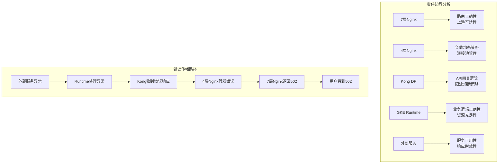

### 2. 问题定位的逆向思维

**核心原则**: 502错误是"果"不是"因"，真正的问题往往在错误发生的上游

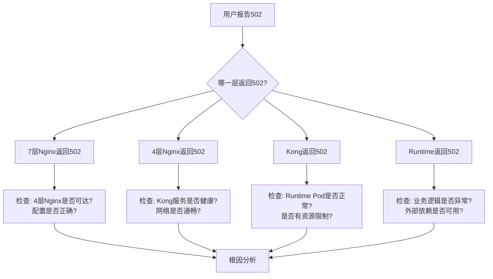

### 3. 时间维度分析思维

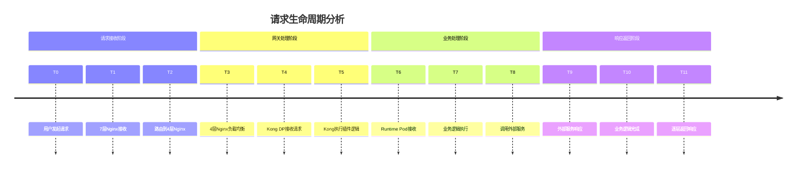

## 调试方法论框架

### 方法论1: MECE分析法 (Mutually Exclusive, Collectively Exhaustive)

**将502错误按照互斥且完全穷尽的方式分类:**

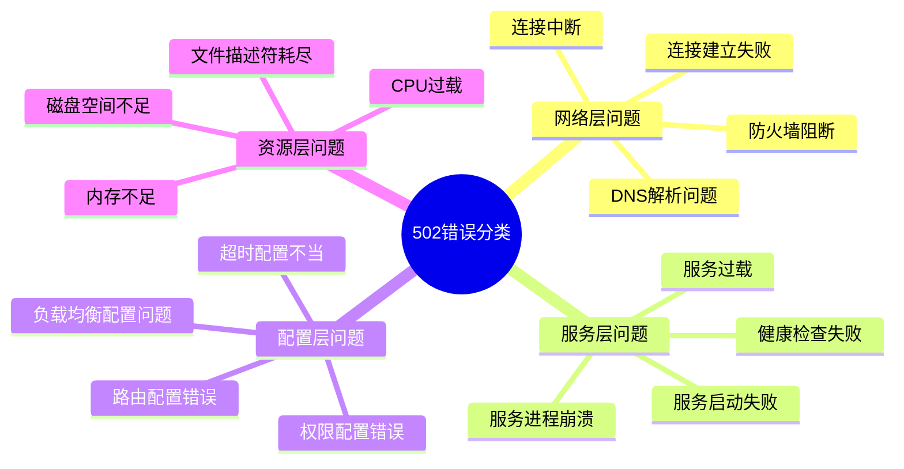

### 方法论2: 5W1H分析框架

| 维度 | 分析要点 | 调试思路 |
|------|---------|---------|
| **What** | 什么错误? | 具体的502子类型，错误消息内容 |
| **When** | 什么时候? | 错误发生的时间模式，是否有规律性 |
| **Where** | 在哪里? | 错误发生在哪一层，影响范围多大 |
| **Who** | 谁受影响? | 特定用户/API/地区，还是全局性问题 |
| **Why** | 为什么? | 根本原因分析，触发条件是什么 |
| **How** | 如何解决? | 短期缓解措施和长期根治方案 |

### 方法论3: 漏斗式排查法

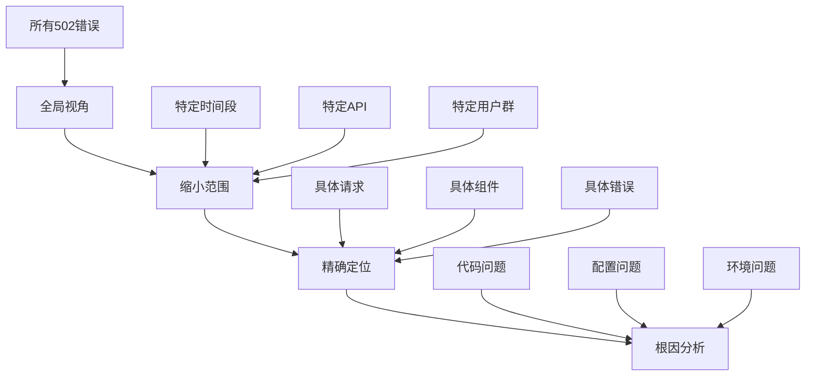

## 核心调试思路

### 思路1: 数据驱动的问题定位

**建立观测体系的思维模型:**

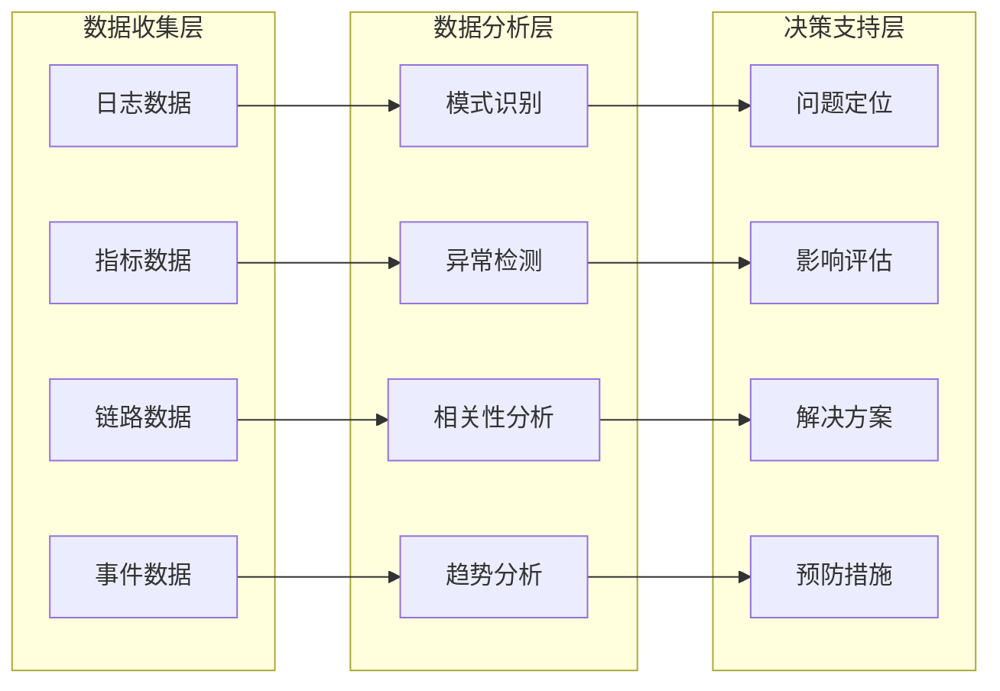

### 思路2: 假设驱动的验证方法

**科学的假设-验证循环:**

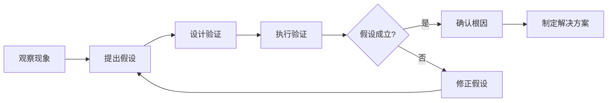

**常见假设模板:**
- 假设1: 是否为特定时间段的问题? → 验证: 分析时间分布
- 假设2: 是否为特定API的问题? → 验证: 按API维度分析
- 假设3: 是否为资源不足? → 验证: 检查资源使用率
- 假设4: 是否为外部依赖问题? → 验证: 检查外部服务状态

### 思路3: 系统性思维模型

**将问题放在整个系统上下文中思考:**

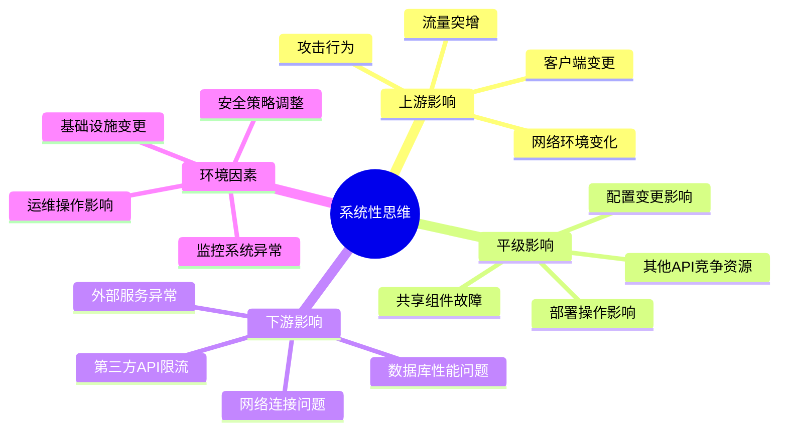

## 高效调试的思维习惯

### 1. 建立调试检查清单思维

**每次遇到502时的标准思考流程:**

```
□ 收集基础信息 (时间、范围、频率)
□ 确定错误边界 (哪一层返回的502)
□ 检查最近变更 (代码、配置、环境)
□ 分析错误模式 (随机、规律、特定条件)
□ 验证外部依赖 (网络、服务、资源)
□ 查看相关指标 (CPU、内存、连接数)
□ 分析日志关联 (错误前后的日志)
□ 制定假设列表 (按可能性排序)
□ 逐一验证假设 (从最可能开始)
□ 确认根本原因 (而非表面现象)
```

### 2. 培养全链路思维

**不要孤立地看单个组件，要考虑整个调用链:**

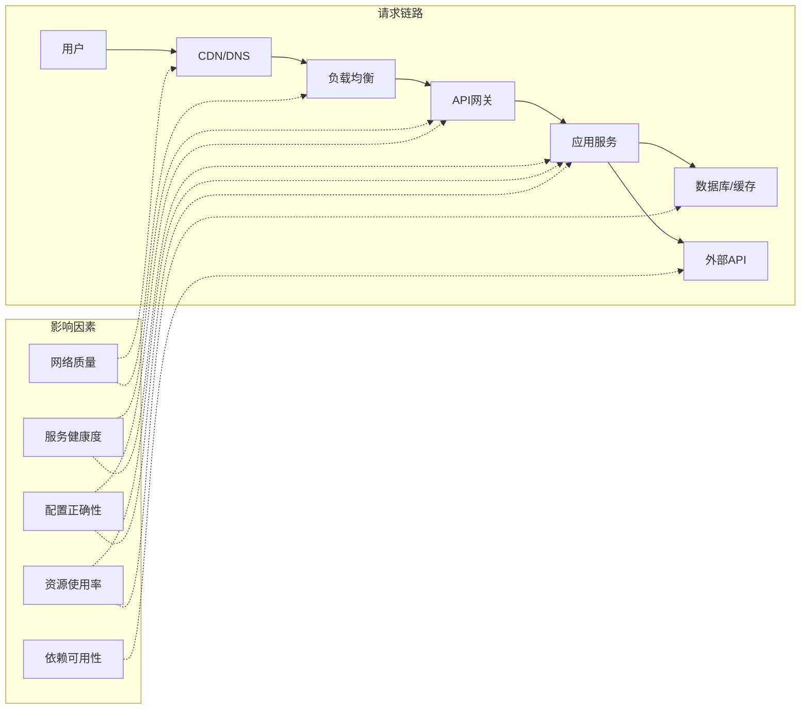

### 3. 建立问题分级思维

**根据影响范围和紧急程度分级处理:**

| 级别 | 影响范围 | 处理策略 | 时间要求 |
|------|---------|---------|---------|
| **P0** | 全局服务不可用 | 立即响应，先恢复后分析 | 15分钟内响应 |
| **P1** | 核心功能受影响 | 快速定位，并行处理 | 1小时内响应 |
| **P2** | 部分功能异常 | 系统性分析，计划处理 | 4小时内响应 |
| **P3** | 个别用户影响 | 深度分析，优化改进 | 24小时内响应 |

## 调试工具箱思维

### 工具分类思维模型

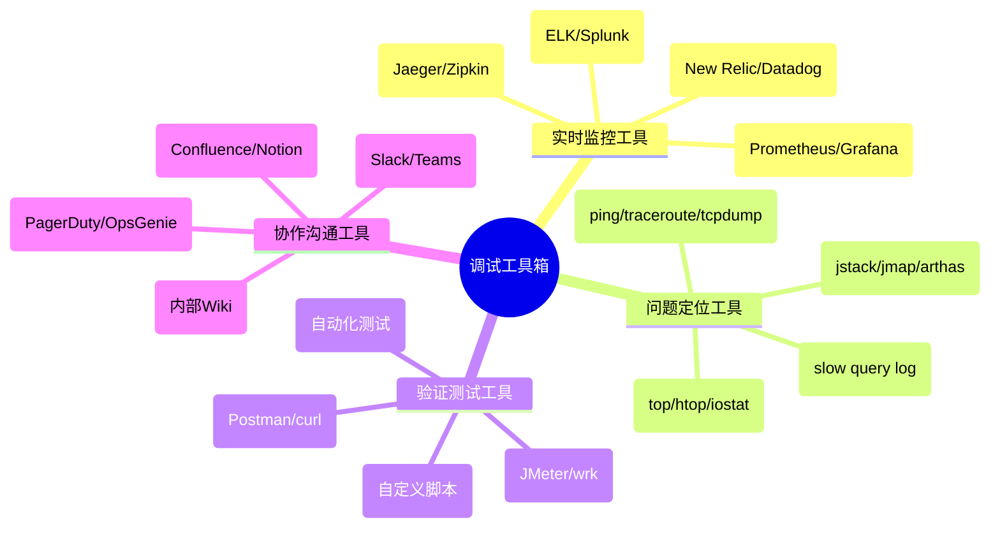

### 工具选择的思维原则

1. **就近原则**: 优先使用距离问题最近的工具
2. **效率原则**: 选择能最快给出答案的工具
3. **准确原则**: 选择数据最准确可靠的工具
4. **成本原则**: 考虑工具使用的时间和资源成本

## 预防性思维

### 建立预防体系

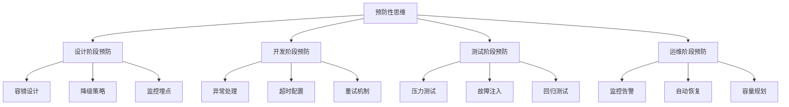

### 持续改进思维

**每次502事件后的思考框架:**

1. **事后复盘**: 问题是如何发生的？
2. **流程优化**: 如何更快发现和解决？
3. **系统加固**: 如何避免类似问题再次发生？
4. **知识沉淀**: 如何让团队从中学习？
5. **工具完善**: 需要什么新的工具或能力？

## 团队协作思维

### 建立共同语言

**统一的问题描述模板:**
```
问题标题: [时间] [影响范围] [问题类型]
问题描述: 
- 现象: 用户看到什么？
- 影响: 影响范围和程度？
- 时间: 开始时间和持续时间？
- 环境: 哪个环境/区域？

初步分析:
- 可能原因: 基于经验的初步判断
- 排查进展: 已经做了什么？
- 需要支持: 需要哪些团队协助？
```

### 分工协作模型

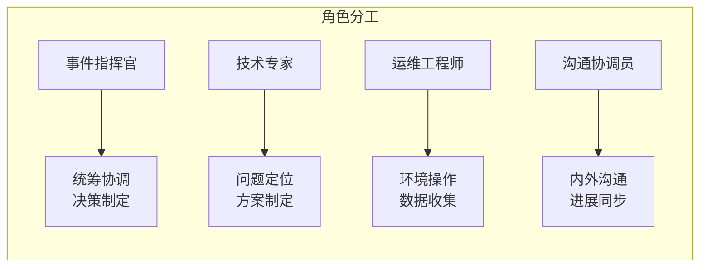

通过建立这套系统性的调试思维模型，你可以更加高效和准确地定位和解决502错误问题。关键是要培养结构化思维，建立标准化流程，并持续优化改进。

## 实践操作指南

### 核心观测能力建设思路

**建设原则**: 可观测性是调试的基础，要建立"三位一体"的观测体系

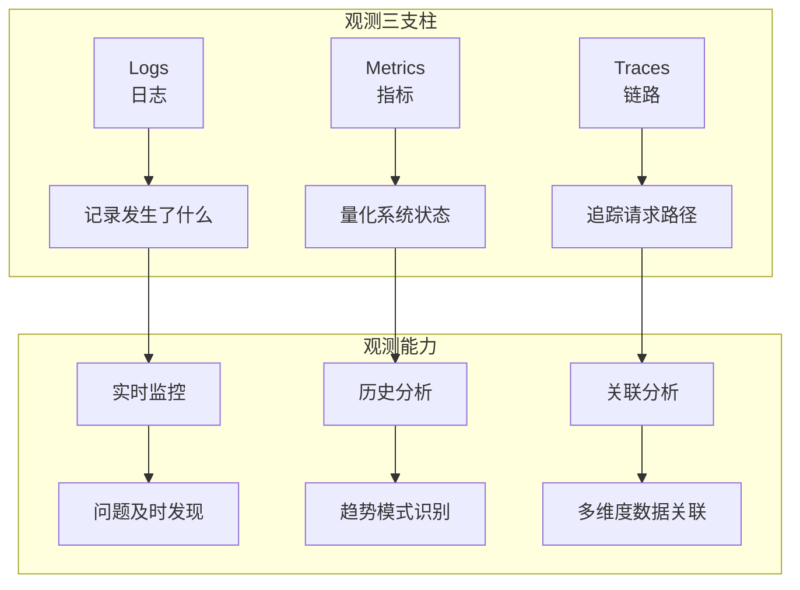

### 关键观测点设计思路

**每一层都要回答的核心问题:**

| 层级 | 核心问题 | 关键指标 | 观测重点 |
|------|---------|---------|---------|
| **7层Nginx** | 请求是否正确路由? | 请求量、响应时间、错误率 | 路由规则、上游状态 |
| **4层Nginx** | 负载均衡是否正常? | 连接数、上游健康度 | 连接池、健康检查 |
| **Kong DP** | 网关逻辑是否正确? | 插件执行时间、限流状态 | 插件链、策略执行 |
| **GKE Runtime** | 业务逻辑是否正常? | JVM指标、业务指标 | 异常堆栈、资源使用 |
| **外部服务** | 依赖是否可用? | 调用成功率、响应时间 | 服务状态、网络质量 |

### 统一追踪标识设计思路

**设计原则**: 一个请求，一个ID，全链路透传

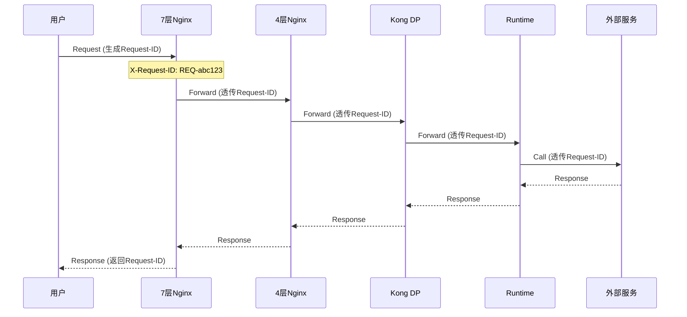

### 日志结构化设计思路

**统一日志格式的思维模型:**

```json
{
  "timestamp": "2024-01-15T10:30:00.123Z",
  "level": "INFO|WARN|ERROR",
  "component": "nginx-7layer|nginx-4layer|kong|runtime",
  "request_id": "REQ-abc123",
  "api_name": "api-name-1", 
  "event_type": "request_start|request_end|error|upstream_call",
  "message": "具体的日志消息",
  "metadata": {
    "duration_ms": 150,
    "status_code": 200,
    "upstream_addr": "10.1.1.1:8080",
    "client_ip": "192.168.1.100"
  }
}
```

## 实战调试流程

### 调试流程设计思路

**核心思想**: 快速缩小问题范围，精确定位根本原因

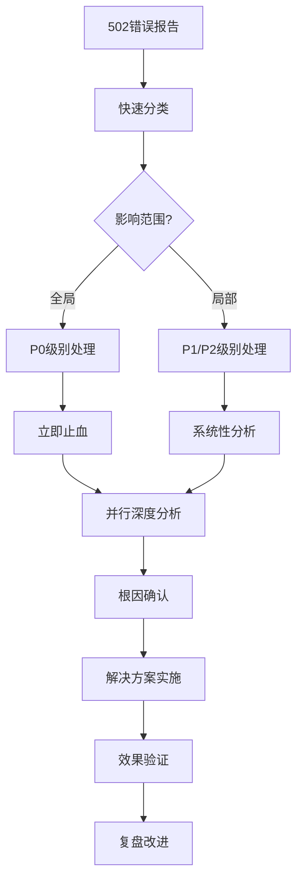

### 快速分类判断思路

**第一时间要回答的关键问题:**

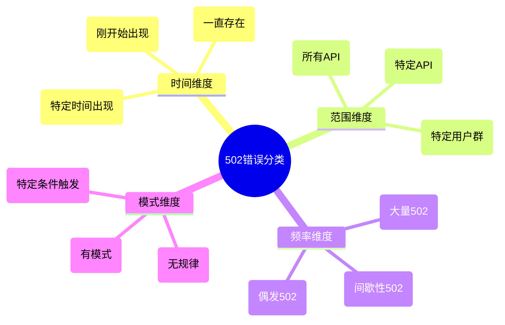

### 分层排查的思维路径

**每一层的排查重点和思路:**

| 层级 | 排查思路 | 关键问题 | 快速验证方法 |
|------|---------|---------|-------------|
| **用户层** | 问题是否真实存在? | 是否为客户端问题? | 不同客户端/网络测试 |
| **7层Nginx** | 路由是否正确? | 上游是否可达? | 检查access log和upstream状态 |
| **4层Nginx** | 负载均衡是否正常? | 后端服务是否健康? | 检查upstream健康检查 |
| **Kong DP** | 网关逻辑是否正确? | 插件是否异常? | 检查Kong admin API |
| **Runtime** | 应用是否正常? | 资源是否充足? | 检查Pod状态和日志 |
| **外部服务** | 依赖是否可用? | 网络是否通畅? | 直接调用测试 |

### 数据收集的优先级思路

**按照紧急程度和信息价值排序:**

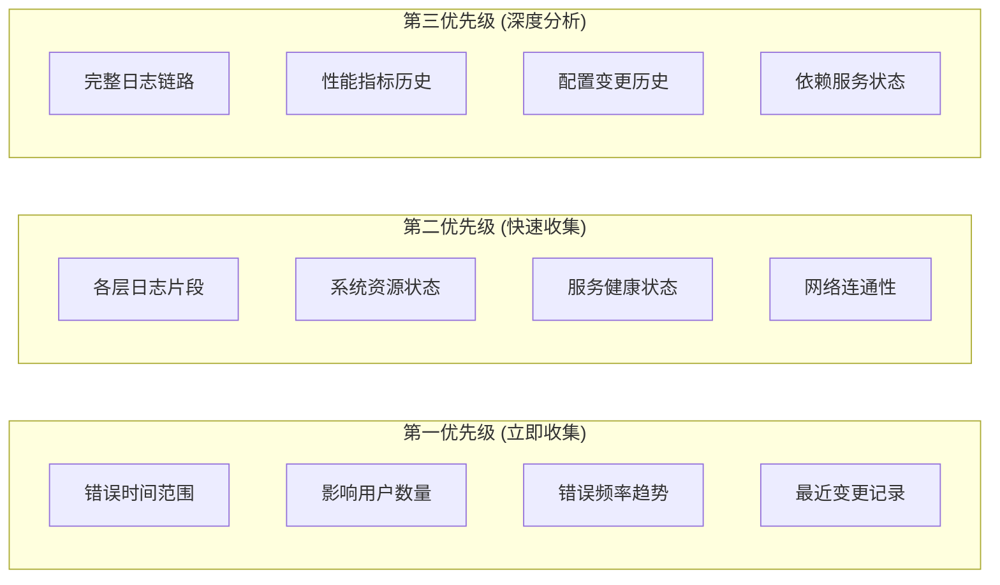

### 假设验证的系统方法

**科学的问题定位方法:**

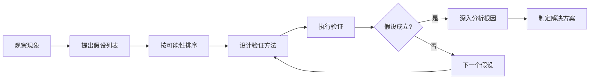

**常用假设模板:**

1. **时间相关假设**
   - 是否与最近的部署/配置变更相关?
   - 是否与特定时间段的流量模式相关?
   - 是否与定时任务/批处理相关?

2. **资源相关假设**
   - 是否为内存/CPU资源不足?
   - 是否为连接池/线程池耗尽?
   - 是否为磁盘空间/文件描述符不足?

3. **依赖相关假设**
   - 是否为外部服务异常?
   - 是否为数据库连接问题?
   - 是否为网络连接问题?

4. **配置相关假设**
   - 是否为超时配置不当?
   - 是否为路由配置错误?
   - 是否为权限配置问题?

### 工具使用的策略思维

**工具选择的决策树:**

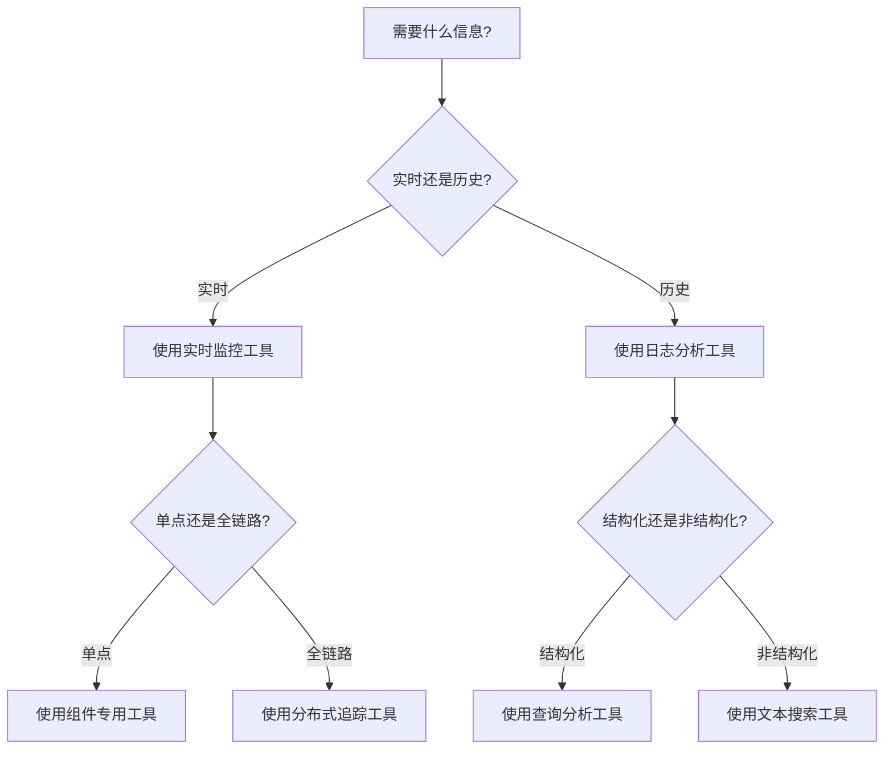

### 问题解决的思维框架

**解决方案的评估维度:**

| 维度 | 考虑因素 | 评估标准 |
|------|---------|---------|
| **有效性** | 能否解决根本问题? | 解决程度、持续性 |
| **风险性** | 是否引入新问题? | 影响范围、回滚难度 |
| **成本性** | 实施成本如何? | 时间成本、资源成本 |
| **可行性** | 是否具备实施条件? | 技术可行性、权限可行性 |

### 持续改进的思维循环

**每次事件后的标准思考流程:**

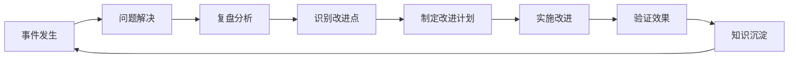

**复盘的标准问题清单:**

1. **时间线分析**: 问题是如何发生和发展的?
2. **根因分析**: 真正的根本原因是什么?
3. **响应分析**: 我们的响应是否及时有效?
4. **影响分析**: 对用户和业务的影响如何?
5. **预防分析**: 如何避免类似问题再次发生?
6. **改进分析**: 需要在哪些方面进行改进?

## 常见问题模式与思维模型

### 502错误的典型模式分类

**按照系统性思维分类错误模式:**

```mermaid
mindmap
  root((502错误模式))
    资源耗尽型
      内存不足导致OOM
      连接池耗尽
      线程池满载
      文件描述符耗尽
      
    配置错误型
      超时配置不当
      路由规则错误
      负载均衡配置问题
      权限配置错误
      
    依赖故障型
      外部服务不可用
      数据库连接失败
      网络连接中断
      DNS解析失败
      
    性能瓶颈型
      处理逻辑耗时过长
      数据库查询缓慢
      GC停顿时间过长
      磁盘IO瓶颈
      
    并发竞争型
      死锁问题
      资源竞争
      缓存击穿
      热点数据访问
```

### 错误模式的识别思路

**通过日志模式快速识别问题类型:**

| 错误模式 | 关键日志特征 | 系统表现 | 定位思路 |
|---------|-------------|---------|---------|
| **资源耗尽** | `OutOfMemoryError`, `Too many open files` | 响应变慢，然后完全不响应 | 检查资源使用趋势 |
| **配置错误** | `Connection refused`, `timeout` | 特定条件下稳定复现 | 对比配置变更历史 |
| **依赖故障** | `ConnectException`, `SocketTimeout` | 调用外部服务时失败 | 检查依赖服务状态 |
| **性能瓶颈** | 响应时间长，无明显错误 | 逐渐变慢，最终超时 | 分析性能指标趋势 |
| **并发问题** | `DeadlockException`, 不规律的错误 | 高并发时偶发 | 压力测试复现 |

### 问题定位的思维路径

**建立系统性的问题定位思维:**

```mermaid
flowchart TD
    A[502错误] --> B{是否有明确的错误日志?}
    
    B -->|有| C[分析错误堆栈]
    B -->|无| D[分析系统指标]
    
    C --> E{错误是否在应用层?}
    D --> F{资源使用是否异常?}
    
    E -->|是| G[检查业务逻辑和依赖]
    E -->|否| H[检查基础设施层]
    
    F -->|是| I[分析资源瓶颈]
    F -->|否| J[分析网络和配置]
    
    G --> K[定位具体问题]
    H --> K
    I --> K
    J --> K
```

## 团队协作与知识管理

### 建立共同的问题分类语言

**统一的问题描述框架:**

```
问题分类: [P0/P1/P2/P3] [资源/配置/依赖/性能/并发]
影响范围: [全局/区域/API/用户群]
问题现象: 用户看到什么? 系统表现如何?
时间特征: 开始时间、持续时间、发生频率
环境信息: 哪个环境、哪个区域、哪个版本
初步分析: 可能的原因假设
排查进展: 已验证的假设、排除的可能性
协作需求: 需要哪些团队/专家支持
```

### 知识积累的思维模型

**建立问题知识库的系统方法:**

```mermaid
graph TD
    A[问题发生] --> B[问题解决]
    B --> C[知识提取]
    C --> D[模式识别]
    D --> E[知识结构化]
    E --> F[知识入库]
    F --> G[知识应用]
    G --> H[知识验证]
    H --> I[知识优化]
    I --> F
```

**知识库的结构设计:**

```
问题知识库/
├── 问题模式库/
│   ├── 资源耗尽类问题/
│   ├── 配置错误类问题/
│   ├── 依赖故障类问题/
│   └── 性能瓶颈类问题/
├── 解决方案库/
│   ├── 快速止血方案/
│   ├── 根治方案/
│   └── 预防方案/
├── 工具脚本库/
│   ├── 信息收集脚本/
│   ├── 问题诊断脚本/
│   └── 自动修复脚本/
└── 案例库/
    ├── 典型案例分析/
    ├── 复杂问题案例/
    └── 预防成功案例/
```

## 持续改进与能力建设

### 建立学习型组织的思维

**从每次事件中学习和改进:**

```mermaid
mindmap
  root((持续改进))
    个人能力
      技术技能提升
      问题分析能力
      工具使用熟练度
      沟通协作能力
      
    团队能力
      协作流程优化
      知识共享机制
      标准化程度
      响应速度提升
      
    系统能力
      监控覆盖度
      自动化程度
      容错能力
      恢复能力
      
    组织能力
      文化建设
      制度完善
      资源投入
      战略规划
```

### 预防性思维的建立

**从被动响应转向主动预防:**

| 阶段 | 传统思维 | 预防性思维 |
|------|---------|-----------|
| **设计阶段** | 功能实现为主 | 考虑失败场景，设计容错机制 |
| **开发阶段** | 业务逻辑为主 | 加入监控埋点，异常处理 |
| **测试阶段** | 功能测试为主 | 包含压力测试，故障注入 |
| **部署阶段** | 功能部署为主 | 灰度发布，回滚准备 |
| **运维阶段** | 问题响应为主 | 主动监控，预警机制 |

### 技术债务管理思维

**将问题修复与技术改进结合:**

```mermaid
graph LR
    A[问题发生] --> B[快速修复]
    B --> C[根因分析]
    C --> D{是否为技术债务?}
    
    D -->|是| E[记录技术债务]
    D -->|否| F[完善监控预警]
    
    E --> G[评估债务优先级]
    G --> H[制定还债计划]
    H --> I[逐步改进]
    
    F --> J[优化运维流程]
    I --> K[系统健壮性提升]
    J --> K
```

## 总结：调试思维的核心要素

### 系统性思维
- 不孤立看问题，考虑整个系统上下文
- 建立分层分类的思维模型
- 用数据和事实说话，避免主观臆断

### 结构化思维  
- 建立标准化的问题分析流程
- 使用框架和模板提高效率
- 积累和复用成功的方法论

### 持续改进思维
- 从每次问题中学习和总结
- 建立知识库和最佳实践
- 不断优化工具和流程

### 协作共赢思维
- 建立团队共同语言和标准
- 知识共享和经验传承
- 跨团队协作和支持

通过建立这套系统性的调试思维模型，你可以更加高效和准确地定位和解决502错误问题，同时不断提升团队的整体技术能力和响应水平。