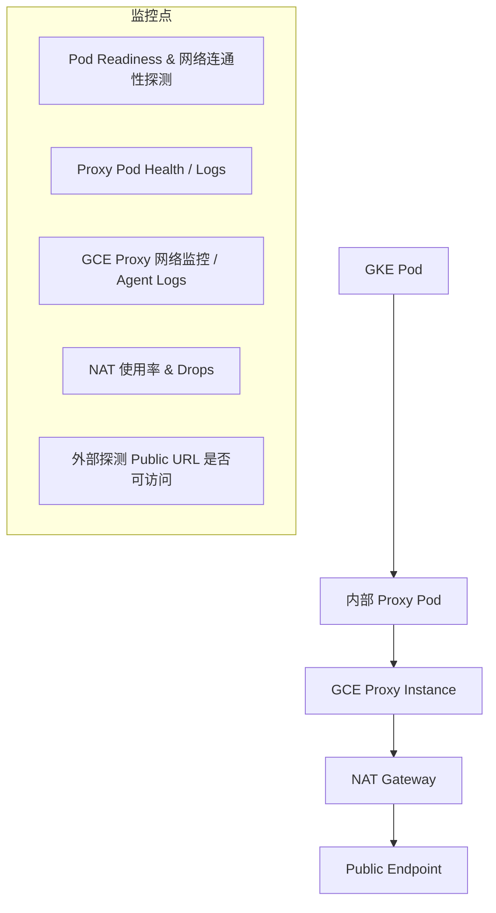

你描述的 egress 流程为：

```
GKE Pod → GKE Pod Proxy → GCE Instance Proxy → GCP NAT Gateway → Public Internet
```

要**确保这个链路的 egress 服务可用性**，你需要**分层监控**和**主动探测机制**，以下是针对这个链路的每一层建议的监控策略：

---

## **🧩 一、整体流程监控设计（路径监控）**



---

## **🔍 二、各层级监控策略细化**

|**组件**|**监控策略**|
|---|---|
|**GKE Pod**|- 使用 livenessProbe/readinessProbe- 使用 DaemonSet 方式定期探测目标外部域名连通性（curl/ping）|
|**GKE Proxy Pod**|- 检查容器日志- 应用级 metrics（如 response code、latency）- Prometheus/Stackdriver 指标|
|**GCE Proxy Instance**|- 安装 Ops Agent（Cloud Ops）- 监控 CPU、内存、连接数、网络流量- 查看 VM 上的 NAT 转发日志|
|**Cloud NAT Gateway**|- **Enable NAT logging**（VPC → NAT → 启用 logging）- 查看日志中是否有 dropped connections、timeout|
|**公共 URL 端探测**|- 使用 GCP Cloud Monitoring + Uptime Checks 探测外部服务是否正常- 或自建 curl-probe 进行定时探测|

---

## **🛠 三、可用的 GCP 工具**

|**功能**|**工具 / 方式**|
|---|---|
|Pod-level Metrics|Kubernetes metrics-server + Prometheus + Grafana|
|Proxy 服务健康 & 日志|Prometheus exporter 或 GKE logging 到 Cloud Logging|
|GCE VM 网络监控|Cloud Monitoring + Ops Agent + VPC Flow Logs|
|NAT 日志与使用率监控|VPC → NAT Gateway → 启用 NAT Logs（含每个 NAT IP 的使用量、丢包数等）|
|整体路径连通性探测（主动）|自建 DaemonSet 运行 curl/ping 到目标公网地址，结果上报至 Stackdriver 或 Prometheus|
|Uptime check（对外域名）|Cloud Monitoring → Uptime Checks（针对外部目标 URL）|

---

## **🧪 四、建议实现主动探测组件（DaemonSet）**

  

你可以部署一个 **轻量级 DaemonSet**，运行 curl/wget/tcping 来周期性探测公网目标，例如：

```
apiVersion: apps/v1
kind: DaemonSet
metadata:
  name: egress-checker
spec:
  selector:
    matchLabels:
      app: egress-checker
  template:
    metadata:
      labels:
        app: egress-checker
    spec:
      containers:
      - name: checker
        image: curlimages/curl
        args:
        - sh
        - -c
        - |
          while true; do
            curl -s -o /dev/null -w "%{http_code}" https://example.com || echo "failed"
            sleep 30
          done
```

将结果推送到 Stackdriver、BigQuery 或 Prometheus。

---

## **🧾 五、关键指标建议**

|**指标项**|**说明**|
|---|---|
|NAT gateway dropped flows|有无连接被 NAT 丢弃|
|NAT IP 使用率|是否快达到 quota 或连接数上限|
|GCE Proxy 网络错误|packet drops、timeout|
|GKE Proxy HTTP 状态码|4xx/5xx 是否异常增多|
|外部目标 RTT/响应码|是否出现大量连接超时、403、502 等|

---

如你需要，我可以提供：

1. 一份可部署的 GKE DaemonSet 探测 YAML
    
2. 一个 Cloud Monitoring Dashboard JSON
    
3. 一个 Prometheus AlertManager rule 示例
    

  

是否需要我为你生成这些示例？