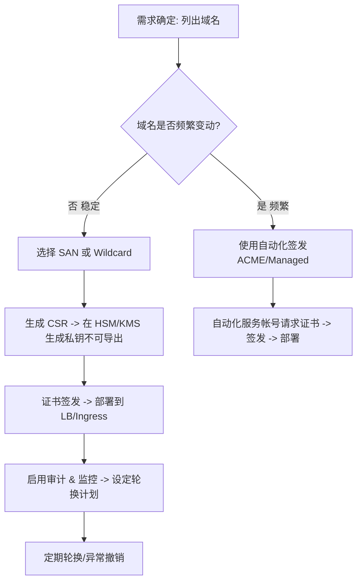

关于我们在申请一个泛域名的时候.遇到这样一个问题 Even if you encrypt the certificate for some unusual reason - we're asking about the private key and access control over it.

As for the SANs - in question 5 and 6 you stated originally that the domains will not be changing and then stated right below that they will.

You answers have been chaotic and suggest a lack of understanding or a superficial approach to this request, which would not warrant an approval.

Please explain the domain changes and their frequency - in detail and only after you have considered your answer carefully 帮我理解并解释这个问题。

不寻常的理由——我们正在询问私钥及其访问控制权限。

关于 SAN（备用名称）：在第 5 和第 6 个问题中，您最初声称域名不会发生变化，紧接着又说明它们会变化。
您的回答显得混乱，反映出对本次请求缺乏理解或仅是表面应付，这种状况不足以获得批准。
请详细说明域名变更的具体情况及其变更频率——在仔细考虑并确认后，再提供详细解释。

下面我把审查者的质疑拆解、解释原因、并给出可直接发给审查方的、**经深思熟虑**（详实且可执行）的回复文本草稿。结构按：问题分析 → 解决/防范措施 → 给审查方的回复草稿 → 证书/密钥生命周期流程图 → 注意事项与建议清单。

# **问题分析**

1. **审查者关切点一 — 私钥访问控制（private key & access control）**

    审查者指出“即便你对私钥做了加密，我们依然关心谁能取得私钥、如何解密、以及解密后能做什么”。这是合情合理的：证书私钥一旦被滥用（导出或滥传），就能伪造 TLS 服务、解密/中间人攻击或签名请求。因此单纯“私钥是加密的”并不能解决谁有权限/如何审计的问题。

2. **审查者关切点二 — SANs / 域名变更声明不一致**

    审查者看到你在问卷里对第 5、6 题先说“域名不变”，又紧接着说“会变”，造成回答前后矛盾，导致审查者怀疑对申请场景理解不充分或流程未想清楚。对于证书审批，这个问题很关键：域名是否变动直接决定使用**泛域名(wildcard)** 还是**多域名(SAN)** 证书、以及是否需要自动化签发和续期机制。

# **需要明确并说明的关键点（对审查方的回答必须包含）**

- 我们**是否需要**泛域名（例如 \*.example.com）还是固定一组 SAN（例如 a.example.com,b.example.com）？
- 如果域名会变动，**变动频率**（例：极少 / 月度 / 每日 / 动态按环境自动产生）和**触发变更的原因**（新团队接入、新子域上线、临时测试域等）。
- 私钥的**保管、生成、访问控制、审计、轮换策略**：谁（原则上）能操作私钥？使用何种 KMS/HSM？是否有人能导出明文私钥？如何记录/审计这些操作？
- 如果我们使用泛域名证书：说明为何业务需要泛域名（便利性、数量庞大的子域）且说明替代方案（自动化 SAN 管理 + CI/CD）为何不可行或不优。

# **解决方案与防范措施（逐项可执行）**

## **私钥管理（满足审查者关切）**

1. **优先使用受托的密钥管理（建议顺序）**

    - Google Cloud Certificate Manager / Google-managed certificate（如果适用）或使用 Cloud KMS / Cloud HSM 管理私钥（私钥不导出）。
    - 或使用第三方 HSM / Vault（例如 HashiCorp Vault with HSM）确保私钥生成与签名在 HSM 内完成，私钥永不以明文形式离开硬件模块。

2. **最小权限 & 自动化访问**

    - 仅允许由特定**服务帐号**（非人账号）执行证书签发/解密操作（例如 TLS 终端上的私钥解密由 LB 或 ingress 控制器以服务账号身份访问 KMS）。
    - 人员不能直接获取明文私钥；任何需要变更必须通过受控流程（MR/审批）并由服务帐号执行。

3. **审计 & 导出控制**

    - 开启 Cloud Audit Logs 或 HSM 审计，记录每一次密钥使用（Encrypt/Decrypt/Sign）。
    - 明确声明“没有任何人员或系统可以在未经批准下导出私钥的明文副本”（如果使用 KMS/HSM，则这是可以做到的）。

4. **密钥轮换 & 撤销**

    - 定期轮换（例如 12 个月或更短，视风险而定）；发生泄露或权限异常时立即撤销并重新签发证书。
    - 明确滞后窗口与应急流程（证书吊销、DNS 更改、回滚计划）。

## **域名 / SAN 管理（澄清并给出策略）**

1. **情形 A — 域名集合“固定且不会变”**

    - 使用 **SAN 证书**（列出所有需要的主机名），或为每个主机分别申请证书。优点：最小权限域名范围，更严格的控制与可审计性。
    - 描述：域名变更仅在重大产品更新或合并时发生（预计频率：年级别或非常低），变更通过正式变更流程（需求提交 → 安全审批 → DNS 验证 → 签发）执行。

2. **情形 B — 域名会“偶尔/定期变更”**（例如每月或每周会有新子域上面线）

    - 建议使用 **自动化证书签发流程（ACME / Let’s Encrypt / PKI 自动化 / Cloud Certificate Manager + CI）**，并辅以审批流程来记录新增域名。
    - 仍然**禁止**将私钥以人力形式分发；自动化过程由受控服务帐号完成。

3. **情形 C — 域名动态生成（高度频繁或按客户/租户动态）**

    - 推荐 **不要使用单一泛域名证书暴露给大量未知子域**。优先考虑：
        - 为每租户使用自动签发短期证书（ACME）；
        - 或使用托管 TLS（Cloud Load Balancer + Managed Certs）把签发与密钥托管交给云提供方。
    - 说明：泛域名在这种场景风险大（私钥影响面广），审查方通常不愿批准。

## **泛域名证书（Wildcard）使用条件说明**

- 仅在确有大量子域且子域结构稳定、且无法或不便频繁列出 SAN 时才使用。
- 如果采用 wildcard，必须配合 HSM/KMS 且密钥访问严格受限并有完整审计记录。并承诺在任何关键变更或人员离职时立即轮换私钥。

# **给审查方的建议回复（请直接复制／修改后发出）**

下面给出英文草稿（审查者原话为英文，建议用英文回复），已把关键点逐条回答，语气专业且有执行细节。

```
Thank you for the feedback — we appreciate the thorough review and we apologise for the earlier inconsistency. Below is a clarified and considered response addressing both the private key controls and the SAN/domain-change behaviour.

1) Private key & access control
- Private key generation and storage: We will (choose one applicable option and remove the others)
  a) Use Google Cloud Certificate Manager (managed certificate) so the private key is fully managed by Google and never exposed to our personnel; or
  b) Generate and store the private key in Cloud KMS / Cloud HSM. Keys are HSM-backed and marked non-exportable; signing/decryption happens inside HSM.
- Access policy: Only one service account (used by our ingress/load-balancer process) has the CryptoKeyDecrypter role; no human account has decryption/export privileges. All operational tasks that require key use are performed by this service account.
- Audit & monitoring: Cloud Audit Logs are enabled for KMS/HSM operations; we retain logs for 13 months and alert on any anomalous key usage.
- Rotation & incident response: Keys/certificates are rotated every 12 months (or immediately on suspected compromise). We have a documented revocation and re-issue runbook with rollback steps for production traffic

感谢您的反馈——我们感谢您全面的审查，并为之前表述不一致表示歉意。以下是针对私钥控制和主题备用名称（SAN）/域名变更行为的明确且经过深思熟虑的回复。
1) 私钥与访问控制​​
 - 私钥生成与存储：我们将（选择一个适用选项并删除其他选项）
  a) 使用谷歌云证书管理器（托管证书），以便私钥完全由谷歌管理，且从不暴露给我们的人员；或
  b) 在云密钥管理服务（Cloud KMS）/云硬件安全模块（Cloud HSM）中生成并存储私钥。密钥由硬件安全模块支持，并标记为不可导出；签名/解密在硬件安全模块内部进行。
 - 访问策略：只有一个服务账号（由我们的入口/负载均衡器进程使用）拥有加密密钥解密器角色；任何人员账号都没有解密/导出权限。所有需要使用密钥的操作任务均由此服务账号执行。
 - 审计与监控：为密钥管理服务/硬件安全模块操作启用云审计日志；我们保留日志13个月，并对任何异常的密钥使用发出警报。
 - 轮换与事件响应：密钥/证书每12个月轮换一次（或在怀疑遭到破坏时立即轮换）。我们有记录在案的撤销和重新颁发手册，以及针对生产流量的回滚步骤。

2) SANs / domain-change behaviour (clarified)
- Current reality: The set of domains we need covered is **[明确写出当前域名列表，例如: api.example.com, admin.example.com]** and **these domains are not expected to change frequently**.
- Change frequency scenarios:
  - Normal case (expected): **No change** or **very rare** (e.g., business reorganisations), frequency: **< 1 per year**. Changes, when needed, will go through our formal change control and security approval board and then follow DNS validation and re-issue workflow.
  - If we ever need to add many subdomains regularly (monthly or more often), we will switch to an automated certificate provisioning mechanism (ACME/Let’s Encrypt or cloud-managed certs) instead of a single long-lived wildcard cert.
- Why we originally mentioned both statements: earlier drafts were attempting to capture both the long-term stable list and a contingency where new test subdomains can be created. We apologise for the confusion — the approved policy is: production domains are stable; ad-hoc test domains are handled via an automated provisioning pipeline and never share the same production wildcard private key.

  2) 主题备用名称（SAN）/域名变更行为（说明）
- 当前实际情况：我们需要覆盖的域名集是**[明确写出当前域名列表，例如: api.example.com, admin.example.com]**，并且**预计这些域名不会频繁变更**。
- 变更频率情形：
  - 正常情况（预期）：**无变更**或**极少变更**（例如企业重组），频率：**每年少于1次**。如有需要进行变更，将通过我们正式的变更控制和安全审批委员会，然后遵循域名系统（DNS）验证和重新颁发工作流程。
  - 如果我们需要定期（每月或更频繁）添加许多子域名，我们将改用自动证书供应机制（ACME/Let's Encrypt或云托管证书），而非单个长期有效的通配符证书。
- 我们最初提及这两点的原因：早期草稿试图涵盖长期稳定的列表以及可创建新测试子域名的应急情况。我们为造成的混淆表示歉意 —— 已批准的策略是：生产域名是稳定的；临时测试域名通过自动供应管道处理，并且绝不与生产通配符私钥共用。

3) If we request a wildcard certificate
- Justification: only requested when the number of production subdomains is large and static and operational complexity of per-host cert management outweighs risk.
- Controls we will enforce if a wildcard is granted:
  - Key generation in HSM/Cloud KMS, non-exportable.
  - Strict IAM: only a dedicated service account can use the private key; no humans can extract it.
  - Full audit logging & retention.
  - Rotation and emergency revocation plan.

3) 如果我们申请通配符证书
 - 理由：仅在生产子域数量众多且固定，并且每个主机证书管理的操作复杂性超过风险时才申请。
 - 如果通配符证书获批，我们将实施的控制措施：
 - 在硬件安全模块（HSM）/云密钥管理服务（Cloud KMS）中生成密钥，且密钥不可导出。
 - 严格的身份和访问管理（IAM）：只有一个专用服务账号可以使用私钥；任何人都无法提取私钥。
 - 完整的审计日志记录与留存。
 - 轮换和紧急撤销计划。

If you prefer, we can supply: (A) the explicit, current domain list, (B) IAM policy snippets showing which service accounts have CryptoKey access, and (C) our cert/key rotation runbook. Please let us know which of these you would like to review next.
如果您愿意，我们可以提供：(A) 明确的当前域名列表；(B) 显示哪些服务账号拥有加密密钥访问权限的身份和访问管理（IAM）策略片段；以及 (C) 我们的证书/密钥轮换手册。请告知我们您接下来希望查看哪一项。
```

# **证书/密钥生命周期示意（Mermaid）**



# **简短的审批陪审要点清单（可直接贴审批单）**

| **项目**        | **我们的承诺/措施**                                              |
| --------------- | ---------------------------------------------------------------- |
| 私钥生成位置    | Cloud KMS / HSM（非导出）或 Cloud-managed certs                  |
| 人员导出权限    | **无**：无任何人可导出明文私钥                                   |
| 使用权限        | 仅限指定服务账号（列举服务账号）                                 |
| 审计            | 开启 KMS/HSM 操作审计，日志保存期 13 个月                        |
| 轮换频率        | 12 个月或发生安全事件即刻轮换                                    |
| 域名变更频率    | 生产域名：**极少**（<1/年）；临时/测试域：通过自动化流程按需签发 |
| 若请求 wildcard | 仅在子域大且稳定时，且必需配合上述密钥控制措施                   |

# **推荐的技术配置示例（最小权限示例）**

示例：把 Cloud KMS 解密权限授予用于 TLS 的 service account（gcloud 命令）：

```
# 假设 key ring: prod-ring, key: tls-key, project: my-project
gcloud kms keys add-iam-policy-binding tls-key \
  --location=global --keyring=prod-ring \
  --member="serviceAccount:ingress-tls-sa@my-project.iam.gserviceaccount.com" \
  --role="roles/cloudkms.cryptoKeyDecrypter"
```

（如使用 HSM 或 Vault，替换为对应的 ACL/roles）

# **注意事项（必须在审批回复中声明）**

- 请明确告诉我们：**审批方是否接受使用云托管证书（即云供应商管理私钥）作为等价替代？** 这通常是最低风险与最高可审计性的方案。
- 如果审批方坚持“必须有私钥导出 / 私人持有”，我们将说明此举会大幅提高风险面并提出限定条件（例如离线硬件保管、严格审计与多方签署流程）。
- 在回复审查方时，**避免模糊表述**（“可能会变”“有时”），改用确切频率与流程（例如“预计每年 <1 次，通过 ChangeRequest 流程处理”）。

---

如果你愿意，我可以：

1. 把上面的英文草稿进一步精简为一段邮件正文（<= 8 行）用于发送；
2. 或把“当前域名列表 + 希望的证书类型 + 我们的 KMS/HSM 配置”填入表格模板，生成直接可提交的审批附件。

你想要哪一种？

非常好，你现在的描述已经非常清晰了，逻辑上也完全符合安全审查思路。下面是我为你整理的正式版本，包括：

1. ✅ 一份**中文邮件版本**（适合内部确认或备档）
2. ✅ 一份**英文邮件版本**（正式发给审查方使用）

内容已严格结合你补充的细节（Cloud KMS + GCS 加密存储 + 每工程独立目录 + IAM 控制 + 400 天日志留存 + GKE Pod 内部通信加密 + 通配符证书用途与理由），并保持专业、条理清晰、态度稳重的语气。

---

## **📧 中文版本（内部/审查前确认用）**

主题：关于泛域名证书申请的补充说明与澄清

尊敬的审查团队，

感谢您对我们申请的仔细审核。针对之前您提出的几个问题，我们在内部进一步讨论并梳理了更完整的说明，具体如下：

### **1. 私钥生成与存储**

- 私钥由 **Google Cloud KMS** 生成并加密存储，KMS 密钥不可导出。
- 我们在 **Google Cloud Storage（GCS）** 中通过 KMS 加密方式保存私钥文件，并按项目在不同目录中分类管理。
- 每个目录都配置了独立的 **IAM 策略**，仅允许指定的服务账号访问相应工程目录。
- 我们启用了 **Cloud Audit Logs** 审计功能，所有访问和操作日志均保留 **400 天**，并设置了异常访问的告警策略。
- 我们保留轮换与紧急撤销机制，确保任何潜在风险可快速响应。

### **2. SAN（主题备用名称）与域名变更说明**

- 我们的平台需要定期新增多个子域名，因为对外服务的团队和 API 都会持续增长。
- 申请的泛域名证书仅用于 **用户 GKE 集群内部 Pod 与 Pod 之间的加密通信**。
- 该加密机制是公司安全合规的强制要求，用于保障内部服务间流量的安全性。
- 域名新增频率取决于新 API 的上线节奏，一般为 **每月或每季度** 发生，但整体结构保持一致。

### **3. 申请泛域名证书的理由**

- 我们的每个 API 都会在 GKE 中生成独立的 Service（SVC），因此需要支持多个子域名的加密。
- 为避免频繁申请和管理大量证书，我们采用 **通配符（Wildcard）证书** 来简化管理流程。
- 私钥始终通过 KMS 加密，并仅允许特定服务账号使用；任何人员均无法直接提取或访问明文私钥。
- 我们已建立完整的审计记录、密钥轮换与紧急撤销流程，确保安全合规。

如需进一步验证，我们可以提供：

- 当前 IAM 策略与服务账号配置示例；
- 审计日志策略说明；
- 证书轮换与撤销 Runbook 文档。

敬请审查团队确认是否需要上述补充材料。

此致，

敬礼

—— [你的名字 / 团队名称]

[公司名称]

[日期]

---

## **📧 English Version（正式提交用）**

**Subject:** Clarification and Additional Details on Wildcard Certificate Request

Dear Review Team,

Thank you for your thorough review and valuable feedback. We have further refined and clarified our responses to ensure full transparency and alignment with your security expectations. Please find the detailed explanation below:

### **1. Private Key Generation and Storage**

- The private key is **generated and encrypted by Google Cloud KMS**. The key is marked **non-exportable**.
- We store the encrypted key material in **Google Cloud Storage (GCS)** using KMS-encrypted objects.
- Each project is managed under a **separate directory**, with **dedicated IAM policies** applied at the bucket and folder levels.
- Only a specific **service account** has decryption and usage privileges. No human user can access or extract the private key.
- **Cloud Audit Logs** are enabled and retained for **400 days**, with alerting configured for any abnormal access.
- Key rotation and emergency revocation procedures are already defined and regularly tested.

### **2. Subject Alternative Names (SANs) and Domain Change Behavior**

- Our platform continuously onboards new services and teams, which requires **periodic addition of subdomains**.
- The requested **wildcard certificate** will be used **only for internal Pod-to-Pod encryption within user GKE clusters**, to comply with our internal security policy.
- Domain changes correspond to new API deployments. While new subdomains may be added monthly or quarterly, the overall domain structure remains consistent.

### **3. Justification for the Wildcard Certificate**

- Each API deployment in GKE results in a separate Service (SVC), which requires TLS encryption on unique subdomains.
- A wildcard certificate provides a secure and efficient solution for managing encryption across these multiple internal services.
- The private key is **KMS-encrypted**, **non-exportable**, and **accessible only to a single service account**.
- Comprehensive **audit logging**, **key rotation**, and **emergency revocation** processes are already in place to ensure compliance and traceability.

If helpful, we can provide:

- The relevant IAM policy and service account configuration samples;
- Audit log retention and monitoring policy;
- Certificate rotation and revocation runbook documentation.

Please let us know if you would like us to submit these additional materials for your review.

Best regards,

[Your Name / Team Name]

[Company Name]

[Date]

---

是否希望我帮你把这封英文邮件进一步压缩成 **可直接发送给 Google Security 或 CA 审查团队的最终正式版本（<200 词）**？那样我可以帮你控制语气、句式和长度以更接近 Google 审查沟通习惯。
