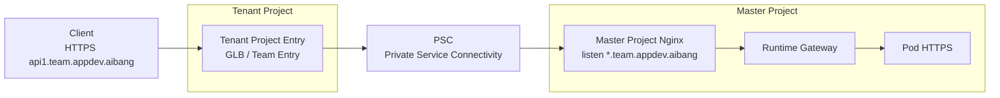
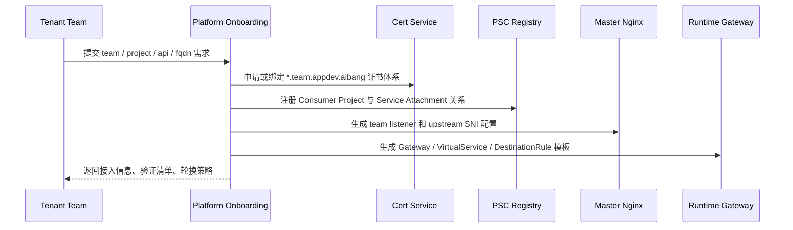

# Cross-Project FQDN Best Practices

> 面向 Tenant Project -> PSC -> Master Project -> Nginx / Gateway / Pod 的跨项目接入场景，目标是在尽量复用同一套 team 证书体系的前提下，保持统一 FQDN、稳定 SNI 语义和可治理的 SAN 边界。

> 说明：你消息里的 `SNA` 这里按 `SAN` 理解。

---

## 1. Goal And Constraints

### 1.1 核心目标

希望在跨项目架构里做到：

- Tenant Project 对外始终使用 `{apiname}.{team}.appdev.aibang`
- Tenant 工程申请并持有 `*.{team}.appdev.aibang` 这套 team wildcard 证书体系
- 即使流量经由 PSC 进入 Master Project，Master Project 的 Nginx 仍按 team 域名侦听
- Nginx 不能去掉，仍作为平台共享入口与治理点
- Onboarding 时平台统一登记 team、域名、证书、路由和 Consumer/Producer 关系
- 从入口到后端尽量复用同一套 team 证书语义

### 1.2 最关键的架构判断

在这个场景里：

- `PSC` 解决的是跨项目私网服务连接
- `SNI` 解决的是每一跳 TLS 连接里“我要访问哪个业务域名”
- `SAN` 解决的是“当前返回的证书能不能代表这个业务域名”

所以跨项目时最重要的不是“PSC 能不能传 TLS”，而是：

`跨项目之后，业务 FQDN 是否仍然保持不变，且每一跳重新发起 TLS 时都继续携带正确 SNI。`

### 1.3 复杂度评级

`Advanced`

原因：

- 你不是单项目入口
- 你要求 team 级 wildcard 证书体系
- 你还有 Onboarding、注册和平台模板化要求
- 你希望尽量从开始到结束都复用同一套证书语义

---

## 2. Recommended Architecture (V1)

### 2.1 最终推荐

推荐 V1 采用：

`统一 team FQDN + team wildcard 证书体系 + Master Project Nginx team listener + 显式保留 SNI + Pod/Gateway 证书 SAN 覆盖业务域名`

更具体一点：

1. 每个 Team 统一拥有一套 `*.{team}.appdev.aibang` 证书体系
2. 外部访问域名始终保持 `{apiname}.{team}.appdev.aibang`
3. PSC 只承载私有转发，不承担证书选择语义
4. Master Project 的 Nginx 必须按 team 域名侦听
5. Nginx -> Gateway / Pod 的 TLS 重建必须显式保留原始 SNI
6. Gateway / Pod 返回的证书 SAN 必须覆盖 `{apiname}.{team}.appdev.aibang}`

### 2.2 推荐的“同一套证书”理解方式

这里要区分两种说法：

| 说法 | 含义 | 是否推荐 |
| --- | --- | --- |
| 同一套证书语义 | 整条链路都围绕 `*.{team}.appdev.aibang` 设计 SAN/SNI | 推荐 |
| 同一张证书文件和同一把私钥到处分发 | Tenant、Master Nginx、Gateway、Pod 全部拿同一份私钥 | 谨慎，仅在硬需求下接受 |

最佳实践不是“无脑把同一把私钥复制到所有层”，而是：

`统一证书命名空间和身份模型，最小化终止点数量，并对必须终止 TLS 的层做受控分发。`

如果你的硬需求就是“确实要复用同一张 team wildcard 证书”，那可以做，但必须接受：

- 私钥暴露面变大
- Secret 生命周期管理更重
- 跨项目审计和轮换必须平台化

### 2.3 推荐链路图



### 2.4 每一段该关注什么

| 链路 | 主要关注点 |
| --- | --- |
| Client -> Tenant Entry | 入口证书 SAN 是否覆盖业务域名 |
| Tenant Entry -> PSC | 这是转发路径，不是证书选择层 |
| PSC -> Master Nginx | 到达 Master 后，Nginx 是否按 team 域名监听 |
| Nginx -> Gateway | 是否继续传原始 SNI |
| Gateway -> Pod | 是否继续用业务域名做 SNI，且后端 SAN 能匹配 |

---

## 3. Trade-Offs And Alternatives

### 3.1 最佳实践结论

如果你的核心目的是“从开始到结束尽量使用同一套证书”，那最好的方案不是让每一层都随意终止 TLS，而是：

- 保持统一业务域名
- 保持统一 SNI 语义
- 只在必要层终止 TLS
- 让所有证书 SAN 都围绕 team FQDN 设计

### 3.2 什么时候重点看 SAN

跨项目里，以下问题看 SAN：

- `*.{team}.appdev.aibang` 是否足够
- 是否还需要根域或特定精确域名
- Pod / Gateway / Nginx 证书是否都覆盖业务域名
- 共享入口证书是否会导致 blast radius 过大

### 3.3 什么时候重点看 SNI

跨项目里，以下问题看 SNI：

- Tenant Project 入口是否把业务域名保留下来
- PSC 之后 Master Nginx 是否仍按该域名选择站点
- Nginx 到 Gateway 是否继续传 `proxy_ssl_name $host`
- Gateway 到 Pod 是否继续传 `DestinationRule.tls.sni`

### 3.4 不建议的做法

#### 做法 1：Tenant 用业务域名，内部回源改成 `cluster.local`

不建议。

因为这样会立刻打断“同一套证书语义”：

- 外部还是业务域名
- 内部 suddenly 变成服务域名
- SAN 匹配与排障模型被拆成两套

#### 做法 2：只配 SAN，不验证 SNI 是否一路保留

不建议。

因为很多跨项目问题不是证书不对，而是：

- 到 Master Project 后拿错证书
- 命中默认证书
- Nginx / Gateway 重新发起 TLS 时丢了原始 SNI

#### 做法 3：PSC 当成 TLS 语义层

不建议。

PSC 是服务级私有连通能力，不是 TLS 证书路由层。

它不会替你保证：

- 返回哪张证书
- SNI 是否正确
- SAN 是否匹配

---

## 4. Implementation Steps

### 4.1 FQDN 归属模型

建议固定为：

| 对象 | 规则 |
| --- | --- |
| Team 域名空间 | `*.{team}.appdev.aibang` |
| API FQDN | `{apiname}.{team}.appdev.aibang` |
| Team 入口证书 | wildcard team cert |
| Master Nginx listener | `server_name *.{team}.appdev.aibang` |
| Gateway hosts | `*.{team}.appdev.aibang` 或精确业务域名 |
| Pod 返回证书 | 覆盖 `{apiname}.{team}.appdev.aibang` |

### 4.2 推荐的证书治理模型

推荐平台统一管理以下内容：

| 项目 | 建议 |
| --- | --- |
| 证书签发 | 平台统一 CA / cert-manager / Vault 流程 |
| 证书命名 | team 维度统一命名规范 |
| 证书分发 | 仅分发到真实 TLS 终止点 |
| 证书轮换 | 同一 team 统一轮换窗口 |
| 审计 | 记录哪些项目、命名空间、工作负载持有 team 证书 |

### 4.3 Onboarding 时必须登记的信息

这是你这个平台场景里最重要的部分。

建议 Onboarding 至少登记：

| 类别 | 字段 |
| --- | --- |
| Team 信息 | `team`、owner、联系人、项目归属 |
| 域名信息 | `*.{team}.appdev.aibang`、允许的 API 名单 |
| 证书信息 | 证书模式、签发来源、到期时间、轮换 SLA |
| Tenant Project | project id、consumer network、入口方式 |
| PSC 信息 | service attachment、accept list、审批模式 |
| Master Project 路由 | Nginx listener、Gateway host、backend service |
| SNI 规则 | 对外 FQDN、Nginx 上游 SNI、Gateway 上游 SNI |
| SAN 规则 | 证书必须覆盖哪些 host |

### 4.4 推荐的 Onboarding 流程



### 4.5 Master Nginx 的关键要求

Master Project 里既然 Nginx 不能去掉，那么它必须承担这些职责：

1. 按 team 域名侦听
2. 使用 team 证书或 team 证书体系
3. 不改写原始 Host
4. 到上游继续传递原始 SNI

参考配置重点：

```nginx
server {
    listen 443 ssl http2;
    server_name *.abjx.appdev.aibang;

    ssl_certificate     /etc/pki/tls/certs/wildcard-abjx-appdev-aibang.crt;
    ssl_certificate_key /etc/pki/tls/private/wildcard-abjx-appdev-aibang.key;

    proxy_set_header Host $host;

    location / {
        proxy_pass https://runtime-istio-ingressgateway.abjx-int.svc.cluster.local:443;
        proxy_ssl_server_name on;
        proxy_ssl_name $host;
    }
}
```

这里最关键的不是 `ssl_certificate`，而是：

```nginx
proxy_ssl_server_name on;
proxy_ssl_name $host;
```

因为这决定了跨项目进入 Master 之后，业务域名语义是否还能继续往后传。

### 4.6 Gateway / Pod 的关键要求

如果 Master Project 后面还有 Gateway / Pod TLS：

#### Gateway

- `hosts` 仍然围绕 `{apiname}.{team}.appdev.aibang`
- 如果 Gateway 终止 TLS，则其证书 SAN 也必须覆盖该域名

#### Gateway -> Pod

```yaml
trafficPolicy:
  tls:
    mode: SIMPLE
    sni: api1.abjx.appdev.aibang
```

这表示：

- Gateway 重新发起 TLS 时，继续把业务域名作为 SNI 发给 Pod

#### Pod

- Pod 证书 SAN 必须覆盖该业务域名
- 如果你坚持同一张 team wildcard 证书，也必须平台统一发放和审计

---

## 5. Validation And Rollback

### 5.1 需要验证的不是“能不能通”，而是“四件事同时成立”

跨项目最佳实践里，必须同时验证：

1. FQDN 没变
2. SNI 没丢
3. SAN 能匹配
4. PSC 只是通路，不引入额外域名语义变化

### 5.2 验证矩阵

| 验证点 | 命令/方法 | 预期 |
| --- | --- | --- |
| 外部域名访问 | `curl --resolve` | 仍访问 `{apiname}.{team}.appdev.aibang` |
| 证书 SAN | `openssl x509 -checkhost` | 匹配业务域名 |
| 服务端 SNI 支持 | `openssl s_client -servername ...` 对比不带 SNI | 返回结果可区分或符合预期 |
| Nginx 上游 SNI | 看 Nginx 配置和上游返回证书 | 上游拿到原始业务域名 |
| Gateway -> Pod SNI | 检查 `DestinationRule.tls.sni` | 与业务域名一致 |

### 5.3 推荐验证命令

#### 验证对外访问

```bash
curl --resolve api1.abjx.appdev.aibang:443:<ENTRY_IP> \
  https://api1.abjx.appdev.aibang/healthz -v
```

#### 验证带 SNI 的证书返回

```bash
openssl s_client -connect <ENTRY_IP>:443 \
  -servername api1.abjx.appdev.aibang </dev/null 2>/dev/null \
  | openssl x509 -noout -subject -issuer -ext subjectAltName
```

#### 验证不带 SNI 的返回

```bash
openssl s_client -connect <ENTRY_IP>:443 </dev/null 2>/dev/null \
  | openssl x509 -noout -subject -issuer -ext subjectAltName
```

#### 验证域名与 SAN

```bash
/Users/lex/git/knowledge/ssl/verify-domain-ssl-enhance.sh api1.abjx.appdev.aibang 443
```

### 5.4 回滚顺序

建议按影响面从小到大回滚：

1. 先回滚 team 的 Nginx listener / route 注册
2. 再回滚 Gateway / DestinationRule
3. 最后回滚证书绑定与 PSC 注册关系

原因：

- Nginx / Gateway 错配通常最先导致流量异常
- PSC 和证书注册通常属于平台共享资产，影响面更大

---

## 6. Reliability And Cost Optimizations

### 6.1 最佳实践总结

如果你坚持“开始到结束尽量同一套证书”，那推荐做法是：

- 同一个 Team 只维护一套 wildcard 证书身份模型
- 不改变业务 FQDN
- 不改变每一跳的 SNI 语义
- 所有证书 SAN 都围绕 team FQDN 设计
- 只有真实 TLS 终止点才持有证书

### 6.2 风险点

| 风险 | 说明 | 建议 |
| --- | --- | --- |
| 同一私钥跨项目扩散 | blast radius 很大 | 尽量减少终止点，统一审计 |
| Tenant 与 Master 都持证书 | 管理复杂度升高 | 统一签发、统一轮换、统一告警 |
| 内部改写为非业务域名 | SAN/SNI 语义断裂 | 全程坚持业务 FQDN |
| 只做链路连通验证 | 看不见 SNI 丢失 | 增加 SNI 对比验证 |

### 6.3 我对“同一套证书”的最终建议

从平台最佳实践看，优先级应该是：

1. 同一套 `FQDN` 语义
2. 同一套 `SNI` 语义
3. 同一套 `SAN` 覆盖策略
4. 在必要时才复用同一张实际证书和同一把私钥

也就是说：

`先保证身份一致，再决定是否物理复用同一张证书。`

这是比“所有地方都复制同一份证书”更稳的做法。

---

## 7. Handoff Checklist

### 7.1 Team Onboarding Checklist

- Team 是否已分配唯一 `team` 标识
- 是否已登记 `*.{team}.appdev.aibang`
- 是否已明确允许的 API FQDN 清单
- Tenant Project 和 Master Project 的映射是否已登记
- PSC Consumer / Producer 关系是否已登记

### 7.2 证书 Checklist

- 证书 SAN 是否覆盖业务域名
- 是否明确哪些层是 TLS 终止点
- 这些终止点是否真的必须持有证书
- 是否已定义轮换和告警
- 是否已审计私钥分发范围

### 7.3 SNI Checklist

- Client -> Tenant Entry 的 SNI 是否正确
- Tenant Entry / PSC -> Master Nginx 后是否仍按 team 域名侦听
- Nginx -> Gateway 是否显式保留 `proxy_ssl_name $host`
- Gateway -> Pod 是否显式配置 `DestinationRule.tls.sni`

### 7.4 最终结论

对于你的跨项目场景，最佳实践不是单纯回答“什么时候用 SAN，什么时候用 SNI”，而是把它们放进同一条治理原则里：

`统一 team FQDN，统一 team wildcard 证书语义，统一每一跳的 SNI 传递，统一 Onboarding 注册和轮换审计。`

如果只保留一句平台级原则，我建议写成：

`在 Cross-Project 架构里，PSC 负责连通，Nginx/Gateway 负责保留域名语义，SAN 负责证书合法性，SNI 负责把这套语义一路传到底。`

