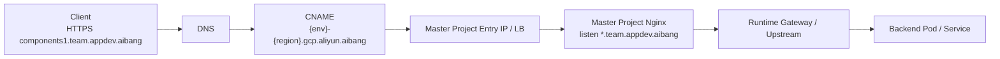
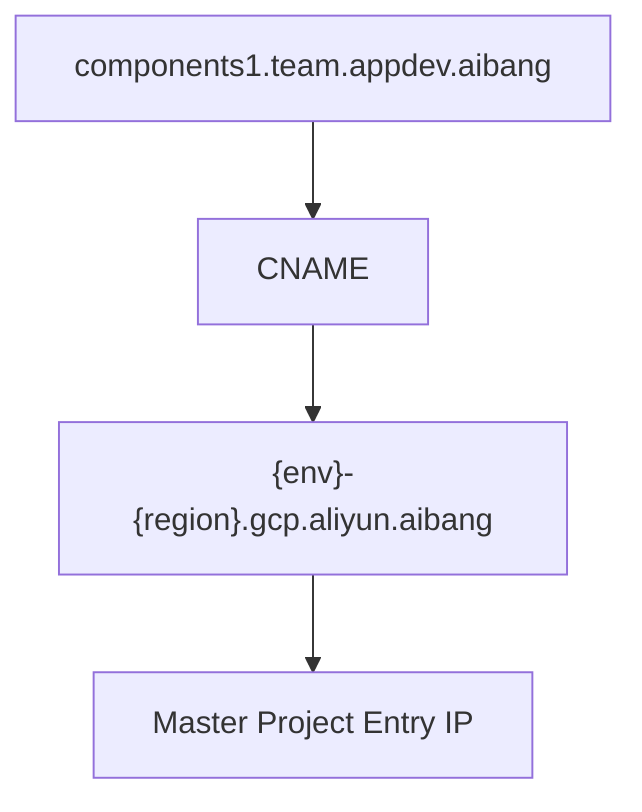
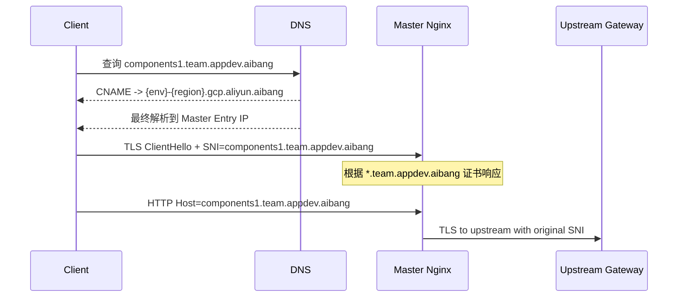

# Current FQDN Status

## Requirements
- Tenant Project 对外必须继续暴露业务域名，如 `components1.{team}.appdev.aibang`。
- Tenant Project 不直接承载最终入口，而是通过 `CNAME` 将业务域名指向 Master Project 的统一入口域名，如 `{env}-{region}.gcp.aliyun.aibang`。
- Master Project 必须提供一个平台可控、可承载、可统一治理的独立入口域名，作为所有 Tenant CNAME 的收敛目标。
- Master Project 入口前或内部必须保留 Nginx，且 Nginx 需要按 `*.{team}.appdev.aibang` 做 team 级域名侦听。
- Master Project 返回的证书必须覆盖业务域名；不能只覆盖 `{env}-{region}.gcp.aliyun.aibang`。
- TLS 语义必须保持业务域名不变：客户端访问时的 Host/SNI 仍应是 `components1.{team}.appdev.aibang`，不能因为 CNAME 改成入口域名。
- Nginx 向上游转发时必须保留原始业务域名语义，包括 Host 不改写、SNI 继续传递。
- 平台需要通过 Onboarding 显式或隐式登记 team、业务域名、CNAME 目标、Nginx listener、证书绑定、上游路由和 SNI 规则。
- Tenant 侧不应感知 Master Project 的真实入口 IP 或底层入口实现；Tenant 上线动作应尽量收敛成配置 CNAME。
- 需要验证 DNS CNAME、生效证书、SNI 保持和 Onboarding 注册完整性，而不只是验证“网络可达”。

## Target
把当前 Cross Project 的 FQDN 实现方式讲清楚：Tenant 负责业务域名和 CNAME，Master Project 负责统一入口承载，Master Nginx 负责 team 级 TLS 身份和后续转发语义保持。最终要达成的认知是，`CNAME` 只是把流量收敛到平台入口，不改变业务域名身份；Tenant 关心业务域名，平台关心真实入口承载。

## Notes
- Inferred: 当前真正持有 `*.{team}.appdev.aibang` TLS 身份、并作为第一个 team-aware TLS 终止点的，是 Master Project 的 Nginx。
- Inferred: `{env}-{region}.gcp.aliyun.aibang` 的主要作用是平台入口承载和 CNAME 收敛目标，而不是业务对外身份。
- Missing detail: 文档是“现状推演”，不是最终已验证架构；其中 listener、证书和上游 SNI 保持仍需用实际配置与链路验证确认。

> 本文基于你补充的背景做“现状推演”，目标是把当前实现方式讲清楚，而不是给出理想态设计。这里重点回答：当 Tenant Project 的业务域名通过 CNAME 指向 Master Project 的统一入口域名时，当前这套 FQDN、SNI、SAN 和 Nginx 侦听关系大概率是怎样工作的。

---

## 1. Goal And Constraints

### 1.1 你补充的关键信息

当前背景可以整理成下面这组事实：

1. Tenant Project 对外仍然希望暴露业务域名：

```text
components1.{team}.appdev.aibang
```

2. 但 Tenant Project 并不是自己直接承载最终入口，而是通过 `CNAME` 指到 Master Project 的统一入口域名，例如：

```text
components1.{team}.appdev.aibang CNAME {env}-{region}.gcp.aliyun.aibang
```

3. Master Project 侧存在一个共享入口。
4. 这个共享入口前面或内部仍然保留 Nginx。
5. Master Project 的 Nginx 按 team wildcard 域名侦听，例如：

```text
*.{team}.appdev.aibang
```

6. 也就是说，外部业务域名没有变，但解析入口已经被统一收敛到 Master Project。

### 1.2 这意味着什么

这意味着当前实现大概率不是：

`Tenant Project 自己终止 TLS + 自己持有完整入口能力`

而是：

`Tenant Project 持有业务域名语义，Master Project 持有真正的共享入口能力`

---

## 2. Recommended Architecture (Current Inference)

### 2.1 当前实现的推演结论

基于你给的背景，当前实现大概率是下面这个结构：



也就是说：

- 业务域名在 DNS 层属于 Tenant 视角
- 实际入口归属在 Master Project
- Nginx 才是第一个真正理解 `*.{team}.appdev.aibang` 语义的 TLS 终止点

### 2.2 当前实现里，CNAME 真正起到的作用

这个 `CNAME` 并不是改变业务身份，而是在做两件事：

1. 把业务域名解析流量统一收敛到 Master Project 入口
2. 让平台可以继续保留统一入口、统一证书、统一路由和统一治理

所以当前架构里：

- `CNAME` 只改变“请求去哪里”
- 不应该改变“请求是谁”

换句话说：

`components1.{team}.appdev.aibang` 仍然是业务身份；`{env}-{region}.gcp.aliyun.aibang` 更像入口承载域名。`

### 2.3 当前独立入口域名存在的意义

你现在补充的这层理解是成立的，而且很关键。

Master Project 之所以需要保留自己的独立入口域名，例如：

```text
{env}-{region}.gcp.aliyun.aibang
```

不是因为它要取代业务域名，而是因为：

`平台必须先有一个自己可控、可承载、可统一治理的入口，Tenant 的业务域名才能通过 CNAME 收敛到这里。`

也就是说，这个入口域名的意义主要在于：

1. 它是平台统一入口的承载点
2. 它是 Tenant 业务域名做 CNAME 收敛的目标
3. 它让 Master Project 可以在这里做 team level 的统一能力
4. 它让 Nginx / Gateway / 路由 / 证书 / Onboarding 都有一个共同的入口锚点
5. 它把 Tenant 对 Master 真实入口地址的感知隔离掉了

如果没有这一层独立入口域名，就会缺少一个稳定的“平台接入点”，那么：

- Tenant 无法统一通过 CNAME 指过来
- Master 无法集中承载 team 级别入口能力
- 平台也很难统一做 listener、证书、路由和流量治理
- Tenant 还可能被迫感知 Master 真实 IP 或更底层入口细节

### 2.4 这一层设计对 Tenant 的直接好处

你想表达的另一层意思也非常重要：

`对于 Tenant Project 来说，它并不需要关心 Master Project 真正的入口 IP 是什么。`

Tenant 在业务上线时，理想上只需要做一件事：

```text
components1.{team}.appdev.aibang CNAME {env}-{region}.gcp.aliyun.aibang
```

也就是说：

- Tenant 不需要知道 Master 真实 IP
- Tenant 不需要感知 Master 后面是 Nginx、Gateway 还是其他入口组件
- Tenant 不需要自己维护复杂入口层实现
- Tenant 只需要把业务域名解析到平台提供的入口域名

这层抽象的好处是：

1. 平台可以独立演进 Master 入口 IP、LB、Nginx 和后端实现
2. Tenant 的上线动作被收敛成“配一个 CNAME”
3. 后续如果 Master 入口 IP 变化，Tenant 不需要逐个改 A 记录
4. Tenant 关注的是业务域名可用性，而不是平台入口内部细节

所以这套模式真正提供的价值可以总结成：

`Tenant 关心业务域名，平台关心真实入口承载。`

所以更准确地说：

- 业务域名是 Tenant 的对外身份
- 独立入口域名是 Master 的平台承载入口

这两者不是重复关系，而是分工关系。

### 2.5 当前最关键的一点

虽然 DNS 最终把请求导向了：

```text
{env}-{region}.gcp.aliyun.aibang
```

但客户端发起 HTTPS 时，如果用户访问的是：

```text
https://components1.{team}.appdev.aibang
```

那么 TLS 语义里真正重要的仍然是：

- Host: `components1.{team}.appdev.aibang`
- SNI: `components1.{team}.appdev.aibang`

这决定了 Master Project 侧 Nginx 必须能够：

1. 识别这个 team 业务域名
2. 返回覆盖该域名的证书
3. 继续把这个业务域名语义往后传

---

## 3. Trade-Offs And Alternatives

### 3.1 当前实现里，谁真正持有业务域名语义

推演下来，当前各层角色大概率是：

| 层                      | 当前角色                                |
| ----------------------- | --------------------------------------- |
| Tenant Project          | 负责对外暴露业务域名和 DNS CNAME        |
| Master Project 入口域名 | 平台统一入口承载名，也是 CNAME 收敛目标 |
| Master Project Nginx    | 真正的 team 域名监听点                  |
| Gateway / Backend       | 接收来自 Nginx 的业务域名语义           |

### 3.2 当前实现里，为什么 Nginx 去不掉

结合你的描述，Nginx 当前不是“可选组件”，而是至少承担了以下职责：

1. team 维度域名监听
2. team wildcard 证书终止
3. Host 保持不改写
4. 上游 TLS 重建时保留原始 SNI
5. 平台统一 Onboarding 后的路由注册点

所以当前实现里，Nginx 更像：

`Master Project 的 team-aware ingress router`

而不是一个普通的透明转发层。

### 3.3 当前实现里，为什么 Master Project 不能只监听 `{env}-{region}.gcp.aliyun.aibang`

因为如果当前用户访问的是：

```text
components1.{team}.appdev.aibang
```

那么客户端校验证书时看的是这个业务域名，而不是 CNAME 目标。

所以如果 Master Project 只拿：

```text
{env}-{region}.gcp.aliyun.aibang
```

对应的证书，而不拿：

```text
*.{team}.appdev.aibang
```

就会出现：

- DNS 可以解析成功
- TCP 可以连上
- 但 TLS 主机名校验失败

这说明当前 Master Project 侦听 `*.{team}.appdev.aibang` 并不是“额外优化”，而是业务域名能成立的必要条件。

---

## 4. Implementation Steps

### 4.1 当前 DNS 层的实际语义

当前 DNS 关系大概率可以描述成：



这不代表客户端在 TLS 层就会改成访问：

```text
{env}-{region}.gcp.aliyun.aibang
```

而是：

- DNS 解析结果走到了 Master Project
- 但 HTTP Host 和 TLS SNI 仍应保持原始业务域名

### 4.2 当前 TLS 握手大概率是怎样发生的



这里最重要的结论是：

`CNAME 指向的是入口地址，不是 TLS 身份。`

### 4.3 当前 Master Nginx 需要满足的条件

在你描述的实现里，Master Project 的 Nginx 需要同时满足：

| 条件                                        | 原因                         |
| ------------------------------------------- | ---------------------------- |
| `server_name` 覆盖 `*.{team}.appdev.aibang` | 要识别业务域名               |
| 挂载 team wildcard 证书                     | 要让客户端对业务域名校验通过 |
| `proxy_set_header Host $host`               | 要保留原始业务 Host          |
| `proxy_ssl_server_name on`                  | 到上游时要带 SNI             |
| `proxy_ssl_name $host`                      | 到上游时继续带业务域名       |

这和你前面文档里给出的模式是一致的：

```nginx
server {
    listen 443 ssl http2;
    server_name *.abjx.appdev.aibang;

    ssl_certificate     /etc/pki/tls/certs/wildcard-abjx-appdev-aibang.crt;
    ssl_certificate_key /etc/pki/tls/private/wildcard-abjx-appdev-aibang.key;

    proxy_set_header Host $host;

    location / {
        proxy_pass https://runtime-istio-ingressgateway.abjx-int.svc.cluster.local:443;
        proxy_ssl_server_name on;
        proxy_ssl_name $host;
    }
}
```

### 4.4 当前实现里 SAN 和 SNI 分别是怎样工作的

#### SAN

当前 SAN 的要求大概率是：

- Master Nginx 返回的证书 SAN 必须覆盖 `components1.{team}.appdev.aibang`
- 如果后面还有 Gateway / Pod TLS，则它们返回的证书 SAN 也最好继续覆盖这个业务域名

#### SNI

当前 SNI 的语义大概率是：

1. Client -> Master Nginx：`SNI=components1.{team}.appdev.aibang`
2. Master Nginx -> Upstream：继续传 `components1.{team}.appdev.aibang`
3. Gateway -> Pod：如果重建 TLS，继续传该业务域名

所以当前实现里最重要的不是：

`CNAME 指向了哪里`

而是：

`链路里的每一个 TLS client 是否继续把 components1.{team}.appdev.aibang 当作 SNI 发出去`

### 4.5 当前 Onboarding 流程大概率注册了什么

如果按你的描述反推，当前 Onboarding 很可能已经隐式或显式在登记这些信息：

| 类别            | 当前可能登记的内容                 |
| --------------- | ---------------------------------- |
| Team            | `team` 标识                        |
| 业务域名        | `components1.{team}.appdev.aibang` |
| CNAME 目标      | `{env}-{region}.gcp.aliyun.aibang` |
| Master listener | 对应 team 的 Nginx 侦听规则        |
| 证书            | `*.{team}.appdev.aibang` 证书绑定  |
| 上游路由        | team -> gateway / backend 关系     |
| SNI 规则        | 上游继续使用业务域名               |

换句话说，现在的 Onboarding 本质上不只是“开通域名”，而是在做：

`team 域名身份注册 + Master 入口绑定 + 上游语义保持`

---

## 5. Validation And Rollback

### 5.1 当前实现最该验证什么

当前实现不是先验证“DNS 能不能通”，而是验证下面几件事是否同时成立：

1. 外部访问仍然使用 `components1.{team}.appdev.aibang`
2. CNAME 最终确实落到 Master Project 入口
3. Master Nginx 返回的是 `*.{team}.appdev.aibang` 证书
4. 上游转发时仍然保留原始 Host/SNI

### 5.2 推荐验证方式

#### 验证 DNS CNAME

```bash
dig components1.abjx.appdev.aibang
```

关注点：

- 是否能看到 `CNAME {env}-{region}.gcp.aliyun.aibang`

#### 验证 Master 入口返回的证书

```bash
openssl s_client -connect <MASTER_ENTRY_IP>:443 \
  -servername components1.abjx.appdev.aibang </dev/null 2>/dev/null \
  | openssl x509 -noout -subject -issuer -ext subjectAltName
```

关注点：

- SAN 是否覆盖 `components1.abjx.appdev.aibang`

#### 验证域名主机名校验

```bash
/Users/lex/git/knowledge/ssl/verify-domain-ssl-enhance.sh components1.abjx.appdev.aibang 443
```

#### 验证不带 SNI 的对比

```bash
openssl s_client -connect <MASTER_ENTRY_IP>:443 </dev/null 2>/dev/null \
  | openssl x509 -noout -subject -issuer -ext subjectAltName
```

关注点：

- 不带 SNI 时是否拿到默认证书
- 带 SNI 时是否拿到 team 证书

### 5.3 如果当前实现有问题，最可能出在哪

| 现象                                   | 高概率问题                                    |
| -------------------------------------- | --------------------------------------------- |
| DNS 正常，但 HTTPS 证书不对            | Master Nginx 没挂 team 证书                   |
| 带域名访问失败，但直接访问入口域名成功 | SAN 只覆盖入口域名，没有覆盖业务域名          |
| 入口层正常，但上游返回错证书           | Nginx 没保留原始 SNI                          |
| 某些 Team 正常，某些 Team 异常         | Onboarding listener / cert / route 注册不完整 |

---

## 6. Reliability And Cost Optimizations

### 6.1 我对当前实现的推测总结

结合你的补充背景，我对当前实现的判断是：

1. Tenant Project 主要负责“业务域名暴露”
2. Master Project 主要负责“统一入口承载”
3. Nginx 是当前真正的 team 域名感知层
4. Master 的独立入口域名是平台接入锚点，CNAME 靠它把流量收敛到 Master
5. CNAME 只是在 DNS 层把流量导向 Master，不改变业务 TLS 身份

### 6.2 当前实现的优点

- Tenant 侧只需要维护业务域名和 CNAME
- Master 侧统一做入口治理
- Nginx 可以按 Team 做 listener 和证书管理
- 比每个 Tenant 各自维护完整入口更容易平台化

### 6.3 当前实现的风险

- team 证书集中在 Master Project，平台 blast radius 大
- Onboarding 一旦漏配 listener/cert/route，就会导致单 team 故障
- 如果上游 SNI 没保持，后段排障会非常绕
- 很容易误以为“CNAME 到入口域名后，证书就该看入口域名”，这是错误的

---

## 7. Handoff Checklist

### 7.1 当前现状一句话总结

当前实现大概率是：

`Tenant Project 提供业务 FQDN 和 CNAME，Master Project 提供真正入口，Master Nginx 按 *.team.appdev.aibang 终止 TLS 并继续保留业务域名语义往后转发。`

### 7.2 当前最关键的技术判断

如果只保留一句话，我建议写成：

`CNAME 改变的是解析路径，不改变 TLS 身份；当前真正持有 team 域名 TLS 身份的是 Master Project 的 Nginx。`

### 7.3 你后续最值得确认的三个点

1. Master 入口返回的证书，是否真的覆盖 `*.{team}.appdev.aibang`
2. Master Nginx 到上游，是否真的继续发送原始 `SNI=$host`
3. Onboarding 当前是否已经把 team listener、team cert、team route 作为显式注册项

---

## 8. 如何给同事用最简单的话解释 CNAME

### 8.1 一句话版本

在我们这个 Cross Project 场景里，`CNAME` 可以理解成：

`业务域名没有变，但它把流量入口委托给了平台提供的统一入口域名。`

### 8.2 更口语化的说法

如果要给同事快速解释，可以直接这么说：

`CNAME 就像“挂靠地址”。Tenant 还是用自己的业务域名对外提供服务，但它不需要自己维护真实入口 IP，而是把这个域名挂到我们平台的统一入口上。`

### 8.3 结合我们当前场景怎么讲

可以用下面这组例子：

```text
components1.{team}.appdev.aibang
    CNAME ->
{env}-{region}.gcp.aliyun.aibang
```

它表达的不是：

`业务域名变成了 {env}-{region}.gcp.aliyun.aibang`

而是：

`components1.{team}.appdev.aibang 这个业务域名，最终由 Master Project 的统一入口来承载。`

### 8.4 给同事讲时最简单的三句话

可以直接说：

1. Tenant 还是用自己的业务域名对外提供服务。
2. Tenant 不需要关心平台真实入口 IP，只需要把业务域名 CNAME 到平台提供的入口域名。
3. 平台收到流量后，再按 Team 的域名规则、证书和路由继续处理。

### 8.5 为什么 Cross Project 里特别适合这样做

因为在 Cross Project 场景里，平台和 Tenant 的职责本来就应该分开：

- Tenant 负责业务域名和业务上线
- 平台负责真实入口、Nginx、证书、路由和治理

所以 CNAME 的价值就是把这两件事拆开：

- Tenant 不需要知道底层入口怎么实现
- 平台可以持续调整入口实现，而不影响 Tenant 的业务域名

### 8.6 你可以直接对同事这么说

`在我们这里，CNAME 的作用不是改业务域名，而是把业务域名接到平台入口上。这样 Tenant 不用关心 Master 的真实 IP，只要把域名指到我们给的入口域名就行，后面的证书、Nginx、路由和跨项目转发都由平台统一处理。`
