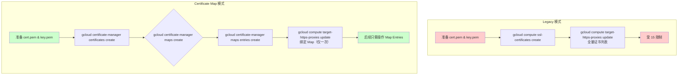

# GCP GLB SSL 证书管理方案
- https://docs.cloud.google.com/sdk/gcloud/reference/compute/target-https-proxies/update
- https://docs.cloud.google.com/certificate-manager/docs/map-entries#gcloud
## 背景

- 当前 GLB 使用 **TargetHttpsProxy**，存在 **15 个 SSL 证书限制**
- 两种模式对比：

| 模式                                              | 是否有15限制 | 证书管理方式                     |
| ------------------------------------------------- | ------------ | -------------------------------- |
| Legacy SSL Certificates（直接绑定到 HTTPS Proxy） | ✅ 有（≈15）  | 证书直接挂载到 Proxy             |
| Certificate Manager + Certificate Map             | ❌ 无限制     | 证书绑定到 Map，Proxy 只绑定 Map |

- English version 
- Current GLB is using Legacy SSL Certificates mode , it has 15 certificates limit 
- Comparison of two modes
- we need to explore how to use Certificate Manager + Certificate Map mode to manage SSL certificates :TODO

| modes                                 | certificate limit | certificate management way                            |
| ------------------------------------- | ----------------- | ----------------------------------------------------- |
| Legacy SSL Certificates               | 15                | certificate directly mounted to Proxy                 |
| Certificate Manager + Certificate Map | no limit          | certificate mounted to Map, Proxy only mounted to Map |

---

## 场景一：Legacy 模式下的操作（< 15 个证书）

> 适用于当前证书数量 < 15，需要新增或更新证书的场景

### 1.1 查看当前证书列表

```bash
# 查看当前 Proxy 关联的证书
gcloud compute target-https-proxies describe YOUR_PROXY_NAME --global --format="get(sslCertificates)"

# 列出项目中所有 SSL 证书
gcloud compute ssl-certificates list
```

### 1.2 新增证书（还有余量时）

假设当前有 7 个证书，还需要新增到 8 个：

```bash
# Step 1：创建新证书
gcloud compute ssl-certificates create cert-site-8 \
  --certificate="./site8-cert.pem" \
  --private-key="./site8-key.pem"

# Step 2：更新 Proxy（必须包含所有现有证书！）
# 注意：这里是全量列表，遗漏的证书会被移除
gcloud compute target-https-proxies update YOUR_PROXY_NAME \
  --ssl-certificates=cert1,cert2,cert3,cert4,cert5,cert6,cert7,cert-site-8 \
  --global

# Step 3（可选）：验证
gcloud compute target-https-proxies describe YOUR_PROXY_NAME --global
```

### 1.3 更新（替换）现有证书

当某个证书过期，需要替换为新证书：

```bash
# Step 1：创建新证书（使用新名称）
gcloud compute ssl-certificates create cert-site-3-v2 \
  --certificate="./new-cert.pem" \
  --private-key="./new-key.pem"

# Step 2：更新 Proxy（全量列表，替换旧证书）
gcloud compute target-https-proxies update YOUR_PROXY_NAME \
  --ssl-certificates=cert1,cert2,cert-site-3-v2,cert4,cert5,cert6,cert7 \
  --global

# Step 3：删除旧证书（确认新证书生效后执行）
gcloud compute ssl-certificates delete cert-site-3
```

### 1.4 Legacy 模式的风险

| 风险         | 说明                                                    |
| ------------ | ------------------------------------------------------- |
| **配置覆盖** | 更新 Proxy 时必须提供完整证书列表，遗漏会导致证书被移除 |
| **15 限制**  | 最多只能绑定约 15 个证书，无法扩展                      |
| **操作风险** | Proxy 更新是控制面操作，配置错误影响大                  |
| **维护困难** | 每次更新都需要小心处理全量列表，易出错                  |

---

## 场景二：Certificate Manager + Map 模式（推荐）

> 适用于需要管理大量证书（> 15）或需要平滑扩展的场景

### 2.1 创建阶段（从零开始）

#### Step 1：准备证书文件

```
cert.pem   - 完整的证书链（服务器证书 + 中间 CA 证书）
key.pem    - 私钥文件
```

#### Step 2：上传证书到 Certificate Manager

```bash
# 创建证书资源
gcloud certificate-manager certificates create my-custom-cert \
  --certificate-file="./cert.pem" \
  --private-key-file="./key.pem" \
  --location="global"
```

#### Step 3：创建 Certificate Map

```bash
# 创建 Map（如果已有则跳过）
gcloud certificate-manager maps create my-glb-cert-map \
  --location="global"
```

#### Step 4：在 Map 中创建 Entry（绑定域名到证书）

```bash
# hostname 指定该证书对应的 SNI 域名
gcloud certificate-manager maps entries create my-map-entry-1 \
  --map="my-glb-cert-map" \
  --certificates="my-custom-cert" \
  --hostname="example.com" \
  --location="global"
```

#### Step 5：将 Map 绑定到 Target HTTPS Proxy

```bash
# 获取 Proxy 名称
# gcloud compute target-https-proxies list

# 将 Map 绑定到 Proxy（这一步只会执行一次）
gcloud compute target-https-proxies update YOUR_PROXY_NAME \
  --certificate-map="my-glb-cert-map" \
  --global
```

### 2.2 新增证书（已有 Map 并已绑定到 Proxy）

假设已有 Map `my-glb-cert-map` 绑定在 LB 上，现在要为 `new-site.com` 新增第 3 个证书：

```bash
# Step 1：上传新证书
gcloud certificate-manager certificates create cert-site-3 \
  --certificate-file="./site3-cert.pem" \
  --private-key-file="./site3-key.pem" \
  --location="global"

# Step 2：在现有 Map 中创建新 Entry
gcloud certificate-manager maps entries create entry-site-3 \
  --map="my-glb-cert-map" \
  --certificates="cert-site-3" \
  --hostname="new-site.com" \
  --location="global"
```

**关键点**：无需再次执行 `target-https-proxies update`，Proxy 已经绑定了 Map，只需要在 Map 层面添加 Entry 即可。

### 2.3 更新现有证书（替换过期证书）

证书过期时，替换流程：

```bash
# Step 1：上传新证书
gcloud certificate-manager certificates create cert-site-3-v2 \
  --certificate-file="./new-cert.pem" \
  --private-key-file="./new-key.pem" \
  --location="global"

# Step 2：更新 Map Entry，指向新证书
gcloud certificate-manager maps entries update entry-site-3 \
  --map="my-glb-cert-map" \
  --certificates="cert-site-3-v2" \
  --location="global"
```

### 2.4 查看和验证

```bash
# 查看 Map 列表
gcloud certificate-manager maps list --location="global"

# 查看 Map 下的 Entry
gcloud certificate-manager maps entries list --map="my-glb-cert-map" --location="global"

# 查看证书详情
gcloud certificate-manager certificates describe my-custom-cert --location="global"
```

### 2.5 删除资源

```bash
# 删除 Map Entry
gcloud certificate-manager maps entries delete entry-site-3 \
  --map="my-glb-cert-map" \
  --location="global"

# 删除证书（确认无 Entry 引用后）
gcloud certificate-manager certificates delete cert-site-3 \
  --location="global"

# 删除 Map（确认无 Entry 后）
gcloud certificate-manager maps delete my-glb-cert-map \
  --location="global"
```

### 2.6 Certificate Manager 模式的优势

| 优势             | 说明                                    |
| ---------------- | --------------------------------------- |
| **无数量限制**   | 可管理数千个证书                        |
| **无需动 Proxy** | 证书管理在 Map 层面，Proxy 绑定一次即可 |
| **零停机**       | Map Entry 更新平滑触发，无中断          |
| **SNI 灵活**     | 通过 hostname 精准匹配不同域名          |

### 2.7 生效时间与注意事项

- **生效时间**：Map Entry 的增改通常在 **2-5 分钟**内全球生效
- **通配符匹配**：同时配置 `example.com` 和 `*.example.com` 时，按最精确匹配（Most specific match）选择
- **权限要求**：确保账号具有 `roles/certificatemanager.owner` 或 `roles/editor` 权限
- **清理旧资源**：确认新证书生效后，删除旧证书以保持环境整洁

---

## 场景三：从 Legacy 模式迁移到 Certificate Manager 模式

> 适用于从 15 限制的 Legacy 模式平滑迁移到无限制的 Certificate Map 模式

### 3.1 迁移步骤

#### Step 1：并行创建 Certificate Manager 证书

将 Legacy 模式下的所有证书都上传到 Certificate Manager：

```bash
# 假设 Legacy 模式下有 7 个证书，逐一创建
gcloud certificate-manager certificates create cert-1 \
  --certificate-file="./cert1.pem" \
  --private-key-file="./key1.pem" \
  --location="global"

gcloud certificate-manager certificates create cert-2 \
  --certificate-file="./cert2.pem" \
  --private-key-file="./key2.pem" \
  --location="global"

# ... 以此类推，创建所有 7 个证书
```

#### Step 2：创建 Certificate Map 和所有 Entry

```bash
# 创建 Map
gcloud certificate-manager maps create my-glb-cert-map \
  --location="global"

# 为每个证书创建 Entry（域名需与原证书对应）
gcloud certificate-manager maps entries create entry-1 \
  --map="my-glb-cert-map" \
  --certificates="cert-1" \
  --hostname="site1.com" \
  --location="global"

gcloud certificate-manager maps entries create entry-2 \
  --map="my-glb-cert-map" \
  --certificates="cert-2" \
  --hostname="site2.com" \
  --location="global"

# ... 以此类推
```

#### Step 3：一次性切换 Proxy 到 Certificate Map

```bash
# 切换 Proxy 绑定方式（此操作无停机）
gcloud compute target-https-proxies update YOUR_PROXY_NAME \
  --certificate-map="my-glb-cert-map" \
  --global
```

#### Step 4：验证与清理

```bash
# 验证 Proxy 已绑定到 Map
gcloud compute target-https-proxies describe YOUR_PROXY_NAME --global --format="get(certificateMap)"

# 确认新证书生效后，删除 Legacy SSL 证书
gcloud compute ssl-certificates delete cert-1
gcloud compute ssl-certificates delete cert-2
# ... 删除所有 Legacy 证书
```

### 3.2 迁移注意事项

- **并行创建**：Step 1 和 Step 2 可以同时进行，互不影响
- **切换无停机**：Step 3 的 Proxy 更新是平滑的，流量不中断
- **验证后再清理**：确认 Certificate Map 模式工作正常后，再删除 Legacy 证书
- **回滚方案**：如有问题，将 Proxy 切回 Legacy 证书即可：
  ```bash
  gcloud compute target-https-proxies update YOUR_PROXY_NAME \
    --ssl-certificates=cert1,cert2,... \
    --global
  ```

---

## 流程图对比



---

## 快速参考表

| 操作     | Legacy 模式                              | Certificate Map 模式                             |
| -------- | ---------------------------------------- | ------------------------------------------------ |
| 创建证书 | `gcloud compute ssl-certificates create` | `gcloud certificate-manager certificates create` |
| 新增证书 | Proxy 全量更新                           | `maps entries create`（无需动 Proxy）            |
| 更新证书 | Proxy 全量更新                           | `maps entries update`                            |
| 删除证书 | `gcloud compute ssl-certificates delete` | `gcloud certificate-manager certificates delete` |
| 数量限制 | ~15                                      | 无限制                                           |
| 操作风险 | 高（需小心全量列表）                     | 低（原子操作）                                   |

---

## 推荐方案

**短期（< 15 证书）**：可以使用 Legacy 模式，但应尽早规划迁移

**中长期或多租户场景**：直接使用 Certificate Manager + Map 模式
- 突破 15 限制
- 简化后续管理
- 支持未来扩展

---

如需进一步帮助：
- 设计无中断迁移方案
- 结合 GKE + Kong 多租户场景的自动化证书管理