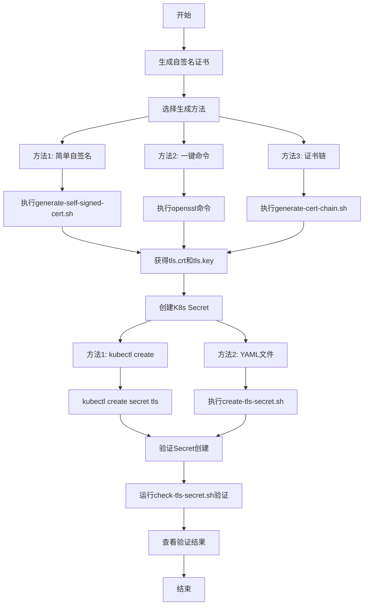

是的，使用自签名证书完全可行来模拟测试。我来给你详细的生成和部署过程。

## 自签名证书生成方法

### 方法一：使用 OpenSSL 生成自签名证书### 方法二：一键生成命令

```bash
# 快速生成自签名证书
openssl req -x509 -newkey rsa:2048 -keyout tls.key -out tls.crt -days 365 -nodes \
    -subj "/C=CN/ST=Beijing/L=Beijing/O=Test/CN=example.com" \
    -addext "subjectAltName=DNS:example.com,DNS:*.example.com,DNS:localhost"
```

### 方法三：生成证书链（包含中间证书）## 创建到 Kubernetes Namespace 的过程

### 方法一：使用 kubectl 直接创建

```bash
# 1. 确保证书文件存在
ls -la tls.crt tls.key

# 2. 创建 namespace（如果不存在）
kubectl create namespace test-tls

# 3. 创建 TLS Secret
kubectl create secret tls my-tls-secret \
    --cert=tls.crt \
    --key=tls.key \
    -n test-tls

➜  certs git:(main) ✗ k create secret tls lex-tls-secret --cert=tls.crt --key=tls.key -n lex
secret/lex-tls-secret created
➜  certs git:(main) ✗ k get secret -n lex
NAME                              TYPE                                  DATA   AGE
default-token-622b4               kubernetes.io/service-account-token   3      223d
lex-tls-secret                    kubernetes.io/tls                     2      10s

# 4. 验证创建结果
kubectl get secret my-tls-secret -n test-tls
kubectl describe secret my-tls-secret -n test-tls

➜  ingress-ssl git:(main) ✗ bash -x check-tls-secret.sh lex-tls-secret lex
```

### 方法二：使用 YAML 文件创建## 完整的测试流程



## 使用示例

### 1. 生成自签名证书
```bash
# 生成简单自签名证书
./generate-self-signed-cert.sh mydomain.com

# 或者生成证书链
./generate-cert-chain.sh mydomain.com
```

### 2. 创建到 K8s
```bash
# 方法1: 直接使用kubectl
kubectl create secret tls test-tls-secret \
    --cert=certs/tls.crt \
    --key=certs/tls.key \
    -n test-namespace

# 方法2: 使用脚本
./create-tls-secret.sh test-tls-secret test-namespace certs/tls.crt certs/tls.key
```

### 3. 验证结果
```bash
# 使用你的验证脚本
./check-tls-secret.sh test-tls-secret test-namespace
```

## 验证结果表格示例

| Check | Status | Details |
|-------|--------|---------|
| Secret Exists | ✓ Pass | Found in namespace test-namespace |
| Secret Type | ✓ Pass | kubernetes.io/tls |
| Cert/Key Match | ✓ Pass | Modulus validation successful |
| Certificate Validity | ✓ Pass | Currently valid |
| Certificate Chain | ✓ Pass | 3 certificate(s) in chain |

这样你就可以完整地测试你的 TLS Secret 验证脚本了。自签名证书完全适合用于测试和开发环境。