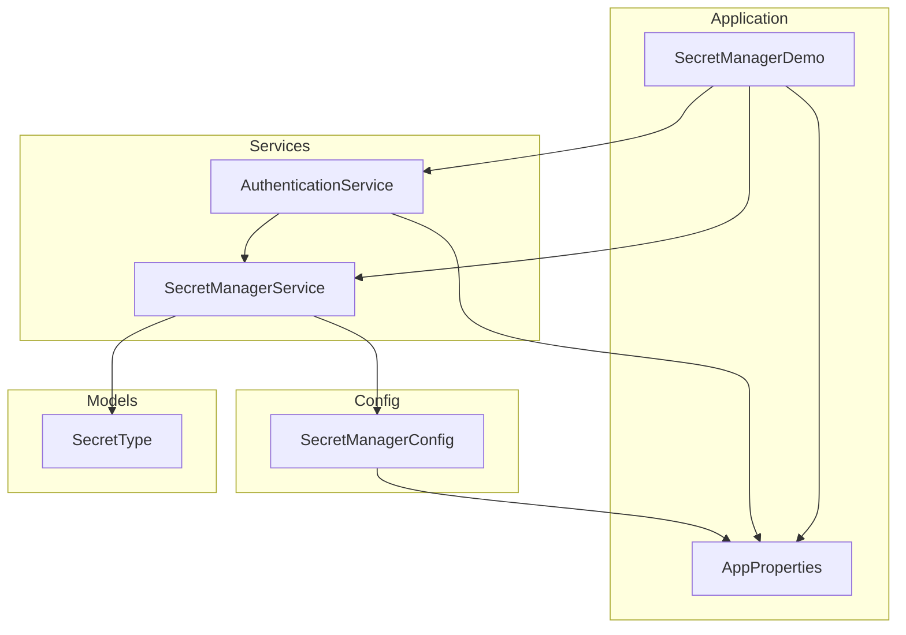

    

    <b>Automatic Architecture Diagrams from Code</b> 
    <a href="https://github.com/swark-io/swark">GitHub</a> • <a href="https://swark.io">Website</a> • <a href="mailto:contact@swark.io">Contact Us</a>

## Usage Instructions

1. **Render the Diagram**: Use the links below to open it in Mermaid Live Editor, or install the [Mermaid Support](https://marketplace.visualstudio.com/items?itemName=bierner.markdown-mermaid) extension.
2. **Recommended Model**: If available for you, use `claude-3.5-sonnet` [language model](vscode://settings/swark.languageModel). It can process more files and generates better diagrams.
3. **Iterate for Best Results**: Language models are non-deterministic. Generate the diagram multiple times and choose the best result.

## Generated Content
**Model**: GPT-4o - [Change Model](vscode://settings/swark.languageModel)  
**Mermaid Live Editor**: [View](https://mermaid.live/view#pako:eNqFUkFugzAQ_Arac_IBDpWqckWqRG44h41ZwBLYlrFTRVH-HiMbakLU-rSenRnPLtyBq4YgBybbQf3wHo3NTgWTmT-Tu3QGdZ99aj0IjlYoGTrzqcqCRlVXxA3ZEiV2ZGbk_Evxum-j9FTHgowVNEUCyYbJl4cqMlfBaUosnO0jWs81SRuTRPScJlqYm1Bb4rtnv5RsRZcaBWTrE7A_bEq_yiHJHtSnm14CzeVeHxaZHY8f6bS73jrdXhXXHBqJxzvda3srXslRmm5muf0vW4dlEg4wkhlRNP4nuzPwX3AkBnnGoKEW3WAZPDzJ6QYtFQL9KkfIrXF0AHRWVTfJl7tRrushb3GY6PEET9Hlmg) | [Edit](https://mermaid.live/edit#pako:eNqFUkFugzAQ_Arac_IBDpWqckWqRG44h41ZwBLYlrFTRVH-HiMbakLU-rSenRnPLtyBq4YgBybbQf3wHo3NTgWTmT-Tu3QGdZ99aj0IjlYoGTrzqcqCRlVXxA3ZEiV2ZGbk_Evxum-j9FTHgowVNEUCyYbJl4cqMlfBaUosnO0jWs81SRuTRPScJlqYm1Bb4rtnv5RsRZcaBWTrE7A_bEq_yiHJHtSnm14CzeVeHxaZHY8f6bS73jrdXhXXHBqJxzvda3srXslRmm5muf0vW4dlEg4wkhlRNP4nuzPwX3AkBnnGoKEW3WAZPDzJ6QYtFQL9KkfIrXF0AHRWVTfJl7tRrushb3GY6PEET9Hlmg)

