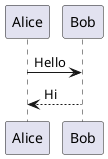

- [ ] **Auths release**
    - [ ] When we updated the bucket configuration, we must wire the response policy to verify whether it affects our changes.

- [ ] **Enhance release step**
    - [ ] When we do the release confirmation steps, test cases need to cover all the changes and some possible changes.
    - [ ] If there are corresponding logic modifications in a script, check for dependencies across the environment.
    - [ ] For the E2E test link, consider internal `curl` commands and the inflow of external traffic.
    - [ ] 整个 release 过程中，所有涉及到的一些组件或者事项都应该做一个单独的二次确认，比如涉及到 DNS 的修改。

- [ ] **How to fix ingress reverse IP issue**
    - [ ] Create a Confluence page using the recorder DNS response policy.
    - [ ] Sort our environment to specify which cases use this feature and add comments.
    - [ ] Write a script for recorder IP address, SVC IP address, ingress address, and DNS response policy.


结合你的需求，你应该重点掌握以下可视化技术和方案，以满足你的技术图形化表达需求：

1. 流程和架构可视化
	•	Mermaid.js：适用于绘制流程图、时序图、甘特图等，支持 Markdown 直接渲染。
	•	PlantUML：更适合复杂的 UML 建模，如时序图、状态机图、类图等。
	•	Graphviz（dot 语言）：适用于节点关系图，适合网络拓扑和依赖关系可视化。

2. 数据可视化
	•	Looker Studio（Google Data Studio）：用于大数据分析、仪表盘展示（你已经在学习）。
	•	Grafana：用于监控和实时数据可视化，支持 Prometheus、Elasticsearch 等数据源。
	•	D3.js：强大的 JavaScript 数据可视化库，适用于定制复杂交互图表。
	•	Apache Superset：开源 BI 平台，适用于大规模数据可视化分析。

3. Kubernetes 相关可视化
	•	Lens：可视化管理 Kubernetes 集群，查看 Pod、Deployment、Service 等状态。
	•	Kubevious：Kubernetes 配置可视化工具，帮助理解复杂的 K8s 配置。
	•	Octant：Kubernetes 资源可视化 UI，适合本地使用。

4. 网络与 API 可视化
	•	Wireshark：用于网络流量分析和可视化，适合 TCP、HTTP 数据包分析。
	•	Kiali：用于 Service Mesh（如 Istio）可视化，展示微服务拓扑和流量。
	•	Postman API Visualizer：用于 API 数据可视化分析。

5. DevOps & CICD 可视化
	•	ArgoCD UI：用于 GitOps 工作流可视化，管理 Kubernetes 部署。
	•	Tekton Dashboard：适用于 Kubernetes 原生 CICD 流程可视化。
	•	Jenkins Blue Ocean：Jenkins 的可视化插件，优化 Pipeline 展示。

6. 架构图和白板工具
	•	Diagrams（Python 库）：用代码生成架构图，适用于 AWS、GCP、K8s 架构绘制。
	•	Draw.io（diagrams.net）：免费在线架构图工具，适合云架构、网络拓扑。
	•	Excalidraw：手绘风格的架构图工具，适合会议讨论。

7. AI 与可视化结合
	•	ChatGPT / Copilot 绘图插件：AI 辅助绘制流程图和架构图。
	•	OpenAI DALL·E：用于生成 AI 生成的示意图或图形化表达。

你可以根据不同场景选择合适的工具，比如：
	•	Kubernetes 相关：Lens、Kubevious、Octant
	•	数据分析：Looker Studio、Grafana、D3.js
	•	网络和 API：Wireshark、Kiali
	•	架构和流程：Mermaid.js、PlantUML、Draw.io

如果你对某个具体方向有更深入的需求，可以告诉我，我可以给你更细化的学习建议。


PlantUML 本身不能直接在 Markdown 文档中原生渲染，除非你使用特定的插件或工具支持。以下是几种方式让 PlantUML 在 Markdown 文档中显示效果的方案：

⸻

1. 直接在 Markdown 中插入 PlantUML（不渲染）

如果你的 Markdown 编辑器不支持 PlantUML，你可以像这样插入代码块，但它不会被解析：




这种方式适用于需要将 PlantUML 代码存档，但不会自动渲染图形。

---

## **2. 使用 Markdown 兼容的 PlantUML 渲染工具**
一些 Markdown 编辑器（如 VS Code、Obsidian）可以安装插件支持 PlantUML 渲染：
- **VS Code 插件**：[PlantUML 插件](https://marketplace.visualstudio.com/items?itemName=jebbs.plantuml)
- **Obsidian 插件**：Obsidian UML 插件

在这些编辑器中，你可以直接使用：


然后它会自动转换为图片显示。

---

## **3. 结合 Mermaid 进行 Markdown 友好渲染**
如果你的 Markdown 渲染环境（如 GitHub、GitLab、Typora）不支持 PlantUML，但支持 Mermaid，你可以考虑改用 Mermaid：
```markdown
```mermaid
sequenceDiagram
    Alice->>Bob: Hello
    Bob-->>Alice: Hi

Mermaid 在很多 Markdown 编辑器中是原生支持的，而 PlantUML 需要额外插件。

---

## **4. 预生成 PlantUML 图片，并在 Markdown 中引用**
如果你在 GitHub、GitLab 或其他不支持 PlantUML 的 Markdown 解析器中使用，你可以：
1. **使用 PlantUML 生成 PNG/SVG 图片**
   ```sh
   java -jar plantuml.jar diagram.puml

	2.	在 Markdown 中引用生成的图片


⸻

5. 使用在线 PlantUML 服务器

你可以使用 PlantUML 在线服务器 直接嵌入 URL：


不过，这种方法需要网络访问。

⸻

总结

方案	适用场景	备注
直接插入 PlantUML 代码	记录代码，但不渲染	适用于 Markdown 代码存档
VS Code/Obsidian 插件	本地编辑时渲染	需要插件支持
使用 Mermaid 代替	GitHub/GitLab/Typora	Mermaid 更通用
预生成 PNG/SVG	GitHub、文档发布	需要额外转换
使用在线 PlantUML 服务器	网络可访问的 Markdown	依赖外部服务

如果你的目标是 Markdown 直接渲染，Mermaid 是更好的选择，如果必须使用 PlantUML，就要借助插件或图片转换。你更倾向哪种方式？