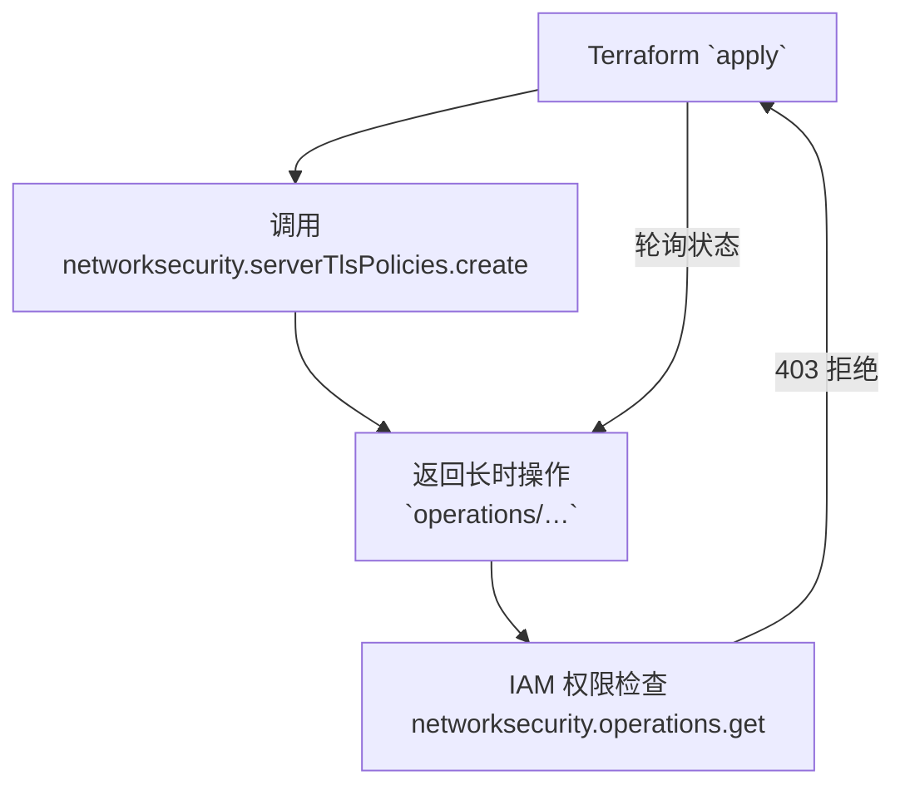
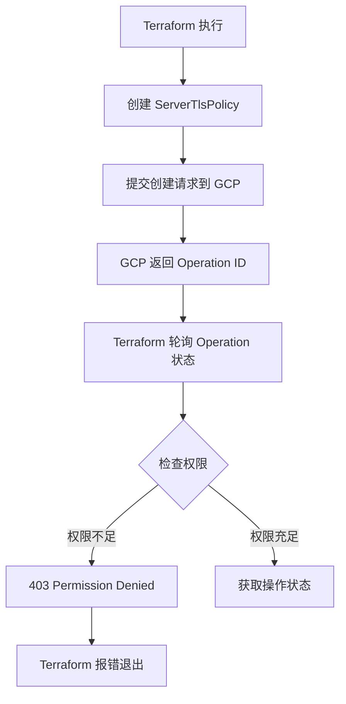
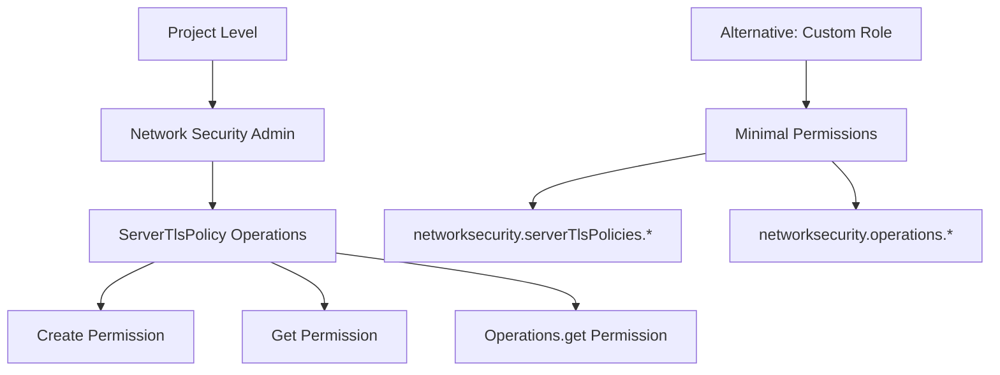

# Q 
我用Terrafrom 推送GCP里面的资源

遇到下面这个报错

Error: Error waiting to create ServerTlsPolicy: Error waiting for Creating ServerTlsPolicy: error while retrieving operation: googleapi: Error 403: Permission 'networksecurity.operations.get denied on 'projects/aibang-my-project/locations/global/operations/operation-1749115455265-636cfad61db4b-15ad567d-2c7842a 1*

with module.public_ingress.module.public_ingress.module.glb.google_network_security_server_tls_policy.default, on modules/aibang-glb/main.tf line 47, in resource "google_network_security_server_tls_policy" "default":

47: resource "google_network_security_server_tls_policy" "default" (
https://cloud.google.com/iam/docs/roles-permissions/networksecurity
https://cloud.google.com/iam/docs/roles-permissions/networksecurity#networksecurity.operations.get

[Owner](https://cloud.google.com/iam/docs/roles-overview#basic) (`roles/owner`)

[Editor](https://cloud.google.com/iam/docs/roles-overview#basic) (`roles/editor`)

[Viewer](https://cloud.google.com/iam/docs/roles-overview#basic) (`roles/viewer`)

[Compute Network Admin](https://cloud.google.com/iam/docs/roles-permissions/compute#compute.networkAdmin) (`roles/compute.networkAdmin`)

[Compute Network User](https://cloud.google.com/iam/docs/roles-permissions/compute#compute.networkUser) (`roles/compute.networkUser`)

[Compute Network Viewer](https://cloud.google.com/iam/docs/roles-permissions/compute#compute.networkViewer) (`roles/compute.networkViewer`)

[Security Admin](https://cloud.google.com/iam/docs/roles-permissions/iam#iam.securityAdmin) (`roles/iam.securityAdmin`)

[Security Reviewer](https://cloud.google.com/iam/docs/roles-permissions/iam#iam.securityReviewer) (`roles/iam.securityReviewer`)

[Security Profile Admin](https://cloud.google.com/iam/docs/roles-permissions/networksecurity#networksecurity.securityProfileAdmin) (`roles/networksecurity.securityProfileAdmin`)
  
# Gemini 

# Resolving Terraform `403 Permission Denied` Error for GCP `ServerTlsPolicy` Creation

## 1. Executive Summary

Users deploying Google Cloud Platform (GCP) resources using Terraform may encounter a `403 Permission Denied` error when attempting to create a `google_network_security_server_tls_policy`. The specific error message, `Permission 'networksecurity.operations.get denied'`, points to an Identity and Access Management (IAM) issue where the principal (user or service account) executing Terraform lacks the necessary permission to monitor the status of the `ServerTlsPolicy` creation operation. This is a common scenario with cloud provider APIs that handle resource provisioning asynchronously.

Successful creation and lifecycle management of `ServerTlsPolicy` resources require not only the permission to initiate creation (e.g., `networksecurity.serverTlsPolicies.create`) but also permissions to track the progress of such operations. This report provides a comprehensive guide to understanding the error, identifying all requisite IAM permissions, and implementing the correct IAM configurations. It details the steps to pinpoint the Terraform principal and grant it the appropriate predefined or custom IAM roles. By following the procedures outlined, users can resolve the permission error and ensure smooth deployment of Network Security resources in GCP using Terraform.

## 2. Deconstructing the Terraform Error Message

The error message provided by the user is central to diagnosing the issue:

`Error: Error waiting to create ServerTlsPolicy: Error waiting for Creating ServerTlsPolicy: error while retrieving operation: googleapi: Error 403: Permission 'networksecurity.operations.get denied on 'projects/aibang-my-project/locations/global/operations/operation-1749115455265-636cfad61db4b-15ad567d-2c7842a1* with module.public_ingress.module.public_ingress.module.glb.google_network_security_server_tls_policy.default.`

A systematic breakdown of this message reveals the precise nature of the problem:

- **`Error waiting to create ServerTlsPolicy`**: This initial part indicates that Terraform successfully submitted the request to create the `ServerTlsPolicy` resource. However, Terraform's process involves waiting for confirmation that the resource has been successfully provisioned.
- **`error while retrieving operation`**: This is the critical failure point. Many GCP resource creation, update, or deletion tasks are asynchronous. When such a task is initiated, the GCP API often returns an operation ID. The client (Terraform, in this case) then polls the status of this operation (e.g., "pending," "running," "succeeded," "failed") to determine the outcome. This part of the message signifies that Terraform failed during this polling phase.
- **`googleapi: Error 403: Permission 'networksecurity.operations.get denied`**: This is the core IAM problem. The HTTP `403` status code means "Forbidden," indicating that the authenticated principal is not authorized to perform the requested action. The message explicitly states that the permission `networksecurity.operations.get` is denied. This permission is required to retrieve the status of an operation within the Network Security API (`networksecurity.googleapis.com`).
- **`on 'projects/aibang-my-project/locations/global/operations/operation-1749115455265-636cfad61db4b-15ad567d-2c7842a1'`**: This specifies the exact resource on which the permission is denied. It's an operation resource, identified by its unique ID, within the specified project (`aibang-my-project`) and global location. This level of detail is invaluable for precise troubleshooting, as it confirms the issue lies with monitoring an operation related to the Network Security service.
- **`with module.public_ingress.module.public_ingress.module.glb.google_network_security_server_tls_policy.default`**: This part of the message traces the error back to the specific Terraform resource definition within the user's configuration that triggered the failed operation.

The asynchronous nature of GCP resource provisioning is key here. Terraform does not simply "fire and forget" a creation request. It needs to track the operation to completion to ensure the resource is in the desired state and to capture any output attributes for its state file. The `networksecurity.operations.get`permission is essential for this tracking mechanism when dealing with Network Security resources. Without it, Terraform cannot confirm the successful creation of the `ServerTlsPolicy`, leading to a timeout and the reported error, even if the initial creation request was valid and accepted by GCP. This underscores the importance of understanding that managing cloud resources often involves permissions beyond the direct `create`, `read`, `update`, or `delete` actions on the resource itself; permissions related to ancillary services like operations monitoring are equally critical.

## 3. Essential IAM Permissions for `ServerTlsPolicy` and Operations Management

Managing a `google_network_security_server_tls_policy` resource through its entire lifecycle (creation, reading, updating, deletion, and monitoring of these actions) requires a set of specific IAM permissions. The error message highlighted the immediate need for `networksecurity.operations.get`, but a comprehensive solution involves ensuring all necessary permissions are in place.

The primary permissions associated with the `ServerTlsPolicy` resource itself include:

- **`networksecurity.serverTlsPolicies.create`**: Allows the principal to initiate the creation of a new Server TLS Policy.1
- **`networksecurity.serverTlsPolicies.get`**: Permits retrieving the details of an existing Server TLS Policy.2 This is crucial for Terraform's state refresh mechanism.
- **`networksecurity.serverTlsPolicies.list`**: Enables listing all Server TLS Policies within a given project and location.2 This is also used by Terraform during planning and state refresh.
- **`networksecurity.serverTlsPolicies.update`** (or the equivalent `patch` method): Allows modification of an existing Server TLS Policy.4
- **`networksecurity.serverTlsPolicies.delete`**: Grants permission to remove a Server TLS Policy.4

Beyond these direct resource manipulation permissions, the management of asynchronous operations within the Network Security API requires:

- **`networksecurity.operations.get`**: As identified in the error, this permission is vital for retrieving the status of ongoing operations (like create, update, or delete) for `ServerTlsPolicy` and other resources managed by the Network Security API.7
- Other `networksecurity.operations.*` permissions, such as `networksecurity.operations.list`, `networksecurity.operations.delete`, and `networksecurity.operations.cancel`, might be necessary for more advanced or direct management of operations 9, but `networksecurity.operations.get` is the one directly implicated in the user's error.

It is important to note that Terraform provider documentation (e.g., for `google_network_security_server_tls_policy`) may not always provide an exhaustive list of all required IAM permissions.10 In such cases, consulting official GCP IAM documentation or reliable third-party permission aggregators becomes necessary to obtain a complete picture of the required permissions.

The following table summarizes the key permissions required for managing `ServerTlsPolicy` resources and the associated operations, along with common predefined roles that grant them:

|   |   |   |
|---|---|---|
|**Permission**|**Description**|**Common Predefined Roles Granting It (Examples)**|
|`networksecurity.serverTlsPolicies.create`|Allows creation of Server TLS Policies.|`roles/compute.networkAdmin` 1, `roles/owner`, `roles/editor`. (Note: `roles/anthosservicemesh.serviceAgent` also has this 1, but service agent roles should not be directly assigned to user-managed principals 7).|
|`networksecurity.serverTlsPolicies.get`|Allows retrieval of Server TLS Policy details.|`roles/compute.networkAdmin`, `roles/compute.loadBalancerAdmin` 3, `roles/viewer`, `roles/owner`, `roles/editor`.|
|`networksecurity.serverTlsPolicies.list`|Allows listing of Server TLS Policies.|`roles/compute.networkAdmin`, `roles/compute.loadBalancerAdmin` 3, `roles/viewer`, `roles/owner`, `roles/editor`.|
|`networksecurity.serverTlsPolicies.update`|Allows updating of existing Server TLS Policies.|`roles/compute.networkAdmin`, `roles/owner`, `roles/editor`.|
|`networksecurity.serverTlsPolicies.delete`|Allows deletion of Server TLS Policies.|`roles/compute.networkAdmin`, `roles/owner`, `roles/editor`.|
|`networksecurity.operations.get`|Allows retrieval of the status of operations within the Network Security service.|`roles/owner`, `roles/editor`, `roles/viewer`, `roles/compute.networkAdmin`, `roles/networksecurity.securityProfileAdmin`.7(Also present in various service agent roles like `roles/container.serviceAgent`, which are not for direct user assignment 7).|
|`networksecurity.operations.list`|Allows listing of operations within the Network Security service.|`roles/owner`, `roles/editor`, `roles/viewer`, `roles/compute.networkAdmin`, `roles/networksecurity.securityProfileAdmin`. (Also present in various service agent roles).|

This consolidated view helps in understanding the breadth of permissions involved. Terraform's operational model, which includes reading current state (requiring `get` and `list` permissions) and monitoring asynchronous actions, necessitates a more comprehensive set of permissions than just `create`.

## 4. Identifying the Principal and Granting Permissions

To resolve the `403 Permission Denied` error, the necessary permissions must be granted to the correct IAM principal that Terraform is using to authenticate with GCP.

### Identifying the Terraform Principal

Terraform authenticates to GCP primarily through Application Default Credentials (ADC).11 The specific identity depends on the environment where Terraform is executed:

- **Local Development (User Workstation):**
    - If `gcloud auth application-default login` was run without impersonation, Terraform uses the logged-in user's credentials.11 The principal is the user's email address.
    - If service account impersonation was configured via `gcloud auth application-default login --impersonate-service-account SERVICE_ACCT_EMAIL`, Terraform uses the specified service account's identity.11 The principal is the service account email. The user performing the impersonation needs the `roles/iam.serviceAccountTokenCreator` role on the target service account.
- **CI/CD Pipelines or GCP Compute Environments (e.g., GCE, Cloud Run, GKE):**
    - Typically, an attached service account is used.11 The compute resource (e.g., GCE VM, GKE Node) runs as this service account, and Terraform inherits its identity. The principal is the email address of this attached service account.
- **Service Account Key File:**
    - If the `GOOGLE_APPLICATION_CREDENTIALS` environment variable is set to the path of a service account key JSON file, Terraform uses that service account.11 The principal is the email of the service account associated with the key. This method is generally less recommended due to the security overhead of managing key files.

If the service account itself is managed by Terraform (using the `google_service_account` resource), its email address can be referenced from the `email` attribute of that resource.12

### Choosing the Right Roles

Once the principal is identified, the next step is to grant it the required permissions, usually by assigning IAM roles.

- **Predefined Roles:**
    
    - GCP offers various predefined roles. For managing `ServerTlsPolicy` and related operations, the **`Compute Network Admin`** role (`roles/compute.networkAdmin`) is a strong candidate. It is documented to include `networksecurity.operations.get` 7 and `networksecurity.serverTlsPolicies.create`.1 It also generally covers a wide range of networking and network security permissions, such as those for address groups.13
    - The **`Security Profile Admin`** role (`roles/networksecurity.securityProfileAdmin`) also contains `networksecurity.operations.get` 7 and permissions for managing security profiles and groups.7
    - The **`Compute Load Balancer Admin`** role (`roles/compute.loadBalancerAdmin`) includes permissions like `networksecurity.serverTlsPolicies.get` and `networksecurity.serverTlsPolicies.list` 3, relevant if the `ServerTlsPolicy` is used with load balancers.
    - The `Network Security Admin` role (`roles/networksecurity.admin`) was considered, but available documentation snippets do not clearly define its specific permissions.15 Without a clear, official list of its permissions, relying on more explicitly documented roles or custom roles is advisable.
    - **Basic Roles (`Owner`, `Editor`, `Viewer`):** These roles grant broad permissions across many GCP services.17
        - `roles/owner`: Full control, includes all necessary permissions but is overly permissive.
        - `roles/editor`: Allows modification of most resources, includes most necessary permissions but is also overly permissive.
        - `roles/viewer`: Provides read-only access. It grants `networksecurity.operations.get` 7 but lacks permissions to create, update, or delete `ServerTlsPolicy` resources. Using basic roles, especially `Owner` and `Editor`, for service accounts is strongly discouraged as it violates the principle of least privilege.
- **Custom Roles:**
    
    - If no single predefined role provides the exact set of required permissions without granting excessive, unrelated privileges, creating a custom IAM role is the recommended approach.17 This aligns best with the principle of least privilege.
        
    - A custom role for managing `ServerTlsPolicy` via Terraform should include at least the following permissions:
        
        - `networksecurity.serverTlsPolicies.create`
        - `networksecurity.serverTlsPolicies.get`
        - `networksecurity.serverTlsPolicies.list`
        - `networksecurity.serverTlsPolicies.update`
        - `networksecurity.serverTlsPolicies.delete`
        - `networksecurity.operations.get` (scoped to Network Security operations)
        - `networksecurity.operations.list` (potentially, for broader operational insight if needed)
    - **Important Caution on Service Agent Roles:** Several GCP service agent roles (e.g., `roles/container.serviceAgent`, `roles/composer.serviceAgent`) might appear in permission searches as they often have broad access, including some `networksecurity.*` permissions.7 These roles are GCP-managed and intended for GCP services to interact with other resources on the user's behalf. **Service agent roles must not be granted to user-managed service accounts or users**.7 Doing so can create significant security risks.
        

### Granting Roles

Permissions can be granted using the Google Cloud Console or the `gcloud` command-line tool.

- **Using Google Cloud Console:**
    
    1. Navigate to "IAM & Admin" > "IAM" in the Google Cloud Console.22
    2. Select the appropriate project (e.g., `aibang-my-project`).
    3. Click on "GRANT ACCESS" (or "Add" in older UIs).22
    4. In the "New principals" field, enter the email address of the user or service account identified previously.
    5. In the "Select a role" dropdown, search for and select the desired predefined role (e.g., `Compute Network Admin`) or custom role.
    6. If granting multiple roles, click "Add another role."
    7. Click "Save."
- Using gcloud command-line:
    
    The command to add an IAM policy binding is:
    
    gcloud projects add-iam-policy-binding PROJECT_ID --member=PRINCIPAL_TYPE:PRINCIPAL_ID --role=ROLE_ID
    
    - Replace `PROJECT_ID` with the actual project ID (e.g., `aibang-my-project`).
    - `PRINCIPAL_TYPE` is `user` for a user account or `serviceAccount` for a service account.
    - `PRINCIPAL_ID` is the email address of the user or service account.
    - `ROLE_ID` is the full ID of the role (e.g., `roles/compute.networkAdmin` or `projects/PROJECT_ID/roles/CUSTOM_ROLE_ID` for a project-level custom role).
    
    Example for granting Compute Network Admin to a service account:
    
    gcloud projects add-iam-policy-binding aibang-my-project --member=serviceAccount:your-terraform-sa@aibang-my-project.iam.gserviceaccount.com --role=roles/compute.networkAdmin
    

Choosing the `Compute Network Admin` role might be a quicker solution if its broader permissions are acceptable within the organization's security posture. However, for production environments and adherence to least privilege, investing time in creating and assigning a well-defined custom role is the superior long-term strategy.

## 5. Troubleshooting and Verification

After identifying the principal and granting the presumed necessary roles, further steps may be needed if the error persists.

### Verifying Permissions

1. **Retry Terraform:** The most direct way to verify is to re-run `terraform apply`. If the permissions are correct and have propagated, the operation should now succeed.
2. **Check IAM Policy:** Use the `gcloud` CLI to inspect the project's IAM policy and confirm the role was correctly assigned to the principal: `gcloud projects get-iam-policy PROJECT_ID --format=json` Look for the principal's email and verify the assigned roles.
3. **Policy Troubleshooter:** The GCP Console offers a Policy Troubleshooter (under IAM & Admin) that can check if a specific principal has a particular permission on a given resource. This can be useful for verifying individual permissions like `networksecurity.operations.get`.
4. **`testIamPermissions()` Method:** While less direct for a Terraform user, developers can use the `testIamPermissions()` API method on resources to programmatically check if the currently authenticated caller has a set of permissions.24

### IAM Propagation Delay

IAM changes in GCP are eventually consistent. This means that after granting a role or permission, it might take some time for the change to take effect across all Google Cloud systems.25

- Propagation time for direct policy changes is typically around 2 minutes but can occasionally take 7 minutes or longer.25
- Changes involving group memberships (if roles are granted to groups, and the principal is a member of that group) can take significantly longer, potentially hours.25 Adding a principal to a group generally propagates faster than removing one.
- If Terraform fails immediately after an IAM change, it is advisable to wait a few minutes (e.g., 5-10 minutes) and then retry the `terraform apply` command.26

### Conflicting Organization Policies

Even if IAM permissions are correctly granted at the project level, Organization Policies set at the organization or folder level can restrict certain actions and override project-level IAM settings.27

- Organization Policies can enforce constraints such as limiting the use of specific APIs, restricting the creation of certain resource types, or defining allowed geographical locations for resources.27
- While less common for a specific permission like `networksecurity.operations.get`, a broader Organization Policy (e.g., one that restricts all `networksecurity.googleapis.com` API calls or specific operations within it) could be the cause.
- Organization Policies can be viewed in the GCP Console under "IAM & Admin" > "Organization Policies".28 The effective policy for a given resource is an evaluation of policies inherited from its hierarchy.
- If an Organization Policy is suspected to be the cause, collaboration with the GCP organization administrator will likely be necessary to review and potentially adjust the policy.

### Other Common GCP 403 Errors and Issues with Terraform

If the `networksecurity.operations.get` error is resolved but other 403 errors or issues arise, consider these common causes:

- **APIs Not Enabled:** Ensure that the necessary APIs are enabled for the project. For `ServerTlsPolicy`, the `Network Security API` (`networksecurity.googleapis.com`) must be enabled. Depending on related resources, the `Compute Engine API` (`compute.googleapis.com`) might also be required.26 APIs can be enabled via the GCP Console (APIs & Services > Library) or `gcloud services enable API_NAME`.
- **Incorrect Project Configuration:** Verify that the Terraform provider configuration and resource definitions are targeting the correct GCP project ID.
- **Service Account Status:** If using a service account, ensure it has not been disabled or deleted.12 The `disabled` field in a service account definition can prevent it from authenticating or being authorized.
- **Billing Account Issues:** While typically resulting in different errors, ensure the project is linked to an active and valid billing account, especially for resource creation. Some APIs or resources might have specific billing project requirements when using User Application Default Credentials.30
- **Terraform State Inconsistencies:** If Terraform fails after some resources are created, the local state file might become inconsistent with the actual cloud state. This can sometimes lead to subsequent errors. Terraform relies heavily on `get` permissions for its refresh cycle to reconcile the desired state (code) with the actual state (cloud). If `get` permissions for `ServerTlsPolicy` are missing, `terraform plan` or `apply` might fail even if `create` was successful previously, or it might incorrectly try to recreate resources. This reinforces the need for comprehensive lifecycle permissions, not just `create` and `operations.get`.

Troubleshooting IAM and deployment issues often requires a systematic approach, starting with the most direct solutions (correct role assignment) and then exploring broader contexts like propagation delays and organizational constraints.

## 6. Recommendations and Best Practices for IAM with Terraform

Successfully resolving the immediate permission error is important, but adopting robust IAM practices is crucial for long-term security and operational efficiency when using Terraform with GCP.

- **Adhere to the Principle of Least Privilege (PoLP):**
    
    - Grant only the minimum set of permissions required for Terraform to manage the resources defined in its configuration.17 Avoid granting broad roles like `Owner` or `Editor` to service accounts.
    - Strongly prefer custom IAM roles when predefined roles are too permissive. A custom role can be tailored to include only the necessary permissions (e.g., `networksecurity.serverTlsPolicies.create`, `.get`, `.list`, `.update`, `.delete`, and `networksecurity.operations.get`).19
    - PoLP significantly reduces the potential impact (blast radius) if the Terraform principal's credentials are ever compromised.
- **Utilize Dedicated Service Accounts for Terraform:**
    
    - Always use dedicated service accounts for Terraform deployments, especially in automated CI/CD environments, rather than relying on user credentials.11 This isolates Terraform's permissions and improves auditability.
    - If service account keys must be used (e.g., for external systems authenticating to GCP), manage them securely. Store them in a secure secret manager, rotate them regularly, and avoid embedding them directly in code or version control systems. Prefer alternatives like Workload Identity Federation for keyless authentication from external environments where possible.11 For GCE VMs or other GCP compute, use attached service accounts which do not require key management.
- **Implement "IAM as Code":**
    
    - Manage IAM policies, particularly for the Terraform service account, using Terraform itself (e.g., with `google_project_iam_member`, `google_project_iam_binding`, or `google_project_iam_policy`resources). This approach ensures that IAM changes are version-controlled, auditable, and part of the same review and deployment process as the infrastructure code. This reduces manual console changes which can be error-prone and difficult to track.
- **Conduct Regular IAM Audits:**
    
    - Periodically review IAM policies, role assignments, and service account permissions to ensure they remain appropriate and adhere to PoLP.
    - Leverage GCP tools like Security Health Analytics (part of Security Command Center 31) and IAM Recommender. IAM Recommender can identify overly permissive roles and suggest more restrictive alternatives.
- **Consider IAM Conditions:**
    
    - For more granular access control, explore IAM Conditions. Conditions allow role bindings to be effective only if specified criteria are met (e.g., based on time of day, resource tags, or requesting IP address).17 This can further refine the application of least privilege.
- **Test IAM Changes Thoroughly:**
    
    - Before applying IAM changes in a production environment, test them in a non-production or development project.
    - Use tools like the GCP Policy Troubleshooter or the `testIamPermissions` API method to verify permissions before attempting deployments.24

By integrating these best practices, organizations can enhance their security posture, reduce the risk of permission-related errors, and maintain better control over their GCP resources when using Terraform.

## 7. Conclusion

The `Error 403: Permission 'networksecurity.operations.get denied` encountered when using Terraform to create a `google_network_security_server_tls_policy` in GCP stems from the Terraform principal lacking the authorization to monitor the asynchronous creation operation. Resolving this requires granting the `networksecurity.operations.get` permission, along with the full suite of permissions needed for the lifecycle management of `ServerTlsPolicy` resources (create, get, list, update, delete).

The recommended approach involves:

1. **Identifying the principal** (user or service account) used by Terraform.
2. **Assigning appropriate IAM roles**. While predefined roles like `roles/compute.networkAdmin` offer a quick solution by including many necessary network security permissions, creating a **custom IAM role**tailored with the specific permissions (`networksecurity.serverTlsPolicies.*` and `networksecurity.operations.get`) is the best practice for adhering to the principle of least privilege.
3. **Verifying the changes** and allowing for IAM propagation delay.
4. Being aware of potential **overriding Organization Policies** or other issues like disabled APIs.

Adopting IAM best practices, such as using dedicated service accounts for Terraform, managing IAM as code, and conducting regular audits, will further strengthen the security and reliability of GCP deployments. By understanding the interplay between Terraform's operational model and GCP's IAM system, users can effectively troubleshoot permission errors and build secure, automated cloud infrastructure.

#  ChatGPT  
以下内容帮助你快速定位 **403 Permission networksecurity.operations.get denied** 的根因，并给出最小权限修复方案。所有示例均可直接复制到终端或 Markdown 文档中。

---

## **1️⃣ 发生了什么？**



Terraform 成功触发 **ServerTlsPolicy** 创建，但在随后轮询长时操作 (operations/...) 时，由于 **缺少 networksecurity.operations.get 权限** 而被 IAM 拒绝。

---

## **2️⃣ 必要权限对照**

|**动作**|**关键权限**|**常见包含角色**|
|---|---|---|
|创建 ServerTlsPolicy|networksecurity.serverTlsPolicies.create|roles/compute.networkAdmin|
|读取操作状态|networksecurity.operations.get|roles/compute.networkAdmin, roles/compute.networkViewer, roles/viewer|

> 只要**缺少第二行的任意角色/权限**，就会出现你看到的 403。

---

## **3️⃣ 解决方案**

  

### **方案 A：授予预定义角色（推荐）**

  

若你希望一次解决 **创建 + 轮询** 所需全部权限，可为 Terraform 使用的身份（人或 Service Account）添加 **Compute Network Admin**：

```
gcloud projects add-iam-policy-binding aibang-my-project \
  --member="serviceAccount:terraform-sa@aibang-my-project.iam.gserviceaccount.com" \
  --role="roles/compute.networkAdmin"
```

_最小可行_ 方案是在已有自定义/预定义角色的基础上，再附加 **Compute Network Viewer**（仅包含只读网络与操作查询权限）：

```
gcloud projects add-iam-policy-binding aibang-my-project \
  --member="serviceAccount:terraform-sa@aibang-my-project.iam.gserviceaccount.com" \
  --role="roles/compute.networkViewer"
```

### **方案 B：更新自定义角色**

  

如果你使用的是自定义最小权限角色，只需要把 networksecurity.operations.get 加进去即可：

```
# 查看现有权限
gcloud iam roles describe tfNetworkSecurity --project=aibang-my-project

# 追加缺失的 operations.get
gcloud iam roles update tfNetworkSecurity \
  --project=aibang-my-project \
  --add-permissions="networksecurity.operations.get"
```

---

## **4️⃣ 验证步骤**

1. **权限生效**后重新运行：
    

```
terraform apply
```

1.   
    
2. 如需手动验证 IAM，可使用：
    

```
gcloud beta network-security operations describe \
  "operation-1749115455265-636cfad61db4b-15ad567d-2c7842a" \
  --project=aibang-my-project
```

2. 若命令不再返回 403，则权限已正确赋予。
    

---

## **5️⃣ 常见坑提醒**

- **API 已启用** —— 能进入创建阶段说明 networksecurity.googleapis.com 已开启，无需重复启用。
    
- **Service Account 作用域** —— 若在 Cloud Build、GitHub Actions 等 CI 环境运行，确保绑定的是实际执行 Terraform 的那一个 Service Account，而非你的个人账号。
    
- **最小权限** —— 如果担心过度授权，可采用 compute.networkViewer + 自定义角色组合，只赋予创建/删除 ServerTlsPolicy 所需的特定权限。
    

---

> 结论：**确实是 Terraform 所用身份缺少 networksecurity.operations.get。**

> 给它加上带此权限的角色（最小可选 roles/compute.networkViewer），或在自定义角色里加入该权限即可解决。

[Compute Network User](https://cloud.google.com/iam/docs/roles-permissions/compute#compute.networkUser) (`roles/compute.networkUser`)

[Compute Network Viewer](https://cloud.google.com/iam/docs/roles-permissions/compute#compute.networkViewer) (`roles/compute.networkViewer`)
是的，你的理解是 **准确的**，如果你的 Terraform 配置中只是**创建或引用网络资源**（如 ServerTlsPolicy）而不是**管理 VPC 或防火墙规则**，你只需要以下两个角色即可：

---

## **✅ 精简权限组合**

| **角色名称**                    | **权限概述**       | **说明**                                                  |
| --------------------------- | -------------- | ------------------------------------------------------- |
| roles/compute.networkUser   | 授权用户使用已存在的网络资源 | 允许访问 VPC 网络、子网、IP 范围等（但不能修改）                            |
| roles/compute.networkViewer | 只读权限           | 包含 networksecurity.operations.get，可用于 Terraform 轮询操作状态等 |

---

## **🎯 权限覆盖情况**

|**操作资源**|**所需权限**|**所属角色**|
|---|---|---|
|创建 ServerTlsPolicy|networksecurity.serverTlsPolicies.create|roles/compute.networkUser ✅|
|查询 operation/... 状态|networksecurity.operations.get|roles/compute.networkViewer ✅|

---

## **✅ 建议授权命令**

  

假设你 Terraform 使用的是一个 Service Account：

```
SERVICE_ACCOUNT="terraform-sa@aibang-my-project.iam.gserviceaccount.com"
PROJECT_ID="aibang-my-project"

# 授予 networkUser
gcloud projects add-iam-policy-binding "$PROJECT_ID" \
  --member="serviceAccount:$SERVICE_ACCOUNT" \
  --role="roles/compute.networkUser"

# 授予 networkViewer
gcloud projects add-iam-policy-binding "$PROJECT_ID" \
  --member="serviceAccount:$SERVICE_ACCOUNT" \
  --role="roles/compute.networkViewer"
```

---

## **✅ 验证权限是否生效**

```
gcloud projects get-iam-policy "$PROJECT_ID" \
  --flatten="bindings[].members" \
  --filter="bindings.members:terraform-sa" \
  --format="table(bindings.role)"
```

确认这两个角色都被正确附加即可。

---

## **✅ 结论**

  

你确实不需要使用过于宽泛的 compute.networkAdmin，

只要：

- roles/compute.networkUser
    
- roles/compute.networkViewer
    

  

即可满足 Terraform 创建 ServerTlsPolicy 的场景，同时避免过度授权。做得很对 ✅。


# Grok
错误分析

您遇到的错误是 Terraform 在尝试创建 Google Cloud Platform (GCP) 的 ServerTlsPolicy 资源时，提示了一个 403 权限错误，具体为：

```text
Error: Error waiting to create ServerTlsPolicy: Error waiting for Creating ServerTlsPolicy: error while retrieving operation: googleapi: Error 403: Permission 'networksecurity.operations.get' denied on 'projects/aibang-my-project/locations/global/operations/operation-1749115455265-636cfad61db4b-15ad567d-2c7842a1'
```

这个错误表明运行 Terraform 的用户或服务账号缺少 networksecurity.operations.get 权限，导致无法获取操作的状态，从而使 Terraform 无法确认 ServerTlsPolicy 资源的创建是否成功。

具体原因

1. 权限缺失：
    
    - Terraform 在执行 google_network_security_server_tls_policy 资源创建时，需要调用 GCP 的 Network Security API 来管理 ServerTlsPolicy。
        
    - 创建资源后，Terraform 会轮询操作状态以确认是否完成，这需要 networksecurity.operations.get 权限。
        
    - 错误明确指出，当前用户或服务账号对指定项目的操作资源（projects/aibang-my-project/locations/global/operations/...）没有 networksecurity.operations.get 权限。
        
2. 可能的场景：
    
    - 服务账号权限不足：如果您使用服务账号运行 Terraform，该服务账号可能未被授予包含 networksecurity.operations.get 的角色。
        
    - 用户账号权限不足：如果您使用个人用户账号运行 Terraform，您的 IAM 角色可能缺少必要的权限。
        
    - 项目范围问题：权限可能在错误的 GCP 项目中配置，或者 Terraform 的凭据配置指向了错误的上下文。
        
3. 错误来源：
    
    - 错误发生在 modules/aibang-glb/main.tf 文件的第 47 行，涉及 google_network_security_server_tls_policy 资源。
        
    - 资源名称为 default，位于 module.public_ingress.module.public_ingress.module.glb 模块中，说明这是一个嵌套模块调用。
        

---

解决方法

为了解决这个问题，您需要确保 Terraform 使用的身份（用户或服务账号）具有足够的权限来执行 ServerTlsPolicy 的创建和操作状态查询。以下是详细的解决步骤：

1. 确认 Terraform 使用的身份

- 检查身份：
    
    - 如果您使用的是服务账号，确认 Terraform 配置中使用的服务账号密钥文件（通常通过 GOOGLE_APPLICATION_CREDENTIALS 环境变量或 Terraform 的 provider 块指定）。
        
        bash
        
        ```bash
        export GOOGLE_APPLICATION_CREDENTIALS=/path/to/service-account-key.json
        ```
        
    - 如果使用的是用户账号，运行以下命令确认当前 gcloud 认证的用户：
        
        bash
        
        ```bash
        gcloud auth list
        ```
        
- 验证项目： 确保 Terraform 使用的项目 ID 为 aibang-my-project，可以通过以下方式确认：
    
    bash
    
    ```bash
    gcloud config get-value project
    ```
    
    如果项目 ID 不正确，设置正确的项目：
    
    bash
    
    ```bash
    gcloud config set project aibang-my-project
    ```
    

2. 检查和分配必要权限

- 需要的权限： 根据错误信息，至少需要以下权限：
    
    - networksecurity.serverTlsPolicies.create：创建 ServerTlsPolicy 资源。
        
    - networksecurity.serverTlsPolicies.get：获取 ServerTlsPolicy 资源。
        
    - networksecurity.operations.get：查询操作状态（这是错误中明确提到的权限）。
        
    - 可能还需要的权限：
        
        - networksecurity.serverTlsPolicies.update：如果 Terraform 需要更新资源。
            
        - networksecurity.serverTlsPolicies.delete：如果 Terraform 需要销毁资源。
            
- 推荐的 IAM 角色： GCP 提供了一些预定义角色，可以包含上述权限：
    
    - Network Security Admin（roles/networksecurity.admin）： 包含对 Network Security 资源的完全访问权限，适合管理 ServerTlsPolicy。
        
    - Custom Role（推荐生产环境）： 如果您希望最小化权限，可以创建一个自定义角色，仅包含 networksecurity.serverTlsPolicies.* 和 networksecurity.operations.get 权限。
        
- 分配权限： 假设您使用的是服务账号（例如 terraform@aibang-my-project.iam.gserviceaccount.com），在 GCP 控制台或使用 gcloud 命令分配角色：
    
    bash
    
    ```bash
    gcloud projects add-iam-policy-binding aibang-my-project \
      --member="serviceAccount:terraform@aibang-my-project.iam.gserviceaccount.com" \
      --role="roles/networksecurity.admin"
    ```
    
    如果使用用户账号：
    
    bash
    
    ```bash
    gcloud projects add-iam-policy-binding aibang-my-project \
      --member="user:your-email@example.com" \
      --role="roles/networksecurity.admin"
    ```
    
    如果需要最小权限的自定义角色：
    
    bash
    
    ```bash
    gcloud iam roles create CustomNetworkSecurityRole \
      --project=aibang-my-project \
      --title="Custom Network Security Role" \
      --description="Role for Terraform to manage ServerTlsPolicy" \
      --permissions="networksecurity.serverTlsPolicies.create,networksecurity.serverTlsPolicies.get,networksecurity.serverTlsPolicies.update,networksecurity.serverTlsPolicies.delete,networksecurity.operations.get"
    gcloud projects add-iam-policy-binding aibang-my-project \
      --member="serviceAccount:terraform@aibang-my-project.iam.gserviceaccount.com" \
      --role="projects/aibang-my-project/roles/CustomNetworkSecurityRole"
    ```
    

3. 验证 Terraform 配置

- 检查 Terraform 代码： 打开 modules/aibang-glb/main.tf 文件，找到第 47 行附近的 google_network_security_server_tls_policy 资源定义。确保配置正确，例如：
    
    hcl
    
    ```hcl
    resource "google_network_security_server_tls_policy" "default" {
      name     = "default"
      project  = "aibang-my-project"
      location = "global"
      # 其他配置...
    }
    ```
    
    确保 project 和 location 与您的环境一致。
    
- 验证提供者配置： 确保 Terraform 的 GCP 提供者配置正确：
    
    hcl
    
    ```hcl
    provider "google" {
      project = "aibang-my-project"
      region  = "us-central1" # 根据需要调整
    }
    ```
    

4. 重新运行 Terraform

- 在分配权限后，重新运行 Terraform：
    
    bash
    
    ```bash
    terraform init
    terraform apply
    ```
    
- 如果仍然失败，检查完整的错误日志，确认是否还有其他权限缺失。
    

5. 调试和排查

- 启用详细日志： 运行 Terraform 时启用调试日志以获取更多信息：
    
    bash
    
    ```bash
    export TF_LOG=DEBUG
    terraform apply
    ```
    
    日志将保存在 terraform.log 中，检查是否有其他权限或配置相关的错误。
    
- 验证 API 是否启用： 确保 GCP 的 Network Security API 已启用：
    
    bash
    
    ```bash
    gcloud services enable networksecurity.googleapis.com
    ```
    
- 检查 IAM 策略： 使用以下命令列出服务账号的权限，确认是否包含 networksecurity.operations.get：
    
    bash
    
    ```bash
    gcloud projects get-iam-policy aibang-my-project \
      --filter="bindings.members:terraform@aibang-my-project.iam.gserviceaccount.com" \
      --format="table(bindings.role, bindings.members)"
    ```
    

---

是否是用户权限问题？

是的，错误明确表明是权限问题（Permission 'networksecurity.operations.get' denied）。运行 Terraform 的用户或服务账号缺少查询操作状态的权限。上述步骤通过分配适当的 IAM 角色（如 roles/networksecurity.admin 或自定义角色）可以解决这个问题。

---

其他可能问题

1. 服务账号密钥过期或错误： 如果服务账号密钥文件过期或配置错误，Terraform 可能使用错误的身份。重新生成密钥并更新 GOOGLE_APPLICATION_CREDENTIALS：
    
    bash
    
    ```bash
    gcloud iam service-accounts keys create key.json \
      --iam-account=terraform@aibang-my-project.iam.gserviceaccount.com
    export GOOGLE_APPLICATION_CREDENTIALS=$(pwd)/key.json
    ```
    
2. Terraform 模块问题： 如果您使用的是嵌套模块（module.public_ingress.module.public_ingress.module.glb），确保模块传递的变量（如项目 ID 或区域）正确无误。
    
3. GCP 配额或限制： 虽然不太可能，但也可能是 GCP 项目达到了某些配额限制。检查 GCP 控制台的 “IAM & Admin” > “Quotas” 页面，确认是否有 Network Security 相关的限制。
    

---

总结

- 问题根因：Terraform 使用的身份缺少 networksecurity.operations.get 权限。
    
- 解决方案：
    
    1. 确认 Terraform 使用的服务账号或用户身份。
        
    2. 为该身份分配 roles/networksecurity.admin 或包含 networksecurity.operations.get 的自定义角色。
        
    3. 验证 Terraform 配置和 Network Security API 是否启用。
        
    4. 重新运行 terraform apply。
        
- 预防措施：在生产环境中，建议使用最小权限原则，创建自定义角色并仅分配必要的权限。
    

如果问题仍未解决，请提供以下信息以便进一步排查：

- Terraform 的 provider 块配置。
    
- main.tf 中 google_network_security_server_tls_policy 资源的完整定义。
    
- 运行 terraform apply 时的完整错误日志（可通过 TF_LOG=DEBUG 获取）。


# Claude
根据错误信息分析，这是一个典型的GCP权限不足问题。让我详细分析并提供解决方案：

## 错误分析

### 主要问题

- **权限缺失**: `networksecurity.operations.get` 权限被拒绝
- **资源类型**: `ServerTlsPolicy` 创建操作
- **位置**: Global 级别的网络安全策略

### 错误流程分析



## 解决方案

### 1. 所需权限清单

执行 Terraform 的用户/服务账号需要以下权限：
https://cloud.google.com/network-security-integration/docs/reference/rest
networksecurity.googleapis.com
https://cloud.google.com/iam/docs/roles-permissions/networksecurity


| 权限                                         | 用途         |
| ------------------------------------------ | ---------- |
| `networksecurity.serverTlsPolicies.create` | 创建服务器TLS策略 |
| `networksecurity.serverTlsPolicies.get`    | 获取TLS策略信息  |
| `networksecurity.operations.get`           | 获取操作状态     |
| `networksecurity.operations.list`          | 列出操作       |

|                                        |                                                                                                                                                                                                                                                                                                                                                                                                                                                                                                                                                                                                                                                                                                                                                                                                                                                                                                                                                                                                                                                                                                                                                                                                               |
| -------------------------------------- | ------------------------------------------------------------------------------------------------------------------------------------------------------------------------------------------------------------------------------------------------------------------------------------------------------------------------------------------------------------------------------------------------------------------------------------------------------------------------------------------------------------------------------------------------------------------------------------------------------------------------------------------------------------------------------------------------------------------------------------------------------------------------------------------------------------------------------------------------------------------------------------------------------------------------------------------------------------------------------------------------------------------------------------------------------------------------------------------------------------------------------------------------------------------------------------------------------------- |
| #### `networksecurity.operations.get`  | [Owner](https://cloud.google.com/iam/docs/roles-overview#basic) (`roles/owner`)<br><br>[Editor](https://cloud.google.com/iam/docs/roles-overview#basic) (`roles/editor`)<br><br>[Viewer](https://cloud.google.com/iam/docs/roles-overview#basic) (`roles/viewer`)<br><br>[Compute Network Admin](https://cloud.google.com/iam/docs/roles-permissions/compute#compute.networkAdmin) (`roles/compute.networkAdmin`)<br><br>[Compute Network User](https://cloud.google.com/iam/docs/roles-permissions/compute#compute.networkUser) (`roles/compute.networkUser`)<br><br>[Compute Network Viewer](https://cloud.google.com/iam/docs/roles-permissions/compute#compute.networkViewer) (`roles/compute.networkViewer`)<br><br>[Security Profile Admin](https://cloud.google.com/iam/docs/roles-permissions/networksecurity#networksecurity.securityProfileAdmin) (`roles/networksecurity.securityProfileAdmin`)<br><br> Service agent roles                                                                                                                                                                                                                                                                        |
| #### `networksecurity.operations.list` | [Owner](https://cloud.google.com/iam/docs/roles-overview#basic) (`roles/owner`)<br><br>[Editor](https://cloud.google.com/iam/docs/roles-overview#basic) (`roles/editor`)<br><br>[Viewer](https://cloud.google.com/iam/docs/roles-overview#basic) (`roles/viewer`)<br><br>[Compute Network Admin](https://cloud.google.com/iam/docs/roles-permissions/compute#compute.networkAdmin) (`roles/compute.networkAdmin`)<br><br>[Compute Network User](https://cloud.google.com/iam/docs/roles-permissions/compute#compute.networkUser) (`roles/compute.networkUser`)<br><br>[Compute Network Viewer](https://cloud.google.com/iam/docs/roles-permissions/compute#compute.networkViewer) (`roles/compute.networkViewer`)<br><br>[Security Admin](https://cloud.google.com/iam/docs/roles-permissions/iam#iam.securityAdmin) (`roles/iam.securityAdmin`)<br><br>[Security Reviewer](https://cloud.google.com/iam/docs/roles-permissions/iam#iam.securityReviewer) (`roles/iam.securityReviewer`)<br><br>[Security Profile Admin](https://cloud.google.com/iam/docs/roles-permissions/networksecurity#networksecurity.securityProfileAdmin) (`roles/networksecurity.securityProfileAdmin`)<br><br> Service agent roles |
### 2. 推荐的IAM角色

```bash
# 网络安全管理员角色（推荐）
roles/networksecurity.admin

# 或者自定义角色包含以下权限
roles/compute.networkAdmin  # 包含基础网络权限
```

### 3. 权限配置方法

#### 方法一：使用预定义角色

```bash
# 为服务账号添加网络安全管理员角色
gcloud projects add-iam-policy-binding aibang-my-project \
  --member="serviceAccount:YOUR_SERVICE_ACCOUNT@aibang-my-project.iam.gserviceaccount.com" \
  --role="roles/networksecurity.admin"
```

#### 方法二：创建自定义角色

```bash
# 创建自定义角色
gcloud iam roles create terraformNetworkSecurity \
  --project=aibang-my-project \
  --title="Terraform Network Security" \
  --description="Custom role for Terraform network security operations" \
  --permissions="networksecurity.serverTlsPolicies.create,networksecurity.serverTlsPolicies.get,networksecurity.operations.get,networksecurity.operations.list"

# 绑定自定义角色
gcloud projects add-iam-policy-binding aibang-my-project \
  --member="serviceAccount:YOUR_SERVICE_ACCOUNT@aibang-my-project.iam.gserviceaccount.com" \
  --role="projects/aibang-my-project/roles/terraformNetworkSecurity"
```

### 4. 验证权限

```bash
# 检查当前用户权限
gcloud auth list

# 测试权限
gcloud auth application-default print-access-token

# 验证服务账号权限
gcloud projects get-iam-policy aibang-my-project \
  --flatten="bindings[].members" \
  --format="table(bindings.role)" \
  --filter="bindings.members:YOUR_SERVICE_ACCOUNT@aibang-my-project.iam.gserviceaccount.com"
```

### 5. Terraform 配置检查

确保 Terraform 使用正确的认证：

```hcl
# provider.tf
provider "google" {
  project = "aibang-my-project"
  region  = "your-region"
  # 确保使用有权限的服务账号
  credentials = file("path/to/service-account-key.json")
}
```

## 权限层级关系



## 最佳实践建议

1. **最小权限原则**: 只授予必要的权限
2. **使用服务账号**: 避免使用个人账号运行 Terraform
3. **权限审计**: 定期检查和清理不必要的权限
4. **环境隔离**: 不同环境使用不同的服务账号

执行以上任一种权限配置方法后，重新运行 Terraform 应该就能解决这个问题。