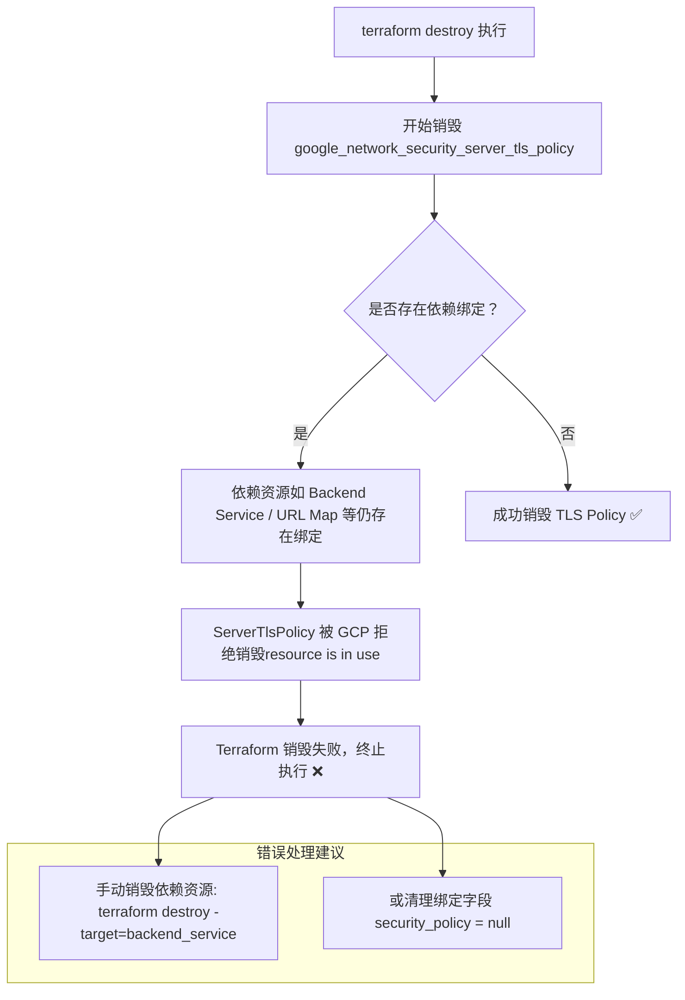

你的两个问题都非常关键，涉及 Terraform 的核心运行机制：**状态轮询与资源依赖的销毁顺序**。我来分别说明。

---

## **🔄 第一部分：Terraform 为什么要轮询操作状态？**

  

Terraform 在管理 GCP 资源（特别是一些异步创建的资源，如 google_network_security_server_tls_policy）时，会通过 **轮询 GCP 的 long-running operations** 接口，来确认资源创建是否完成。

  

### **🎯 主要目的：**

1. **等待资源创建完成**
    
    - 很多 GCP 资源（如 Cloud Armor policy、Certificate Manager、TLS Policy）都不是立刻返回完成，而是异步执行。
        
    - Terraform 会轮询 operations.get 接口直到 DONE。
        
    
2. **处理错误与重试逻辑**
    
    - 如果创建失败，它可以在 plan/apply 阶段中提示你错误，比如你遇到的 403。
        
    - Terraform 可以决定是否重试，还是终止（fail-fast）。
        
    
3. **更新 .tfstate 状态文件**
    
    - 确保 Terraform state 文件记录的是 **最新的、已经完成的资源状态**，否则下一次 apply 或 destroy 会异常。
        
    

---

## **💥 第二部分：Destroy 时资源间的依赖导致失败**

  

你提到的 Destroy 失败，确实是 Terraform 使用中的一个常见难点。根本原因在于：**资源之间的依赖关系未能正确处理或手动绕过了 Terraform 的生命周期管理**。

---

### **📌 场景举例：**

  

假设你有如下资源依赖：

```
resource "google_network_security_server_tls_policy" "tls_policy" {
  ...
}

resource "google_compute_backend_service" "backend" {
  security_policy = google_network_security_server_tls_policy.tls_policy.name
}
```

> 如果 backend_service 没有先 destroy 掉，tls_policy 是无法销毁的，会报 GCP API 的 “resource is still in use” 错误。

---

### **🧯 解决方案建议：**

  

#### **✅ 方法 1：手动分阶段 destroy（最保险）**

```
# 先单独销毁有依赖的上层资源
terraform destroy -target=google_compute_backend_service.backend

# 再整体 destroy
terraform destroy
```

#### **✅ 方法 2：清理绑定依赖资源再 destroy**

- 如果你用了 resource "google_compute_url_map" 等自动绑定 TLS/Backend，可以尝试修改 .tf，先清空这些字段（如把 security_policy = null），再 destroy。
    

  

#### **✅ 方法 3：使用** 

#### **lifecycle**

####  **+ ignore 处理某些字段（不推荐乱用）**

```
resource "google_compute_backend_service" "backend" {
  ...

  lifecycle {
    ignore_changes = [security_policy]
  }
}
```

适用于不让 Terraform 管理某些绑定，但要小心：**忽略之后 Terraform 无法控制这个字段，destroy 时也不会处理这个依赖**。

---

## **✅ 总结建议**

|**问题**|**建议**|
|---|---|
|Terraform 为什么轮询操作状态？|为了等待资源异步创建完成，更新 state，保证 apply/destroy 正常|
|Destroy 时出现依赖无法删除|使用 -target 先手动销毁上层依赖资源；或者清理绑定字段再 destroy|
|Terraform 不处理自动解绑？|是的，目前 Terraform **不具备自动解开资源绑定依赖的能力**，只能显式表达依赖或手动处理|

---

如果你愿意我可以帮你生成一个 Mermaid 图解释 destroy 的依赖流程。是否需要？

好的，下面是一个使用 Mermaid 描述的 Terraform destroy 过程中依赖关系导致失败的流程图，帮助你理解为什么 destroy 有时必须手动处理：

---



---

## **🔍 说明：**

- ServerTlsPolicy 这类资源在 **被其他资源绑定时无法销毁**。
    
- Terraform 并不会自动判断并解绑这些绑定关系。
    
- 所以你需要先销毁引用它的资源（如 Backend Service、URL Map），再销毁 TLS Policy 本身。
    

---

## **✅ 小技巧总结**

|**操作**|**方法**|
|---|---|
|检查资源间引用关系|查看 .tf 文件中是否有 xxx = resource.name 类引用|
|强制先销毁某个资源|terraform destroy -target=xxx|
|快速找引用路径|`terraform graph|
|想跳过绑定字段管理|使用 lifecycle.ignore_changes，但不推荐 destroy 时使用|

---

如果你希望我帮你画出你当前 Terraform 中 TLS Policy 的依赖图（Mermaid 格式），请贴出你主要的相关 .tf 段落，我可以快速生成图形说明。


我的核心问题是状态轮询的时候却少了个权限.那么有没有简单的办法绕过这个get .因为我看到其实很多资源都创建成功了.仅仅是这个get权限缺失了

你说得非常对，**Terraform 中最常见的 GCP 权限问题**就是：

资源创建权限有了，**但轮询状态的权限（如 .operations.get）没有！**

---

## **🚨 问题核心**

  

Terraform 在 GCP 创建某些资源时，会使用 GCP 的 long-running operations 接口，比如：

```
GET https://networksecurity.googleapis.com/v1/projects/xxx/locations/global/operations/operation-xxxx
```

你缺少的是：

```
roles/networksecurity.admin 或
resourcemanager.projects.get + networksecurity.operations.get
```

**所以问题不是资源本身创建失败，而是 Terraform 轮询这个 “操作状态” 失败了。**

---

## **✅ 有没有办法跳过/绕过** 

## **.operations.get**

##  **权限？**

  

### **❌ 结论：**

### **目前**

### **无法直接跳过或关闭 Terraform 的状态轮询！**

  

Terraform 的 GCP provider 会自动调用 .operations.get 来确认创建状态完成，不允许用户跳过这步，也没有 flag 可以关闭它。

---

## **✅ 解决方式建议（推荐做法）**

|**方法**|**操作**|
|---|---|
|✅ **增加权限（推荐）**|给 Terraform 的服务账号增加：🔹roles/networksecurity.admin（最全）或至少：networksecurity.serverTlsPolicies.create + networksecurity.operations.get|
|🔍 **最小权限策略**|你可以自定义 IAM Role，仅添加 networksecurity.operations.get 权限|
|🧪 **手动分阶段 Apply**|如果你发现多数资源都已创建成功，可以将有问题的资源先从 .tf 中注释掉或移除，执行一次 terraform apply 确保其他状态记录无误，然后再重新添加资源并 apply（但依然需要权限）|
|🧰 **CLI 绕过方式（不推荐）**|理论上可以自己用 gcloud CLI 创建资源，绕过 Terraform，但这样 state 会不同步，**不可取**|
|🧼 **最后实在不行**|临时用全权限的账号执行 Terraform（用于 apply 后马上禁用），但请务必记录权限变更，避免滥用|

---

## **📝 最低权限建议举例**

```
title: custom_terraform_tls_policy_role
includedPermissions:
  - networksecurity.serverTlsPolicies.create
  - networksecurity.serverTlsPolicies.get
  - networksecurity.operations.get
```

通过 GCP Console 或 Terraform 创建一个 custom 角色，赋予你的 Terraform 服务账号即可。

---

## **✅ 总结建议**

|**问题**|**说明**|
|---|---|
|为什么会报错？|因为 Terraform 在等待 GCP 异步操作完成时，调用了 operations.get，你缺权限|
|能否跳过这个操作？|**不能**，Terraform provider 必须拿到成功状态才能继续|
|最推荐方案？|补上 networksecurity.operations.get 权限或赋予 networksecurity.admin 临时权限|

---

如果你希望我帮你生成 IAM 自定义角色的 .tf 模板或 gcloud 命令，也可以告诉我。