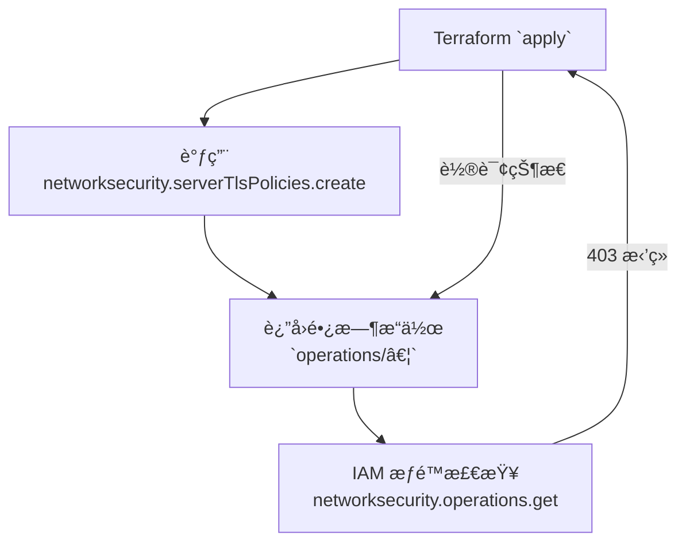
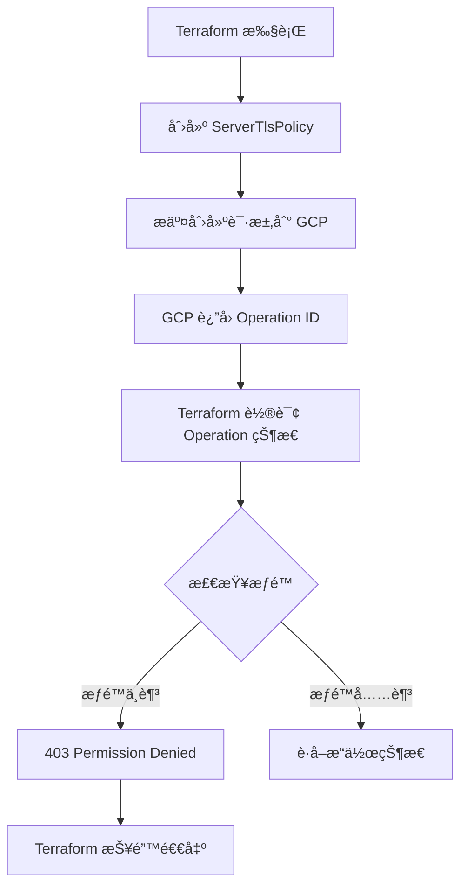
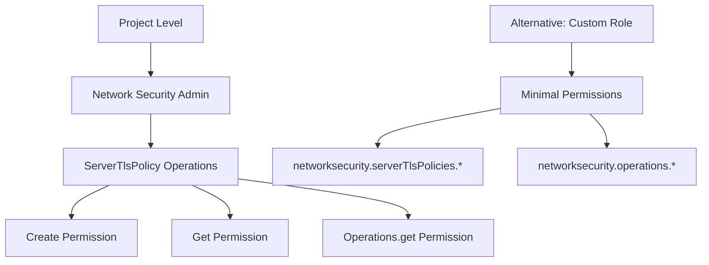

# Q 
我用Terrafrom æ¨é€GCP里é¢çš„资æº

é‡åˆ°ä¸‹é¢è¿™ä¸ªæŠ¥é”™

Error: Error waiting to create ServerTlsPolicy: Error waiting for Creating ServerTlsPolicy: error while retrieving operation: googleapi: Error 403: Permission 'networksecurity.operations.get denied on 'projects/aibang-my-project/locations/global/operations/operation-1749115455265-636cfad61db4b-15ad567d-2c7842a 1*

with module.public_ingress.module.public_ingress.module.glb.google_network_security_server_tls_policy.default, on modules/aibang-glb/main.tf line 47, in resource "google_network_security_server_tls_policy" "default":

47: resource "google_network_security_server_tls_policy" "default" (
https://cloud.google.com/iam/docs/roles-permissions/networksecurity
https://cloud.google.com/iam/docs/roles-permissions/networksecurity#networksecurity.operations.get

[Owner](https://cloud.google.com/iam/docs/roles-overview#basic) (`roles/owner`)

[Editor](https://cloud.google.com/iam/docs/roles-overview#basic) (`roles/editor`)

[Viewer](https://cloud.google.com/iam/docs/roles-overview#basic) (`roles/viewer`)

[Compute Network Admin](https://cloud.google.com/iam/docs/roles-permissions/compute#compute.networkAdmin) (`roles/compute.networkAdmin`)

[Compute Network User](https://cloud.google.com/iam/docs/roles-permissions/compute#compute.networkUser) (`roles/compute.networkUser`)

[Compute Network Viewer](https://cloud.google.com/iam/docs/roles-permissions/compute#compute.networkViewer) (`roles/compute.networkViewer`)

[Security Admin](https://cloud.google.com/iam/docs/roles-permissions/iam#iam.securityAdmin) (`roles/iam.securityAdmin`)

[Security Reviewer](https://cloud.google.com/iam/docs/roles-permissions/iam#iam.securityReviewer) (`roles/iam.securityReviewer`)

[Security Profile Admin](https://cloud.google.com/iam/docs/roles-permissions/networksecurity#networksecurity.securityProfileAdmin) (`roles/networksecurity.securityProfileAdmin`)
  
# Gemini 

# Resolving Terraform `403 Permission Denied` Error for GCP `ServerTlsPolicy` Creation

## 1. Executive Summary

Users deploying Google Cloud Platform (GCP) resources using Terraform may encounter a `403 Permission Denied` error when attempting to create a `google_network_security_server_tls_policy`. The specific error message, `Permission 'networksecurity.operations.get denied'`, points to an Identity and Access Management (IAM) issue where the principal (user or service account) executing Terraform lacks the necessary permission to monitor the status of the `ServerTlsPolicy` creation operation. This is a common scenario with cloud provider APIs that handle resource provisioning asynchronously.

Successful creation and lifecycle management of `ServerTlsPolicy` resources require not only the permission to initiate creation (e.g., `networksecurity.serverTlsPolicies.create`) but also permissions to track the progress of such operations. This report provides a comprehensive guide to understanding the error, identifying all requisite IAM permissions, and implementing the correct IAM configurations. It details the steps to pinpoint the Terraform principal and grant it the appropriate predefined or custom IAM roles. By following the procedures outlined, users can resolve the permission error and ensure smooth deployment of Network Security resources in GCP using Terraform.

## 2. Deconstructing the Terraform Error Message

The error message provided by the user is central to diagnosing the issue:

`Error: Error waiting to create ServerTlsPolicy: Error waiting for Creating ServerTlsPolicy: error while retrieving operation: googleapi: Error 403: Permission 'networksecurity.operations.get denied on 'projects/aibang-my-project/locations/global/operations/operation-1749115455265-636cfad61db4b-15ad567d-2c7842a1* with module.public_ingress.module.public_ingress.module.glb.google_network_security_server_tls_policy.default.`

A systematic breakdown of this message reveals the precise nature of the problem:

- **`Error waiting to create ServerTlsPolicy`**: This initial part indicates that Terraform successfully submitted the request to create the `ServerTlsPolicy` resource. However, Terraform's process involves waiting for confirmation that the resource has been successfully provisioned.
- **`error while retrieving operation`**: This is the critical failure point. Many GCP resource creation, update, or deletion tasks are asynchronous. When such a task is initiated, the GCP API often returns an operation ID. The client (Terraform, in this case) then polls the status of this operation (e.g., "pending," "running," "succeeded," "failed") to determine the outcome. This part of the message signifies that Terraform failed during this polling phase.
- **`googleapi: Error 403: Permission 'networksecurity.operations.get denied`**: This is the core IAM problem. The HTTP `403` status code means "Forbidden," indicating that the authenticated principal is not authorized to perform the requested action. The message explicitly states that the permission `networksecurity.operations.get` is denied. This permission is required to retrieve the status of an operation within the Network Security API (`networksecurity.googleapis.com`).
- **`on 'projects/aibang-my-project/locations/global/operations/operation-1749115455265-636cfad61db4b-15ad567d-2c7842a1'`**: This specifies the exact resource on which the permission is denied. It's an operation resource, identified by its unique ID, within the specified project (`aibang-my-project`) and global location. This level of detail is invaluable for precise troubleshooting, as it confirms the issue lies with monitoring an operation related to the Network Security service.
- **`with module.public_ingress.module.public_ingress.module.glb.google_network_security_server_tls_policy.default`**: This part of the message traces the error back to the specific Terraform resource definition within the user's configuration that triggered the failed operation.

The asynchronous nature of GCP resource provisioning is key here. Terraform does not simply "fire and forget" a creation request. It needs to track the operation to completion to ensure the resource is in the desired state and to capture any output attributes for its state file. The `networksecurity.operations.get`permission is essential for this tracking mechanism when dealing with Network Security resources. Without it, Terraform cannot confirm the successful creation of the `ServerTlsPolicy`, leading to a timeout and the reported error, even if the initial creation request was valid and accepted by GCP. This underscores the importance of understanding that managing cloud resources often involves permissions beyond the direct `create`, `read`, `update`, or `delete` actions on the resource itself; permissions related to ancillary services like operations monitoring are equally critical.

## 3. Essential IAM Permissions for `ServerTlsPolicy` and Operations Management

Managing a `google_network_security_server_tls_policy` resource through its entire lifecycle (creation, reading, updating, deletion, and monitoring of these actions) requires a set of specific IAM permissions. The error message highlighted the immediate need for `networksecurity.operations.get`, but a comprehensive solution involves ensuring all necessary permissions are in place.

The primary permissions associated with the `ServerTlsPolicy` resource itself include:

- **`networksecurity.serverTlsPolicies.create`**: Allows the principal to initiate the creation of a new Server TLS Policy.1
- **`networksecurity.serverTlsPolicies.get`**: Permits retrieving the details of an existing Server TLS Policy.2 This is crucial for Terraform's state refresh mechanism.
- **`networksecurity.serverTlsPolicies.list`**: Enables listing all Server TLS Policies within a given project and location.2 This is also used by Terraform during planning and state refresh.
- **`networksecurity.serverTlsPolicies.update`** (or the equivalent `patch` method): Allows modification of an existing Server TLS Policy.4
- **`networksecurity.serverTlsPolicies.delete`**: Grants permission to remove a Server TLS Policy.4

Beyond these direct resource manipulation permissions, the management of asynchronous operations within the Network Security API requires:

- **`networksecurity.operations.get`**: As identified in the error, this permission is vital for retrieving the status of ongoing operations (like create, update, or delete) for `ServerTlsPolicy` and other resources managed by the Network Security API.7
- Other `networksecurity.operations.*` permissions, such as `networksecurity.operations.list`, `networksecurity.operations.delete`, and `networksecurity.operations.cancel`, might be necessary for more advanced or direct management of operations 9, but `networksecurity.operations.get` is the one directly implicated in the user's error.

It is important to note that Terraform provider documentation (e.g., for `google_network_security_server_tls_policy`) may not always provide an exhaustive list of all required IAM permissions.10 In such cases, consulting official GCP IAM documentation or reliable third-party permission aggregators becomes necessary to obtain a complete picture of the required permissions.

The following table summarizes the key permissions required for managing `ServerTlsPolicy` resources and the associated operations, along with common predefined roles that grant them:

|   |   |   |
|---|---|---|
|**Permission**|**Description**|**Common Predefined Roles Granting It (Examples)**|
|`networksecurity.serverTlsPolicies.create`|Allows creation of Server TLS Policies.|`roles/compute.networkAdmin` 1, `roles/owner`, `roles/editor`. (Note: `roles/anthosservicemesh.serviceAgent` also has this 1, but service agent roles should not be directly assigned to user-managed principals 7).|
|`networksecurity.serverTlsPolicies.get`|Allows retrieval of Server TLS Policy details.|`roles/compute.networkAdmin`, `roles/compute.loadBalancerAdmin` 3, `roles/viewer`, `roles/owner`, `roles/editor`.|
|`networksecurity.serverTlsPolicies.list`|Allows listing of Server TLS Policies.|`roles/compute.networkAdmin`, `roles/compute.loadBalancerAdmin` 3, `roles/viewer`, `roles/owner`, `roles/editor`.|
|`networksecurity.serverTlsPolicies.update`|Allows updating of existing Server TLS Policies.|`roles/compute.networkAdmin`, `roles/owner`, `roles/editor`.|
|`networksecurity.serverTlsPolicies.delete`|Allows deletion of Server TLS Policies.|`roles/compute.networkAdmin`, `roles/owner`, `roles/editor`.|
|`networksecurity.operations.get`|Allows retrieval of the status of operations within the Network Security service.|`roles/owner`, `roles/editor`, `roles/viewer`, `roles/compute.networkAdmin`, `roles/networksecurity.securityProfileAdmin`.7(Also present in various service agent roles like `roles/container.serviceAgent`, which are not for direct user assignment 7).|
|`networksecurity.operations.list`|Allows listing of operations within the Network Security service.|`roles/owner`, `roles/editor`, `roles/viewer`, `roles/compute.networkAdmin`, `roles/networksecurity.securityProfileAdmin`. (Also present in various service agent roles).|

This consolidated view helps in understanding the breadth of permissions involved. Terraform's operational model, which includes reading current state (requiring `get` and `list` permissions) and monitoring asynchronous actions, necessitates a more comprehensive set of permissions than just `create`.

## 4. Identifying the Principal and Granting Permissions

To resolve the `403 Permission Denied` error, the necessary permissions must be granted to the correct IAM principal that Terraform is using to authenticate with GCP.

### Identifying the Terraform Principal

Terraform authenticates to GCP primarily through Application Default Credentials (ADC).11 The specific identity depends on the environment where Terraform is executed:

- **Local Development (User Workstation):**
    - If `gcloud auth application-default login` was run without impersonation, Terraform uses the logged-in user's credentials.11 The principal is the user's email address.
    - If service account impersonation was configured via `gcloud auth application-default login --impersonate-service-account SERVICE_ACCT_EMAIL`, Terraform uses the specified service account's identity.11 The principal is the service account email. The user performing the impersonation needs the `roles/iam.serviceAccountTokenCreator` role on the target service account.
- **CI/CD Pipelines or GCP Compute Environments (e.g., GCE, Cloud Run, GKE):**
    - Typically, an attached service account is used.11 The compute resource (e.g., GCE VM, GKE Node) runs as this service account, and Terraform inherits its identity. The principal is the email address of this attached service account.
- **Service Account Key File:**
    - If the `GOOGLE_APPLICATION_CREDENTIALS` environment variable is set to the path of a service account key JSON file, Terraform uses that service account.11 The principal is the email of the service account associated with the key. This method is generally less recommended due to the security overhead of managing key files.

If the service account itself is managed by Terraform (using the `google_service_account` resource), its email address can be referenced from the `email` attribute of that resource.12

### Choosing the Right Roles

Once the principal is identified, the next step is to grant it the required permissions, usually by assigning IAM roles.

- **Predefined Roles:**
    
    - GCP offers various predefined roles. For managing `ServerTlsPolicy` and related operations, the **`Compute Network Admin`** role (`roles/compute.networkAdmin`) is a strong candidate. It is documented to include `networksecurity.operations.get` 7 and `networksecurity.serverTlsPolicies.create`.1 It also generally covers a wide range of networking and network security permissions, such as those for address groups.13
    - The **`Security Profile Admin`** role (`roles/networksecurity.securityProfileAdmin`) also contains `networksecurity.operations.get` 7 and permissions for managing security profiles and groups.7
    - The **`Compute Load Balancer Admin`** role (`roles/compute.loadBalancerAdmin`) includes permissions like `networksecurity.serverTlsPolicies.get` and `networksecurity.serverTlsPolicies.list` 3, relevant if the `ServerTlsPolicy` is used with load balancers.
    - The `Network Security Admin` role (`roles/networksecurity.admin`) was considered, but available documentation snippets do not clearly define its specific permissions.15 Without a clear, official list of its permissions, relying on more explicitly documented roles or custom roles is advisable.
    - **Basic Roles (`Owner`, `Editor`, `Viewer`):** These roles grant broad permissions across many GCP services.17
        - `roles/owner`: Full control, includes all necessary permissions but is overly permissive.
        - `roles/editor`: Allows modification of most resources, includes most necessary permissions but is also overly permissive.
        - `roles/viewer`: Provides read-only access. It grants `networksecurity.operations.get` 7 but lacks permissions to create, update, or delete `ServerTlsPolicy` resources. Using basic roles, especially `Owner` and `Editor`, for service accounts is strongly discouraged as it violates the principle of least privilege.
- **Custom Roles:**
    
    - If no single predefined role provides the exact set of required permissions without granting excessive, unrelated privileges, creating a custom IAM role is the recommended approach.17 This aligns best with the principle of least privilege.
        
    - A custom role for managing `ServerTlsPolicy` via Terraform should include at least the following permissions:
        
        - `networksecurity.serverTlsPolicies.create`
        - `networksecurity.serverTlsPolicies.get`
        - `networksecurity.serverTlsPolicies.list`
        - `networksecurity.serverTlsPolicies.update`
        - `networksecurity.serverTlsPolicies.delete`
        - `networksecurity.operations.get` (scoped to Network Security operations)
        - `networksecurity.operations.list` (potentially, for broader operational insight if needed)
    - **Important Caution on Service Agent Roles:** Several GCP service agent roles (e.g., `roles/container.serviceAgent`, `roles/composer.serviceAgent`) might appear in permission searches as they often have broad access, including some `networksecurity.*` permissions.7 These roles are GCP-managed and intended for GCP services to interact with other resources on the user's behalf. **Service agent roles must not be granted to user-managed service accounts or users**.7 Doing so can create significant security risks.
        

### Granting Roles

Permissions can be granted using the Google Cloud Console or the `gcloud` command-line tool.

- **Using Google Cloud Console:**
    
    1. Navigate to "IAM & Admin" > "IAM" in the Google Cloud Console.22
    2. Select the appropriate project (e.g., `aibang-my-project`).
    3. Click on "GRANT ACCESS" (or "Add" in older UIs).22
    4. In the "New principals" field, enter the email address of the user or service account identified previously.
    5. In the "Select a role" dropdown, search for and select the desired predefined role (e.g., `Compute Network Admin`) or custom role.
    6. If granting multiple roles, click "Add another role."
    7. Click "Save."
- Using gcloud command-line:
    
    The command to add an IAM policy binding is:
    
    gcloud projects add-iam-policy-binding PROJECT_ID --member=PRINCIPAL_TYPE:PRINCIPAL_ID --role=ROLE_ID
    
    - Replace `PROJECT_ID` with the actual project ID (e.g., `aibang-my-project`).
    - `PRINCIPAL_TYPE` is `user` for a user account or `serviceAccount` for a service account.
    - `PRINCIPAL_ID` is the email address of the user or service account.
    - `ROLE_ID` is the full ID of the role (e.g., `roles/compute.networkAdmin` or `projects/PROJECT_ID/roles/CUSTOM_ROLE_ID` for a project-level custom role).
    
    Example for granting Compute Network Admin to a service account:
    
    gcloud projects add-iam-policy-binding aibang-my-project --member=serviceAccount:your-terraform-sa@aibang-my-project.iam.gserviceaccount.com --role=roles/compute.networkAdmin
    

Choosing the `Compute Network Admin` role might be a quicker solution if its broader permissions are acceptable within the organization's security posture. However, for production environments and adherence to least privilege, investing time in creating and assigning a well-defined custom role is the superior long-term strategy.

## 5. Troubleshooting and Verification

After identifying the principal and granting the presumed necessary roles, further steps may be needed if the error persists.

### Verifying Permissions

1. **Retry Terraform:** The most direct way to verify is to re-run `terraform apply`. If the permissions are correct and have propagated, the operation should now succeed.
2. **Check IAM Policy:** Use the `gcloud` CLI to inspect the project's IAM policy and confirm the role was correctly assigned to the principal: `gcloud projects get-iam-policy PROJECT_ID --format=json` Look for the principal's email and verify the assigned roles.
3. **Policy Troubleshooter:** The GCP Console offers a Policy Troubleshooter (under IAM & Admin) that can check if a specific principal has a particular permission on a given resource. This can be useful for verifying individual permissions like `networksecurity.operations.get`.
4. **`testIamPermissions()` Method:** While less direct for a Terraform user, developers can use the `testIamPermissions()` API method on resources to programmatically check if the currently authenticated caller has a set of permissions.24

### IAM Propagation Delay

IAM changes in GCP are eventually consistent. This means that after granting a role or permission, it might take some time for the change to take effect across all Google Cloud systems.25

- Propagation time for direct policy changes is typically around 2 minutes but can occasionally take 7 minutes or longer.25
- Changes involving group memberships (if roles are granted to groups, and the principal is a member of that group) can take significantly longer, potentially hours.25 Adding a principal to a group generally propagates faster than removing one.
- If Terraform fails immediately after an IAM change, it is advisable to wait a few minutes (e.g., 5-10 minutes) and then retry the `terraform apply` command.26

### Conflicting Organization Policies

Even if IAM permissions are correctly granted at the project level, Organization Policies set at the organization or folder level can restrict certain actions and override project-level IAM settings.27

- Organization Policies can enforce constraints such as limiting the use of specific APIs, restricting the creation of certain resource types, or defining allowed geographical locations for resources.27
- While less common for a specific permission like `networksecurity.operations.get`, a broader Organization Policy (e.g., one that restricts all `networksecurity.googleapis.com` API calls or specific operations within it) could be the cause.
- Organization Policies can be viewed in the GCP Console under "IAM & Admin" > "Organization Policies".28 The effective policy for a given resource is an evaluation of policies inherited from its hierarchy.
- If an Organization Policy is suspected to be the cause, collaboration with the GCP organization administrator will likely be necessary to review and potentially adjust the policy.

### Other Common GCP 403 Errors and Issues with Terraform

If the `networksecurity.operations.get` error is resolved but other 403 errors or issues arise, consider these common causes:

- **APIs Not Enabled:** Ensure that the necessary APIs are enabled for the project. For `ServerTlsPolicy`, the `Network Security API` (`networksecurity.googleapis.com`) must be enabled. Depending on related resources, the `Compute Engine API` (`compute.googleapis.com`) might also be required.26 APIs can be enabled via the GCP Console (APIs & Services > Library) or `gcloud services enable API_NAME`.
- **Incorrect Project Configuration:** Verify that the Terraform provider configuration and resource definitions are targeting the correct GCP project ID.
- **Service Account Status:** If using a service account, ensure it has not been disabled or deleted.12 The `disabled` field in a service account definition can prevent it from authenticating or being authorized.
- **Billing Account Issues:** While typically resulting in different errors, ensure the project is linked to an active and valid billing account, especially for resource creation. Some APIs or resources might have specific billing project requirements when using User Application Default Credentials.30
- **Terraform State Inconsistencies:** If Terraform fails after some resources are created, the local state file might become inconsistent with the actual cloud state. This can sometimes lead to subsequent errors. Terraform relies heavily on `get` permissions for its refresh cycle to reconcile the desired state (code) with the actual state (cloud). If `get` permissions for `ServerTlsPolicy` are missing, `terraform plan` or `apply` might fail even if `create` was successful previously, or it might incorrectly try to recreate resources. This reinforces the need for comprehensive lifecycle permissions, not just `create` and `operations.get`.

Troubleshooting IAM and deployment issues often requires a systematic approach, starting with the most direct solutions (correct role assignment) and then exploring broader contexts like propagation delays and organizational constraints.

## 6. Recommendations and Best Practices for IAM with Terraform

Successfully resolving the immediate permission error is important, but adopting robust IAM practices is crucial for long-term security and operational efficiency when using Terraform with GCP.

- **Adhere to the Principle of Least Privilege (PoLP):**
    
    - Grant only the minimum set of permissions required for Terraform to manage the resources defined in its configuration.17 Avoid granting broad roles like `Owner` or `Editor` to service accounts.
    - Strongly prefer custom IAM roles when predefined roles are too permissive. A custom role can be tailored to include only the necessary permissions (e.g., `networksecurity.serverTlsPolicies.create`, `.get`, `.list`, `.update`, `.delete`, and `networksecurity.operations.get`).19
    - PoLP significantly reduces the potential impact (blast radius) if the Terraform principal's credentials are ever compromised.
- **Utilize Dedicated Service Accounts for Terraform:**
    
    - Always use dedicated service accounts for Terraform deployments, especially in automated CI/CD environments, rather than relying on user credentials.11 This isolates Terraform's permissions and improves auditability.
    - If service account keys must be used (e.g., for external systems authenticating to GCP), manage them securely. Store them in a secure secret manager, rotate them regularly, and avoid embedding them directly in code or version control systems. Prefer alternatives like Workload Identity Federation for keyless authentication from external environments where possible.11 For GCE VMs or other GCP compute, use attached service accounts which do not require key management.
- **Implement "IAM as Code":**
    
    - Manage IAM policies, particularly for the Terraform service account, using Terraform itself (e.g., with `google_project_iam_member`, `google_project_iam_binding`, or `google_project_iam_policy`resources). This approach ensures that IAM changes are version-controlled, auditable, and part of the same review and deployment process as the infrastructure code. This reduces manual console changes which can be error-prone and difficult to track.
- **Conduct Regular IAM Audits:**
    
    - Periodically review IAM policies, role assignments, and service account permissions to ensure they remain appropriate and adhere to PoLP.
    - Leverage GCP tools like Security Health Analytics (part of Security Command Center 31) and IAM Recommender. IAM Recommender can identify overly permissive roles and suggest more restrictive alternatives.
- **Consider IAM Conditions:**
    
    - For more granular access control, explore IAM Conditions. Conditions allow role bindings to be effective only if specified criteria are met (e.g., based on time of day, resource tags, or requesting IP address).17 This can further refine the application of least privilege.
- **Test IAM Changes Thoroughly:**
    
    - Before applying IAM changes in a production environment, test them in a non-production or development project.
    - Use tools like the GCP Policy Troubleshooter or the `testIamPermissions` API method to verify permissions before attempting deployments.24

By integrating these best practices, organizations can enhance their security posture, reduce the risk of permission-related errors, and maintain better control over their GCP resources when using Terraform.

## 7. Conclusion

The `Error 403: Permission 'networksecurity.operations.get denied` encountered when using Terraform to create a `google_network_security_server_tls_policy` in GCP stems from the Terraform principal lacking the authorization to monitor the asynchronous creation operation. Resolving this requires granting the `networksecurity.operations.get` permission, along with the full suite of permissions needed for the lifecycle management of `ServerTlsPolicy` resources (create, get, list, update, delete).

The recommended approach involves:

1. **Identifying the principal** (user or service account) used by Terraform.
2. **Assigning appropriate IAM roles**. While predefined roles like `roles/compute.networkAdmin` offer a quick solution by including many necessary network security permissions, creating a **custom IAM role**tailored with the specific permissions (`networksecurity.serverTlsPolicies.*` and `networksecurity.operations.get`) is the best practice for adhering to the principle of least privilege.
3. **Verifying the changes** and allowing for IAM propagation delay.
4. Being aware of potential **overriding Organization Policies** or other issues like disabled APIs.

Adopting IAM best practices, such as using dedicated service accounts for Terraform, managing IAM as code, and conducting regular audits, will further strengthen the security and reliability of GCP deployments. By understanding the interplay between Terraform's operational model and GCP's IAM system, users can effectively troubleshoot permission errors and build secure, automated cloud infrastructure.

#  ChatGPT  
ä»¥ä¸‹å†…å®¹å¸®åŠ©ä½ å¿«é€Ÿå®šä½ **403 Permission networksecurity.operations.get denied** 的根因，并给出最å°æƒé™ä¿®å¤æ–¹æ¡ˆã€‚所有示例å‡å¯ç›´æ¥å¤åˆ¶åˆ°ç»ˆç«¯æˆ– Markdown 文档中。

---

## **1ï¸âƒ£ å‘生了什么？**



Terraform æˆåŠŸè§¦å‘ **ServerTlsPolicy** 创建，但在éšå轮询长时æ“作 (operations/...) æ—¶ï¼Œç”±äº **缺少 networksecurity.operations.get æƒé™** 而被 IAM æ‹’ç»ã€‚

---

## **2ï¸âƒ£ å¿…è¦æƒé™å¯¹ç…§**

|**动作**|**关键æƒé™**|**常è§åŒ…å«è§’色**|
|---|---|---|
|创建 ServerTlsPolicy|networksecurity.serverTlsPolicies.create|roles/compute.networkAdmin|
|读å–æ“作状æ€|networksecurity.operations.get|roles/compute.networkAdmin, roles/compute.networkViewer, roles/viewer|

> åªè¦**缺少第二行的任æ„角色/æƒé™**，就会出ç°ä½ çœ‹åˆ°çš„ 403。

---

## **3ï¸âƒ£ 解决方案**

  

### **方案 A：æˆäºˆé¢„定义角色（æ¨è）**

  

若你希望一次解决 **创建 + 轮询** 所需全部æƒé™ï¼Œå¯ä¸º Terraform 使用的身份（人或 Service Account）添加 **Compute Network Admin**：

```
gcloud projects add-iam-policy-binding aibang-my-project \
  --member="serviceAccount:terraform-sa@aibang-my-project.iam.gserviceaccount.com" \
  --role="roles/compute.networkAdmin"
```

_最å°å¯è¡Œ_ 方案是在已有自定义/预定义角色的基础上，å†é™„加 **Compute Network Viewer**（仅包å«åªè¯»ç½‘络ä¸æ“作查询æƒé™ï¼‰ï¼š

```
gcloud projects add-iam-policy-binding aibang-my-project \
  --member="serviceAccount:terraform-sa@aibang-my-project.iam.gserviceaccount.com" \
  --role="roles/compute.networkViewer"
```

### **方案 B：更新自定义角色**

  

如æœä½ ä½¿ç”¨çš„是自定义最å°æƒé™è§’色，åªéœ€è¦æŠŠ networksecurity.operations.get 加进å»å³å¯ï¼š

```
# 查看ç°æœ‰æƒé™
gcloud iam roles describe tfNetworkSecurity --project=aibang-my-project

# 追加缺失的 operations.get
gcloud iam roles update tfNetworkSecurity \
  --project=aibang-my-project \
  --add-permissions="networksecurity.operations.get"
```

---

## **4ï¸âƒ£ 验è¯æ­¥éª¤**

1. **æƒé™ç”Ÿæ•ˆ**åé‡æ–°è¿è¡Œï¼š
    

```
terraform apply
```

1.   
    
2. å¦‚éœ€æ‰‹åŠ¨éªŒè¯ IAM，å¯ä½¿ç”¨ï¼š
    

```
gcloud beta network-security operations describe \
  "operation-1749115455265-636cfad61db4b-15ad567d-2c7842a" \
  --project=aibang-my-project
```

2. 若命令ä¸å†è¿”å› 403，则æƒé™å·²æ­£ç¡®èµ‹äºˆã€‚
    

---

## **5ï¸âƒ£ 常è§å‘æ醒**

- **API å·²å¯ç”¨** —— èƒ½è¿›å…¥åˆ›å»ºé˜¶æ®µè¯´æ˜ networksecurity.googleapis.com 已开å¯ï¼Œæ— éœ€é‡å¤å¯ç”¨ã€‚
    
- **Service Account 作用域** —— 若在 Cloud Buildã€GitHub Actions ç­‰ CI ç¯å¢ƒè¿è¡Œï¼Œç¡®ä¿ç»‘定的是å®é™…执行 Terraform 的那一个 Service Account，而é你的个人账å·ã€‚
    
- **最å°æƒé™** —— 如æœæ‹…心过度æˆæƒï¼Œå¯é‡‡ç”¨ compute.networkViewer + 自定义角色组åˆï¼Œåªèµ‹äºˆåˆ›å»º/删除 ServerTlsPolicy 所需的特定æƒé™ã€‚
    

---

> 结论：**ç¡®å®æ˜¯ Terraform 所用身份缺少 networksecurity.operations.get。**

> 给它加上带此æƒé™çš„角色（最å°å¯é€‰ roles/compute.networkViewer），或在自定义角色里加入该æƒé™å³å¯è§£å†³ã€‚

[Compute Network User](https://cloud.google.com/iam/docs/roles-permissions/compute#compute.networkUser) (`roles/compute.networkUser`)

[Compute Network Viewer](https://cloud.google.com/iam/docs/roles-permissions/compute#compute.networkViewer) (`roles/compute.networkViewer`)
是的，你的ç†è§£æ˜¯ **准确的**，如æœä½ çš„ Terraform é…置中åªæ˜¯**创建或引用网络资æº**（如 ServerTlsPolicy）而ä¸æ˜¯**ç®¡ç† VPC 或防ç«å¢™è§„则**，你åªéœ€è¦ä»¥ä¸‹ä¸¤ä¸ªè§’色å³å¯ï¼š

---

## **✅ 精简æƒé™ç»„åˆ**

| **角色å称**                    | **æƒé™æ¦‚è¿°**       | **说æ˜**                                                  |
| --------------------------- | -------------- | ------------------------------------------------------- |
| roles/compute.networkUser   | æˆæƒç”¨æˆ·ä½¿ç”¨å·²å­˜åœ¨çš„ç½‘ç»œèµ„æº | å…许访问 VPC 网络ã€å­ç½‘ã€IP 范围等（但ä¸èƒ½ä¿®æ”¹ï¼‰                            |
| roles/compute.networkViewer | åªè¯»æƒé™           | åŒ…å« networksecurity.operations.get，å¯ç”¨äº Terraform 轮询æ“作状æ€ç­‰ |

---

## **🯠æƒé™è¦†ç›–情况**

|**æ“作资æº**|**所需æƒé™**|**所å±è§’色**|
|---|---|---|
|创建 ServerTlsPolicy|networksecurity.serverTlsPolicies.create|roles/compute.networkUser ✅|
|查询 operation/... 状æ€|networksecurity.operations.get|roles/compute.networkViewer ✅|

---

## **✅ 建议æˆæƒå‘½ä»¤**

  

å‡è®¾ä½  Terraform 使用的是一个 Service Account：

```
SERVICE_ACCOUNT="terraform-sa@aibang-my-project.iam.gserviceaccount.com"
PROJECT_ID="aibang-my-project"

# æˆäºˆ networkUser
gcloud projects add-iam-policy-binding "$PROJECT_ID" \
  --member="serviceAccount:$SERVICE_ACCOUNT" \
  --role="roles/compute.networkUser"

# æˆäºˆ networkViewer
gcloud projects add-iam-policy-binding "$PROJECT_ID" \
  --member="serviceAccount:$SERVICE_ACCOUNT" \
  --role="roles/compute.networkViewer"
```

---

## **✅ 验è¯æƒé™æ˜¯å¦ç”Ÿæ•ˆ**

```
gcloud projects get-iam-policy "$PROJECT_ID" \
  --flatten="bindings[].members" \
  --filter="bindings.members:terraform-sa" \
  --format="table(bindings.role)"
```

确认这两个角色都被正确附加å³å¯ã€‚

---

## **✅ 结论**

  

ä½ ç¡®å®ä¸éœ€è¦ä½¿ç”¨è¿‡äºå®½æ³›çš„ compute.networkAdmin，

åªè¦ï¼š

- roles/compute.networkUser
    
- roles/compute.networkViewer
    

  

å³å¯æ»¡è¶³ Terraform 创建 ServerTlsPolicy 的场景，åŒæ—¶é¿å…过度æˆæƒã€‚åšå¾—很对 ✅。


# Grok
错误分æ

您é‡åˆ°çš„错误是 Terraform 在å°è¯•åˆ›å»º Google Cloud Platform (GCP) çš„ ServerTlsPolicy 资æºæ—¶ï¼Œæ示了一个 403 æƒé™é”™è¯¯ï¼Œå…·ä½“为：

```text
Error: Error waiting to create ServerTlsPolicy: Error waiting for Creating ServerTlsPolicy: error while retrieving operation: googleapi: Error 403: Permission 'networksecurity.operations.get' denied on 'projects/aibang-my-project/locations/global/operations/operation-1749115455265-636cfad61db4b-15ad567d-2c7842a1'
```

这个错误表æ˜è¿è¡Œ Terraform 的用户或æœåŠ¡è´¦å·ç¼ºå°‘ networksecurity.operations.get æƒé™ï¼Œå¯¼è‡´æ— æ³•è·å–æ“作的状æ€ï¼Œä»è€Œä½¿ Terraform 无法确认 ServerTlsPolicy 资æºçš„创建是å¦æˆåŠŸã€‚

具体åŸå› 

1. æƒé™ç¼ºå¤±ï¼š
    
    - Terraform 在执行 google_network_security_server_tls_policy 资æºåˆ›å»ºæ—¶ï¼Œéœ€è¦è°ƒç”¨ GCP çš„ Network Security API æ¥ç®¡ç† ServerTlsPolicy。
        
    - 创建资æºå，Terraform 会轮询æ“作状æ€ä»¥ç¡®è®¤æ˜¯å¦å®Œæˆï¼Œè¿™éœ€è¦ networksecurity.operations.get æƒé™ã€‚
        
    - 错误æ˜ç¡®æŒ‡å‡ºï¼Œå½“å‰ç”¨æˆ·æˆ–æœåŠ¡è´¦å·å¯¹æŒ‡å®šé¡¹ç›®çš„æ“作资æºï¼ˆprojects/aibang-my-project/locations/global/operations/...）没有 networksecurity.operations.get æƒé™ã€‚
        
2. å¯èƒ½çš„场景：
    
    - æœåŠ¡è´¦å·æƒé™ä¸è¶³ï¼šå¦‚æœæ‚¨ä½¿ç”¨æœåŠ¡è´¦å·è¿è¡Œ Terraform，该æœåŠ¡è´¦å·å¯èƒ½æœªè¢«æˆäºˆåŒ…å« networksecurity.operations.get 的角色。
        
    - 用户账å·æƒé™ä¸è¶³ï¼šå¦‚æœæ‚¨ä½¿ç”¨ä¸ªäººç”¨æˆ·è´¦å·è¿è¡Œ Terraform，您的 IAM 角色å¯èƒ½ç¼ºå°‘å¿…è¦çš„æƒé™ã€‚
        
    - 项目范围问题：æƒé™å¯èƒ½åœ¨é”™è¯¯çš„ GCP 项目中é…置，或者 Terraform 的凭æ®é…置指å‘了错误的上下文。
        
3. 错误æ¥æºï¼š
    
    - 错误å‘生在 modules/aibang-glb/main.tf 文件的第 47 è¡Œï¼Œæ¶‰åŠ google_network_security_server_tls_policy 资æºã€‚
        
    - 资æºå称为 default，ä½äº module.public_ingress.module.public_ingress.module.glb 模å—中，说æ˜è¿™æ˜¯ä¸€ä¸ªåµŒå¥—模å—调用。
        

---

解决方法

为了解决这个问题，您需è¦ç¡®ä¿ Terraform 使用的身份（用户或æœåŠ¡è´¦å·ï¼‰å…·æœ‰è¶³å¤Ÿçš„æƒé™æ¥æ‰§è¡Œ ServerTlsPolicy 的创建和æ“作状æ€æŸ¥è¯¢ã€‚以下是详细的解决步骤：

1. 确认 Terraform 使用的身份

- 检查身份：
    
    - 如æœæ‚¨ä½¿ç”¨çš„是æœåŠ¡è´¦å·ï¼Œç¡®è®¤ Terraform é…置中使用的æœåŠ¡è´¦å·å¯†é’¥æ–‡ä»¶ï¼ˆé€šå¸¸é€šè¿‡ GOOGLE_APPLICATION_CREDENTIALS ç¯å¢ƒå˜é‡æˆ– Terraform çš„ provider å—指定）。
        
        bash
        
        ```bash
        export GOOGLE_APPLICATION_CREDENTIALS=/path/to/service-account-key.json
        ```
        
    - 如æœä½¿ç”¨çš„是用户账å·ï¼Œè¿è¡Œä»¥ä¸‹å‘½ä»¤ç¡®è®¤å½“å‰ gcloud 认è¯çš„用户：
        
        bash
        
        ```bash
        gcloud auth list
        ```
        
- 验è¯é¡¹ç›®ï¼š ç¡®ä¿ Terraform 使用的项目 ID 为 aibang-my-project，å¯ä»¥é€šè¿‡ä»¥ä¸‹æ–¹å¼ç¡®è®¤ï¼š
    
    bash
    
    ```bash
    gcloud config get-value project
    ```
    
    如æœé¡¹ç›® ID ä¸æ­£ç¡®ï¼Œè®¾ç½®æ­£ç¡®çš„项目：
    
    bash
    
    ```bash
    gcloud config set project aibang-my-project
    ```
    

2. 检查和分é…å¿…è¦æƒé™

- 需è¦çš„æƒé™ï¼š æ ¹æ®é”™è¯¯ä¿¡æ¯ï¼Œè‡³å°‘需è¦ä»¥ä¸‹æƒé™ï¼š
    
    - networksecurity.serverTlsPolicies.create：创建 ServerTlsPolicy 资æºã€‚
        
    - networksecurity.serverTlsPolicies.get：è·å– ServerTlsPolicy 资æºã€‚
        
    - networksecurity.operations.get：查询æ“作状æ€ï¼ˆè¿™æ˜¯é”™è¯¯ä¸­æ˜ç¡®æ到的æƒé™ï¼‰ã€‚
        
    - å¯èƒ½è¿˜éœ€è¦çš„æƒé™ï¼š
        
        - networksecurity.serverTlsPolicies.updateï¼šå¦‚æœ Terraform 需è¦æ›´æ–°èµ„æºã€‚
            
        - networksecurity.serverTlsPolicies.deleteï¼šå¦‚æœ Terraform 需è¦é”€æ¯èµ„æºã€‚
            
- æ¨èçš„ IAM 角色： GCP æ供了一些预定义角色，å¯ä»¥åŒ…å«ä¸Šè¿°æƒé™ï¼š
    
    - Network Security Admin（roles/networksecurity.admin）： 包å«å¯¹ Network Security 资æºçš„完全访问æƒé™ï¼Œé€‚åˆç®¡ç† ServerTlsPolicy。
        
    - Custom Role（æ¨è生产ç¯å¢ƒï¼‰ï¼š 如æœæ‚¨å¸Œæœ›æœ€å°åŒ–æƒé™ï¼Œå¯ä»¥åˆ›å»ºä¸€ä¸ªè‡ªå®šä¹‰è§’è‰²ï¼Œä»…åŒ…å« networksecurity.serverTlsPolicies.* å’Œ networksecurity.operations.get æƒé™ã€‚
        
- 分é…æƒé™ï¼š å‡è®¾æ‚¨ä½¿ç”¨çš„是æœåŠ¡è´¦å·ï¼ˆä¾‹å¦‚ terraform@aibang-my-project.iam.gserviceaccount.com），在 GCP æ§åˆ¶å°æˆ–使用 gcloud 命令分é…角色：
    
    bash
    
    ```bash
    gcloud projects add-iam-policy-binding aibang-my-project \
      --member="serviceAccount:terraform@aibang-my-project.iam.gserviceaccount.com" \
      --role="roles/networksecurity.admin"
    ```
    
    如æœä½¿ç”¨ç”¨æˆ·è´¦å·ï¼š
    
    bash
    
    ```bash
    gcloud projects add-iam-policy-binding aibang-my-project \
      --member="user:your-email@example.com" \
      --role="roles/networksecurity.admin"
    ```
    
    如æœéœ€è¦æœ€å°æƒé™çš„自定义角色：
    
    bash
    
    ```bash
    gcloud iam roles create CustomNetworkSecurityRole \
      --project=aibang-my-project \
      --title="Custom Network Security Role" \
      --description="Role for Terraform to manage ServerTlsPolicy" \
      --permissions="networksecurity.serverTlsPolicies.create,networksecurity.serverTlsPolicies.get,networksecurity.serverTlsPolicies.update,networksecurity.serverTlsPolicies.delete,networksecurity.operations.get"
    gcloud projects add-iam-policy-binding aibang-my-project \
      --member="serviceAccount:terraform@aibang-my-project.iam.gserviceaccount.com" \
      --role="projects/aibang-my-project/roles/CustomNetworkSecurityRole"
    ```
    

3. éªŒè¯ Terraform é…ç½®

- 检查 Terraform 代ç ï¼š 打开 modules/aibang-glb/main.tf 文件，找到第 47 行附近的 google_network_security_server_tls_policy 资æºå®šä¹‰ã€‚ç¡®ä¿é…置正确，例如：
    
    hcl
    
    ```hcl
    resource "google_network_security_server_tls_policy" "default" {
      name     = "default"
      project  = "aibang-my-project"
      location = "global"
      # 其他é…ç½®...
    }
    ```
    
    ç¡®ä¿ project å’Œ location ä¸æ‚¨çš„ç¯å¢ƒä¸€è‡´ã€‚
    
- 验è¯æ供者é…置： ç¡®ä¿ Terraform çš„ GCP æ供者é…置正确：
    
    hcl
    
    ```hcl
    provider "google" {
      project = "aibang-my-project"
      region  = "us-central1" # æ ¹æ®éœ€è¦è°ƒæ•´
    }
    ```
    

4. é‡æ–°è¿è¡Œ Terraform

- 在分é…æƒé™å，é‡æ–°è¿è¡Œ Terraform：
    
    bash
    
    ```bash
    terraform init
    terraform apply
    ```
    
- 如æœä»ç„¶å¤±è´¥ï¼Œæ£€æŸ¥å®Œæ•´çš„错误日志，确认是å¦è¿˜æœ‰å…¶ä»–æƒé™ç¼ºå¤±ã€‚
    

5. 调试和æ’查

- å¯ç”¨è¯¦ç»†æ—¥å¿—： è¿è¡Œ Terraform æ—¶å¯ç”¨è°ƒè¯•æ—¥å¿—以è·å–更多信æ¯ï¼š
    
    bash
    
    ```bash
    export TF_LOG=DEBUG
    terraform apply
    ```
    
    日志将ä¿å­˜åœ¨ terraform.log 中，检查是å¦æœ‰å…¶ä»–æƒé™æˆ–é…置相关的错误。
    
- éªŒè¯ API 是å¦å¯ç”¨ï¼š ç¡®ä¿ GCP çš„ Network Security API å·²å¯ç”¨ï¼š
    
    bash
    
    ```bash
    gcloud services enable networksecurity.googleapis.com
    ```
    
- 检查 IAM 策略： 使用以下命令列出æœåŠ¡è´¦å·çš„æƒé™ï¼Œç¡®è®¤æ˜¯å¦åŒ…å« networksecurity.operations.get：
    
    bash
    
    ```bash
    gcloud projects get-iam-policy aibang-my-project \
      --filter="bindings.members:terraform@aibang-my-project.iam.gserviceaccount.com" \
      --format="table(bindings.role, bindings.members)"
    ```
    

---

是å¦æ˜¯ç”¨æˆ·æƒé™é—®é¢˜ï¼Ÿ

是的，错误æ˜ç¡®è¡¨æ˜æ˜¯æƒé™é—®é¢˜ï¼ˆPermission 'networksecurity.operations.get' denied）。è¿è¡Œ Terraform 的用户或æœåŠ¡è´¦å·ç¼ºå°‘查询æ“作状æ€çš„æƒé™ã€‚上述步骤通过分é…适当的 IAM 角色（如 roles/networksecurity.admin 或自定义角色）å¯ä»¥è§£å†³è¿™ä¸ªé—®é¢˜ã€‚

---

其他å¯èƒ½é—®é¢˜

1. æœåŠ¡è´¦å·å¯†é’¥è¿‡æœŸæˆ–错误： 如æœæœåŠ¡è´¦å·å¯†é’¥æ–‡ä»¶è¿‡æœŸæˆ–é…置错误，Terraform å¯èƒ½ä½¿ç”¨é”™è¯¯çš„身份。é‡æ–°ç”Ÿæˆå¯†é’¥å¹¶æ›´æ–° GOOGLE_APPLICATION_CREDENTIALS：
    
    bash
    
    ```bash
    gcloud iam service-accounts keys create key.json \
      --iam-account=terraform@aibang-my-project.iam.gserviceaccount.com
    export GOOGLE_APPLICATION_CREDENTIALS=$(pwd)/key.json
    ```
    
2. Terraform 模å—问题： 如æœæ‚¨ä½¿ç”¨çš„是嵌套模å—（module.public_ingress.module.public_ingress.module.glb），确ä¿æ¨¡å—传递的å˜é‡ï¼ˆå¦‚项目 ID 或区域）正确无误。
    
3. GCP é…é¢æˆ–é™åˆ¶ï¼š 虽然ä¸å¤ªå¯èƒ½ï¼Œä½†ä¹Ÿå¯èƒ½æ˜¯ GCP 项目达到了æŸäº›é…é¢é™åˆ¶ã€‚检查 GCP æ§åˆ¶å°çš„ “IAM & Admin†> “Quotas†页é¢ï¼Œç¡®è®¤æ˜¯å¦æœ‰ Network Security 相关的é™åˆ¶ã€‚
    

---

总结

- 问题根因：Terraform 使用的身份缺少 networksecurity.operations.get æƒé™ã€‚
    
- 解决方案：
    
    1. 确认 Terraform 使用的æœåŠ¡è´¦å·æˆ–用户身份。
        
    2. ä¸ºè¯¥èº«ä»½åˆ†é… roles/networksecurity.admin æˆ–åŒ…å« networksecurity.operations.get 的自定义角色。
        
    3. éªŒè¯ Terraform é…置和 Network Security API 是å¦å¯ç”¨ã€‚
        
    4. é‡æ–°è¿è¡Œ terraform apply。
        
- 预防æªæ–½ï¼šåœ¨ç”Ÿäº§ç¯å¢ƒä¸­ï¼Œå»ºè®®ä½¿ç”¨æœ€å°æƒé™åŸåˆ™ï¼Œåˆ›å»ºè‡ªå®šä¹‰è§’色并仅分é…å¿…è¦çš„æƒé™ã€‚
    

如æœé—®é¢˜ä»æœªè§£å†³ï¼Œè¯·æ供以下信æ¯ä»¥ä¾¿è¿›ä¸€æ­¥æ’查：

- Terraform çš„ provider å—é…置。
    
- main.tf 中 google_network_security_server_tls_policy 资æºçš„完整定义。
    
- è¿è¡Œ terraform apply 时的完整错误日志（å¯é€šè¿‡ TF_LOG=DEBUG è·å–）。


# Claude
æ ¹æ®é”™è¯¯ä¿¡æ¯åˆ†æ，这是一个典å‹çš„GCPæƒé™ä¸è¶³é—®é¢˜ã€‚让我详细分æ并æ供解决方案：

## 错误分æ

### 主è¦é—®é¢˜

- **æƒé™ç¼ºå¤±**: `networksecurity.operations.get` æƒé™è¢«æ‹’ç»
- **资æºç±»å‹**: `ServerTlsPolicy` 创建æ“作
- **ä½ç½®**: Global 级别的网络安全策略

### 错误æµç¨‹åˆ†æ



## 解决方案

### 1. 所需æƒé™æ¸…å•

执行 Terraform 的用户/æœåŠ¡è´¦å·éœ€è¦ä»¥ä¸‹æƒé™ï¼š
https://cloud.google.com/network-security-integration/docs/reference/rest
networksecurity.googleapis.com
https://cloud.google.com/iam/docs/roles-permissions/networksecurity


| æƒé™                                         | 用途         |
| ------------------------------------------ | ---------- |
| `networksecurity.serverTlsPolicies.create` | 创建æœåŠ¡å™¨TLSç­–ç•¥ |
| `networksecurity.serverTlsPolicies.get`    | è·å–TLSç­–ç•¥ä¿¡æ¯  |
| `networksecurity.operations.get`           | è·å–æ“ä½œçŠ¶æ€     |
| `networksecurity.operations.list`          | 列出æ“作       |

|                                        |                                                                                                                                                                                                                                                                                                                                                                                                                                                                                                                                                                                                                                                                                                                                                                                                                                                                                                                                                                                                                                                                                                                                                                                                               |
| -------------------------------------- | ------------------------------------------------------------------------------------------------------------------------------------------------------------------------------------------------------------------------------------------------------------------------------------------------------------------------------------------------------------------------------------------------------------------------------------------------------------------------------------------------------------------------------------------------------------------------------------------------------------------------------------------------------------------------------------------------------------------------------------------------------------------------------------------------------------------------------------------------------------------------------------------------------------------------------------------------------------------------------------------------------------------------------------------------------------------------------------------------------------------------------------------------------------------------------------------------------------- |
| #### `networksecurity.operations.get`  | [Owner](https://cloud.google.com/iam/docs/roles-overview#basic) (`roles/owner`)<br><br>[Editor](https://cloud.google.com/iam/docs/roles-overview#basic) (`roles/editor`)<br><br>[Viewer](https://cloud.google.com/iam/docs/roles-overview#basic) (`roles/viewer`)<br><br>[Compute Network Admin](https://cloud.google.com/iam/docs/roles-permissions/compute#compute.networkAdmin) (`roles/compute.networkAdmin`)<br><br>[Compute Network User](https://cloud.google.com/iam/docs/roles-permissions/compute#compute.networkUser) (`roles/compute.networkUser`)<br><br>[Compute Network Viewer](https://cloud.google.com/iam/docs/roles-permissions/compute#compute.networkViewer) (`roles/compute.networkViewer`)<br><br>[Security Profile Admin](https://cloud.google.com/iam/docs/roles-permissions/networksecurity#networksecurity.securityProfileAdmin) (`roles/networksecurity.securityProfileAdmin`)<br><br> Service agent roles                                                                                                                                                                                                                                                                        |
| #### `networksecurity.operations.list` | [Owner](https://cloud.google.com/iam/docs/roles-overview#basic) (`roles/owner`)<br><br>[Editor](https://cloud.google.com/iam/docs/roles-overview#basic) (`roles/editor`)<br><br>[Viewer](https://cloud.google.com/iam/docs/roles-overview#basic) (`roles/viewer`)<br><br>[Compute Network Admin](https://cloud.google.com/iam/docs/roles-permissions/compute#compute.networkAdmin) (`roles/compute.networkAdmin`)<br><br>[Compute Network User](https://cloud.google.com/iam/docs/roles-permissions/compute#compute.networkUser) (`roles/compute.networkUser`)<br><br>[Compute Network Viewer](https://cloud.google.com/iam/docs/roles-permissions/compute#compute.networkViewer) (`roles/compute.networkViewer`)<br><br>[Security Admin](https://cloud.google.com/iam/docs/roles-permissions/iam#iam.securityAdmin) (`roles/iam.securityAdmin`)<br><br>[Security Reviewer](https://cloud.google.com/iam/docs/roles-permissions/iam#iam.securityReviewer) (`roles/iam.securityReviewer`)<br><br>[Security Profile Admin](https://cloud.google.com/iam/docs/roles-permissions/networksecurity#networksecurity.securityProfileAdmin) (`roles/networksecurity.securityProfileAdmin`)<br><br> Service agent roles |
### 2. æ¨èçš„IAM角色

```bash
# 网络安全管ç†å‘˜è§’色（æ¨è）
roles/networksecurity.admin

# 或者自定义角色包å«ä»¥ä¸‹æƒé™
roles/compute.networkAdmin  # 包å«åŸºç¡€ç½‘络æƒé™
```

### 3. æƒé™é…置方法

#### 方法一：使用预定义角色

```bash
# 为æœåŠ¡è´¦å·æ·»åŠ ç½‘络安全管ç†å‘˜è§’色
gcloud projects add-iam-policy-binding aibang-my-project \
  --member="serviceAccount:YOUR_SERVICE_ACCOUNT@aibang-my-project.iam.gserviceaccount.com" \
  --role="roles/networksecurity.admin"
```

#### 方法二：创建自定义角色

```bash
# 创建自定义角色
gcloud iam roles create terraformNetworkSecurity \
  --project=aibang-my-project \
  --title="Terraform Network Security" \
  --description="Custom role for Terraform network security operations" \
  --permissions="networksecurity.serverTlsPolicies.create,networksecurity.serverTlsPolicies.get,networksecurity.operations.get,networksecurity.operations.list"

# 绑定自定义角色
gcloud projects add-iam-policy-binding aibang-my-project \
  --member="serviceAccount:YOUR_SERVICE_ACCOUNT@aibang-my-project.iam.gserviceaccount.com" \
  --role="projects/aibang-my-project/roles/terraformNetworkSecurity"
```

### 4. 验è¯æƒé™

```bash
# 检查当å‰ç”¨æˆ·æƒé™
gcloud auth list

# 测试æƒé™
gcloud auth application-default print-access-token

# 验è¯æœåŠ¡è´¦å·æƒé™
gcloud projects get-iam-policy aibang-my-project \
  --flatten="bindings[].members" \
  --format="table(bindings.role)" \
  --filter="bindings.members:YOUR_SERVICE_ACCOUNT@aibang-my-project.iam.gserviceaccount.com"
```

### 5. Terraform é…置检查

ç¡®ä¿ Terraform 使用正确的认è¯ï¼š

```hcl
# provider.tf
provider "google" {
  project = "aibang-my-project"
  region  = "your-region"
  # ç¡®ä¿ä½¿ç”¨æœ‰æƒé™çš„æœåŠ¡è´¦å·
  credentials = file("path/to/service-account-key.json")
}
```

## æƒé™å±‚级关系



## 最佳å®è·µå»ºè®®

1. **最å°æƒé™åŸåˆ™**: åªæˆäºˆå¿…è¦çš„æƒé™
2. **使用æœåŠ¡è´¦å·**: é¿å…使用个人账å·è¿è¡Œ Terraform
3. **æƒé™å®¡è®¡**: 定期检查和清ç†ä¸å¿…è¦çš„æƒé™
4. **ç¯å¢ƒéš”离**: ä¸åŒç¯å¢ƒä½¿ç”¨ä¸åŒçš„æœåŠ¡è´¦å·

执行以上任一ç§æƒé™é…置方法å，é‡æ–°è¿è¡Œ Terraform 应该就能解决这个问题。