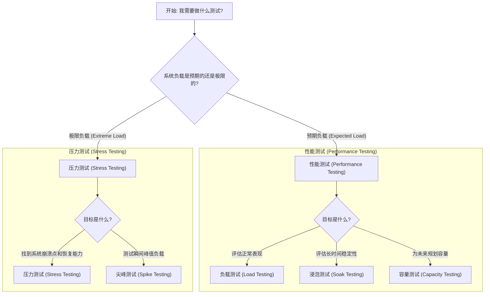

# 压力测试 (Stress Testing) vs 性能测试 (Performance Testing) 深度比较

在软件质量保证中，性能测试和压力测试都是确保系统稳定可靠的关键环节，但它们的目标和方法论有本质区别。简单来说，性能测试是在“舒适区”内检查系统的表现，而压力测试则是将系统推向“极限区”以观察其反应。

参考 `test/api-testing-types.md` 中的定义：
- **性能测试 (Load Testing)**: 评估 API 在**特定预期负载**下的性能。
- **压力测试 (Stress Testing)**: 在**极端条件下**测试 API，超出其正常运行能力，目的是找到系统的崩溃点以及恢复能力。

本文将深入探讨二者的区别，并提供在不同场景下如何选择和设计测试的建议。

## 核心概念与目标

### 性能测试 (Performance Testing)
性能测试是一个广义的类别，其核心目标是**验证和评估系统在预期的负载下的各项性能指标是否达标**。它关注的是系统在正常工作范围内的表现。

- **主要目标**:
  - **基准测试 (Benchmark Testing)**: 建立系统性能基准。
  - **负载测试 (Load Testing)**: 模拟真实用户负载，检查系统在预期峰值负载下的响应时间、吞吐量等。
  - **稳定性/浸泡测试 (Soak Testing)**: 在正常负载下长时间运行，检查是否存在内存泄漏、资源耗尽等问题。
- **关注点**: 系统是否“快”和“稳”。
- **例子**: 测试一个电商网站在“双十一”活动期间，模拟 10,000 用户同时在线购物时的系统表现。

### 压力测试 (Stress Testing)
压力测试是性能测试的一个子集，但目标更具破坏性。其核心目标是**找到系统的极限（崩溃点），并评估系统在负载超限后的恢复能力**。

- **主要目标**:
  - **找到瓶颈**: 确定系统在哪种资源（CPU, 内存, 磁盘I/O, 网络）上最先达到极限。
  - **评估鲁棒性**: 观察系统在高压下是否会数据损坏、安全漏洞暴露。
  - **评估恢复能力**: 当负载降回正常水平后，系统是否能自动恢复服务，恢复需要多长时间。
- **关注点**: 系统是否会“崩溃”以及如何“恢复”。
- **例子**: 持续增加一个视频转码服务的并发任务数，直到服务无响应，记录下最大并发数，并观察服务恢复正常所需的时间。

## 主要区别对比

| 特征 (Feature) | 性能测试 (Performance Testing) | 压力测试 (Stress Testing) |
| :--- | :--- | :--- |
| **目标 (Goal)** | 在预期负载下，验证性能是否达标。 | 找到系统的极限和瓶颈，并测试其恢复能力。 |
| **负载模型 (Load Model)** | 稳定、可预测的负载，通常不超过预期的峰值。 | 持续增加或突发的高负载，远超系统设计容量。 |
| **关注指标 (Key Metrics)** | 响应时间、吞吐量 (TPS/QPS)、资源利用率、成功率。 | 系统崩溃点、错误率、恢复时间 (MTTR)、资源极限。 |
| **测试结果 (Outcome)** | "在 X 负载下，响应时间为 Y ms，系统稳定。" | "系统在 Z 负载下崩溃，瓶颈是 CPU，恢复需要 N 分钟。" |
| **业务价值 (Business Value)** | 容量规划、性能优化、确保用户体验。 | 风险评估、增强系统鲁棒性、定义服务降级策略。 |

## 如何为两个不同的后端应用设计测试

假设有两个后端服务：
- **后端 A**: 面向用户的核心电商交易系统，对稳定性和响应时间要求极高。
- **后端 B**: 内部使用的数据处理服务，用于批量生成报表，对实时性要求不高。

### 为“后端 A (核心交易系统)”设计测试

对于核心系统，**稳定性和可预测性**是第一位的。

1.  **性能测试 (负载测试)**:
    - **关注点**:
        - **低延迟**: 确保用户的每个操作（浏览、加购、下单）都有快速响应。严格监控 P95/P99 响应时间。
        - **高吞吐量**: 确保在业务高峰期（如秒杀活动）能处理大量的并发请求。关注最大 TPS。
        - **高成功率**: 错误率必须无限接近于 0。
        - **安全的资源水位**: CPU、内存、数据库连接池等资源利用率应保持在安全范围内（如 70% 以下），留有冗余。
    - **执行方式**: 模拟预期的用户访问量，并逐渐增加到历史峰值的 1.5 倍，观察各项指标是否仍在 SLA (服务等级协议) 范围内。

2.  **压力测试**:
    - **关注点**:
        - **优雅降级**: 当负载超过极限时，系统是否能进行服务降级（如暂时关闭非核心功能、返回“系统繁忙”提示）而不是直接崩溃。
        - **快速恢复**: 当流量高峰过后，系统是否能自动恢复所有功能。
        - **数据一致性**: 确保在极端情况下不会发生数据错乱（如重复下单、库存扣减错误）。
    - **执行方式**: 在隔离的预发环境中进行，将负载持续推高，直到触发服务降级或系统崩溃，验证监控告警和自动恢复机制是否生效。**线上环境严禁进行破坏性的压力测试**。

### 为“后端 B (内部数据处理服务)”设计测试

对于内部批处理系统，**处理能力和资源效率**是重点。

1.  **性能测试 (基准测试)**:
    - **关注点**:
        - **处理效率**: 处理一个标准大小的数据集需要多长时间。
        - **资源消耗**: 在处理过程中，CPU 和内存的消耗情况如何，是否存在优化空间。
    - **执行方式**: 使用不同大小的数据集（小、中、大）运行服务，记录每次的处理耗时和资源使用情况，建立性能基准。

2.  **压力测试**:
    - **关注点**:
        - **处理极限**: 系统能处理的最大数据集是多少？一次性提交大量任务是否会导致任务队列堵塞或内存溢出？
        - **瓶颈分析**: 当处理超大数据集时，瓶颈是 CPU 计算、内存限制还是磁盘 I/O？
        - **失败处理**: 如果单个任务失败，是否会影响其他任务？是否有重试机制？
    - **执行方式**: 可以更激进地测试。例如，尝试导入一个远超常规大小的文件，或者在短时间内提交数百个处理任务，观察系统的反应和错误日志。

## 流程图：选择正确的测试类型

