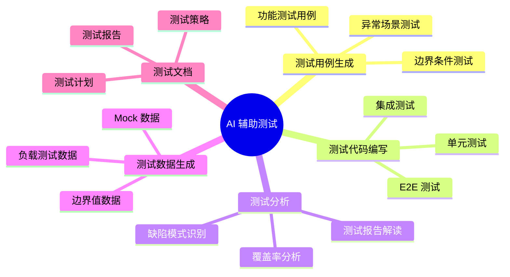
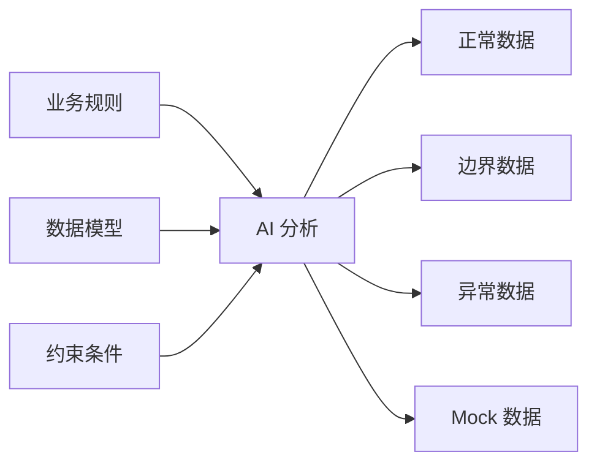
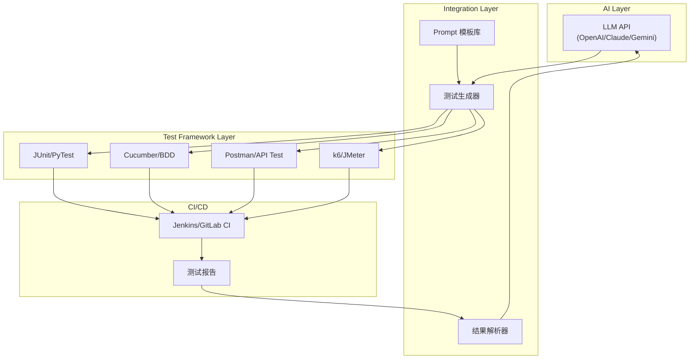
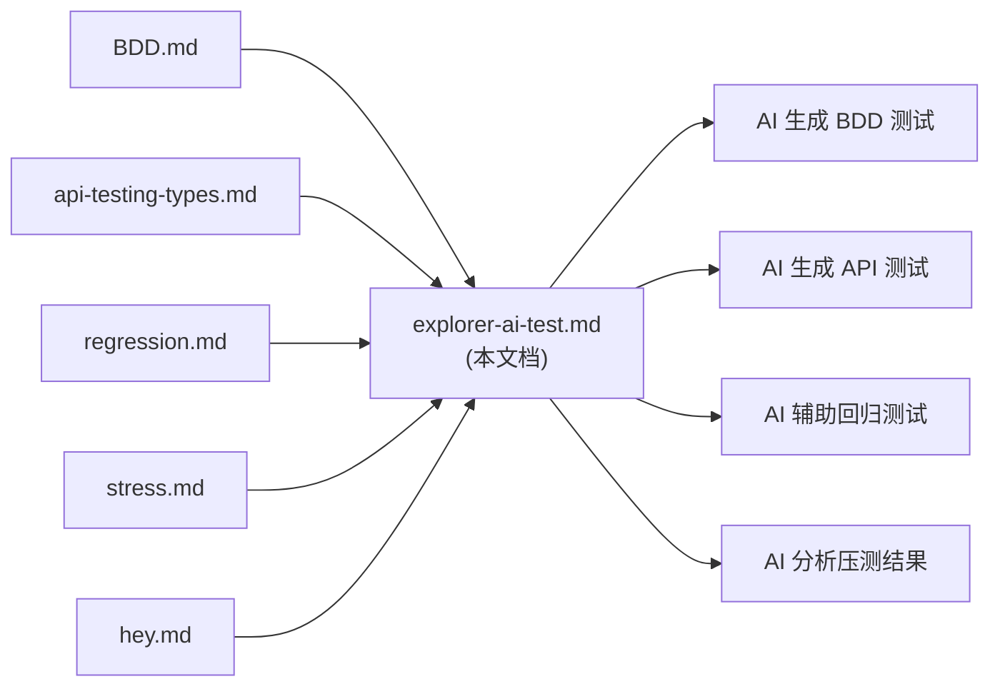

# AI 辅助测试探索指南

> 在 AI 时代，如何利用大语言模型（LLM）提升测试效率、生成测试用例、自动化测试代码编写，以及实现智能化测试分析。

---

## 目录

1. [概述：AI 在测试领域的应用场景](#概述ai-在测试领域的应用场景)
2. [AI 辅助测试的核心能力](#ai-辅助测试的核心能力)
3. [Prompt 工程：设计高质量测试 Prompt](#prompt-工程设计高质量测试-prompt)
4. [实战场景与 Prompt 模板](#实战场景与-prompt-模板)
5. [与现有测试框架的集成](#与现有测试框架的集成)
6. [最佳实践与注意事项](#最佳实践与注意事项)
7. [工具推荐](#工具推荐)

---

## 概述：AI 在测试领域的应用场景



### AI 可以帮助解决的痛点

| 传统测试痛点 | AI 解决方案 |
|-------------|------------|
| 测试用例设计耗时 | 基于需求/代码自动生成测试用例 |
| 边界条件容易遗漏 | AI 分析代码逻辑，自动识别边界场景 |
| 测试代码重复编写 | 根据模式生成标准化测试代码 |
| Mock 数据构造繁琐 | 智能生成符合业务规则的测试数据 |
| 测试报告分析困难 | 自动解读测试结果，定位问题根因 |

---

## AI 辅助测试的核心能力

### 1. 测试用例生成（Test Case Generation）

AI 可以基于以下输入生成测试用例：

- **需求文档**：从 PRD/User Story 提取测试点
- **API 定义**：从 OpenAPI/Swagger 规范生成 API 测试用例
- **源代码**：分析函数逻辑，生成覆盖各分支的测试
- **现有测试**：基于已有测试模式扩展新用例

### 2. 测试代码编写（Test Code Writing）

支持多种测试框架的代码生成：

| 测试类型 | 支持框架 |
|---------|---------|
| 单元测试 | JUnit, PyTest, Jest, Go Test |
| BDD 测试 | Cucumber, Behave, Karate |
| API 测试 | Postman, REST Assured, Karate |
| 性能测试 | JMeter, Locust, k6, hey |
| E2E 测试 | Selenium, Cypress, Playwright |

### 3. 测试数据生成（Test Data Generation）



---

## Prompt 工程：设计高质量测试 Prompt

### Prompt 设计原则

1. **明确上下文**：提供足够的背景信息（语言、框架、业务领域）
2. **具体化需求**：明确测试类型、覆盖范围、输出格式
3. **提供示例**：给出期望的输入输出样例
4. **迭代优化**：根据输出结果调整 Prompt

### Prompt 结构模板

```
## 角色定义
你是一位资深的 [语言/框架] 测试工程师，精通 [测试类型] 测试。

## 任务背景
[描述被测系统/功能/API 的背景]

## 输入信息
[提供代码片段/API 定义/需求描述]

## 任务要求
请生成 [具体测试类型] 测试，覆盖以下场景：
1. [场景1]
2. [场景2]
3. [场景3]

## 输出格式
- 使用 [框架名] 框架
- 遵循 [命名规范/编码规范]
- 包含必要的注释说明

## 示例参考
[可选：提供期望的输出格式示例]
```

---

## 实战场景与 Prompt 模板

### 场景 1：从 API 定义生成单元测试

**适用于**：REST API、微服务接口测试

```markdown
## Prompt 模板

你是一位精通 Java 和 JUnit 5 的测试工程师。

### 任务
根据以下 API 接口定义，生成完整的单元测试代码。

### API 定义
```java
@RestController
@RequestMapping("/api/orders")
public class OrderController {
    
    @PostMapping
    public ResponseEntity<Order> createOrder(@RequestBody OrderRequest request) {
        // 创建订单
    }
    
    @GetMapping("/{orderId}")
    public ResponseEntity<Order> getOrder(@PathVariable String orderId) {
        // 查询订单
    }
}
```

### 要求
1. 使用 JUnit 5 + Mockito
2. 覆盖正常场景、异常场景、边界条件
3. 使用 @DisplayName 提供清晰的测试描述
4. Mock 外部依赖（Service 层）
5. 验证 HTTP 状态码和响应体

### 输出格式
完整的测试类代码，包含必要的 import 语句
```

---

### 场景 2：从需求文档生成 BDD 测试用例

**适用于**：行为驱动开发、验收测试

```markdown
## Prompt 模板

你是一位精通 BDD 和 Cucumber 的测试工程师。

### 任务
将以下用户故事转换为 Gherkin 格式的 BDD 测试场景。

### 用户故事
作为一个电商用户，我希望能够：
- 将商品添加到购物车
- 修改购物车中商品数量
- 删除购物车中的商品
- 查看购物车总价

### 业务规则
- 单个商品最多添加 99 件
- 购物车最多容纳 50 种不同商品
- 库存不足时应提示用户
- 价格精确到小数点后 2 位

### 要求
1. 使用 Given-When-Then 结构
2. 覆盖正常流程和异常流程
3. 包含边界值测试
4. 每个 Scenario 应该独立可执行

### 输出格式
Feature 文件内容，包含多个 Scenario
```

---

### 场景 3：生成性能测试脚本

**适用于**：负载测试、压力测试

```markdown
## Prompt 模板

你是一位精通性能测试的工程师，熟悉 k6、JMeter、Locust 等工具。

### 任务
为以下 API 生成性能测试脚本。

### 被测 API
- 端点：POST /api/v1/transactions
- 请求体：{"amount": 100.00, "currency": "USD", "merchant_id": "M001"}
- 预期响应时间：< 200ms (P95)
- 预期吞吐量：1000 TPS

### 测试场景
1. **基准测试**：10 VU，持续 1 分钟
2. **负载测试**：逐步增加到 100 VU，持续 5 分钟
3. **压力测试**：200 VU，持续 10 分钟
4. **峰值测试**：瞬间 500 VU，持续 30 秒

### 要求
1. 使用 k6 脚本语法
2. 包含 Threshold 定义
3. 添加 HTTP 响应断言
4. 输出测试报告配置

### 输出格式
完整的 k6 JavaScript 脚本
```

---

### 场景 4：分析测试覆盖率并补充测试

**适用于**：提高测试覆盖率

```markdown
## Prompt 模板

你是一位资深测试工程师，擅长分析代码覆盖率并设计测试用例。

### 任务
分析以下代码和现有测试，识别未覆盖的分支并生成补充测试。

### 源代码
```java
public class PaymentService {
    public PaymentResult processPayment(PaymentRequest request) {
        if (request.getAmount() <= 0) {
            throw new InvalidAmountException("Amount must be positive");
        }
        
        if (request.getAmount() > 10000) {
            return processHighValuePayment(request);
        }
        
        if ("CREDIT_CARD".equals(request.getMethod())) {
            return processCreditCardPayment(request);
        } else if ("BANK_TRANSFER".equals(request.getMethod())) {
            return processBankTransfer(request);
        } else {
            throw new UnsupportedPaymentMethodException(request.getMethod());
        }
    }
}
```

### 现有测试
```java
@Test
void shouldProcessCreditCardPayment() {
    PaymentRequest request = new PaymentRequest(100.0, "CREDIT_CARD");
    PaymentResult result = service.processPayment(request);
    assertEquals(PaymentStatus.SUCCESS, result.getStatus());
}
```

### 要求
1. 识别所有未覆盖的代码路径
2. 为每个未覆盖路径生成测试用例
3. 包含边界值测试（如 amount = 0, 10000, 10001）
4. 测试异常场景

### 输出格式
列出未覆盖路径 + 对应的测试代码
```

---

### 场景 5：生成回归测试检查清单

**适用于**：版本发布前的回归验证

```markdown
## Prompt 模板

你是一位资深 QA 工程师，擅长制定回归测试策略。

### 任务
根据以下变更内容，生成回归测试检查清单。

### 本次变更
1. 修改了订单创建接口的参数校验逻辑
2. 新增了订单取消功能
3. 优化了库存查询性能
4. 更新了支付网关集成

### 系统模块关系
- 订单模块 -> 库存模块
- 订单模块 -> 支付模块
- 订单模块 -> 通知模块

### 要求
1. 按模块分类测试项
2. 标注测试优先级（P0/P1/P2）
3. 区分自动化测试和手动测试
4. 包含回滚验证场景

### 输出格式
Markdown 表格，包含：测试项、模块、优先级、测试类型、预期结果
```

---

### 场景 6：Mock 数据生成

**适用于**：测试数据准备

```markdown
## Prompt 模板

你是一位测试数据工程师，擅长生成符合业务规则的测试数据。

### 任务
为以下数据模型生成测试数据集。

### 数据模型
```json
{
  "user": {
    "id": "UUID",
    "name": "姓名 (2-20字符)",
    "email": "有效邮箱格式",
    "phone": "中国手机号",
    "age": "18-120",
    "status": "ACTIVE|INACTIVE|SUSPENDED"
  }
}
```

### 数据要求
1. 正常数据：10 条，覆盖各种状态
2. 边界数据：名字长度为 2 和 20，年龄为 18 和 120
3. 异常数据：无效邮箱、非法手机号、超出范围的年龄
4. 特殊字符：包含中文、emoji、特殊符号的名字

### 输出格式
JSON 数组，每条数据标注其测试目的
```

---

### 场景 7：Nginx 配置变更的回归测试

**适用于**：基础设施变更验证（结合你现有的 [regression.md](file:///Users/lex/git/knowledge/test/regression.md)）

```markdown
## Prompt 模板

你是一位精通 Nginx 和 Linux 的运维测试工程师。

### 任务
为以下 Nginx 配置变更生成回归测试脚本。

### 配置变更
```nginx
# 新增的 upstream 配置
upstream backend_v2 {
    server 10.0.0.1:8080 weight=3;
    server 10.0.0.2:8080 weight=2;
    keepalive 32;
}

# 修改的 location 配置
location /api/v2 {
    proxy_pass http://backend_v2;
    proxy_connect_timeout 5s;
    proxy_read_timeout 30s;
}
```

### 测试要求
1. 验证配置语法正确性
2. 验证路由转发正确性
3. 验证负载均衡权重分配
4. 验证超时配置生效
5. 验证旧路由不受影响

### 输出格式
Shell 脚本，包含 curl 测试命令和断言
```

---

## 与现有测试框架的集成

### 集成架构



### 集成方式

#### 方式一：IDE 插件集成

| IDE | 推荐插件/扩展 |
|-----|-------------|
| VS Code | GitHub Copilot, Codeium |
| IntelliJ IDEA | GitHub Copilot, AI Assistant |
| JetBrains | AI Test Generator |

#### 方式二：CLI 工具集成

```bash
# 示例：使用 AI 生成测试并运行
# 1. 生成测试
ai-test generate --source src/main/java/OrderService.java --framework junit5

# 2. 运行测试
mvn test -Dtest=OrderServiceTest

# 3. 分析结果
ai-test analyze --report target/surefire-reports/
```

#### 方式三：CI/CD Pipeline 集成

```yaml
# GitLab CI 示例
ai_test_generation:
  stage: test
  script:
    - python scripts/generate_tests.py --changed-files ${CI_COMMIT_SHA}
    - mvn test
    - python scripts/analyze_coverage.py
  artifacts:
    reports:
      junit: target/surefire-reports/*.xml
```

---

## 最佳实践与注意事项

### ✅ 推荐做法

1. **人工审核**：AI 生成的测试必须经过人工审核
2. **迭代优化**：根据测试结果持续优化 Prompt
3. **保留上下文**：在对话中保持完整的业务上下文
4. **版本控制**：将 Prompt 模板纳入版本管理
5. **覆盖率监控**：持续监控 AI 生成测试的覆盖率贡献

### ⚠️ 注意事项

1. **不要盲目信任**：AI 可能生成语法正确但逻辑错误的测试
2. **敏感数据**：避免在 Prompt 中包含真实的敏感业务数据
3. **复杂业务逻辑**：对于复杂业务规则，AI 可能无法完全理解
4. **性能考量**：大量调用 AI API 可能影响 CI/CD 流水线速度
5. **成本控制**：注意 Token 使用量和 API 调用成本

### 常见陷阱

| 陷阱 | 解决方案 |
|------|---------|
| 生成的测试只覆盖"Happy Path" | 明确要求覆盖异常和边界场景 |
| Mock 过度，测试价值低 | 指定哪些依赖需要 Mock，哪些需要真实调用 |
| 测试代码可读性差 | 在 Prompt 中要求添加注释和清晰命名 |
| 断言不充分 | 明确指定需要验证的内容 |

---

## 工具推荐

### AI 代码助手

| 工具 | 特点 | 适用场景 |
|------|------|---------|
| GitHub Copilot | 代码补全、测试生成 | 日常开发中的测试编写 |
| Claude | 长上下文、代码理解 | 复杂测试用例设计 |
| ChatGPT | 通用性强 | 测试策略讨论 |
| Gemini | 多模态能力 | 测试文档分析 |

### 专用测试工具

| 工具 | 功能 | 链接 |
|------|------|------|
| Diffblue Cover | Java 单元测试自动生成 | https://www.diffblue.com/ |
| Testim | AI 驱动的 E2E 测试 | https://www.testim.io/ |
| mabl | 智能测试自动化 | https://www.mabl.com/ |
| Aplitools | 视觉回归测试 | https://applitools.com/ |

### Prompt 管理工具

| 工具 | 用途 |
|------|-----|
| PromptLayer | Prompt 版本管理和分析 |
| LangChain | Prompt 模板和链式调用 |
| Promptify | 结构化 Prompt 生成 |

---

## 与本目录现有文档的关联

本探索文档与目录中其他文档的关系：



| 现有文档 | AI 辅助增强方向 |
|---------|----------------|
| [BDD.md](file:///Users/lex/git/knowledge/test/BDD.md) | 使用 AI 从用户故事生成 Gherkin 场景 |
| [api-testing-types.md](file:///Users/lex/git/knowledge/test/api-testing-types.md) | 基于 API 类型自动选择测试策略 |
| [regression.md](file:///Users/lex/git/knowledge/test/regression.md) | AI 分析变更影响范围，生成回归检查清单 |
| [stress.md](file:///Users/lex/git/knowledge/test/stress.md) | AI 设计压测场景，分析压测报告 |
| [hey.md](file:///Users/lex/git/knowledge/test/hey.md) | AI 生成 hey 命令参数，解读输出结果 |

---

## 下一步行动建议

1. **选择一个场景开始**：从上述 Prompt 模板中选择最符合你当前需求的场景
2. **定制化调整**：根据你的技术栈（Java/Python/Go）和测试框架调整模板
3. **建立 Prompt 库**：将验证有效的 Prompt 保存为模板，方便团队复用
4. **持续迭代**：根据实际效果不断优化 Prompt 设计
5. **分享经验**：记录 AI 辅助测试的最佳实践，在团队内推广

---

> 📝 **文档维护说明**  
> 本文档将根据 AI 测试工具的发展和团队实践经验持续更新。  
> 最后更新时间：2025-12-25
