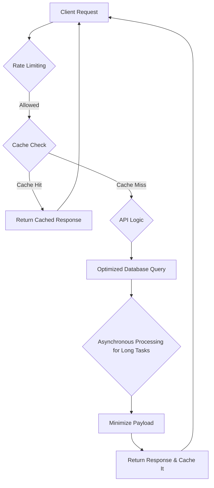

# Top 5 Common Ways to Improve API Performance

Improving API performance is crucial for providing a good user experience and ensuring the scalability of your application. Here are the top 5 common ways to achieve this:

1.  **Caching**: Store frequently accessed data in a cache (like Redis or Memcached) to reduce the number of requests to your database or backend services. This significantly lowers response times for repeated requests.

2.  **Optimize Database Queries**: Inefficient database queries are a common performance bottleneck. Analyze and optimize your queries, ensure proper indexing on your tables, and avoid N+1 query problems.

3.  **Minimize Payload Size**: Only return the data that the client needs. Use techniques like pagination to limit the amount of data sent in a single request and response. Compressing the response body using Gzip can also significantly reduce the payload size.

4.  **Rate Limiting**: Implement rate limiting to prevent abuse and ensure fair usage of your API. This protects your API from being overwhelmed by too many requests from a single client.

5.  **Asynchronous Processing**: For long-running tasks, such as sending emails or processing large files, use a message queue (like RabbitMQ or Kafka) to process them asynchronously. This prevents blocking the main thread and allows your API to respond to requests more quickly.

## API Performance Optimization Flow

