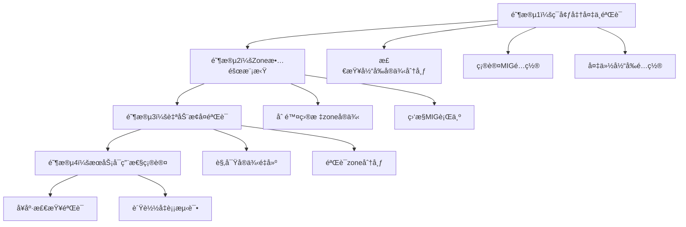
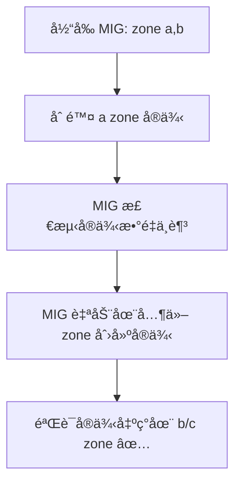

# Claude

# GCP Regional MIG Zone 故障 DR 测试方案

## 问题分æ

您的核心需求是：

- 当å‰ç¯å¢ƒï¼š2 个å®ä¾‹åˆ†å¸ƒåœ¨ 2 个 zone
- 测试目标：验è¯å½“其中 1 个 zone 故障时，æœåŠ¡èƒ½åœ¨å‰©ä½™ zone ä¿æŒå¯ç”¨
- 期望结æœï¼šç¡®ä¿ zone 级别的高å¯ç”¨æ€§å’Œè‡ªåŠ¨æ¢å¤èƒ½åŠ›

## 解决方案

### 方案设计æ€è·¯

基äºæ‚¨çš„场景，æ¨è采用**æ¸è¿›å¼ DR 测试方案**，分为三个阶段：



---

## 完整 DR 测试脚本

### 主测试脚本

```bash
#!/bin/bash

#############################################
# GCP Regional MIG Zone DR 测试脚本
# 用途：模拟zone故障并验è¯è‡ªåŠ¨æ¢å¤èƒ½åŠ›
#############################################

set -e

# ==================== é…ç½®å‚æ•° ====================
MIG_NAME="your-mig-name"
REGION="europe-west2"
TARGET_ZONE="europe-west2-a"  # è¦æ¨¡æ‹Ÿæ•…障的zone
EXPECTED_INSTANCE_COUNT=2
HEALTH_CHECK_TIMEOUT=300      # å¥åº·æ£€æŸ¥è¶…时时间(秒)

# 颜色输出
RED='\033[0;31m'
GREEN='\033[0;32m'
YELLOW='\033[1;33m'
NC='\033[0m' # No Color

# ==================== 函数定义 ====================

log_info() {
    echo -e "${GREEN}[INFO]${NC} $1"
}

log_warn() {
    echo -e "${YELLOW}[WARN]${NC} $1"
}

log_error() {
    echo -e "${RED}[ERROR]${NC} $1"
}

# è·å–当å‰å®ä¾‹åˆ†å¸ƒ
get_instance_distribution() {
    log_info "è·å–当å‰å®ä¾‹åˆ†å¸ƒ..."
    gcloud compute instance-groups managed list-instances "$MIG_NAME" \
        --region="$REGION" \
        --format="table(instance,zone,status)"
}

# 统计å„zoneå®ä¾‹æ•°é‡
count_instances_by_zone() {
    gcloud compute instance-groups managed list-instances "$MIG_NAME" \
        --region="$REGION" \
        --format="csv[no-heading](zone)" | sort | uniq -c
}

# 检查MIGé…ç½®
check_mig_config() {
    log_info "检查MIGé…ç½®..."
    gcloud compute instance-groups managed describe "$MIG_NAME" \
        --region="$REGION" \
        --format="yaml(distributionPolicy,targetSize,autoHealingPolicies)"
}

# 删除指定zone的所有å®ä¾‹
delete_zone_instances() {
    local zone=$1
    log_warn "准备删除zone ${zone} 中的所有å®ä¾‹..."

    # è·å–该zoneçš„å®ä¾‹åˆ—表
    local instances=$(gcloud compute instance-groups managed list-instances "$MIG_NAME" \
        --region="$REGION" \
        --filter="zone:(${zone})" \
        --format="value(instance)")

    if [[ -z "$instances" ]]; then
        log_info "Zone ${zone} 中没有å®ä¾‹ï¼Œè·³è¿‡åˆ é™¤ã€‚"
        return 0
    fi

    log_info "å‘ç°ä»¥ä¸‹å®ä¾‹å°†è¢«åˆ é™¤ï¼š"
    echo "$instances"

    # 删除å®ä¾‹
    for instance in $instances; do
        log_info "删除å®ä¾‹: $instance"
        gcloud compute instance-groups managed delete-instances "$MIG_NAME" \
            --region="$REGION" \
            --instances="$instance" \
            --quiet
    done

    log_info "Zone ${zone} çš„å®ä¾‹åˆ é™¤å®Œæˆ"
}

# 等待并验è¯å®ä¾‹é‡å»º
wait_for_recovery() {
    local timeout=$1
    local start_time=$(date +%s)

    log_info "等待MIG自动æ¢å¤å®ä¾‹..."

    while true; do
        local current_time=$(date +%s)
        local elapsed=$((current_time - start_time))

        if [[ $elapsed -gt $timeout ]]; then
            log_error "超时ï¼å®ä¾‹æ¢å¤æ—¶é—´è¶…过 ${timeout} 秒"
            return 1
        fi

        # 检查当å‰å®ä¾‹æ•°é‡
        local current_count=$(gcloud compute instance-groups managed list-instances "$MIG_NAME" \
            --region="$REGION" \
            --filter="status=RUNNING" \
            --format="value(instance)" | wc -l)

        log_info "当å‰è¿è¡Œå®ä¾‹æ•°: ${current_count}/${EXPECTED_INSTANCE_COUNT} (耗时: ${elapsed}s)"

        if [[ $current_count -ge $EXPECTED_INSTANCE_COUNT ]]; then
            log_info "✅ 所有å®ä¾‹å·²æ¢å¤"
            return 0
        fi

        sleep 10
    done
}

# 验è¯zone分布
verify_zone_distribution() {
    log_info "验è¯å®ä¾‹zone分布..."

    local zone_count=$(gcloud compute instance-groups managed list-instances "$MIG_NAME" \
        --region="$REGION" \
        --filter="status=RUNNING" \
        --format="value(zone)" | sort -u | wc -l)

    log_info "å®ä¾‹åˆ†å¸ƒåœ¨ ${zone_count} 个zone"

    # 显示详细分布
    log_info "详细zone分布统计："
    count_instances_by_zone

    # 检查是å¦è¿˜æœ‰å®ä¾‹åœ¨ç›®æ ‡zone
    local target_zone_count=$(gcloud compute instance-groups managed list-instances "$MIG_NAME" \
        --region="$REGION" \
        --filter="zone:(${TARGET_ZONE}) AND status=RUNNING" \
        --format="value(instance)" | wc -l)

    if [[ $target_zone_count -gt 0 ]]; then
        log_warn "注æ„：目标zone ${TARGET_ZONE} ä»æœ‰ ${target_zone_count} 个å®ä¾‹"
        return 1
    else
        log_info "✅ 目标zone ${TARGET_ZONE} æ— è¿è¡Œå®ä¾‹"
        return 0
    fi
}

# 生æˆæµ‹è¯•æŠ¥å‘Š
generate_report() {
    local test_result=$1
    local report_file="dr_test_report_$(date +%Y%m%d_%H%M%S).txt"

    {
        echo "======================================"
        echo "  GCP MIG Zone DR 测试报告"
        echo "======================================"
        echo "测试时间: $(date)"
        echo "MIGå称: $MIG_NAME"
        echo "区域: $REGION"
        echo "测试zone: $TARGET_ZONE"
        echo "期望å®ä¾‹æ•°: $EXPECTED_INSTANCE_COUNT"
        echo ""
        echo "测试结æœ: $test_result"
        echo ""
        echo "最终å®ä¾‹åˆ†å¸ƒ:"
        get_instance_distribution
        echo ""
        echo "Zone统计:"
        count_instances_by_zone
    } | tee "$report_file"

    log_info "测试报告已ä¿å­˜è‡³: $report_file"
}

# ==================== 主æµç¨‹ ====================

main() {
    log_info "=========================================="
    log_info "  开始 Zone DR 测试"
    log_info "=========================================="

    # 阶段1：å‰ç½®æ£€æŸ¥
    log_info "ã€é˜¶æ®µ1】ç¯å¢ƒæ£€æŸ¥"
    check_mig_config
    echo ""

    log_info "测试å‰å®ä¾‹åˆ†å¸ƒ:"
    get_instance_distribution
    echo ""

    log_info "Zone统计:"
    count_instances_by_zone
    echo ""

    # 确认继续
    read -p "是å¦ç»§ç»­æ‰§è¡ŒDR测试？这将删除 ${TARGET_ZONE} 中的å®ä¾‹ (y/n): " confirm
    if [[ "$confirm" != "y" ]]; then
        log_warn "测试已å–消"
        exit 0
    fi

    # 阶段2：模拟zone故障
    log_info "ã€é˜¶æ®µ2】模拟Zoneæ•…éšœ"
    delete_zone_instances "$TARGET_ZONE"
    echo ""

    # 阶段3：验è¯è‡ªåŠ¨æ¢å¤
    log_info "ã€é˜¶æ®µ3】验è¯è‡ªåŠ¨æ¢å¤"
    if wait_for_recovery "$HEALTH_CHECK_TIMEOUT"; then
        log_info "✅ å®ä¾‹æ¢å¤æˆåŠŸ"
    else
        log_error "⌠å®ä¾‹æ¢å¤å¤±è´¥"
        generate_report "FAILED"
        exit 1
    fi
    echo ""

    # 阶段4：验è¯zone分布
    log_info "ã€é˜¶æ®µ4】验è¯Zone分布"
    sleep 30  # 等待å®ä¾‹å®Œå…¨å¯åŠ¨

    if verify_zone_distribution; then
        log_info "✅ Zone分布验è¯é€šè¿‡"
        test_result="PASSED ✅"
    else
        log_warn "âš ï¸  Zone分布å¯èƒ½ä¸ç¬¦åˆé¢„期"
        test_result="PARTIAL âš ï¸"
    fi
    echo ""

    # 生æˆæŠ¥å‘Š
    log_info "ã€æµ‹è¯•å®Œæˆã€‘生æˆæŠ¥å‘Š"
    generate_report "$test_result"

    log_info "=========================================="
    log_info "  DR测试完æˆ"
    log_info "=========================================="
}

# 执行主æµç¨‹
main
```

---

## 辅助脚本：æŒç»­ç›‘æ§

```bash
#!/bin/bash

#############################################
# MIG å®ä¾‹åˆ†å¸ƒç›‘æ§è„šæœ¬
# 用途：å®æ—¶ç›‘æ§å®ä¾‹çš„zone分布情况
#############################################

MIG_NAME="your-mig-name"
REGION="europe-west2"
INTERVAL=5  # 监æ§é—´éš”(秒)

echo "å¼€å§‹ç›‘æ§ MIG: $MIG_NAME"
echo "按 Ctrl+C åœæ­¢"
echo ""

while true; do
    clear
    echo "========================================"
    echo "监æ§æ—¶é—´: $(date '+%Y-%m-%d %H:%M:%S')"
    echo "========================================"
    echo ""

    # 显示å®ä¾‹åˆ—表
    echo "å®ä¾‹åˆ—表:"
    gcloud compute instance-groups managed list-instances "$MIG_NAME" \
        --region="$REGION" \
        --format="table(instance,zone,status,lastAttempt.errors.errors[0].code)"

    echo ""
    echo "Zone分布统计:"
    gcloud compute instance-groups managed list-instances "$MIG_NAME" \
        --region="$REGION" \
        --format="csv[no-heading](zone,status)" | \
        awk -F',' '{print $1" "$2}' | sort | uniq -c

    echo ""
    echo "----------------------------------------"
    sleep $INTERVAL
done
```

---

## 使用说æ˜

### 1. 准备工作

```bash
# 1. 修改脚本中的é…ç½®å‚æ•°
MIG_NAME="your-actual-mig-name"
REGION="your-region"
TARGET_ZONE="zone-to-test"

# 2. 赋予执行æƒé™
chmod +x dr_test.sh
chmod +x monitor_mig.sh
```

### 2. 执行测试

**终端 1 - è¿è¡Œ DR 测试:**

```bash
./dr_test.sh
```

**终端 2 - å®æ—¶ç›‘æ§(å¯é€‰):**

```bash
./monitor_mig.sh
```

### 3. 预期结æœ

| 阶段          | 预期行为                   | 验è¯æŒ‡æ ‡             |
| ------------- | -------------------------- | -------------------- |
| Zone 故障模拟 | 目标 zone å®ä¾‹è¢«åˆ é™¤       | 该 zone å®ä¾‹æ•°=0     |
| 自动æ¢å¤      | MIG 在其他 zone 创建新å®ä¾‹ | 总å®ä¾‹æ•°æ¢å¤åˆ°ç›®æ ‡å€¼ |
| Zone 分布     | æ–°å®ä¾‹åˆ†å¸ƒåœ¨å…¶ä»– zone      | 目标 zone æ— æ–°å®ä¾‹   |
| æœåŠ¡å¯ç”¨æ€§    | è´Ÿè½½å‡è¡¡ç»§ç»­å·¥ä½œ           | å¥åº·æ£€æŸ¥é€šè¿‡         |

---

## 注æ„事项

### âš ï¸ æµ‹è¯•å‰æ£€æŸ¥æ¸…å•

- [ ] 确认 MIG é…置了 autoHealingPolicy
- [ ] 验è¯è‡³å°‘é…置了 2 个以上的 zone
- [ ] 检查å®ä¾‹æ¨¡æ¿çš„å¥åº·æ£€æŸ¥é…ç½®
- [ ] 确认测试窗å£æœŸé—´æµé‡è¾ƒä½
- [ ] 准备å›æ»šæ–¹æ¡ˆ

### âš ï¸ å·²çŸ¥é™åˆ¶

1. **Policy é™åˆ¶**: å¦‚æœ MIG çš„ distributionPolicy ä»åŒ…å«ç›®æ ‡ zone，å®ä¾‹å¯èƒ½ä¼šé‡æ–°è°ƒåº¦å›è¯¥ zone
2. **资æºé™åˆ¶**: 如æœå…¶ä»– zone é…é¢ä¸è¶³ï¼Œæ¢å¤å¯èƒ½å¤±è´¥
3. **时间延迟**: å®ä¾‹é‡å»ºé€šå¸¸éœ€è¦ 2-5 分钟

### 解决方案：强制æ’除 zone

如需确ä¿å®ä¾‹ä¸å›åˆ°ç›®æ ‡ zone，需è¦åœ¨ MIG 创建时指定 zone 列表：

```bash
# é‡å»ºMIG并æ’除特定zone
gcloud compute instance-groups managed create $MIG_NAME \
  --region=$REGION \
  --template=your-template \
  --size=2 \
  --distribution-policy-zones=europe-west2-b,europe-west2-c
```

---

## 扩展验è¯(å¯é€‰)

### è´Ÿè½½å‡è¡¡å¥åº·æ£€æŸ¥

```bash
# 检查å端æœåŠ¡å¥åº·çŠ¶æ€
gcloud compute backend-services get-health BACKEND_SERVICE_NAME \
  --region=$REGION \
  --format="table(status.healthStatus[].instance,status.healthStatus[].healthState)"
```

### æµé‡æµ‹è¯•

```bash
# 使用curlæŒç»­è¯·æ±‚测试
while true; do
  curl -s -o /dev/null -w "Status: %{http_code}, Time: %{time_total}s\n" \
    https://your-service-url.com
  sleep 1
done
```

---

需è¦æˆ‘进一步优化脚本或添加其他验è¯åŠŸèƒ½å—?例如:

- 自动化的负载测试集æˆ
- Slack/Email 告警通知
- 多 zone 轮询故障测试
- 性能指标采集

# ChatGPT

你的目标é常æ˜ç¡®ï¼š

> 模拟å•ä¸ª **zone æ•…éšœ**ï¼Œå¹¶éªŒè¯ **Regional MIG** 是å¦èƒ½åœ¨å…¶ä»–å¯ç”¨çš„ zone 内自动æ¢å¤å®ä¾‹ã€‚

基äºä½ ä¸Šä¼ çš„文档内容（dr-mig-zone-test.md），我总结出两ç§å¯è¡Œä¸”安全的 **DR 测试方案**，并æ供相应的脚本供你直æ¥éªŒè¯ã€‚

---

## **一ã€å¿«é€ŸéªŒè¯æ–¹æ¡ˆï¼ˆæ¨è）**

### **目标**

验è¯å½“æŸä¸ª zone（如 europe-west2-a）“挂æ‰â€æ—¶ï¼ŒRegional MIG 是å¦ä¼šåœ¨å…¶ä»– zone（bã€c）自动补建å®ä¾‹ã€‚

### **æ€è·¯**

1. **ä¸ä¿®æ”¹ä»»ä½•ç­–ç•¥**（ä¿æŒå½“å‰ MIG 设置）
2. **手动删除æŸä¸ª zone 的所有å®ä¾‹**
3. 观察 MIG 是å¦åœ¨å…¶ä»– zone 自动é‡å»ºå®ä¾‹

---

### **脚本：mig_zone_dr_test.sh**

```bash
#!/bin/bash

# ========== å‚数定义 ==========
MIG_NAME="your-mig-name"
REGION="europe-west2"
ZONE_TO_SIMULATE_DOWN="europe-west2-a"

# ========== Step 1: 显示当å‰åˆ†å¸ƒ ==========
echo "å½“å‰ MIG å®ä¾‹åˆ†å¸ƒï¼š"
gcloud compute instance-groups managed list-instances "$MIG_NAME" \
  --region="$REGION" \
  --format="table(instance, zone, status)"

# ========== Step 2: è·å–指定 zone çš„å®ä¾‹ ==========
echo "è·å– $ZONE_TO_SIMULATE_DOWN 中的å®ä¾‹..."
INSTANCES=$(gcloud compute instance-groups managed list-instances "$MIG_NAME" \
  --region="$REGION" \
  --filter="zone:($ZONE_TO_SIMULATE_DOWN)" \
  --format="value(instance)")

if [[ -z "$INSTANCES" ]]; then
  echo "✅ $ZONE_TO_SIMULATE_DOWN 中没有å®ä¾‹ï¼Œæ— éœ€æ¨¡æ‹Ÿæ•…障。"
  exit 0
fi

# ========== Step 3: 删除该 zone å®ä¾‹ï¼ˆæ¨¡æ‹Ÿæ•…障） ==========
echo "模拟 $ZONE_TO_SIMULATE_DOWN 故障，删除å®ä¾‹..."
for INSTANCE in $INSTANCES; do
  echo "🗑 删除å®ä¾‹ï¼š$INSTANCE"
  gcloud compute instance-groups managed delete-instances "$MIG_NAME" \
    --region="$REGION" \
    --instances="$INSTANCE" \
    --quiet
done

# ========== Step 4: 等待 MIG 自愈 ==========
echo "等待 MIG 自动é‡å»ºå®ä¾‹..."
sleep 90

# ========== Step 5: å†æ¬¡æŸ¥çœ‹åˆ†å¸ƒ ==========
echo "é‡æ–°æ£€æŸ¥å®ä¾‹åˆ†å¸ƒï¼š"
gcloud compute instance-groups managed list-instances "$MIG_NAME" \
  --region="$REGION" \
  --format="table(instance, zone, status)"
```

---

### **è¿è¡Œæ–¹å¼**

```
chmod +x mig_zone_dr_test.sh
./mig_zone_dr_test.sh
```

è¿è¡Œå®Œå，观察是å¦æœ‰æ–°å®ä¾‹åœ¨ europe-west2-b 或 europe-west2-c 出ç°ã€‚

如æœæ˜¯ ✅，说æ˜ä½ çš„ MIG 能在 zone 故障时自动æ¢å¤ã€‚

---

### **验è¯æµç¨‹å›¾**



---

## **二ã€å®Œå…¨æ§åˆ¶æ–¹æ¡ˆï¼ˆå¯é‡å¤æµ‹è¯•ï¼‰**

当你想**严格指定容ç¾ç›®æ ‡ zone**ï¼ˆä¾‹å¦‚å½»åº•ä» a è¿åˆ° b,c），å¯ä»¥ä½¿ç”¨æ­¤æ–¹æ¡ˆã€‚

### **步骤**

#### **1ï¸âƒ£ 创建一个新的 MIG（带 zone 策略）**

```bash
gcloud compute instance-groups managed create my-dr-test-mig \
  --region=europe-west2 \
  --template=my-template \
  --size=2 \
  --distribution-policy-zones=europe-west2-b,europe-west2-c
```

#### **2ï¸âƒ£ 观察å®ä¾‹åˆ†å¸ƒï¼š**

```bash
gcloud compute instance-groups managed list-instances my-dr-test-mig \
  --region=europe-west2 \
  --format="table(instance, zone)"
```

#### **3ï¸âƒ£ 模拟一个 zone 故障：**

```bash
gcloud compute instance-groups managed delete-instances my-dr-test-mig \
  --region=europe-west2 \
  --instances=$(gcloud compute instance-groups managed list-instances my-dr-test-mig \
    --region=europe-west2 --filter="zone:(europe-west2-b)" --format="value(instance)")
```

#### **4ï¸âƒ£ 验è¯æ˜¯å¦è‡ªåŠ¨é‡å»ºåˆ° europe-west2-c：**

```bash
gcloud compute instance-groups managed list-instances my-dr-test-mig \
  --region=europe-west2 \
  --format="table(instance, zone, status)"
```

---

## **三ã€æœ€ä½³å®è·µä¸æ³¨æ„事项**

| **项目**           | **建议**                                                                                                                                                    |
| ------------------ | ----------------------------------------------------------------------------------------------------------------------------------------------------------- |
| æµ‹è¯•ç±»å‹           | 使用 Regional MIG（必须）                                                                                                                                   |
| 分布策略           | è‡³å°‘åŒ…å« 2 个ä¸åŒ zone                                                                                                                                      |
| 模拟 zone æ•…éšœæ–¹å¼ | 手动删除å®ä¾‹ or resize=0 → resize=åŸå€¼                                                                                                                      |
| 自动æ¢å¤éªŒè¯       | 观察å®ä¾‹é‡æ–°å‡ºç°åœ¨å…¶ä»– zone                                                                                                                                 |
| å®é™…生产 DR        | ç»“åˆ [Fault Injection Testing (FIT)](https://cloud.google.com/architecture/dr-drills-fault-injection-gce) æ›´çœŸå® |

---

是å¦å¸Œæœ›æˆ‘进一步帮你扩展这个脚本，让它能：

- 自动检测 MIG 所有 zone；
- 自动选择一个 zone 进行“failoverâ€æµ‹è¯•ï¼›
- 输出 JSON æ ¼å¼çš„å‰å对比结æœï¼Ÿ

这样就能å®ç°**一键自动化 DR 测试**，适åˆå®šæœŸéªŒè¯ã€‚
