你可以通过**手动更新 GCP 的 Managed Instance Group (MIG)** 的 **location policy（分布策略）或直接修改 instanceTemplate 并强制重新创建实例**来模拟一个 zone 故障并实现 DR Testing。以下是推荐的做法，适用于 **Regional MIG（即分布于多个 zone 的 MIG）**。

---

## **🎯 目标**

- 当前 MIG 分布在 europe-west2-a 和 europe-west2-b
    
- 现在你想模拟 europe-west2-a zone 故障
    
- 实现目标：将所有实例仅分布到 europe-west2-b 和 europe-west2-c
    

---

## **✅ 步骤说明（推荐方式）**

  

### **步骤 1：更新 Regional MIG 的** 

### **distributionPolicy.zones**

```
gcloud compute instance-groups managed update [MIG_NAME] \
  --region=[REGION] \
  --distribution-policy-zones=europe-west2-b,europe-west2-c
```

- 这条命令会修改 MIG 的 zone 分布策略。
    
- ⚠️ **这不会自动迁移现有实例**，只会影响接下来被替换或扩展的实例位置。
    

---

### **步骤 2：手动触发 Rolling Update（重新创建所有实例）**

  

为了强制现有实例按照新的 zone 策略进行重新部署，你需要触发一次 Rolling Update：

```
gcloud compute instance-groups managed rolling-action start-update [MIG_NAME] \
  --region=[REGION] \
  --type=replace
```

> 这会根据新的 distributionPolicy 把旧实例逐一删除并在新 zone（b、c）中重建。

  

你也可以指定 --max-surge 和 --max-unavailable 控制切换的并发和风险，比如：

```
--max-surge=1 --max-unavailable=0
```

---

### **📝 示例命令（实际替换）**

```
# 更新为 b 和 c zone
gcloud compute instance-groups managed update my-api-mig \
  --region=europe-west2 \
  --distribution-policy-zones=europe-west2-b,europe-west2-c

# 开始 rolling update，重建实例
gcloud compute instance-groups managed rolling-action start-update my-api-mig \
  --region=europe-west2 \
  --type=replace \
  --max-surge=1 \
  --max-unavailable=0
```

---

## **📌 其他方案（仅适合测试）**

  

如果你只是想快速验证 DR，而不想更改分布策略，可以考虑：

  

### **方法：逐个手动删除某个 zone 的实例（GCE 会自动重建）**

```
gcloud compute instances list --filter="zone:(europe-west2-a) AND name~'my-api-mig'" \
  --format="value(name,zone)"
```

然后删除这些实例：

```
gcloud compute instance-groups managed delete-instances my-api-mig \
  --region=europe-west2 \
  --instances=INSTANCE_NAME1,INSTANCE_NAME2
```

由于 MIG 控制，该 zone 的实例会在其余 zone 中重建（根据当前 policy），适合模拟某个 zone 挂掉的行为。

---

## **✅ 建议策略**

|**操作方式**|**说明**|
|---|---|
|修改 distributionPolicy + rolling update|✅ 推荐方式，真实模拟 DR failover|
|手动删除特定 zone 的实例|快速模拟，但不修改策略，适合演练|
|修改 instanceTemplate + update|如果还需要修改镜像等可一并做|

---

如你还希望结合 Mermaid 图解释，可以参考下面：



---

有任何 DR 测试自动化脚本需求也可以继续告诉我，我可以帮你写完整的 gcloud + bash 自动化流程。


是的，只要你的 **MIG 是 Regional 类型**，并且设置了 **多个 zone（distribution policy zones）**，当你手动删除某个 zone（比如 europe-west2-a）下的实例后：

  

> ✅ **新建的实例会被调度到 policy 中的其他 zone**（比如 europe-west2-b、europe-west2-c），**而不会重新创建在已删除的那个 zone（如果它没有在当前策略里或 zone 有问题）**

---

## **📌 更具体的行为说明：**

  

### **1.** 

### **当前 MIG policy 包含哪些 zone**

```
gcloud compute instance-groups managed describe my-api-mig \
  --region=europe-west2 \
  --format="yaml(distributionPolicy)"
```

如果输出如下：

```
distributionPolicy:
- zones:
  - europe-west2-a
  - europe-west2-b
  - europe-west2-c
```

则 GCE 会在这三个 zone 中调度重建实例，**但会尽量避开你刚删除的那个 zone**（除非资源紧张）。

---

### **2.** 

### **如何确保实例不再回到 europe-west2-a**

  

如果你**想确保重建后的实例绝对不会再回到 europe-west2-a**：

  

✅ 最好先运行以下命令，**把该 zone 从 MIG 策略中移除**：

```
gcloud compute instance-groups managed update my-api-mig \
  --region=europe-west2 \
  --distribution-policy-zones=europe-west2-b,europe-west2-c
```

然后再删除 europe-west2-a 的实例，MIG 会按照当前策略只在 b/c 两个 zone 中重建。

---

### **🧪 示例测试命令：**

  

#### **Step 1: 确认所有实例分布情况**

```
gcloud compute instances list \
  --filter="name~'my-api-mig'" \
  --format="table(name,zone,status)"
```

#### **Step 2: 删除 europe-west2-a 的实例**

```
gcloud compute instance-groups managed delete-instances my-api-mig \
  --region=europe-west2 \
  --instances=instance-1,instance-2
```

> 删除后，MIG 控制器会根据当前 policy 自动补足目标 instance 数量。

---

### **✅ 小结：**

|**条件**|**是否会重建到其他 zone**|
|---|---|
|MIG 是 Regional 类型|✅ 会|
|MIG policy 包含其他可用 zone|✅ 会|
|MIG policy 仍包含删除 zone|⚠️ 有可能仍重建到该 zone|
|删除实例前修改 MIG 的分布策略|✅ 可精确控制重建位置|

---

是否需要我帮你写个一键自动删除某 zone 的所有实例并观察新建 zone 的小脚本？

以下是一个自动化脚本，用于：

1. 获取某个 MIG 中指定 Zone 的所有实例名称
    
2. 删除这些实例（MIG 会自动重建）
    
3. 可选：在删除前修改 MIG 的分布策略，确保新实例不会回到被删除的 Zone
    

---

### **🛠 示例脚本（Bash +** gcloud

```bash
#!/bin/bash

# 必填变量
MIG_NAME="your-mig-name"
REGION="europe-west2"
ZONE_TO_DRAIN="europe-west2-a"
REMAINING_ZONES="europe-west2-b,europe-west2-c"

echo "Step 1: Update distribution policy to exclude ${ZONE_TO_DRAIN}..."
gcloud compute instance-groups managed update "$MIG_NAME" \
  --region="$REGION" \
  --distribution-policy-zones="$REMAINING_ZONES"

echo "Step 2: Get all instances in ${ZONE_TO_DRAIN}..."
INSTANCES=$(gcloud compute instance-groups managed list-instances "$MIG_NAME" \
  --region="$REGION" \
  --filter="zone:($ZONE_TO_DRAIN)" \
  --format="value(instance)")

if [[ -z "$INSTANCES" ]]; then
  echo "✅ No instances found in $ZONE_TO_DRAIN. Nothing to delete."
  exit 0
fi

echo "Step 3: Deleting instances in $ZONE_TO_DRAIN..."
for INSTANCE in $INSTANCES; do
  echo "  - Deleting: $INSTANCE"
  gcloud compute instance-groups managed delete-instances "$MIG_NAME" \
    --region="$REGION" \
    --instances="$INSTANCE" \
    --quiet
done

echo "✅ Done. MIG will now recreate instances in $REMAINING_ZONES."
```

---

### **📌 使用说明：**

1. 把以下参数替换为你的实际值：
    

```
MIG_NAME="your-mig-name"
REGION="europe-west2"
ZONE_TO_DRAIN="europe-west2-a"
REMAINING_ZONES="europe-west2-b,europe-west2-c"
```

1.   
    
2. 赋予执行权限并运行：
    

```
chmod +x mig-drain-zone.sh
./mig-drain-zone.sh
```

  

---

需要我再加个可视化的 Mermaid 流程图说明整个流程吗？

如果你不想更新 MIG 的 distribution policy，**仅想临时验证**当一个 Zone（如 europe-west2-a）的实例被删除后，GCE 是否会在 **其他 Zone 重建实例**，你可以：

---

### **✅** 

### **直接删除指定 zone 中的实例**

### **，观察 MIG 重建的位置。**

  

即：**不修改 policy**，仅做删除操作。GCE 会尝试在可用 Zone 重建实例，**但不保证一定避开原来的 zone**。

---

### **🛠 示例脚本（不修改 policy，仅删除指定 zone 实例）**

```
#!/bin/bash

# 自定义参数
MIG_NAME="your-mig-name"
REGION="europe-west2"
ZONE_TO_TEST="europe-west2-a"

echo "Step 1: 获取 MIG 中位于 $ZONE_TO_TEST 的实例..."
INSTANCES=$(gcloud compute instance-groups managed list-instances "$MIG_NAME" \
  --region="$REGION" \
  --filter="zone:($ZONE_TO_TEST)" \
  --format="value(instance)")

if [[ -z "$INSTANCES" ]]; then
  echo "✅ Zone $ZONE_TO_TEST 中没有实例，无需删除。"
  exit 0
fi

echo "Step 2: 删除 $ZONE_TO_TEST 中的实例，模拟 zone 故障..."
for INSTANCE in $INSTANCES; do
  echo "  - 删除实例：$INSTANCE"
  gcloud compute instance-groups managed delete-instances "$MIG_NAME" \
    --region="$REGION" \
    --instances="$INSTANCE" \
    --quiet
done

echo "✅ 删除完成。请通过以下命令观察重建的实例所在 zone："
echo "  gcloud compute instances list --filter='name~$MIG_NAME' --format='table(name,zone,status)'"
```

---

### **✅ 验证方法**

  

运行下面命令观察是否新建的实例落到了其他 zone（比如 b、c）：

```
gcloud compute instances list \
  --filter="name~'your-mig-name'" \
  --format="table(name,zone,status)"
```

---

### **⚠️ 注意事项**

- 如果 distribution policy 包含 europe-west2-a，GCE 仍可能调度新实例回到 europe-west2-a。
    
- 若该 zone 临时设置为不可用（模拟 DR 故障），则 GCE 会自动避开它（这可以通过故障注入或 Resource Contention 模拟）。
    
- 想更精准测试 DR 逻辑，建议搭配 GCP 的 [Fault Injection Testing (FIT)](https://cloud.google.com/architecture/dr-drills-fault-injection-gce) 工具。
    

---

如需我补充一个 Mermaid 流程图帮助理解上面 DR 删除验证流程，我也可以补上。是否需要？