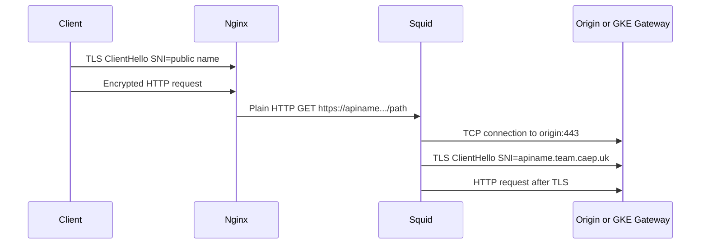
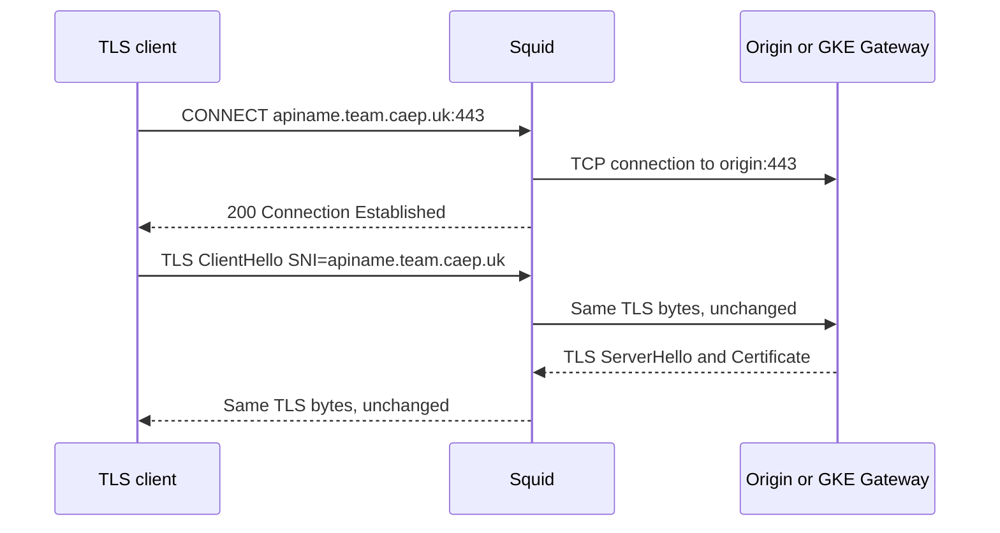

# Nginx、Squid 与 TLS SNI：端到端行为探索

> 范围：应用层 Nginx / Squid 配置，并向下解释 TCP、TLS 与抓包可见性。
>
> 结论先行：SNI 属于 **TLS ClientHello 扩展**，不属于 TCP，也不是 HTTP `Host` 头。谁真正对目标服务发起 TLS ClientHello，谁决定该连接的 SNI。

相关材料：

- [`squid-sni.md`](squid/docs/squid-sni.md)
- [`sni-nginx-solution.md`](../gcp/cross-project/public-tls-ingress/sni-nginx-solution.md)

本文根据两份材料中的实际 Nginx 片段重新校准了一个关键边界：`proxy_pass http://ourintra.squid.proxy:3128` 时，Nginx 到 Squid 是 HTTP；`proxy_ssl_*` 指令不会在这一跳执行。它也不是 Nginx 自动建立的 `CONNECT` 隧道。

## 1. TCP 与 TLS 的区别

| 维度 | TCP | TLS |
|---|---|---|
| 层次 | 传输层（L4） | 位于 TCP 之上的安全协议；HTTPS = HTTP over TLS over TCP |
| 解决的问题 | 两端可靠、有序的字节流；端口、多路复用、重传、流控 | 身份认证、机密性、完整性、密钥协商 |
| 起始交互 | SYN → SYN-ACK → ACK | TCP 建立后，ClientHello → ServerHello → Certificate … |
| 是否知道域名/HTTP 路径 | 否。TCP 只看到源/目的 IP、端口和字节 | ClientHello 可携带 SNI；握手后才有 HTTP 请求和 `Host` |
| SNI 所在位置 | 不存在 | TLS ClientHello 的 `server_name` 扩展（通常可被链路上的观察者看到） |

TCP 连接到 IP 地址，例如 `10.10.1.8:443`；TLS 需要在同一 IP 上选择正确证书/虚拟主机时，客户端可在 ClientHello 中附带 `apiname.team.caep.uk`。这就是 SNI（Server Name Indication）。TLS 1.3 不会天然加密 SNI；只有部署 ECH（Encrypted Client Hello）时，外部可见名称才会发生变化。

`Host` / `:authority` 与 SNI 也不能混为一谈：

- SNI 在 TLS 握手阶段出现，决定证书和 TLS 虚拟主机选择；
- `Host`（HTTP/1.1）或 `:authority`（HTTP/2、HTTP/3）在 TLS 已建立后出现，决定 HTTP 路由；
- 两者通常应为同一个受控域名，但协议不会自动强制它们一致。

## 2. Nginx 的 SNI 行为

### 2.1 Nginx 作为 TLS 服务端

客户端访问 Nginx 的 `:443` 时，**客户端**在 ClientHello 中发 SNI。Nginx 使用该 SNI 在握手时选择 `server` 块、证书和 TLS 策略。之后才解密 HTTP，再基于 `Host` 与 URI 路由。

```text
Client -- TCP --> Nginx
Client -- TLS ClientHello, SNI=www.example.com --> Nginx
Client -- encrypted HTTP, Host: www.example.com --> Nginx
```

Nginx 不会把入站 SNI 自动复制到任何上游。若要影响上游 SNI，必须由 Nginx 在其作为 TLS **客户端**的那条新连接中显式配置。

### 2.2 Nginx 作为 HTTPS 上游客户端：直接 `proxy_pass https://…`

下面才是 `proxy_ssl_*` 实际生效的场景：Nginx 自己对 upstream 建立 TLS。

```nginx
location / {
    proxy_pass https://intra.gateway:443;

    proxy_ssl_server_name on;       # 默认值是 off；显式开启才发送 SNI
    proxy_ssl_name intra.gateway;   # 默认值为 $proxy_host；此处显式、稳定
    proxy_ssl_verify on;
    proxy_ssl_trusted_certificate /etc/nginx/trust/internal-ca.pem;

    proxy_set_header Host intra.gateway;
    proxy_set_header X-Original-Host $host;
}
```

在这条连接上：Nginx 发送 `SNI=intra.gateway`，并在握手完成后发送 HTTP `Host: intra.gateway`。若上游需要按原始外部域名作 HTTP 路由，可保留不同的 `Host`，但必须确认上游的证书/SNI 路由与 HTTP 路由设计允许这种分离。

对于原问题中的配置：

```nginx
proxy_pass https://intra.gateway:443;
proxy_set_header Host $host;
proxy_set_header X-Original-Host $host;
proxy_ssl_server_name on;
proxy_ssl_name $host;
proxy_ssl_verify off;
```

其语义是：每个请求用 `$host` 作为到 `intra.gateway` 的 **上游 SNI**，同时也发送相同的 HTTP `Host`。这仅适用于 `$host` 是严格受控、且 `intra.gateway` 的证书和 Gateway TLS 路由均覆盖该值的情形。

风险与修正：

- `proxy_ssl_server_name` 的默认值是 `off`，因此“`proxy_pass https://…` 默认填 SNI”的说法不适用于标准 Nginx `proxy` 模块；应显式写 `on`。
- `proxy_ssl_name` 的默认值是 `$proxy_host`，即通常为 `proxy_pass` URL 中的主机名。它不是 `$host`。
- `$host` 来自请求行/`Host`/匹配的 `server_name`，不等同于“原始客户端 SNI”。不要把未校验的客户端 `Host` 直接用作 SNI；应使用固定名称或 allowlist 映射。
- `proxy_ssl_verify off` 会接受伪造的上游证书。生产中应使用私有 CA 信任链、`proxy_ssl_verify on` 和正确的 `proxy_ssl_name`。

一个安全的多域名映射示例：

```nginx
map $host $upstream_sni {
    default                         "";
    api.teamshared.intra.caep.uk    api.teamshared.intra.caep.uk;
    billing.teamshared.intra.caep.uk billing.teamshared.intra.caep.uk;
}

server {
    # 对 default / 空值返回 421 或 444，避免任意 Host 驱动上游连接。
    location / {
        if ($upstream_sni = "") { return 421; }
        proxy_pass https://intra.gateway:443;
        proxy_ssl_server_name on;
        proxy_ssl_name $upstream_sni;
        proxy_ssl_verify on;
        proxy_ssl_trusted_certificate /etc/nginx/trust/internal-ca.pem;
        proxy_set_header Host $upstream_sni;
        proxy_set_header X-Original-Host $host;
    }
}
```

> 注：如 `proxy_pass` 的地址本身也使用变量，应配置 `resolver` 并评估 DNS、缓存与 SSRF 边界；本例的 upstream 地址是固定的。

## 3. Squid 的两种根本不同的 HTTPS 路径

### 3.1 普通 forward proxy：Squid 发起到源站的 TLS

你提供的现有片段本质上是这一类：

```nginx
location /apiname/ {
    rewrite ^/apiname/(.*)$ "://apiname.team.caep.uk:443/$1";
    rewrite ^(.*)$ "https$1" break;
    proxy_pass http://ourintra.squid.proxy:3128;
    proxy_set_header Host apiname.team.caep.uk;
}
```

`proxy_pass` 的直接 upstream 是 `http://ourintra.squid.proxy:3128`，所以 Nginx 只建立一条**明文 HTTP**连接给 Squid。经 rewrite 后，Squid 收到的应是 absolute-form 请求，等价于：

```http
GET https://apiname.team.caep.uk:443/users/123 HTTP/1.1
Host: apiname.team.caep.uk
```

实际 request-line 以 `nginx -T`、access log 或抓包为准；重点是它不是 `CONNECT`。此时连接角色如下：



这里实际创建 TLS ClientHello 的是 **Squid**，不是 Nginx。Squid 从 absolute URL 的 authority 得到源站名称、解析 DNS、连接源站并作为 TLS 客户端发起 HTTPS。SNI 的实际值受 Squid 版本、编译 TLS 库、`cache_peer` / `tls_outgoing_options` 等配置影响；不能把它描述为“OpenSSL 从 `SSL_connect()` 参数自动推断”。OpenSSL 的 `SSL_connect()` 本身没有 hostname 参数，SNI 必须由调用者/封装层设置。生产事实应以 Squid→源站抓包为准。

Squid 的 `Host` 处理与 SNI 也各自独立：它可把 forward-proxy 的 URL authority 用于连接和 TLS，同时将 HTTP 请求传给源站。若目标依赖 HTTP Host 路由，必须验证到达源站的 `Host` 是否为预期值。

### 3.2 HTTP CONNECT 隧道：客户端发起 TLS，Squid 只转发

真正的 `CONNECT` 形态是：客户端先对 Squid 发送：

```http
CONNECT apiname.team.caep.uk:443 HTTP/1.1
Host: apiname.team.caep.uk:443
```

Squid 建立 TCP 到目标并回复 `200 Connection Established` 后，客户端在隧道内自行发出 TLS ClientHello。Squid 默认只是双向转发字节，不会解密、不会创建第二个 TLS ClientHello，也不会更改其中的 SNI。



在这种模式，源站看到的 SNI 由 **P** 决定。如果 P 是 curl/浏览器，它们发；如果某个支持 forward HTTPS proxy 的客户端库在使用代理，它发。标准 Nginx `proxy_pass` 模块并不会因为 upstream 是 HTTP proxy 就自动升级为 `CONNECT` 客户端，因此不能把上节的 Nginx 配置解释成这个流程。

### 3.3 `ssl_bump`：Squid 可读取甚至重新发起 TLS

`ssl_bump` 是另外一条安全边界：Squid 在 CONNECT 之后 peek ClientHello，以 SNI 作 ACL 决策，然后可以：

- `splice`：保留隧道，原始客户端 SNI 原样通过；
- `bump`：Squid 对客户端终止 TLS、检查 HTTP，再建立一条新的 Squid→源站 TLS；后者 SNI 由 Squid 的出站 TLS 配置决定。

它需要企业 CA、证书签发/轮换、隐私与合规审批，不能仅为“补一个 SNI”而引入。现有普通 HTTP forward-proxy 架构也不需要它。

## 4. 本架构的端到端 SNI 流

当前链路至少有两条彼此独立的 TLS 会话：

| 段 | TCP 对端 | TLS ClientHello 发起方 | SNI | HTTP Host |
|---|---|---|---|---|
| 外部客户端 → Nginx | Client ↔ Nginx | 外部客户端 | 公网域名，例如 `www.aibang.com` | 公网域名，或客户端发送的值 |
| Nginx → Squid | Nginx ↔ Squid:3128 | 无 TLS（当前是 HTTP） | 不适用 | target URL / 配置决定的 HTTP Host |
| Squid → GKE origin | Squid ↔ `apiname...:443` | Squid（普通 forward proxy） | 预期 `apiname.team.caep.uk`，必须验证 | 预期 `apiname.team.caep.uk`，必须验证 |

因此，以下配置在当前 Squid 链路中**不会起作用**：

```nginx
proxy_ssl_server_name on;
proxy_ssl_name $host;
```

原因不是它们错误，而是它们只控制 `Nginx → HTTPS upstream`；而当前 Nginx 的 upstream 是 `http://ourintra.squid.proxy:3128`。要让它们生效，必须让 Nginx 直接使用 `proxy_pass https://intra.gateway:443`，或另行采用真正支持 CONNECT 的客户端路径。

## 5. 验证计划：以数据包确认而非推断

以下操作只读/诊断性质。生产抓包前应获得网络与安全团队批准，使用最小时间窗并保护 pcap，因为 HTTP 元数据可能含敏感信息。

### 5.1 检查生效配置

```bash
sudo nginx -T | rg -n 'proxy_pass|proxy_ssl_|rewrite|proxy_set_header'
sudo squid -k parse
sudo squid -v
```

重点确认：Nginx 的 `proxy_pass` 是否确实为 `http://…:3128`；Squid 是否有 `ssl_bump`、`cache_peer`、`tls_outgoing_options` 或等效的出站 TLS 覆盖。

### 5.2 在 Nginx 主机确认到 Squid 的协议

```bash
sudo tcpdump -i any -nn -s 0 -w /tmp/nginx-to-squid.pcap \
  'host <SQUID_IP> and tcp port 3128'

tshark -r /tmp/nginx-to-squid.pcap -Y 'http.request' \
  -T fields -e http.request.method -e http.request.full_uri -e http.host
```

预期：普通 forward-proxy 流程可见 `GET https://apiname…` 这样的 absolute URI；若看到 `CONNECT` 才是隧道流程。不要仅根据端口或配置名称判断。

### 5.3 在 Squid 主机确认到 GKE 的真实 SNI

```bash
sudo tcpdump -i any -nn -s 0 -w /tmp/squid-to-origin.pcap \
  'host <GKE_GATEWAY_IP> and tcp port 443'

tshark -r /tmp/squid-to-origin.pcap \
  -Y 'tls.handshake.type == 1' \
  -T fields -e ip.dst -e tls.handshake.extensions_server_name
```

期望结果为 `<GKE_GATEWAY_IP>    apiname.team.caep.uk`。若 SNI 空缺或不是目标域名，继续检查 Squid 版本/出站 TLS 配置及 URL authority；不要用修改 `proxy_ssl_name` 修复，因为 Nginx 并不在这条 TLS 连接上。

### 5.4 直接验证证书选择

从 Squid 网络命名空间（或等价允许源站访问的位置）执行：

```bash
openssl s_client -connect <GKE_GATEWAY_IP>:443 \
  -servername apiname.team.caep.uk \
  -verify_hostname apiname.team.caep.uk </dev/null
```

它验证的是目标 Gateway 对指定 SNI 返回的证书，而不是验证 Squid 当前行为；两项验证都需要。

## 6. 生产建议

1. 为每一条 TLS 会话分别定义 `client → server`、SNI、证书 SAN、HTTP Host 和路由规则；不要把它们概括成“链路的 SNI”。
2. 当前 Nginx→Squid 架构中，将目标域名固定在 rewrite/allowlist 内，并在 Squid 限制可访问域名、端口与来源网段，避免开放代理/SSRF。
3. 如果业务目标只是让 Squid 正确访问 HTTPS origin，先用 Squid→origin 抓包与日志校验 SNI；无需引入 `ssl_bump`。
4. 如果业务目标是让 Nginx 强制指定上游 SNI，改为 Nginx 直连 HTTPS upstream，并使用 `proxy_ssl_server_name on`、固定/映射的 `proxy_ssl_name`、证书校验开启和受控 CA。
5. 在 GKE Gateway/Envoy 上同时记录 TLS SNI、HTTP authority、选择的 listener/filter chain 与 route；当两者不一致时应按明确策略拒绝或路由，避免域名前置混淆。

## 7. 一手参考

- [NGINX `proxy_ssl_server_name` / `proxy_ssl_name` / `proxy_ssl_verify`](https://nginx.org/en/docs/http/ngx_http_proxy_module.html#proxy_ssl_server_name)：确认 `proxy_ssl_server_name` 默认 `off`，而 `proxy_ssl_name` 默认 `$proxy_host`。
- [RFC 6066 §3: Server Name Indication](https://www.rfc-editor.org/rfc/rfc6066#section-3)：定义 ClientHello 的 `server_name` 扩展及其证书选择用途。
- [Squid `ssl_bump` 指令](https://www.squid-cache.org/Doc/config/ssl_bump/)：说明 `peek`、`splice` 与 `bump` 的不同 TLS 处理方式。
