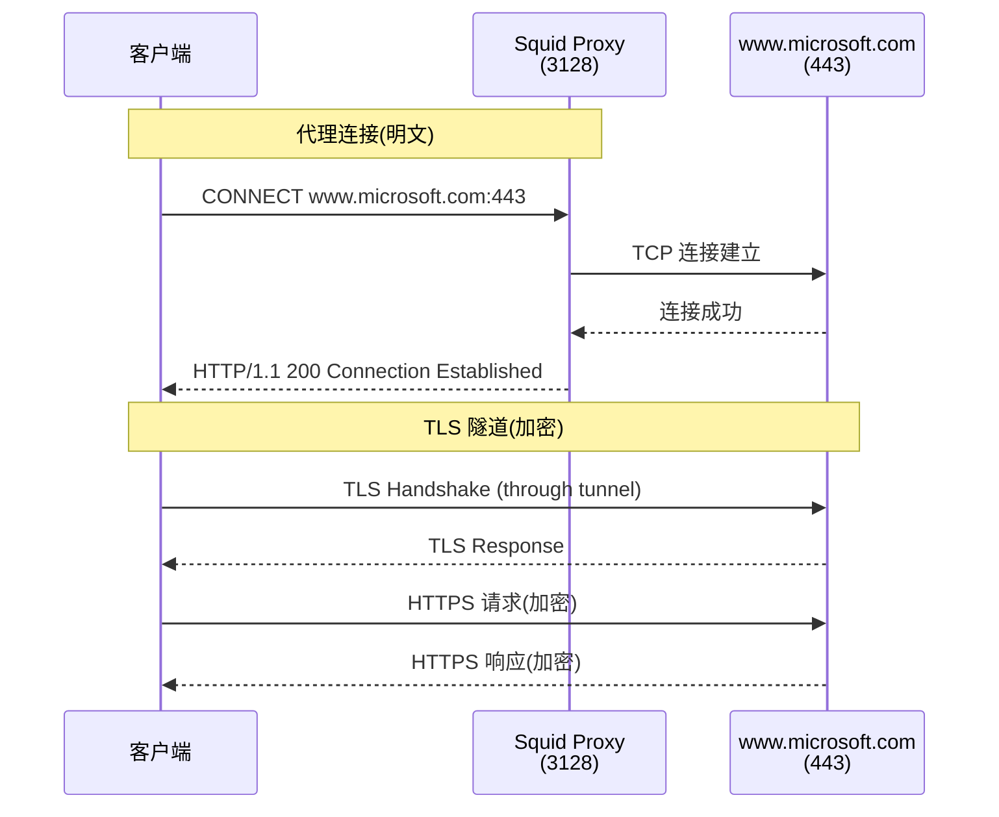
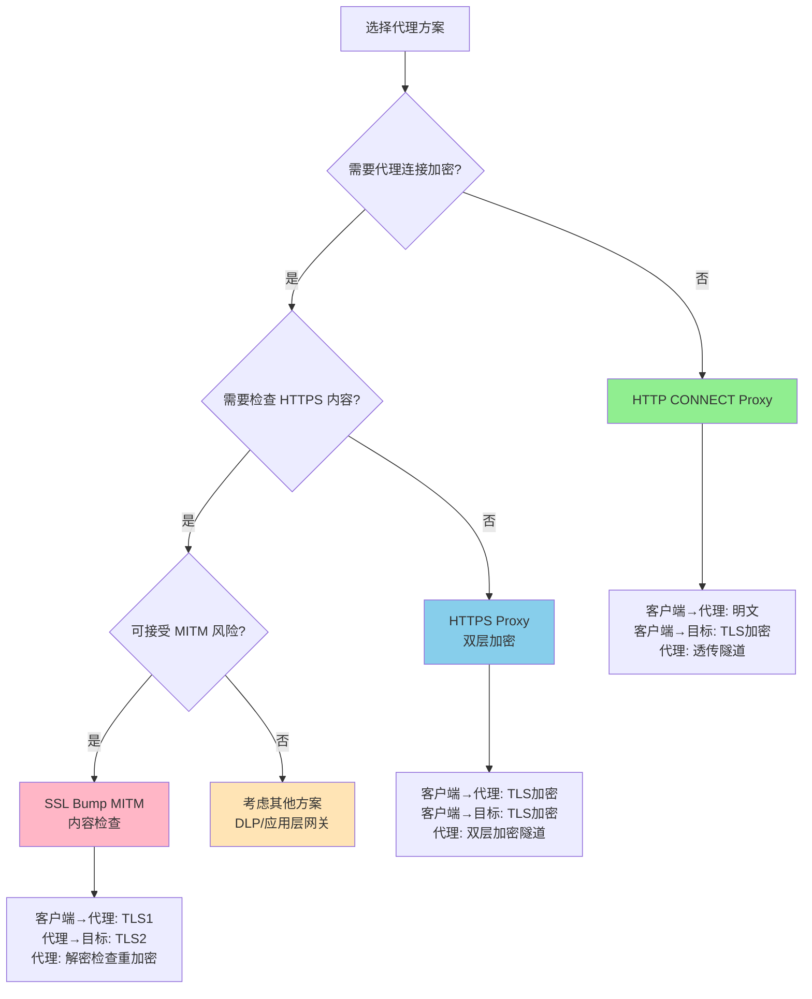
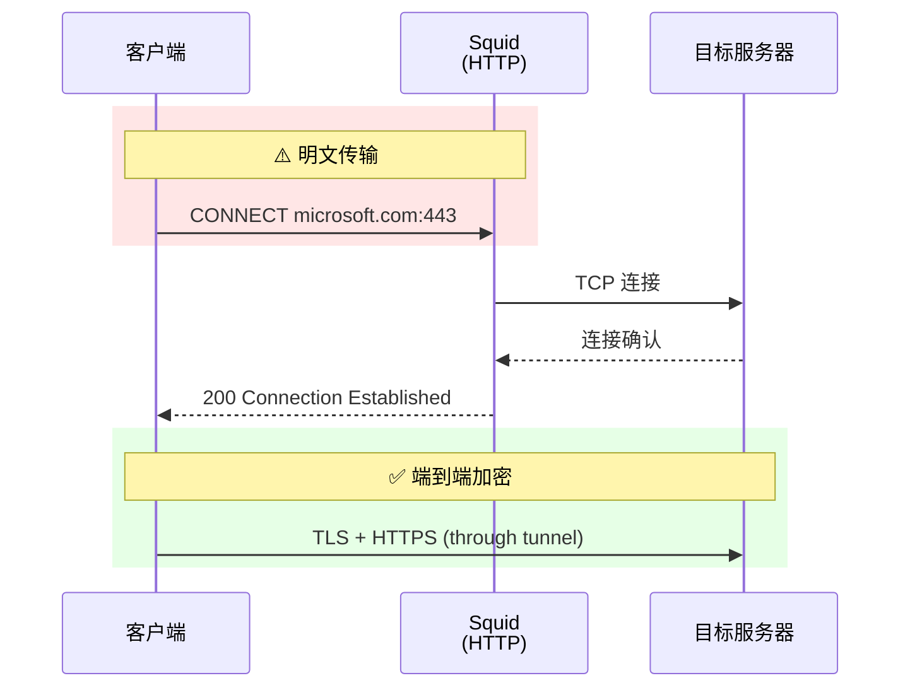
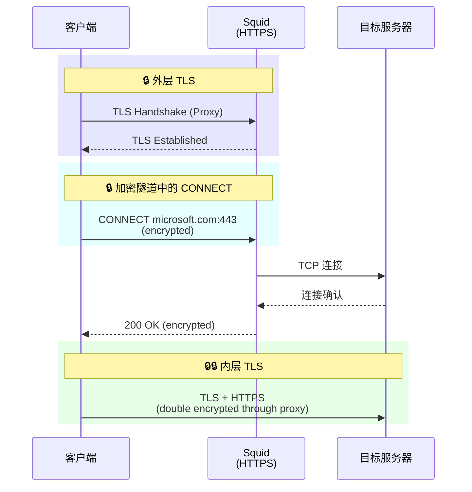
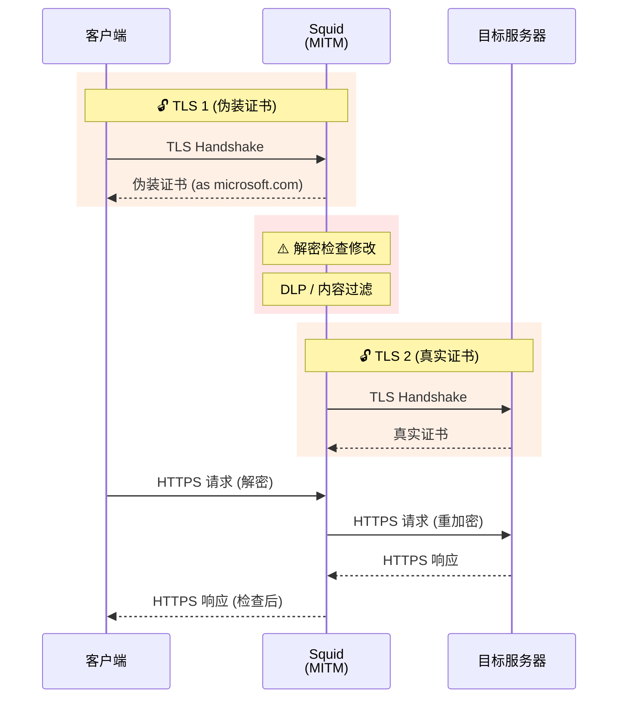
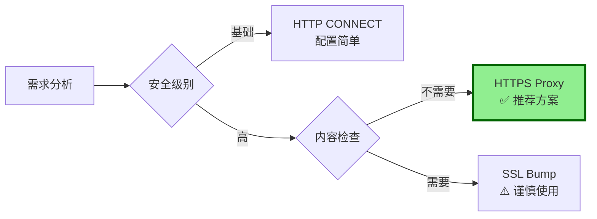
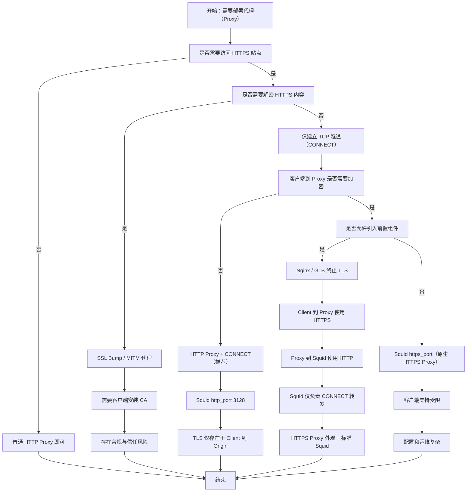

# Squid 代理配置分析与 HTTPS 代理方案

## 1. 问题分析

当前场景涉及：
- 基础 HTTP 代理：`curl -x Microsoft.env.region.aibang:3128 https://www.microsoft.com`
- 期望实现：加密的代理连接 `curl -x https://microsoft.env.region.aibang:3128`
- 核心需求：代理本身的传输加密

## 2. 当前 Squid 配置反推

基于 `curl -x Microsoft.env.region.aibang:3128 https://www.microsoft.com` 能正常工作，推断当前配置：

### 2.1 基础配置结构

```bash
# /etc/squid/squid.conf

# 监听端口配置
http_port 3128

# ACL 定义
acl localnet src 10.0.0.0/8
acl localnet src 172.16.0.0/12
acl localnet src 192.168.0.0/16
acl SSL_ports port 443
acl Safe_ports port 80
acl Safe_ports port 443
acl CONNECT method CONNECT

# 访问控制规则
http_access deny !Safe_ports
http_access deny CONNECT !SSL_ports
http_access allow localnet
http_access deny all

# HTTPS 隧道支持（CONNECT 方法）
# 默认已启用，允许 CONNECT 到 443 端口
```

### 2.2 工作原理说明



**关键点**：
- 客户端到 Squid：**明文 HTTP CONNECT**
- Squid 到目标：**TCP 隧道**（透传）
- 客户端到目标：**端到端 TLS 加密**

## 3. HTTPS 代理方案分析

### 3.1 方案可行性

`curl -x https://microsoft.env.region.aibang:3128` 这种写法**在技术上可行但需要特殊配置**：

| 方案 | 可行性 | 复杂度 | 安全性 |
|------|--------|--------|--------|
| HTTP CONNECT (当前) | ✅ 标准 | 低 | 中（端到端加密，代理连接明文） |
| HTTPS Proxy | ✅ 可行 | 高 | 高（全程加密） |
| Squid SSL Bump | ✅ 可行 | 很高 | 低（MITM 风险） |

### 3.2 HTTPS 代理实现配置

```bash
# /etc/squid/squid.conf

# 生成 SSL 证书（首次配置）
# openssl req -new -newkey rsa:2048 -days 365 -nodes -x509 \
#   -keyout /etc/squid/proxy.key -out /etc/squid/proxy.crt

# HTTPS 代理端口
https_port 3128 cert=/etc/squid/proxy.crt key=/etc/squid/proxy.key

# 同时保留 HTTP 端口（可选）
http_port 3129

# ACL 配置（同上）
acl SSL_ports port 443
acl Safe_ports port 80 443
acl CONNECT method CONNECT

# 访问控制
http_access deny !Safe_ports
http_access deny CONNECT !SSL_ports
http_access allow localnet
http_access deny all

# 禁用 SSL Bump（避免 MITM）
# 不配置 ssl_bump 相关指令
```

### 3.3 客户端使用方式

```bash
# 使用 HTTPS 代理（代理连接加密）
curl -x https://microsoft.env.region.aibang:3128 https://www.microsoft.com

# 如果使用自签名证书，需要跳过证书验证
curl -x https://microsoft.env.region.aibang:3128 \
     --proxy-insecure \
     https://www.microsoft.com

# 使用 CA 签名证书（生产环境推荐）
curl -x https://microsoft.env.region.aibang:3128 \
     --proxy-cacert /path/to/proxy-ca.crt \
     https://www.microsoft.com
```

## 4. 代理模式决策流程图



## 5. 三种模式对比

### 5.1 HTTP CONNECT Proxy（当前模式）



**特点**：
- ✅ 配置简单
- ✅ Squid 不解密流量
- ⚠️ 代理连接明文（可被监听）
- ✅ 客户端到目标端到端加密

### 5.2 HTTPS Proxy（双层加密）



**特点**：
- ✅ 客户端到代理加密
- ✅ 客户端到目标加密
- ✅ 双层加密保护
- ⚠️ 性能开销增加
- ⚠️ 需要证书管理

### 5.3 SSL Bump MITM（中间人检查）



**特点**：
- ⚠️ 需要客户端信任 CA
- ⚠️ 破坏端到端加密
- ✅ 可检查 HTTPS 内容
- ⚠️ 隐私和合规风险
- ⚠️ 配置复杂

## 6. 方案合理性评估

### 6.1 HTTPS Proxy 适用场景

```bash
# 推荐场景
✅ 防止代理连接被监听
✅ 敏感网络环境（公共 WiFi、不可信网络）
✅ 合规要求（如 PCI DSS、HIPAA）
✅ 防止代理凭证泄露
```

### 6.2 配置建议

```bash
# 生产环境最佳实践

# 1. 使用受信任的 CA 签名证书
# 申请证书：Let's Encrypt 或商业 CA
certbot certonly --standalone -d microsoft.env.region.aibang

# 2. 配置强加密套件
https_port 3128 \
    cert=/etc/letsencrypt/live/microsoft.env.region.aibang/fullchain.pem \
    key=/etc/letsencrypt/live/microsoft.env.region.aibang/privkey.pem \
    options=NO_SSLv3,NO_TLSv1,NO_TLSv1_1 \
    cipher=HIGH:!aNULL:!MD5

# 3. 启用 HSTS（如果适用）
# 在响应头中添加
request_header_add Strict-Transport-Security "max-age=31536000" all

# 4. 配置访问日志
access_log daemon:/var/log/squid/access.log squid
```

### 6.3 性能影响对比

| 指标 | HTTP Proxy | HTTPS Proxy | 增加 |
|------|-----------|-------------|------|
| TLS 握手次数 | 1 | 2 | +100% |
| CPU 开销 | 低 | 中 | +30-50% |
| 延迟 | 基准 | +10-30ms | - |
| 吞吐量 | 100% | 90-95% | -5-10% |

## 7. 注意事项

### 7.1 证书管理

```bash
# 自动续期（Let's Encrypt）
cat > /etc/cron.d/certbot-renew << 'EOF'
0 3 * * * root certbot renew --quiet --post-hook "systemctl reload squid"
EOF

# 手动续期测试
certbot renew --dry-run
```

### 7.2 客户端兼容性

```bash
# 检查客户端是否支持 HTTPS 代理
curl --version | grep -i "https-proxy"

# 常见工具支持情况
# ✅ curl 7.52.0+
# ✅ wget 1.19+
# ✅ Python requests + proxy SSL 配置
# ⚠️ 部分老旧工具可能不支持
```

### 7.3 监控建议

```bash
# 监控 Squid 性能
squidclient -p 3128 mgr:info | grep "Number of clients"
squidclient -p 3128 mgr:5min | grep "client_http.requests"

# 监控 SSL 连接
tail -f /var/log/squid/access.log | grep "CONNECT"
```

## 8. 总结与建议

### 8.1 方案选择矩阵



### 8.2 最终建议

**对于您的场景**：

1. **HTTPS Proxy 方案完全可行且推荐**
   - 提供代理连接加密
   - 保持端到端加密
   - 安全性显著提升

2. **实施步骤**：
   ```bash
   # 1. 申请证书
   certbot certonly --standalone -d microsoft.env.region.aibang
   
   # 2. 修改 Squid 配置
   https_port 3128 cert=/path/to/cert key=/path/to/key
   
   # 3. 重启服务
   systemctl restart squid
   
   # 4. 测试连接
   curl -x https://microsoft.env.region.aibang:3128 \
        --proxy-cacert /etc/letsencrypt/live/.../fullchain.pem \
        https://www.microsoft.com
   ```

3. **避免使用 SSL Bump**，除非：
   - 明确需要内容检查（DLP、威胁检测）
   - 已获得法律和合规批准
   - 用户知情同意

**方案合理性评分**：⭐⭐⭐⭐⭐（5/5）强烈推荐


下面按平台代理 + 网络协议的视角，把你的两个问题一次性讲清楚，并给出可行方案与不推荐方案的边界。

---

一、问题分析（反推当前 Squid 行为）

你的使用方式是：

curl -x Microsoft.env.region.aibang:3128 https://www.microsoft.com

这说明几个非常关键的事实：

1️⃣ 这是一个 HTTP Proxy（明文代理）
	•	-x host:port 且 没有 https:// scheme
	•	curl 默认认为这是一个 HTTP Proxy
	•	客户端 → Squid 这一段是 明文 HTTP
	•	Squid 收到的是 CONNECT www.microsoft.com:443 HTTP/1.1

👉 TLS 并不发生在客户端与 Squid 之间

2️⃣ HTTPS 的加密发生在哪里？

curl ──(HTTP CONNECT 明文)──> Squid ──(TCP Tunnel)──> www.microsoft.com:443
                                     ↑
                             TLS 在这里建立

	•	Squid 只是 转发 TCP 流
	•	Squid 看不到 HTTPS 内容
	•	Squid 只知道目标 host:port

3️⃣ 你当前 Squid 配置至少满足以下条件（反推）

http_port 3128

acl allowed_clients src <你的客户端IP/CIDR>
http_access allow allowed_clients

# 允许 CONNECT 443
acl SSL_ports port 443
acl CONNECT method CONNECT
http_access allow CONNECT SSL_ports

📌 结论
你现在用的是 标准 Forward HTTP Proxy + CONNECT 模式
这是企业内最常见、最稳定的做法。

---

二、你想要的目标：Proxy 本身也加密

你问的是：

curl -x https://microsoft.env.region.aibang:3128 https://www.microsoft.com

也就是：

客户端 → Squid 这一段也走 HTTPS

这在协议层面叫：

HTTPS Proxy / TLS-encrypted Forward Proxy

---

三、是否可行？结论先给

方案	是否可行	是否推荐
HTTP Proxy + CONNECT（你现在的）	✅	⭐⭐⭐⭐⭐（推荐）
HTTPS Proxy（Proxy 本身 TLS）	⚠️ 可行	⭐⭐（复杂、不常用）
HTTPS Proxy + MITM 解密	❌	🚫 强烈不建议


---

四、HTTPS Proxy（Proxy 本身加密）能不能做？

✅ 技术上 可以

❌ 但 Squid 并不原生推荐

---

方案 A：Squid 原生 https_port（不推荐）

https_port 3129 cert=/etc/squid/proxy.pem key=/etc/squid/proxy.key

客户端：

curl -x https://proxy.example.com:3129 https://www.microsoft.com

问题点：
	1.	客户端支持度极差
	•	curl 可以
	•	浏览器基本不支持
	2.	TLS 只保护：
	•	Client → Squid
	3.	运维复杂度暴涨：
	•	证书
	•	CA 信任
	•	SNI
	4.	Squid 官方文档也明确：
HTTPS forward proxy is rarely needed

📌 适用场景非常窄
	•	强制公网传输代理地址
	•	特殊合规场景

---

方案 B：推荐架构（生产级）

用 Nginx / GLB 做 TLS，Squid 保持 HTTP

架构图

Client
  |
  | HTTPS Proxy (TLS)
  v
Nginx / GLB
  |
  | HTTP Proxy
  v
Squid
  |
  | TCP CONNECT
  v
Internet


---

Nginx 示例（L4/L7 均可）

stream {
  server {
    listen 3128 ssl;
    ssl_certificate     proxy.crt;
    ssl_certificate_key proxy.key;

    proxy_pass squid:3128;
  }
}

客户端：

curl -x https://microsoft.env.region.aibang:3128 https://www.microsoft.com

✅ 优点

优点	说明
TLS 终止标准化	用 Nginx / GLB
Squid 配置不变	稳定
易接入 mTLS / Armor	GCP 原生能力
客户端兼容性好	curl / 自动化工具

📌 这是云平台最佳实践

---

五、绝对不推荐的方案（容易踩坑）

❌ Squid SSL-Bump（MITM）

ssl_bump peek all
ssl_bump bump all

问题：
	•	需要给所有客户端安装 CA
	•	HTTPS 被解密
	•	合规 / 法务 / 信任链极其复杂
	•	Microsoft、Google 等大量站点会直接失败

🚫 除非你是做安全审计盒子，否则别碰

---

六、决策总结矩阵

目标	推荐方案
简单、稳定	HTTP Proxy + CONNECT
Proxy 地址走公网	Nginx / GLB TLS 包 Squid
内网使用	纯 HTTP Proxy
流量审计	CONNECT 日志
HTTPS 内容解析	❌ 不做


---

七、一句话结论（给架构评审用）

HTTPS 本身已经端到端加密，没有必要让 Forward Proxy 再做 TLS
如果一定要加密代理入口，应在 Squid 前面用 Nginx / GLB 做 TLS，而不是让 Squid 自己承担 HTTPS Proxy 角色

---

如果你愿意，下一步我可以直接帮你：
	•	设计 GCP GLB + Squid Forward Proxy 标准架构
	•	给你一份 curl / yum / apt / git 代理统一配置规范
	•	或画一张 HTTP Proxy vs HTTPS Proxy vs MITM 的 Mermaid 决策图



阅读指引

	•	走到 HTTP Proxy + CONNECT：最稳、最常见、最推荐
	•	走到 Nginx / GLB + Squid：云平台与公网场景最佳实践
	•	走到 SSL Bump / MITM：只有安全审计设备才应选择
	•	走到 Squid https_port：理论可行，工程上不优