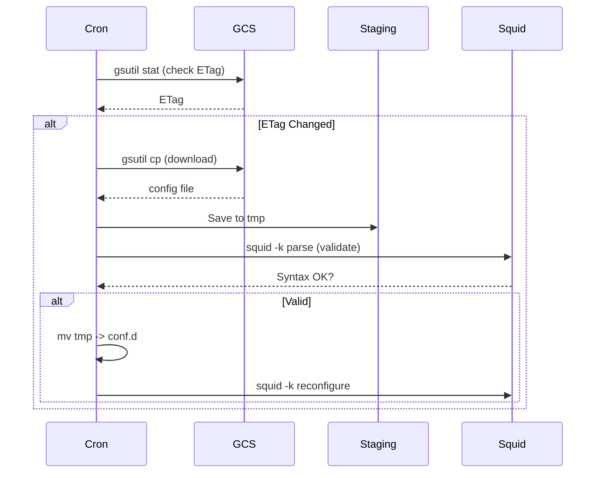

# Squid GCS Config Sync Automation - Architecture Discovery

## 1. Problem Statement
Squid configurations stored in a GCS bucket need to be synchronized to a GCE instance dynamically. Changes in the bucket must propagate to the instance within 5 minutes, ensuring configuration consistency without manual intervention, while maintaining service availability.

## 2. Proposed Architecture
A robust, shell-based synchronization engine running as a system cron job.

### Workflow Logic (The Sync Engine)
1.  **Check Phase**: Use `gsutil stat` to retrieve the current ETag of the remote configuration file.
2.  **Compare Phase**: Compare the remote ETag against a locally cached `last_sync_etag`.
3.  **Sync Phase (Conditional)**: If ETag differs:
    *   Download file to a staging area (`/etc/squid/conf.d.tmp/`).
    *   **Validation**: Execute `squid -k parse -f /etc/squid/squid.conf` against the new configuration to ensure syntax validity.
    *   **Swap**: Atomically replace old configuration in `/etc/squid/conf.d/` with the validated new configuration.
    *   **Reload**: Signal Squid to reload configuration via `squid -k reconfigure`.
    *   **Cleanup**: Update local ETag cache.

### Mermaid Flow

## 3. Resource Inventory
| Component | Resource | Description |
| :--- | :--- | :--- |
| **Storage** | `gs://<bucket>/path/to/squid/` | Source of truth for config files. |
| **Compute** | GCE Instance | Host running Squid and the sync script. |
| **IAM** | Service Account (attached to GCE) | Needs `storage.objects.get` permissions. |
| **Local Path** | `/etc/squid/conf.d/` | Active Squid configuration directory. |
| **Local Path** | `/etc/squid/conf.d.tmp/` | Staging directory. |
| **Automation** | `crontab` | Executes sync script every 5 minutes. |
| **Log** | `/var/log/squid-sync.log` | Sync history and error logging. |

## 4. Implementation Strategy
*   **Safety First**: Syntax validation (`squid -k parse`) is mandatory *before* applying the configuration to prevent service outage.
*   **Idempotency**: The script must be idempotent.
*   **Logging**: Every sync action (success/fail) must be appended to the log for audit trails.
*   **Permissions**: The script must run as a user with write permissions to `/etc/squid/conf.d/` and execute permission for `squid -k reconfigure`.

## 5. Verification Plan
1.  **Dry Run**: Run the sync script manually, force a change in GCS, verify log output.
2.  **Syntax Error Test**: Upload an invalid `squid.conf` to GCS, verify the script detects the error (`squid -k parse` failure), leaves existing config intact, and logs the failure.
3.  **Reload Test**: Verify `squid -k reconfigure` successfully reloads settings without dropping active connections.
