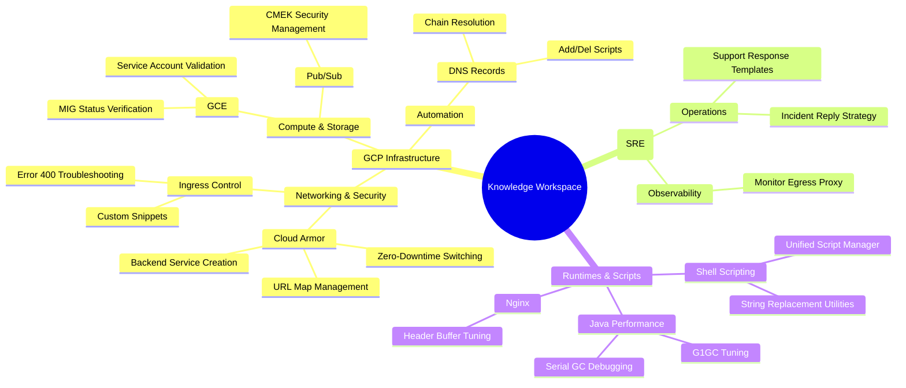
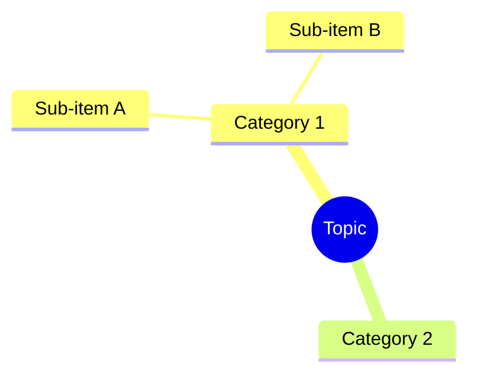

# Weekly Workspace Report (2026-01-26 to 2026-02-01)

## 📊 Activity Summary
This week's focus was heavily centered on **Google Cloud Platform (GCP)** infrastructure management, specifically **Cloud Armor** security, **GCE** instance verification, and **DNS** automation. Significant effort was also dedicated to **SRE documentation** and **Java performance tuning**.

### 📈 Statistics
- **Total Commits**: 52
- **Modified Knowledge Nodes**: 47 files
- **Primary Technical Domains**:- [x] Analyze recent git commits and modified files
- [x] Research technical knowledge points from modified files
- [x] Create implementation plan for the weekly report
- [x] Generate the weekly report in `weekly-report.md`
    - [x] Include commit statistics
    - [x] Include modified file list
    - [x] Include technical knowledge mindmap
- [x] Document the generation process (commands & logic)
- [x] Verify the content and formatting
---

## 🛠️ Technical Knowledge Mindmap
A visualization of the technical concepts explored and documented this week:



---

## 📂 Detailed File Changes

### 🌐 GCP Networking & Security
- `aliyun.cloud-armor/dedicated-armor/`: Extensive work on **Cloud Armor** integration with GLB.
    - `create-backendservice.md`, `gcloud-compute-url-maps.md`, `how-to-manage-url-map.md`, `how-to-switch-zerodowntime.md`.
- `gcp/ingress/`: Handling **Ingress Control** and custom snippets.
    - `ingress-control-400.md`, `ingress-snippet.md`.

### 🏗️ GCP Core Services
- `gcp/gce/`: **Managed Instance Group (MIG)** status verification tools.
    - `verify-mig-status.sh`, `verify-mig-status.md`.
- `gcp/pub-sub/pub-sub-cmek/`: **CMEK** encryption for Pub/Sub.
    - `pubsub-cmek-manager.sh`, `USAGE.md`.
- `gcp/sa/`: **Service Account** relationship with GCE.
    - `verify-gce-sa.sh`.

### 🤖 Automation & Tools
- `dns/docs/`: Automation for **Cloud DNS** management.
    - `dnsrecord-add-del.sh`, `dnsrecord-add-script-usage.md`.
- `shell-script/scripts/`: General purpose automation utilities.
    - `replace.sh`, `merged-scripts.md`.

### ☕ Performance & Runtimes
- `java/debug/`: **JVM Garbage Collection** tuning and debugging.
    - `java-G1GC.md`, `java-serial.md`.
- `nginx/buffer/`: Nginx performance tuning.
    - `client_header_buffer_size.md`.

### 📋 SRE & Documentation
- `sre/docs/`: Standardizing **SRE response** workflows.
    - `How-to-reply.md`, `reply-template.md`.
- `prompt/`: AI assistant prompt engineering for SRE tasks.
    - `sre-prompt.md`.

---

## 🛠️ Implementation Deep Dive
To help you replicate this process or understand how I gathered this data, here are the exact steps and commands used:

### 1. Data Extraction (Git)
I used the following shell commands to pull raw data from your workspace:

*   **To see all modified files and commit messages from the last 7 days:**
    ```bash
    git log --since="1 week ago" --oneline --name-only
    ```
*   **To get a clean list of commits with dates for statistics:**
    ```bash
    git log --since="1 week ago" --pretty=format:"%h - %s (%ad)" --date=short
    ```
*   **To get a unique list of all files changed in the last week:**
    ```bash
    git log --since="1 week ago" --name-only --pretty=format: | sort | uniq | grep -v '^$'
    ```

### 2. Categorization Logic
I analyzed the **file paths** and **commit subjects** to group work into technical domains:
- `/gcp/` -> GCP Infrastructure
- `/java/` -> JVM/Performance
- `/sre/` -> Operations/Documentation
- `.sh` files -> Automation Scripting

### 3. Visualization (Mermaid)
The mindmap was generated using **Mermaid's `mindmap` syntax**. This is a powerful way to represent hierarchical knowledge in Markdown. If you want to generate a similar map yourself, you can use the following structure:


### 4. Pro-tip for Future Reports
When asking an AI (like me) for a report, you can use this prompt pattern:
> "Analyze my git logs from the last week. Categorize modified files by technical domain. Summarize the key knowledge points and present everything in a Markdown document with a Mermaid mindmap."
